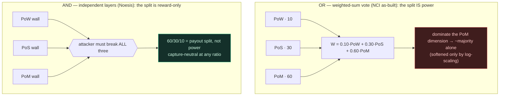

# Coherence Laws (PRIVATE, stealth)

> The cryptoeconomic invariants Noesis must satisfy to be *coherent* — the anchor
> doc the others reference. Will: "set laws/rules/standards of cryptoeconomic
> coherence." Each law is structural (must be enforced by construction, not asserted).
> A design change that violates one is incoherent until the law is restored or
> explicitly amended here. Cross-refs: `WHITEPAPER.md`, `CRYPTOECONOMICS.md`,
> `POM-CONSENSUS.md`, `COORDINATION-SCHELLING.md`.

## L1 — Separation of powers (RPS minimality)
Money, governance, and capital/franchise are *separable* functions; exactly **three**
powers (cognition / compute / capital) form the minimal non-dominated cyclic
equilibrium. 2 → binary capture; 4+ → coalitions without added non-domination. One
instrument per function (Tinbergen). **Capture-resistance is a property of the cycle's
*independence* (the AND-composition of L12), not of weight *symmetry*** — so an asymmetric
split (60/30/10) does not break it and a symmetric split (33/33/33) does not guarantee it.

## L2 — Soulbound franchise: no capital → consensus
Consensus weight (the franchise) is **soulbound / non-transferable**. Anything tradable
(state-bytes, money) MUST NOT buy consensus weight. Enforced as a type-script invariant
on the consume→produce transition (no owner/contributor reassignment), and consensus
reads the **contributor** key, never the owner lock. Violation ⇒ collapse to PoS.

## L3 — Conservation of proof (GEV)
Proofs are **conserved, relocated** — never eliminated by fiat. PoW is not deleted; it
moves to the money layer (JUL). Removing a proof requires showing its job is either
unnecessary or done by another proof, not just dropping it.

## L4 — Mint ↔ sink balance
Endogenous minting (novel contribution → PoM/state) MUST be matched by a sink (decay /
state-rent) that bounds total live supply and forces ongoing contribution to retain
state. No unbounded mint without a conserving burn.

## L5 — Strategyproof minting
Minting is gated on **temporal-novelty**: sybil, padding, and collusion-ring strategies
earn **0** by construction. Any new value rule MUST preserve this floor (the learned
`v(S)` included) or it is incoherent.

## L6 — Closed value-provenance
Value flows only along the provenance DAG (Myerson / graph-restricted). A coalition
disconnected in provenance creates no value. No value may be conjured from outside the
recorded contribution graph.

## L7 — Append-only, slashable
The chain is append-only and tamper-evident (signed, owned, Merkle-committed). Refuted
contributions are **slashable** within a dispute window, not silently deleted. History
is preserved; correction is an explicit, auditable event.

## L8 — Contributor floor
A genuine contributor MUST NOT be zeroed by a quiet period alone: a decay floor /
minimum-capacity grant per active contributor (anti-starvation). Prevents the decay sink
(L4) from eating honest participants.

## L9 — Core / nucleolus stability
Consensus is defection-proof: no validator coalition profits by deviating. Enforced by a
core/nucleolus stability constraint over the PoM-weighted coalition game. Required for
consensus specifically (not kitchen-sinked onto pure attribution).

## L10 — Two-axis robustness
Every hard-to-defend parameter/choice carries ≥2 independent justifications, so no single
objection collapses it. Single-pillar designs are incoherent under adversarial review.

## L11 — Coordination-layer integrity ≥ max coordinated attack surface
When two systems (e.g. the LLM and the DeFi protocol) coordinate **through** the chain,
the chain becomes a shared dependency: its compromise is correlated failure of both.
This nets positive **iff** the coordination layer's own integrity guarantees exceed the
**weaker** of the systems it coordinates. The hub must be harder to break than its
spokes, or it concentrates risk instead of dissolving it. (Derives the meta-security
result in `COORDINATION-SCHELLING.md`; pairs with the openness/cheap-exit condition that
keeps the hub a keystone, not a hostage.)

## L12 — Composition before weighting (AND over OR)
**60% PoM is only dangerous if it's a 60% *vote*.** (Will, 2026-06-11 — the law in one
sentence.) The three powers MUST compose as **AND** — an attacker has to defeat each
independent layer — not as one weighted-sum vote (**OR / substitutable**). The
distinction, not the numbers, is load-bearing:

- **Under AND**, the split is **reward / incentive only** and carries no consensus power;
  any split (60/30/10, 45/35/20, 33/33/33) is capture-neutral. Its only jobs are
  participation incentive and tie-break / liveness.
- **Under OR-additive** weighting — NCI as-built, `W(node) = 0.10·PoW + 0.30·PoS +
  0.60·PoM` (`NakamotoConsensusInfinity.sol:19`, `POM_WEIGHT_BPS = 6000`) — the split **is**
  power: a dimension whose saturation weight ≥ 50% can reach majority on that dimension
  alone. NCI softens this with log₂ scaling on PoW and PoM (diminishing returns,
  anti-plutocracy) but does **not** make it AND.
- **Invariant.** Either (a) declare AND-composition at the finalizing layer (the structural
  fix — preferred), **or** (b) if additive weighting is retained, no single proof's
  saturation weight may be ≥ 50% of total (the patch — drops PoM 60 → < 50). At least one
  must hold, or the RPS claim (L1) is decoration.
- **Corollary (33/33/33).** Symmetric weights are neither necessary (AND makes the split
  cosmetic) nor sufficient (a symmetric OR-vote still cycles for liveness and still lets any
  2-of-3 collude to 66%). Capture-resistance comes from cycle *independence*, not weight
  equality.

### L12 hardening — devil's-advocate pass (2026-06-11)
Six objections, each with the clause that answers it. The bare law ("AND → the split is
reward-only") survives *only* with these attached:

1. **AND-security implies AND-liveness fragility.** If finalizing needs all three layers,
   any one stalled or censoring layer halts the chain — so real systems relax AND toward a
   threshold, and the weighting returns through the back door. **Clause:** the AND is over
   *necessary constraints / vetoes*, not over *production*. No single layer **produces**
   finality; each can **gate** it; a gating layer's outage is a **bounded** liveness cost
   (timeout → slash), never a cross-dimension substitution. Safety-AND ≠ liveness-AND.
2. **"Independent layers" is a fiction — money correlates them.** A rich actor buys PoS,
   runs PoW, and funds PoM contributors; three walls with one root (capital) collapse AND
   toward a single wall. **Clause:** L12's guarantee is *conditional* on each wall being
   independently un-buyable. PoM's independence is **load-bearing on L5** (temporal-novelty:
   sybil / padding / collusion → 0) **and L2** (soulbound franchise). If those leak, AND
   degrades to correlated-OR. Independence is a property to *prove*, not assume.
3. **Reward-only still captures dynamically.** Paying PoM 60% starves PoW / PoS provisioning
   until the weakest wall is paper — capture by attrition, no vote required. **Clause:** the
   split is capture-neutral only while **every dimension stays paid above its cost-to-break**
   (a per-dimension security-provisioning floor; sibling of L8). Free to vary above the
   floor, never below.
4. **No laundering of NCI's real risk.** L12 defends *Noesis-under-AND*. **NCI as-built is
   OR-additive and remains UNDEFENDED** until either the AND-migration (a) ships or the cap
   (b) is imposed. L12 must not be quoted to wave away the deployed contract's genuine
   60%-vote exposure.
5. **The <50% single-proof cap (patch b) is insufficient under correlation.** Under OR, any
   colludable subset over threshold captures; with correlation (objection 2) one actor
   supplies several dimensions, so the safe cap is on *any colludable coalition*, not any
   single proof — unenforceable by one number. **This is the argument for AND (a) over the
   cap (b):** the patch is a stopgap; AND is the fix.
6. **Tie-break is a smuggled vote.** "AND for safety, weighted for liveness" leaks power if
   the tie-break is weight-proportional — PoM at 60% then decides every contested block.
   **Clause:** any scalar combination in the protocol (tie-break, fork-choice) MUST be
   AND-gated or **content-independent-random** (VRF / commit-reveal-seed shuffle, as in the
   batch auction) — **never weight-proportional**.

**Net after hardening:** the one-liner holds, but AND-composition is load-bearing on
**(L2 ∧ L5)** for independence, requires a **per-dimension provisioning floor**, must keep
**every scalar combination content-independent**, and does **not** retroactively defend the
OR-additive NCI. The honest one-liner *with its preconditions attached*.

---

### Amendment log
- 2026-06-11 — L1–L10 drafted from the in-context invariant set; **L11 added** (meta-
  security / coordination-layer integrity bound). Genesis-burn fair launch ratified
  (see WHITEPAPER §10) — candidate L13 if it needs a standing invariant ("no creator
  pre-launch advantage; neutralization must be on-chain-provable, not asserted").
- 2026-06-11 — **L12 added** (composition before weighting; AND over OR) + **L1 amended**
  (capture-resistance is cycle-independence, not weight-symmetry). Resolves the
  "does 60/30/10 break RPS?" question: it does not, *iff* composition is AND or no single
  proof ≥ 50% under additive. Verified against `NakamotoConsensusInfinity.sol:19` —
  NCI as-built is OR-additive (W = 0.10·PoW + 0.30·PoS + 0.60·PoM), so Noesis declaring
  AND is a real divergence from NCI, not a relabel. Crystallized by Will: *"60% PoM is
  only dangerous if it's a 60% vote."*
