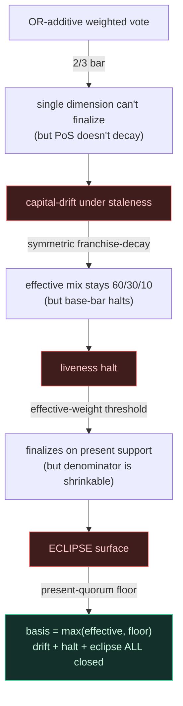

# Consensus Review — PoM-weighted finalization (PRIVATE, stealth)

> Consolidated findings from the 2026-06-11 consensus study + RSAW adversarial self-audit.
> Each finding is build-don't-claim: backed by a test in `node/src/lib.rs` (`consensus` mod,
> 42/42) or a verified line in `NakamotoConsensusInfinity.sol`. Anchors `COHERENCE-LAWS.md`
> L12/L13 and the retention-decay section of `POM-CONSENSUS.md`.

## The spine: composition, not weights

The load-bearing question was *"does NCI's 60/30/10 break the rock-paper-scissors / separation-of-powers
claim?"* The answer turns entirely on **composition**, not the numbers:

- **OR-additive** (weighted-sum vote): the split **is** power — a dimension reaching the
  finalization threshold finalizes alone.
- **AND** (attacker must defeat each independent layer): the split is **reward-only** — capture-neutral
  at any ratio.

**One-liner (Will): "60% PoM is only dangerous if it's a 60% vote."** Capture-resistance is a property
of the cycle's *independence*, not weight *symmetry* — so 33/33/33 is neither necessary (AND ⇒ split
cosmetic) nor sufficient (OR ⇒ still cycles + any subset ≥ threshold colludes).

## What NCI as-built actually is (verified against the contract)

| Property | Finding | Source |
|---|---|---|
| Combination | OR-additive weighted vote `W = 0.10·PoW + 0.30·PoS + 0.60·PoM` | `NakamotoConsensusInfinity.sol:19` |
| Finalization | 2/3 supermajority of **base** total weight | `:696` `FINALIZATION_THRESHOLD_BPS = 6667`; `:693`/`:977` `_getTotalActiveWeight` = base |
| Single-dimension capture | **Blocked** — PoM 60% < 66.67% bar; capture needs PoM + >6.67% of a 2nd dimension | `consensus::single_dimension_cannot_finalize_under_two_thirds` |
| Retention | PoW+PoM vote-weight decays by staleness; **PoS does not** | `:648-686` `_retentionAdjustedVoteWeight` |
| Eclipse | **Resistant** — threshold on base weight; a shrunken-denominator attack can't help | (base basis is fixed) |
| Liveness | **Halt-prone** — decayed `weightFor` vs a base bar fails under low participation | `consensus::base_threshold_halts_under_staleness` |

**Verdict:** NCI is OR-additive but **threshold-hardened** — the 2/3 bar sits above every single
dimension's weight, so no dimension finalizes alone. It is **not** naive-majority OR.

## The fix-chain (each fix reveals the next attack)

The real review output is a *sequence of dissolved classes*, each verified by a test:

Tests: `nci_as_built_drifts_toward_capital_under_staleness` → `symmetric_decay_preserves_composition`
→ `base_threshold_halts_under_staleness` → `effective_threshold_avoids_halt` →
`audit_a1_effective_threshold_opens_an_eclipse_surface` → `quorum_floor_param_closes_eclipse_and_keeps_liveness`.

**Key clarification:** the eclipse surface is a property of the *proposed effective-weight fix*, **not**
of NCI as-built (which uses the base basis and is eclipse-resistant). NCI trades eclipse-risk for
halt-risk; the **hybrid** (`finalizes_hybrid`: effective term + quorum floor) gets both.

## Findings & status

| # | Finding | Status | Evidence |
|---|---|---|---|
| L12 | Composition (AND vs OR) decides whether weights are power | LAW | `COHERENCE-LAWS.md` L12 |
| L13 | Per-dimension provisioning floor (no starved paper-wall) | LAW | `COHERENCE-LAWS.md` L13 |
| C1 | 2/3 bar blocks single-dimension capture | TESTED | `single_dimension_cannot_finalize_under_two_thirds` |
| C2 | Non-decaying PoS drifts effective mix toward capital | TESTED | `nci_as_built_drifts_toward_capital_under_staleness` |
| C3 | Symmetric franchise-decay restores the mix | TESTED | `symmetric_decay_preserves_composition` |
| C4 | Base-bar liveness halt under staleness | TESTED | `base_threshold_halts_under_staleness` |
| C5 | Effective-bar fix opens an eclipse surface | TESTED | `audit_a1_effective_threshold_opens_an_eclipse_surface` |
| C6 | Quorum-floor hybrid closes eclipse, keeps liveness | TESTED | `quorum_floor_param_closes_eclipse_and_keeps_liveness` |
| A3 | Sybil splitting bounded by MIN_STAKE | TESTED | `audit_a3_sybil_splitting_is_bounded_by_min_stake` |
| A5 | Stale validator still slashable (decay ≠ exit) | TESTED | `audit_a5_stale_validator_is_still_slashable` |

## Open gaps (honest, not yet closed)

- **A2 — saturation vs realizable share.** `single_dimension_can_finalize` treats a dimension's mix
  fraction (0.60) as its realizable share. That is the worst-case *saturation ceiling*; the actual
  share also depends on cross-node distribution and NCI's **log₂ scaling** on PoW+PoM (`:155-159`),
  which the reference model omits. Correct for the L12 worst case; not a general-distribution model.
- **A4 — lifecycle.** Equivocation slashing, the early-reject branch (`weightAgainst > total - threshold`,
  `:707`), and proposal expiry are not modeled here.
- **A5+ — slashability is modeled but the *decayed-but-slashable* invariant is not enforced in NCI code**;
  verify the contract keeps a stale validator slashable (don't assume).
- **Quorum floor is a Noesis proposal**, not in NCI. Adopting the hybrid basis requires a contract change
  (verify against NCI before any tokenomics code; tokenomics-zero-tolerance).

## Recommendations

1. **Adopt the hybrid basis** `max(effective_total, quorum_floor)` for any PoM-weighted finalization —
   it is the only option in the fix-chain that closes drift, halt, *and* eclipse together.
2. **Decay all three franchises symmetrically** (vote-weight, never the staked balance) so the effective
   mix is time-invariant and capital loses its always-fresh edge (Will's call; ties L12/L13).
3. **Keep the AND framing primary.** The weighted-OR + 2/3 is a threshold-hardened stopgap; the
   structural fix is AND-composition (each layer independently necessary), which is what constitutional
   separation of powers already is (non-substitutable branches).
4. **Verify before code.** A2/A4 and the quorum-floor adoption are NCI-contract decisions — re-derive
   against `NakamotoConsensusInfinity.sol`, do not port the reference model's simplifications into Solidity.
