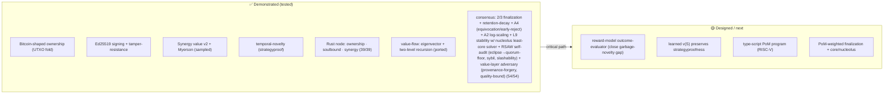

# CONTINUE — Noesis handoff (PRIVATE, stealth)

## ▶ RESUME HERE (2026-06-12 PM-7 — value_v7 semantic-floored seeds, node 126/126; story-loop 1/10)
- **`value_v7` SHIPPED — flips `noise_child_still_seeds_flow_in_v5_open_gap`**: seed =
  `semantic_floor(floored_novelty)` on top of v6's standing gate. The SAME vested identity
  committing the SAME noise pumps the parent under v6 and pumps NOTHING under v7 (in-test
  contrast). **Load-bearing separation held**: only the SEED is semantic-floored, the cell's
  own gated value is not — so the airgap backstop survives (keyish cell still EARNS when
  built upon, in-test) while noise-shaped bytes certify nothing upward. v7 ≡ v6 elementwise
  on content-only graphs (in-test).
- **Adversarial tick: the layering CONVERGED** — the v7 survivor is structured-but-valueless
  prose (`structured_valueless_child_still_seeds_flow_open_gap`), which is EXACTLY the
  already-named out-of-band frontier (#3: labels/outcomes, not bytes). No new in-gate layer
  is available from content alone; per the method, that's a convergence signal, not a TODO.
- **Loop 2/10 — entropy_theta CALIBRATED (node 128/128)**: `semantic::calibrate_theta`
  returns the separating band (max content entropy, min noise entropy) over labeled corpora
  — zero empirical FP/FN for any theta inside it; `recommend_theta` = midpoint. The suite's
  0.95 verified strictly inside the band (stops being magic). **Airgap restated as
  calibration math + pinned**: one keyish payload in the content corpus ⇒ band = `None` ⇒
  no theta separates by bytes — the formal reason the floor is seed-only + flow-backstopped,
  never a verdict. Honest scope: corpus-relative evidence, not proof.
- **Loop 3/10 — critical-qa on the semantic arc (node 129/129): 1 real break found + pinned,
  2 honest annotations, verdict revise→shipped.**
  - **R-adversarial (REAL, verified numerically then pinned)**: encoding-evasion — hex-encode
    or zero-dilute the same garbage and entropy drops 1.0→≈0.57, under any workable theta,
    while shingle novelty survives (`encoded_noise_evades_the_entropy_floor_open_gap`).
    The floor's claim NARROWED in-doc: it stops accidental/lazy noise and raises the
    attacker's move to "encode it" — economic layers (v6 standing, dispute slashing) stay
    the binding defense vs the aware adversary. Encoded noise ≡ structured-but-valueless ⇒
    re-enters the already-named out-of-band frontier (no new layer owed).
  - **R-composition (doc fix)**: dual-"canonical" ambiguity resolved — production_value =
    canonical-at-INTAKE (boost form); v5→v7 = SETTLEMENT form (vests as use realizes).
  - **R-mechanism (annotation)**: the whole value layer is f64; the ckb-vm type-script port
    will need fixed-point/deterministic arithmetic — noted in HANDOFF frontier #2.
  - Confirmed-ok: short-payload edges (n<2 ⇒ passes, harmless), calibration honesty already
    scoped corpus-relative, empty-corpus None handled.
- **Story-loop armed by Will (menu-pick 2): 10 increments.** 3 done. Queue hint in
  `~/.claude/state/story-loop.json`. Next: survivor-named work or ckb-vm API verification
  (read-first, no assumed APIs; fixed-point requirement now on record).
- **HANDOFF frontier #4 SHIPPED**: `semantic::semantic_floor` AND-composed into
  `production_value` (new `entropy_theta` param) — after the similarity floor, BEFORE the
  quality boost. Incompressible noise now earns 0 at the canonical rule even at max quality;
  in-test contrast proves the similarity floor alone still pays it (semantic does the work).
  Airgap pin propagated (`production_value_semantic_airgap_pinned_high_entropy_value_floored`).
- **Adversarial tick (same increment, method-standard): the survivor named the next layer
  and is PINNED** — `noise_child_still_seeds_flow_in_v5_open_gap`: the semantic floor guards
  the boost rule only; a high-entropy noise CHILD still carries a positive flow seed in
  v5/v6, so a vested identity's noise commit pumps a parent's gate (bounded by v6 standing,
  not free — but real). **Next increment: semantic-floored SEEDS** — design first: the
  semantic airgap's backstop ("wrongly-floored useful cells still earn via flow") must
  survive; flooring a cell's SEED (what it pumps to parents) ≠ flooring its own gated value —
  those can be separated, and probably should be.
- Remaining frontier unchanged: real outcome-labels (external), ckb-vm type-script (verify
  APIs first), structured-but-valueless novelty (out-of-band).
- **PHASE-1 FRONTIER FIRST INCREMENT** (`outcome` module): the learned v(S) the coverage
  proxy can't be. `coalition_features(S)` = SET-level structural features (breadth, synergy,
  internal connectedness, lineage depth) the per-block proxy can't see; `train()` =
  Bradley-Terry over pairwise coalition preferences (the outcome LABELS = the outside
  signal); `v_outcome ∈ [0,1]`. Separates orphaned garbage from connected value on features
  content can't fake; learns orderings the proxy can't express; generalizes to unseen
  coalitions. **Safe by the authority boundary, not a robustness proof** — corrupt weights
  routed through `evaluator::intake_advance` on a fresh identity = 0.
- **Adversarial tick (same session):** fake-lineage garbage (chain of noise, each pointing
  at the last) SPOOFS the connectedness/depth features and out-scores orphaned garbage —
  pinned honest. CONTAINED: can't mint (bounded evaluator) + building the lineage is exactly
  what v6 prices + dispute slashes. The new layer inherits the protection below it.
- **Honest scope:** the model is built; real outcome-LABEL data (DeepFunding-distill-over-
  sets) is the unbuilt input (synthetic structural labels only so far). It informs the
  bounded evaluator; it does NOT replace the gate or auto-close the in-gate garbage-novelty
  proxy pin. Next: real labels; OR Role-C AND-composed semantic floor (close at the gate);
  OR on-VM type-script (ckb-vm). Study guide regenerates via `scripts/study-guide.py`.

## ▶ RESUME HERE (2026-06-12 PM-4 — role-bounded evaluator shipped, node 101/101 then)
- **PHASE-1 CORE BET REFRAMED + FIRST INCREMENT SHIPPED** (`OUTCOME-EVALUATOR.md` +
  `evaluator` module): the learned v(S) is NOT the gate (v5 settled that) — its authority
  is BOUNDED to (A) advance timing: intake liquidity `min(κ·score·floored_novelty,
  μ·standing)`, repaid from vesting, shortfall slashed at window close; (B) dispute
  evidence, never verdict; (C, research) semantic floor AND-composed (can zero, never
  rescue). Obligation collapsed: "prove model un-gameable" → "the bounds hold."
  Corrupt-evaluator test: score 1e18 ⇒ fresh identity 0, redundancy 0, vested leak ≤
  μ·standing and fully recovered. THRONE.md also shipped (telos doc, 8 mechanism-grounded
  correspondences). **97 → 101 green.**
- **Open next increments:** learned model itself (Bradley-Terry exists; outcome-set
  labels pending); κ/μ + W/B/α/β one calibration harness; concurrent claims on standing
  (advance-shortfall vs dispute-slash priority — design before code).

## ▶ RESUME HERE (2026-06-12 PM-3 — escalation court shipped, node 97/97 then)
- **JUDGE-CARTEL COUNTER IMPLEMENTED** (design §7): round-1 PoM-only veto is no longer
  final — appeal escalates to the AND-composed full-mix tribunal (`Tribunal::FullMix` =
  NCI mix; a 40%-standing cartel is only 24% of that court ⇒ overturned, in-test);
  **juror accountability** = overturned veto bloc slashed `rate × voted-pom` (the
  load-bearing piece — attaches to the VOTE, so identity separation doesn't evade);
  conflicted jurors excluded (hygiene); appeal bonds double (2^k griefing bound).
  **Ceiling stated in code, never flips:**
  `full_consensus_capture_defeats_the_escalation_court_global_assumption` — ≥2/3
  cross-dimension capture defeats every tribunal; that is the consensus layer's own
  global assumption, no NEW surface introduced. **92 → 97 green.**
- **Value-layer hardening arc COMPLETE for this pass** (v5 flow gate → v6 priced
  identity → dispute slashing → QA hardenings → cell-layer wiring → escalation court).
  Remaining Phase-1 frontier returns to the LEARNED v(S): outcome-evaluator replacing
  the coverage proxy (the core bet), plus W/B/α/β calibration on real data.

## ▶ RESUME HERE (2026-06-12 PM-2 — dispute module shipped, node 92/92 then)
- **ENDORSEMENT-SLASHING IMPLEMENTED** (`dispute` module, design = `DISPUTE-SLASHING.md`):
  windowed vesting (spendable at E+W; refutation inside W cancels unvested only — vested is
  finality-protected), challenge bond, PoM-only 2/3 + quorum-floor verdict (reuses
  `consensus::finalizes_hybrid`), DETERMINISTIC causal-share slash (zero-seed v6 recompute;
  `bounded_shares` keeps Σ ≤ canceled), λ·share+α slashing, β-bounty, γ-compensation on
  upheld, `apply_slashes` → standing. **The vested-certifier attack is now negative-EV when
  caught, and §4 inequality holds at p=½ for any α>0 (in-test). 77 → 85 green (now 92: +4 QA, +3 soulbound dispute-wiring).**
- **New pinned gap (adversarial tick vs the dispute layer, same session):** JUDGE CARTEL —
  a >1/3 vested-standing bloc vetoes every refutation of its own ring (2/3 bar cuts both
  ways): `judge_cartel_protects_its_own_garbage_open_gap`. Economic bounds exist (§5.3);
  structural counter pending. **Next increment candidates: juror-exclusion of
  edge-connected standing / escalation court / dilution-indexed slashing.**

## ▶ RESUME HERE (2026-06-12 PM — value_v6 priced identity shipped, node 77/77 then)
- **`value_v6` BUILT + tested** — closes the v5 sybil-ring gap by PRICING IDENTITY:
  flow seeds are standing-gated (`seed = floored_novelty` iff contributor's soulbound
  standing ≥ floor, else 0). A3 economics reached the value layer
  (`max_certifying_identities` mirrors `consensus::max_sybils`) — stronger than A3:
  standing is EARNED + soulbound, not purchasable capital. Ring cost 0 → K × earn-the-floor.
  Seed-gated not edge-gated ⇒ unvested newcomers still EARN (vested use pays them),
  certification transitive through unvested intermediaries, fully-vested graph ≡ v5.
  **69 → 77 green (now 85).**
- **New pinned gap (adversarial tick vs v6, same session):** a VESTED certifier endorsing
  novel garbage into a fresh-key pocket still pays
  (`vested_certifier_endorsing_garbage_open_gap`). No longer free identity-minting — the
  endorser is accountable + slashable. **Next increment: ENDORSEMENT-SLASHING** — building
  on later-refuted garbage costs the certifier standing (refuted-value dispute window ⇒
  `soulbound::Op::Slash`); design the dispute window + refutation proof shape first.
- **DESIGN SHIPPED (same day): `DISPUTE-SLASHING.md`** — full mechanism (windowed vesting,
  challenge bond, PoM-weighted verdict reusing `finalizes_hybrid`, deterministic causal-share
  slash via zero-seed flow recomputation, incentive inequalities, 7-point test plan).
  **Next code increment = implement the `dispute` module against the test plan in doc §6**
  (flips `vested_certifier_endorsing_garbage_open_gap`; new pin to add:
  `judge_cartel_protects_its_own_garbage_open_gap`).

## ▶ RESUME HERE (2026-06-12 — value_v5 GATE shipped, node 69/69)
- **`value_v5(novelty, downstream_flow)` BUILT + tested** — the Phase-1 composition fix.
  `value = floored_novelty × g(downstream)`, `g(f)=f/(f+half)`. Flow seeded by floored
  novelty (redundant children pump 0), EXTERNAL edges only (no self-certification;
  `flow::children_of_external` + `value_flow_with_own` + `downstream_flow_external`).
  Regressions: q=0 noise w/ zero flow → 0 (v4-pays contrast in-test); honest-but-low-quality
  built-upon work PAID; floor-before-gate; retroactive vesting. **62 → 69 green (now 77).**
- **New pinned gap (adversarial tick vs v5, same session):** two-identity ring of
  novel-garbage children pumps the gate (`sybil_identity_ring_pumps_the_flow_gate_open_gap`).
  **Next increment:** price identity at the value layer (soulbound-standing / MIN_STAKE
  economics, cf. consensus A3) and/or seed flow with VESTED value. ROADMAP Phase 1 updated.

## ▶ RESUME HERE (2026-06-11 night — AFK full-auto run)
Shipped this session (all pushed to `WGlynn/noesis`):
- **Visuals embedded INSIDE every doc** (not a central file): WHITEPAPER (4), BLOCK-ECONOMY-SPEC
  (2), POM-CONSENSUS (4), CRYPTOECONOMICS (3 + misconception callout), COORDINATION-SCHELLING
  (4), COHERENCE-LAWS (AND-vs-OR), ROADMAP (2), WHITEPAPER-FOR-DAD (2), node/README (1), README
  (system map + rewritten landing page), CONTINUE (status map). Mermaid; renders on GitHub.
- **COHERENCE-LAWS L12 + L1 amend — "composition before weighting (AND over OR)."** Resolves
  *"does 60/30/10 break RPS?"*: **verified vs `NakamotoConsensusInfinity.sol:19`** — NCI is
  OR-additive (`W = 0.10·PoW + 0.30·PoS + 0.60·PoM`), so Noesis declaring AND is a real
  divergence, not a relabel. One-liner (Will): *"60% PoM is only dangerous if it's a 60% vote."*
  Plus a 6-objection devil's-advocate hardening (liveness ≠ safety-AND; independence is
  load-bearing on L2 ∧ L5; per-dimension provisioning floor; no laundering of NCI's OR-risk;
  the <50% single-proof cap is insufficient under correlation; tie-break must be
  content-independent, never weight-proportional).
- **Rust port: `value-flow.py` → `node/` `flow` module** — eigenvector value-flow (damped,
  bounds self-reference = §8 guard mechanical) + two-level recursion (2-player closed form +
  N-contributor reusing the synergy game). **node 22/22 → 28/28.**
- **Rust consensus module + RSAW adversarial self-audit** (`consensus` mod) — PoM-weighted
  finalization, retention-decay, 2/3 bar (single dimension can't finalize alone), capital-drift
  + symmetric-decay fix, all TESTED. **Self-audit found the effective-weight liveness fix opens
  an ECLIPSE surface** (shrink the denominator → attacker finalizes alone); a **quorum-floor
  hybrid** closes it (both demonstrated as tests). POM-CONSENSUS resolution updated. **node
  28/28 → 39/39.** Audit gaps logged in-code (A2 log-scaling/saturation, A3 sybil econ, A4
  lifecycle, A5 slashability-under-decay) — open.

**NCI finalize path VERIFIED (this run):** `finalizeProposal` = **2/3 supermajority**
(`FINALIZATION_THRESHOLD_BPS = 6667`) of summed retention-adjusted combined `W` — so 60/30/10
IS a finalization vote-weight (OR-additive), **but threshold-hardened**: the 2/3 bar sits above
PoM's 60% ceiling ⇒ no single dimension finalizes alone (capture needs PoM + >6.67% of a second
dimension). L12 refined accordingly. Next: fold the L12 provisioning-floor into a machine
coherence check; type-script PoM (RISC-V) + PoM-weighted finalization. (Separately, the
ethresearch GEV Part 4 draft on Desktop was formatted — outside this repo.)

## ▶ RESUME HERE (2026-06-11 eve — chat rotated at 214k ctx)
Shipped this session (all pushed to `WGlynn/noesis`, head `7842e4e`):
- **VISUALS.md** (8 Mermaid figs) + Desktop render `noesis-figures.html`.
- **COORDINATION-SCHELLING.md** — Schelling/inward-outward synthesis + equi-dependence
  keystone + **meta-security** (LLM+DeFi coordinate through JARVIS on Noesis) + invariant.
  Folded into WHITEPAPER §5.2.
- **COHERENCE-LAWS.md** (L1–L11; L11 = coordination-layer integrity ≥ max spoke surface).
- **Fair launch RATIFIED = genesis-burn** (provable > asserted). WHITEPAPER §10.
- **WHITEPAPER-FOR-DAD.md** + Desktop PDF `Noesis-in-Plain-English.pdf`.
- **scripts/harvest-noesis.py** (code-only pick-list, 9 buckets) + daily cron `41445bfe`
  (⚠ 7-day expiry — needs self-perpetuation for permanence).
- **Rust:** `node/src/lib.rs` — modules soulbound, ownership, value, synergy, **flow** (value_flow + recurse_two + recurse_shares = value-flow.py PORTED), **consensus**, **stability**, **harness**, **adversary** + `production_value`. **61/61 green at the time** (verified `cargo test` 2026-06-12; suite has since grown).
- Memory: `primitive_meta-security-coordination-hub.md` (local, discretion:internal; NOT yet MEMORY.md-indexed).

**Top next steps:** (1) ✓ DONE — `value-flow.py` ported to Rust `flow` module (eigenvector + 2-level recursion);
(2) make harvest cron self-perpetuating; (3) Phase-1 open (THE frontier): prove LEARNED v(S) preserves
strategyproofness. See OPEN THREADS below for the full list. Build green (61 at the time), verified 2026-06-12.

Public-side this session (separate, codeword-free): integrity root **re-attested + signed**
(drift was benign +2 files); leak-gate hardened (4 codeword sites scrubbed + self-skip
removed so the scanner polices its own public mirror).

> Read this first on a fresh session to continue the Proof-of-Mind value chain.
> Repo: `~/noesis` (private remote `github.com/WGlynn/noesis`).
> The roadmap-advance cron loop (`3b8e2f47`, every 3h) auto-continues this.

## What this is
**Noesis** (provisional name) — the value chain Bitcoin is mistaken for. Proof of Mind
(verified, synergy-weighted contribution) replaces Proof of Work for consensus. CKB-shaped:
Rust + RISC-V (CKB-VM) + Cell model + state-rent. **Core inspiration = Nervos CKB
(github.com/nervosnetwork/ckb), keep that lineage.** Full context: `WHITEPAPER.md`.

## Built + TESTED (demonstrated, not claimed)
- Python prototype: `block-ownership.py` (UTXO transfer-fold), `block-value-v2.py`
  (Myerson synergy), `value-v3.py` (temporal-novelty, strategyproof), `value-v4.py`
  (novelty × quality), `pom-score.py` (PoM = consensus weight), `value-flow.py`
  (eigenvector + 2-level recursion), `adversarial-game.py` (sybil/padding/collusion all
  → 0 under temporal-novelty), `reward-model.py` (Bradley-Terry learned v(S)).
- **Rust node** (`node/`, `cargo test` = 5/5): Cell model, lock script (ownership) +
  type script (encapsulates PoM), temporal-novelty value, pom_scores, shardability,
  ownership transfer-fold. CKB-attribution README.

## Key results / decisions
- **Value rule = temporal-novelty** (commit-reveal order): strategyproof by construction
  (sybil/padding/collusion earn 0). Inter-block = temporal-novelty; intra-block co-authors
  = Myerson (synergy). Composed with learned quality: value = novelty × (1+quality).
- **Cryptoeconomics** (`CRYPTOECONOMICS.md`): 1 PoM = 1 byte of state (CKB direct-port);
  issuance reinterpret (PoM minted by contribution, earned not bought); rent augment
  (PoM decay). **PoM soulbound** (non-transferable) → consensus/franchise; **state-bytes
  transferable** → medium of exchange; buy storage, not consensus.
- **3-token = RPS equilibrium** (capital/compute/cognition = state-stake / PoW-JUL / PoM).
  3 is minimal for non-dominated capture-resistance. PoW relocates to the **money layer
  (JUL)**, orthogonal to PoM. JUL NOT yet integrated (honest open item).
- **Consensus**: PoM-weighted + Nakamoto-Infinity fallback (`POM-CONSENSUS.md`). Stability
  = core/nucleolus. Slashing = invalid-reveal + refuted-value dispute window.

## NEXT increments (critical path, do-it-right + test each)
1. **Port Python → Rust** (continue): value-v4 (novelty×quality) + adversarial tests +
   reward-model (Bradley-Terry) into the `node/` crate. Idiomatic Rust.
2. **Phase 1 still-open** (🔬): prove the LEARNED v(S) preserves the novelty/strategyproof
   property; attribution-ring under the learned model; decay + reviewer-diversity.
3. **Type-script PoM program** (RISC-V) — the actual on-VM validation; integrate `ckb-vm`
   crate (verify APIs against the CKB source, don't assume).
4. **Cryptoeconomics open**: decay rate/half-life, contributor floor, JUL integration.
5. **Consensus**: PoM-weighted finalization + core/nucleolus stability in code.

## Honest load-bearing risk
The whole thing rests on **un-gameable `v(S)`**. The coverage proxy is strategyproof;
the *learned* reward model must preserve that. The adversarial-gaming loop is the moat —
keep running it against every new `v(S)`.

## Naming (LOCKED 2026-06-11)
- **Noēsis** = the network (the act of mind). Crate name; private repo `WGlynn/noesis`.
- **Noeum** = the unit / token (1 Noeum = 1 byte of state = 1 PoM unit; Ethereum/Ether shape).
- **Web-checked 2026-06-11:** no established crypto token named Noesis or Noeum (only a
  Solana NFT-game "Quantum Noesis" using the $SNS token, and a one-off Noesis NFT) →
  appears available. Trademark/domain check still TODO before any public reveal.
- Both names are in the leak-gate (`~/.claude/state/private-leak-patterns.txt`) — keep
  out of public during stealth.

## SESSION 2026-06-11 PM — shipped (repo renamed to noesis, from the old private name)
- **value-v4 ported to Rust** (`node/`, novelty × (1+quality), Bradley-Terry quality, normalized 0..1). Multiplication keeps novelty floor dominant: redundant cell = 0 even at max quality (tested).
- **3-attack adversarial moat ported to Rust** (sybil / padding / collusion-ring all earn 0; honest keep novelty).
- **SOULBOUND resolved in code** — `soulbound` module: soulbound is NOT a data flag (UTXO has no account to freeze); it is a TYPE-SCRIPT INVARIANT on the consume→produce transition. `valid_transition` admits only identity-preserving successors (accrue/decay/slash/burn), REJECTS any owner/contributor reassignment. Two-cell mint: transferable **capacity cell** (money) rides the ownership fold; soulbound **standing cell** (franchise) cannot move. `pom_scores` now keys by contributor (`type_script.args`), NOT owner lock. **node tests 5/5 → 16/16.**
- **doc-coherence gate built** (`scripts/doc-coherence.py`) — closes the docs-lag-code information asymmetry. code content-hash; docs stamped with the hash they were reconciled against; `--check` fails if code moved past stamp; machine-checks (no old-repo-name refs, doc test-counts == cargo). NOT yet `--stamp`ed, NOT yet wired as pre-commit hook.
- **Boot-bind**: `~/.claude/session-chain/private-handoff-loader.py` (registered in settings.json SessionStart, after session-state-loader) now surfaces this handoff at every boot — fixes the "reboot drifts to public task" class. Generic globs only, no private nouns in source (sync-safe).

## SESSION 2026-06-11 (eve) — visuals + Schelling synthesis
- **`VISUALS.md`** — 8 Mermaid figures (value pipeline, two-cell mint, 3-power RPS,
  consensus stack, inward/outward Schelling fold, fair-launch decision, ToM→ETM→PoM,
  mint↔sink). Renders on the private GitHub remote.
- **`COORDINATION-SCHELLING.md`** — deployment thesis: JARVIS-as-Schelling-point →
  same reconciliation fold at two radii (inward = coherent self, outward = network).
  Two load-bearing edges: protocol-not-platform; openness-is-what-makes-it-focal.
  Whitepaper §5.2 added.
- **Fair launch DECIDED (recommend): genesis-burn > chain-reset** — provable fair launch
  (pre-launch blocks auditable, PoM/value burned to 0 on-chain at launch height) beats a
  reset (asserted, trust-me). In WHITEPAPER §10 + COORDINATION-SCHELLING. Will to ratify.
- TODO queued: (a) **whitepaper-for-dads** (plain-language explainer); (b) **simple cron**
  that greps Will's own repos for items that DIRECTLY serve the noesis roadmap (indirect later).
- **DONE (a)** `WHITEPAPER-FOR-DAD.md` + Desktop PDF (`Noesis-in-Plain-English.pdf`).
- **DONE (b)** `scripts/harvest-noesis.py` (code-only, 9 mechanism buckets, ~614 candidates)
  + daily cron `41445bfe` (durable; 7-day auto-expire — add self-perpetuation for permanence).
  Output `NOESIS-HARVEST.md` (gitignored, regenerable).
- **DONE — Rust port continued:** `synergy` module = block-value-v2.py (submodular coverage
  value + **Myerson** graph-restricted Shapley, Data-Shapley sampling, deterministic SplitMix64
  PRNG, no `rand` dep). Tests prove cooperative game is load-bearing: synergy-Shapley ≠ additive
  Copeland (L1>0.02), Myerson restricts value to provenance, redundant→low marginal, sampling
  deterministic. **node tests 16/16 → 20/20.** Next un-ported: value-flow.py (eigenvector + 2-level recursion).

## OPEN THREADS — do next session
1. **Finish doc reconciliation** (Will: "they're all outdated… docs never lag code"). Systematic fixes across WHITEPAPER / BLOCK-ECONOMY-SPEC / POM-CONSENSUS / CRYPTOECONOMICS / ROADMAP / node/README / CONTINUE: (a) kill the owner-vs-contributor / transferable-PoM conflation (now resolved = soulbound two-cell, consensus reads contributor); (b) make temporal-novelty × quality the canonical value rule everywhere; (c) names (noesis) + test counts (16). Then `python scripts/doc-coherence.py --stamp` and install it as a git pre-commit hook (`.git/hooks/pre-commit`).
2. ✅ DONE — README rewritten (2026-06-11 night: system map + landing page; repo=noesis, private remote exists, push freely).
3. **COHERENCE-LAWS.md** — Will: "set laws/rules/standards of cryptoeconomic coherence." ~10 invariants drafted in-context (separation-of-powers/RPS, soulbound-franchise/no-capital→consensus, conservation-of-proof/GEV, mint↔sink balance, strategyproof-minting, closed-value-provenance, contributor-floor, append-only-slashable, core/nucleolus stability, two-axis robustness). Write it as the anchor doc the others reference.
4. **token↔proof mapping** — now RESOLVED by the two-cell split: PoM-byte = tradable **capacity** (state, money-ish); franchise = soulbound **standing** + VIBE validation; JUL = PoW/money. Buy storage, not consensus, ENFORCED (pom keys by contributor). Still verify vs NCI contracts (`a442fc5b`) before reusing labels (tokenomics-zero-tolerance).
5. Roadmap next code increment: port `reward-model.py` (Bradley-Terry learned v(S)) into `node/` and prove it preserves the novelty/strategyproof property.
6. **Living study guide** (Will: "a living breathing study guide locally that updates with its contents, so I can study and internalize it all over time"). Build `scripts/study-guide.py` → generates `STUDY-GUIDE.md` FROM the repo (so it can't go stale, same philosophy as the coherence gate): read-in-order path, per-doc one-line synopsis, module/file map, glossary of key terms (PoM / Noeum / temporal-novelty / Myerson / soulbound two-cell / core-nucleolus), the key decisions + WHY, test inventory from `cargo test`, and progress checkboxes Will ticks as he internalizes each piece. Wire it to regenerate alongside the doc-coherence stamp (and optionally the pre-commit hook) so it tracks contents automatically. Pairs with [F·will-learning-goals].

## Language decisions (general, saved to memory)
Saved `memory/primitive_language-decision-router.md` (domain→language router; substrate-fit ¬ popularity; full-stack map; **strengths-lens** = find a language's strength in what others call its weakness, same as treating any mind by strengths). MEMORY.md index line still PENDING (deferred under context-rotation — add it in the fresh chat).
