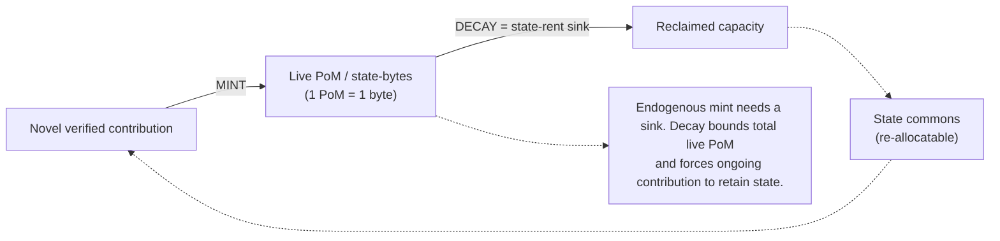
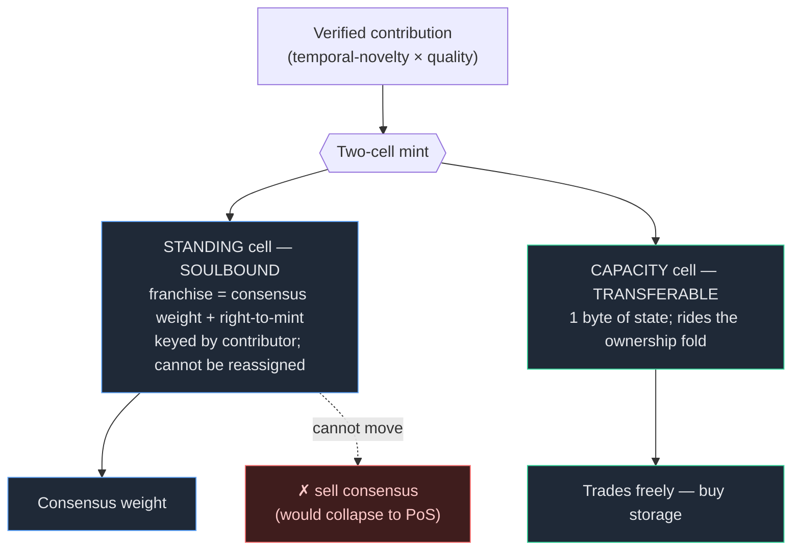
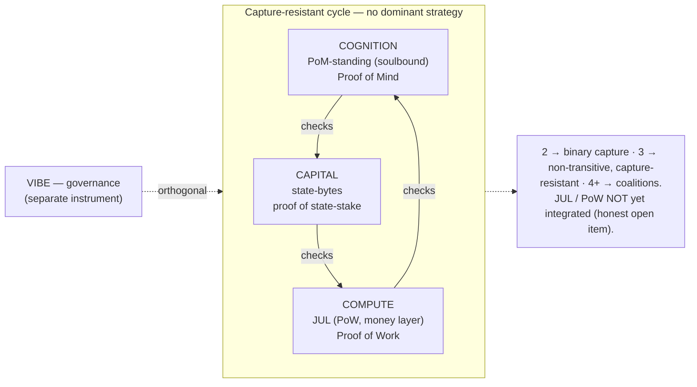

# Cryptoeconomics — 1 PoM = 1 byte of state (PRIVATE)

> Stealth. CKB's "token = state capacity" model, ported and augmented for Proof of
> Mind. Substrate-port-pattern call (Will, 2026-06-11).

## The model

**1 PoM = 1 byte of on-chain state.** Storage is the scarce resource (CKB's
insight); PoM is the right to occupy it. Your accumulated PoM is your state budget.

## Port / reinterpret / augment

| Component | CKB | PoM network | Verdict |
|---|---|---|---|
| Capacity equation | 1 CKB = 1 byte | 1 PoM = 1 byte | **DIRECT-PORT** — storage-as-scarcity is exactly right for a value chain |
| Issuance | pre-mined + bought | **minted by temporal-novelty contribution** (your verified novel value *is* the mint) | **REINTERPRET** — earned, not bought. State commons allocated by proven contribution, not capital. The thesis. |
| State rent | secondary issuance dilutes idle holders | **PoM decay** — stale contribution loses byte-capacity over time; holding state requires continued contribution | **AUGMENT** — decay replaces monetary rent AND is the supply sink |

## Why it closes cleanly

- **Endogenous supply needs a sink.** Minting PoM from contribution would grow state
  unboundedly; **decay is the sink** — it bounds total live PoM and forces ongoing
  contribution to retain state. Mint (novel contribution) and burn (decay) balance.
- **State is the commons; PoM is the standing to use it.** You earn the right to occupy
  the shared state by contributing verified value, and you keep it by staying current.
  Stop contributing → your PoM decays → your byte-capacity shrinks → your state is
  reclaimed. Self-regulating.
- **No capital gate.** Unlike CKB (buy CKB to use state) or PoS (buy stake to secure),
  here you *contribute* your way in. Sybil/padding/collusion mint 0 (temporal-novelty),
  so you can't fake your way to state capacity.

## Medium of exchange: soulbound PoM + transferable bytes (NO PoW needed)

"PoM can't be bought" was conflating two things. Split them:

- **PoM-standing = SOULBOUND (non-transferable).** Earned standing → consensus weight
  + the *right to mint* state. Cannot be sold. This is what makes can't-be-bought +
  sybil-resistance real: a transferable PoM ⇒ a rich actor buys consensus ⇒ back to PoS.
  PoM is reputation, not money.
- **State-capacity (bytes/cells) = TRANSFERABLE.** The medium of exchange. You *earn the
  right* to mint bytes via PoM; once minted the bytes trade freely. So you can **buy
  storage, not consensus.** A commodity (state) is liquid; mind-standing is not.

**Do we need a PoW currency? No — it's the unnecessary tack-on.** PoW's only job is to
make a token costly-to-fake. **PoM-gated minting already does that** (can't mint bytes
without earned PoM; sybil/padding/collusion mint 0 via temporal-novelty) — without an
energy/miner subsystem. PoW here is strictly redundant.

The one genuine gap a medium of exchange has — **price stability** (volatile bytes =
poor money) — is *intended* to be answered by JUL (the money/stability layer in the
broader three-token thesis: JUL=money, VIBE=gov, state-rent=capital). **Honest status:
JUL is NOT integrated into this system yet** — it's a planned dependency, not a present
component. So: the minimal core (**soulbound PoM + transferable bytes**) needs no PoW
*now*; a stability layer (JUL, or equivalent) is the planned answer for the
medium-of-exchange's price-stability, still to be added. Don't claim it's there.
🟡 roadmap: integrate JUL (or a stability mechanism) as the exchange/unit-of-account
layer. (First-available-trap: PoW is the thing to NOT add; stability is the thing still
owed.)

## The three-token model holds — and where PoW actually lives (Will, 2026-06-11)

The three-token thesis maps onto Noesis cleanly — not surprising, because it's
**separation of powers** (Tinbergen's rule / consensus-constitution): money, governance,
and capital are universal *separable* functions, one instrument each.

**Why exactly 3 (Will, 2026-06-11): rock-paper-scissors equilibrium.** Separation of
powers *needs* 3 — it's the minimum for a non-dominated cyclic equilibrium. With **2**
powers one is the strict best response and captures the other (binary dominance). With
**3** you get non-transitivity (RPS): each power checks another in a cycle, no pure
dominant strategy, capture-resistant by structure. **4+** adds complexity without more
non-domination and invites coalitions. So 3 is *minimal and sufficient*. The three
powers (consensus-constitution: **capital / compute / cognition**) map to **PoM
(cognition) / PoW (compute, via JUL) / state-stake (capital)** — each checks another;
none dominates consensus. The 3-power design is the RPS equilibrium that makes capture
structurally impossible, not an arbitrary token count.

| Role | Instrument here | Proof |
|---|---|---|
| **franchise** (consensus weight + right to mint) | **PoM-standing**, SOULBOUND | Proof of Mind |
| **capital / state** | **state-bytes** (PoM-minted, transferable; 1 = 1 byte) | (minted by PoM) |
| **money / medium-of-exchange** | **JUL** (fiat-stable, PoW-objective) | **Proof of Work** |
| **governance** | **VIBE** | (governance) |

> **Common misconception — defended in `COHERENCE-LAWS.md` L12.** *"60% PoM means PoM
> controls 60% of consensus, so it dominates and RPS is broken."* True **only if the 60 is
> a vote weight** (OR / weighted-sum — which is what NCI as-built does:
> `W = 0.10·PoW + 0.30·PoS + 0.60·PoM`). Under Noesis's **AND-composition** (an attacker
> must defeat all three independent layers) the split is **reward / incentive only** and
> carries no consensus power, so any split is capture-neutral. **60% PoM is only dangerous
> if it's a 60% *vote*.** Capture-resistance comes from the cycle's *independence*, not from
> weight symmetry — so 33/33/33 is neither necessary nor sufficient.

**Correction to "no PoW needed."** That holds for the **consensus + state** layer — PoM
handles it, PoW would be redundant there. But the **money** layer is different: **JUL is
PoW-objective by design**, so *adding JUL brings PoW back* — at the money layer, orthogonal
to PoM. Two proofs, two jobs:
- **PoM = proof of mind** → secures contribution, state-minting, consensus (the franchise).
- **PoW = proof of work** → grounds objective, stable money (JUL).

GEV-conservation: PoW is **conserved, relocated** to where it belongs (money), not
eliminated. So the honest answer to "do we need PoW?": *not for consensus/state; yes, it
comes with JUL when we add the money layer.* The two proofs coexist cleanly, each doing
the one thing it's actually good at.

## Token↔proof mapping — Will's cleaner version (PROPOSAL, verify before coding)

Will 2026-06-11: name each token by its proof, transparently.

| Proof | Token | Earned by | Role |
|---|---|---|---|
| **Proof of Mind** | **PoM** (= Noeum, the byte) | verified contribution (temporal-novelty) | state-capacity: 1 PoM = 1 byte. Tradable (medium of exchange for state). |
| **Proof of Stake/Participation** | **VIBE** | voting + validating | governance / consensus franchise |
| **Proof of Work** | **JUL** | SHA-256 mining, energy-pegged | money / stability layer |

Consensus = RPS-weighted combination of the three proofs (NCI's 60/30/10 is the
*weighting*; independent of labels). Three powers (contribution / validation / work)
check each other — none dominates.

**⚠ DIVERGES from implemented NCI** (`a442fc5b`: VIBE=PoM 60% / CKBn=PoS 30% / JUL=PoW
10%). Will's version reassigns: PoM becomes the contribution-token-AND-state-byte (merges
NCI's VIBE-PoM with CKBn-state); VIBE becomes the validation/governance token. Decision
needed: re-map NCI to this cleaner scheme, or keep NCI and let Noesis differ. **Verify
against the NCI contracts before any code (tokenomics-zero-tolerance).**

**⚠ Buy-storage-not-consensus must be re-checked under this mapping:** PoM=byte is
TRADABLE (state), so **consensus weight must come from VIBE + validation (soulbound)**,
not from holding PoM-bytes — else buyable bytes = buyable consensus. Pin this in spec.

## Honest open items
- **Floor:** genuine contributors shouldn't be zeroed by a quiet period; a decay floor
  (cf. Lawson-floor) or a minimum-capacity grant per active contributor. 🟡
- **Decay rate / half-life:** a parameter (cf. the contribution-graph decay) — set by
  how fast "state relevance" ages. 🔬
- **Bridge to a tradable unit:** is PoM itself transferable as the byte-token, or is
  there a separate liquid layer (cf. JUL=money / VIBE=gov / state-rent split)? Likely a
  three-role split as in the existing token architecture. 🟡
- ties: [P·dual-cap-monetary-architecture] · [F·jul-is-primary-liquidity] · CKB state-rent · [P·cell-knowledge-architecture].
