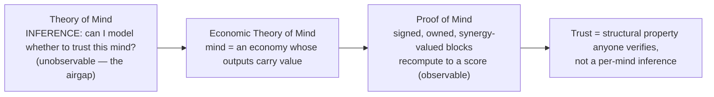
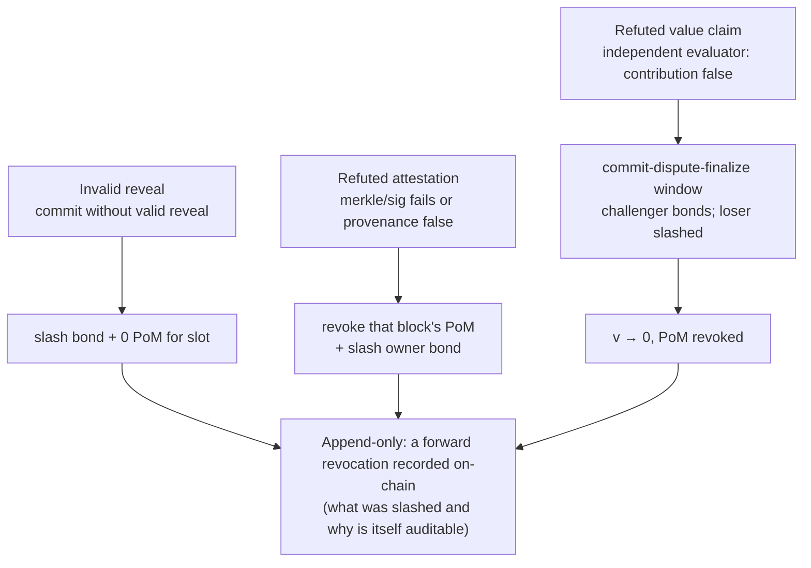
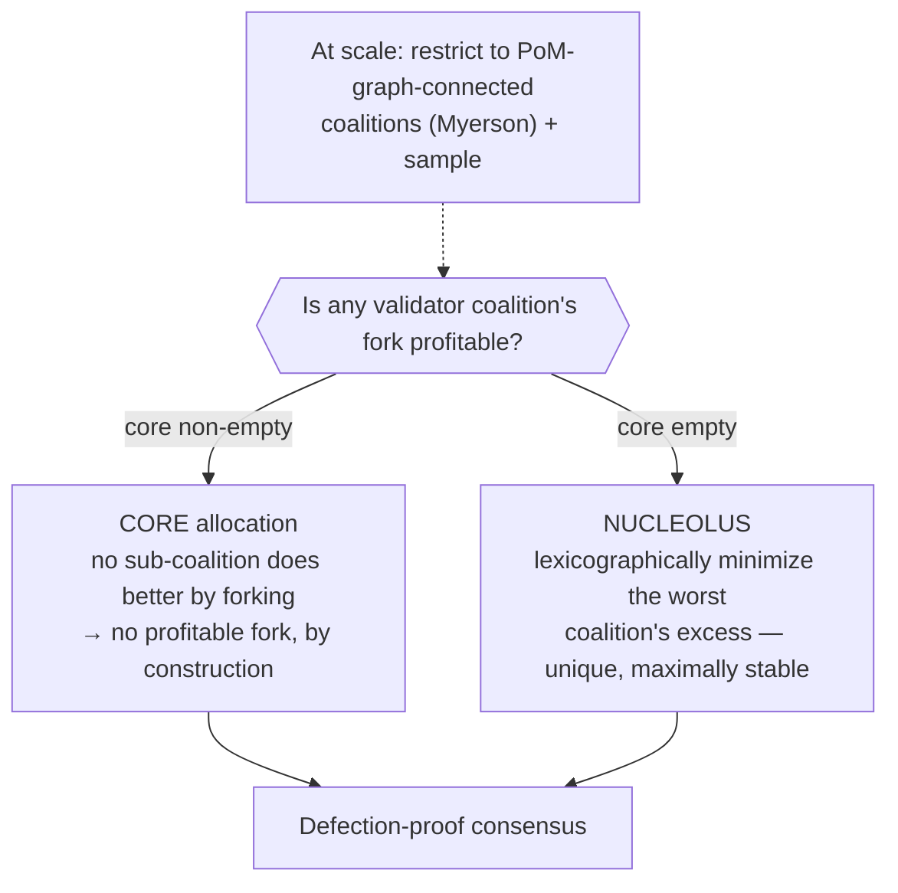
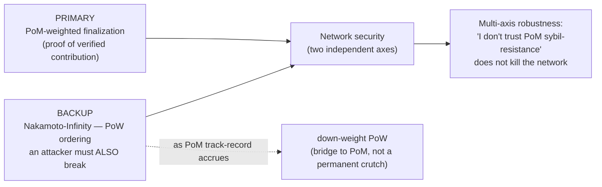

# Proof of Mind — consensus + the Theory-of-Mind mapping (PRIVATE)

> Stealth. No public release until matured. Builds on BLOCK-ECONOMY-SPEC.md.

## Proof of Mind (PoM) — the score

An agent's **PoM score** = its accumulated Myerson/Shapley credit across *verified,
owned, provenance-complete* blocks (the block-economy value layer). It is a number
that says: *this mind has provably contributed this much synergy-weighted value to
the shared outcome.*

Properties it inherits for free from the block economy:
- **verifiable** — every contributing block is provenance-complete (commit-reveal
  inputs→output) and owner-signed (Ed25519). PoM can be recomputed by anyone.
- **ownable + transferable** — credit accrues to the block's current owner (UTXO
  fold); PoM is the sum over owned blocks.
- **synergy-weighted** — value is the Myerson value of the outcome game, so PoM
  rewards *pivotal* contribution and discounts *redundant* contribution. You cannot
  pad PoM with repetition.

## PoM consensus — why decentralization becomes realistic

Weight validators by **PoM**, not energy (PoW) or capital (PoS):

- **Sybil-resistance is structural.** PoM requires owned blocks whose value was
  synergy-judged and whose provenance is signed. A thousand fake nodes have zero
  PoM because they produced no verifiable, pivotal contribution. Splitting one
  mind into many accounts does not multiply PoM (the synergy game discounts the
  redundant copies — same diagnostic as the block-value fix).
- **Stake = demonstrated mind.** The thing at risk is your accumulated proof of
  contribution, which can only be earned, not bought. Slashing = revoking PoM for
  proven-bad blocks (caught hallucinations, refuted attestations).
- **Stability (no profitable fork).** Add a **core / nucleolus** stability
  constraint over the PoM-weighted coalition game so no validator coalition can
  profitably deviate — the consensus is defection-proof at the mechanism level,
  not by social trust. (This is the "add a stability concept only when consensus
  needs it" piece from the math roadmap.)

The chain (tamper-evident, signed, owned) is the ledger; PoM is the stake;
consensus = PoM-weighted agreement on the canonical chain. That is a decentralized
network whose security comes from *proven thinking*.

## Theory of Mind → Proof of Mind (the mapping Will asked for)

The derivation chain is clean, and it runs through Will's ETM primitive:

**Theory of Mind (ToM)** — the cognitive capacity to model other minds' beliefs,
intentions, and knowledge. Across agents it is *inference*: you cannot see inside
another mind, so you guess whether to trust it. This is an **airgap** — the
inter-mind version of the blockchain-vs-reality airgap.

**Economic Theory of Mind (ETM)** — Will's frame: *mind = economy*. A mind's
states are positions in an internal economy; its outputs are contributions with
value. ETM turns "what is this mind?" into "what does this mind's economy
produce?"

**Proof of Mind (PoM)** — the *verifiable economic proof* of a mind's
contribution. It closes the ToM airgap: instead of each node *inferring* whether
another node is a mind worth trusting (intractable, game-able), PoM gives a
**proof** — signed, owned, synergy-valued blocks that recompute to a score.

> ToM asks "can I model whether to trust this mind?" — inference, unobservable.
> PoM answers "here is the proof this mind contributed verified value" — observable.
> ToM → ETM → PoM is: capacity → mind-as-economy → cryptographic proof of that economy.

So PoM is what makes ToM **tractable for a decentralized network**: trust stops
being an inference each node must make about every other mind, and becomes a
structural property anyone can verify. That is the same move as the rest of the
stack — replace "detect / infer / trust" with "prove / verify / structure." It is
the maximally-moral-agent thesis at the network scale: a network of minds whose
standing is *earned and proven*, not claimed or assumed.

Connections: [P·economic-theory-of-mind] · [P·airgap-problem-blockchain-vs-reality]
(ToM airgap closed) · [P·honesty-as-structural-load-bearing-property] · the
existing MessagingPoM / proof-of-mind line (now given a concrete, computable score).

## Slashing & commit-reveal (AFK item 4)

PoM is earned and *revocable*. The slashable events, and what each costs:

- **Invalid reveal.** Authorship uses commit-reveal: `hash(block‖secret)` + signature
  + timestamp is published before content. Committing then failing to reveal valid
  content (or revealing content that doesn't match the commit) forfeits a bond and
  earns zero PoM for that slot — this is the same 50%-invalid-reveal slash as the
  batch exchange, applied to block authorship. It makes authorship un-front-runnable
  *and* costly to spam.
- **Refuted attestation.** A block whose attestation is later refuted (the merkle/
  signature doesn't verify, or the provenance is shown false) revokes the PoM that
  block contributed, retroactively, and slashes the owner's bond.
- **Refuted value claim.** A block whose *outcome value* is successfully challenged
  (an independent evaluator shows the claimed contribution is false/hallucinated)
  zeroes that block's `v` and revokes its PoM. This needs a **commit-dispute-finalize**
  window (the merkle-dispute-window primitive): value is provisional until a challenge
  window closes; challengers post a bond; the loser of a challenge is slashed.
- **Append-only safety.** Credit is append-only (earned at finalization), so slashing
  is a *forward* revocation event recorded on-chain, never a silent rewrite — the
  history of what was slashed and why is itself auditable.

Net: PoM can only be earned by verifiable contribution and can be *lost* by proven
dishonesty. Honesty is the profitable strategy; dishonesty is bonded-and-slashable.

## Stability — no profitable fork (AFK item 8)

PoM-weighted agreement must be **defection-proof**: no coalition of validators should
profit by deviating from the canonical chain. We impose a stability constraint over
the PoM-weighted coalition game:

- **Core.** Require the PoM allocation to lie in the *core* of the validator game —
  no sub-coalition can secure more by going it alone (forking). When the core is
  non-empty, no profitable fork exists by construction.
- **Nucleolus fallback.** The core can be empty. When it is, select the **nucleolus**
  — the allocation that lexicographically minimizes the worst coalition's
  dissatisfaction (its excess). This is the maximally-stable point even when perfect
  stability is unattainable, and it is unique.
- **Why both.** Core = "is any fork profitable?" (a yes/no stability test). Nucleolus
  = "given some instability is unavoidable, minimize the largest incentive to defect."
  Compose them: core when it exists, nucleolus otherwise. Added *because consensus
  requires it* — pure attribution (PoM score alone) does not need a stability concept.
- **Cost.** Core/nucleolus are expensive in general (LP / iterated-LP over coalitions);
  at scale, restrict to the PoM-graph-connected coalitions (Myerson-style) and sample,
  same as the value layer.

## Value strategyproofness — adversary finding + fix (2026-06-11)

A standing adversary (`adversarial-game.py`) found a real hole and we fixed it:
- **Sybil-split: resistant.** K identical clones share one block's value (1.06× for
  K=5), they do not multiply it — the synergy game discounts duplicates.
- **Padding: GAMEABLE under Shapley.** A block whose coverage is a subset of an
  existing block earned positive value (≈29.86) by extracting credit from the donor
  in the orderings where it preceded it. Shapley splits *shared* coverage with later
  duplicators.
- **Fix — temporal-novelty (commit-reveal order).** `value(b) = coverage(b) minus the
  union of coverage of all EARLIER-committed blocks`. First-to-reveal-coverage earns
  it; later padding/sybil blocks earn **0 novel coverage** (tested: both attacks → 0,
  honest blocks keep novelty). This is *why commit-reveal is load-bearing for VALUE,
  not just authorship* — it supplies the canonical order that makes the value rule
  strategyproof. Shapley is for unordered contributions; a chain has a commit order, so
  temporal-novelty is the correct rule.

## Fallback: Nakamoto-Infinity as a backup consensus (Will, 2026-06-11)

PoM's sybil-resistance is structural, but *trust* in a new mechanism is earned slowly.
Hedge with a familiar, battle-tested layer: run **NakamotoConsensusInfinity** (PoW-style
ordering, already in the VibeSwap contracts) as a backup/cross-check beneath PoM.

- **Primary:** PoM-weighted finalization (proof of verified contribution).
- **Backup:** Nakamoto PoW provides an independent ordering an attacker must *also*
  break. Two independent consensus axes → multi-axis robustness; a single objection
  ("I don't trust PoM sybil-resistance") doesn't kill the network, because the Nakamoto
  layer still holds.
- **Trust bridge:** skeptics who don't yet believe proof-of-mind can rely on the
  familiar Nakamoto guarantee while PoM proves itself; as PoM track-record accrues, the
  PoW backup can be down-weighted. It is a *bridge to PoM*, not a permanent crutch —
  same shape as defense being a bridge-to-dissolution.
- Composes with the core/nucleolus stability above: stability makes PoM defection-proof;
  Nakamoto makes the whole thing robust to *disbelief in* PoM.

## Retention-decay attack surface (NCI verification, 2026-06-11)

NCI decays the **PoW + PoM** portions of a validator's vote weight by staleness
(`_retentionAdjustedVoteWeight`: `weight = PoS-portion + decay(PoW+PoM)`), while the **PoS**
portion (locked capital) does **not** decay, and the finalization threshold is 2/3 of *base*
(undecayed) weight. Three consequences worth watching:

- **Composition drift toward capital.** PoS is the only non-decaying input, so under correlated
  staleness of PoM/PoW validators (minds offline) the *effective* live weight shifts toward
  capital. The 60% PoM bloc is a *base-weight* figure; its effective share decays — so L12's
  "PoM 60% < 66.67% ⇒ no single dimension finalizes alone" margin is **participation-conditional**,
  not static. A patient capital actor is structurally "always fresh."
- **Low-participation liveness halt.** `weightFor` is decayed but the threshold is on base weight,
  so heavy staleness ⇒ `weightFor` cannot reach 2/3-of-base ⇒ proposals fail to finalize. This is
  fail-safe (a halt, not a safety break) but a real liveness hole an attacker can exploit by
  inducing or awaiting staleness.
- **Mitigations (candidates).** Threshold on *effective* (decayed) active weight, or a
  present-quorum rule (closes the halt); a freshness floor / slower decay on PoM+PoW so a brief
  outage does not collapse the cognitive bloc (ties L8 / L13 floors); document that
  single-dimension-can't-finalize is conditioned on live PoM participation.

Net: retention-decay correctly prices idle attack and aligns weight with live participation (the
ETM move), but it makes the dimension mix time-varying — capital's relative influence rises exactly
when cognition goes quiet. That asymmetry is the surface to watch.

**Resolution direction (Will, 2026-06-11): make PoS decay too.** The drift exists *only* because
PoS vote-weight is the lone non-decaying input. Decay it symmetrically with PoW+PoM and the
effective mix stays ~60/30/10 under any correlated staleness — capital loses its "always fresh"
edge and the three powers become time-symmetric (cleaner RPS; more faithful to ETM — relevance
fades for *every* substrate, capital included). Three conditions make it coherent:
- **Decay the franchise, not the balance.** Decay PoS *vote-weight*, never the staked capital —
  you keep your stake, you lose *influence* when stale. A deliberate reframe from
  "capital-at-risk" to "capital-that-also-shows-up" (use-it-or-lose-it franchise for all three).
- **Pair with an effective-weight threshold — plus a quorum floor.** Symmetric decay *alone*
  worsens the liveness halt (everything shrinks against a base-weight bar). Measuring the 2/3
  threshold against *effective* (decayed) active weight closes the halt — **but a bare
  effective-weight bar opens an eclipse surface**: an attacker who makes honest validators look
  absent shrinks the denominator and reaches 2/3 of it alone (RSAW self-audit, demonstrated in
  `node` `consensus::audit_a1_effective_threshold_opens_an_eclipse_surface`). The hybrid fix:
  effective-weight bar over **max(effective_total, present-quorum floor)** so the denominator
  cannot be shrunk below a minimum honest participation (`audit_a1_quorum_floor_closes_the_eclipse`).
  Together: drift closed, halt closed, eclipse closed.
- **Already true economically.** Capital already decays via state-rent / secondary-issuance
  dilution of idle holders in the CKB model; this just extends "idle capital fades" up to the
  vote-weight layer for consistency.

Constitutional note: US branches do *not* decay (a quiet Congress keeps full power; only periodic
elections refresh legitimacy). Decaying all three powers is a *continuous-time, use-it-or-lose-it*
franchise — closer to "elections every epoch" than to the US's multi-year heartbeat, and a stronger
anti-incumbency property than the Constitution has. (Open item; no code change yet.)

## Dissolving the open-model trilemma via coordination (Will, 2026-06-11)

The open-model trilemma (sovereignty ⊥ capability ⊥ footprint) binds a *single*
model. Mechanism design + coordination get most of all three by making collective
capability *emerge* from many lightweight-open models — and the mechanism that does
it is **this network, one level down**:

- **Mixture-of-agents.** Many small sovereign models generate blocks; the value game +
  PoM select and aggregate the best. Collective capability > any single small model.
  The open models become PoM contributors (recursion: the network of minds includes
  the models).
- **Verification asymmetry (the lever).** Generating is hard; verifying is cheaper. Many
  cheap generators + structural verification (gates, synergy value, adversarial check)
  match a heavy model's *reliable* output at light footprint. JARVIS's thesis applied to
  buy the capability axis without the weight.
- **Coordination game.** Route each hard sub-task to the best small model (learned,
  PoM-weighted). Specialization beats one generalist.

**Honest residual — relocation, not abolition (GEV-conservation).** This converts the
model-*size* constraint into a **coordination-cost** constraint (latency + running
several models). Net win only where verification < generation (most verifiable work),
not for irreducibly-hard frontier generation. Coordination amplifies/selects/verifies
*latent* capability; it cannot manufacture capability no open model has. Large lunch on
reliable verifiable capability; no free lunch on raw frontier reasoning.

## Status (honest)
- Designed, not built: PoM aggregation across owned blocks; core/nucleolus stability;
  PoM-weighted consensus finalization; the slashing-on-refuted-attestation path.
- Depends on: the synergy outcome-value v(S) (v1, in progress) being real, or PoM
  inherits the additive-Shapley ceremony problem. Get v(S) right first.
