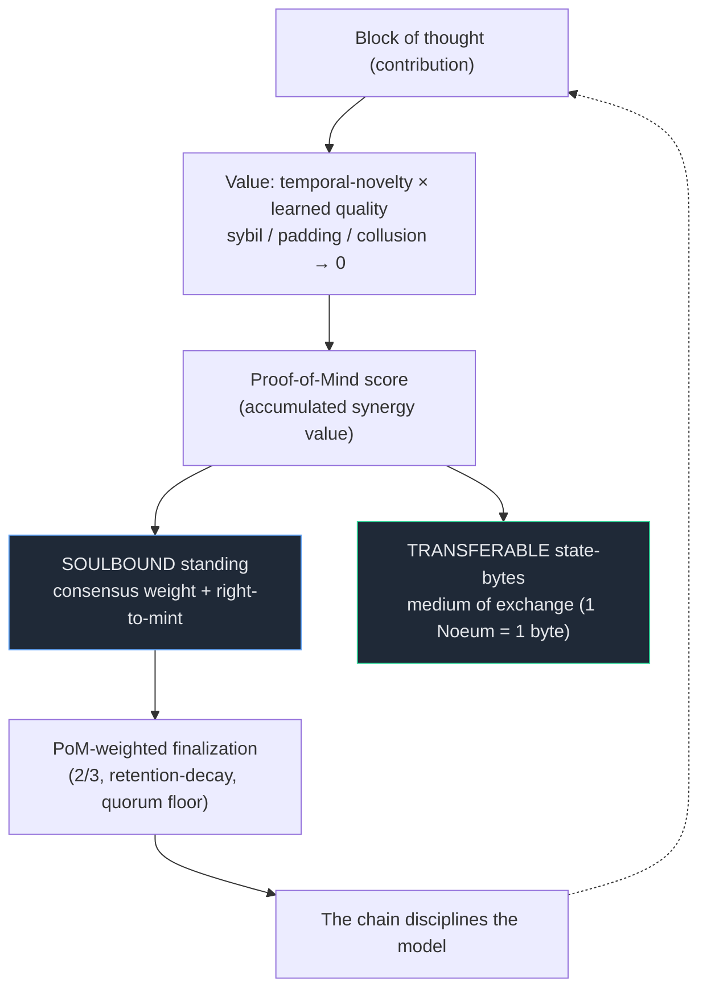

# noesis

**A Proof-of-Mind value chain.** Blocks are owned, value flows along the graph of what
builds on what, and the right to finalize is earned by demonstrated contribution rather
than bought with capital — the chain that prices *minds*, not hashes or stake.

> Status: **reference implementation, pre-launch.** The consensus, value, and execution
> layers are implemented in Rust and exercised by **221 passing tests**; the on-chain
> rules run as type-scripts inside CKB-VM (RISC-V) in-test. There is no public network yet.

---

## Why it exists

Bitcoin made *scarcity* objective. It did not make *value* objective — proof-of-work
prices energy, not contribution. noesis closes that gap: a block's value is sourced from
the realized downstream flow it enables, identity is earned and soulbound rather than
purchasable, and finalization weight comes from a Proof-of-Mind score. The cheapest way to
gain influence becomes actually contributing — the attack surface is dissolved, not patched.



## Architecture

```
Execution    on-VM type-scripts (RISC-V / CKB-VM): intake floors, proven novelty, finalization
Value        novelty -> similarity/semantic floors -> realized-flow gate -> priced identity -> dispute
Consensus    PoM-weighted finalization (2/3, retention-decay, quorum floor), AND-composed proof mix
State        Cell model (UTXO-style), sparse-merkle novelty index, commit-reveal ordering
```

The substrate is Nervos CKB's design — Rust, the RISC-V CKB-VM, and the Cell model — with
Proof-of-Mind as the consensus and value mechanism on top. Every security-critical input
the chain consumes is re-derived from consensus, never accepted as the transaction assembler
claims it (the recurring *don't-let-the-attacker-choose-the-input* invariant).

## Repository layout

```
node/            Reference implementation (Rust, host): consensus, value, dispute, the SMT
                 novelty index, the fixed-point arithmetic cores, and the full test suite.
onchain/
  noesis-core/   no_std verify-side core shared by the node and the type-scripts —
                 ONE source of truth for the arithmetic both sides must agree on.
  pom-typescript/          On-VM intake type-script (novelty/semantic floors, proofs).
  finalization-typescript/ On-VM PoM-weighted finalization (header-sourced `now`).
docs/            Whitepaper, protocol specs, consensus / cryptoeconomic write-ups.
research/        Prototype models (Python) the Rust implementation is derived from.
scripts/         Repo-hygiene tooling (doc-coherence, study guide).
```

## Build & test

```bash
make test        # host suite — node + noesis-core (221 passing)
make fmt         # rustfmt
make clippy      # clippy, warnings-as-errors
make elf         # build the RISC-V type-scripts (nightly + riscv64imac target)
```

Or directly:

```bash
cargo test                     # workspace host tests
cd onchain/finalization-typescript && \
  cargo build --release --target riscv64imac-unknown-none-elf
```

The on-VM type-scripts compile to RISC-V and are validated end-to-end against a host harness
that serves the Cell environment, so the same rule produces the same verdict on-VM and
off-VM — cross-boundary determinism via canonical fixed-point arithmetic.

## Documentation

- [`docs/WHITEPAPER.md`](docs/WHITEPAPER.md) — the full design.
- [`docs/POM-CONSENSUS.md`](docs/POM-CONSENSUS.md) — Proof-of-Mind finalization.
- [`docs/BLOCK-ECONOMY-SPEC.md`](docs/BLOCK-ECONOMY-SPEC.md) — block ownership + value flow.
- [`ROADMAP.md`](ROADMAP.md) — phased plan and current frontier.
- [`STUDY-GUIDE.md`](STUDY-GUIDE.md) — generated map of the codebase and docs.

> Naming: **Noēsis** = the network (the act of mind); **Noeum** = the unit
> (1 Noeum = 1 byte of state = 1 PoM unit). Core inspiration: Nervos CKB.

## License

Proprietary and confidential during the pre-release period — see [`LICENSE`](LICENSE).
An open-source license will be designated at public release.
