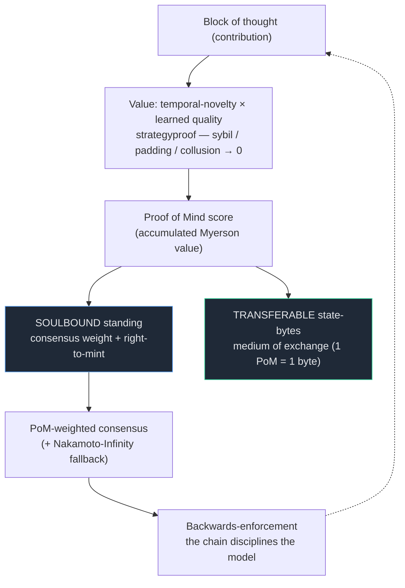

# Noesis — the Proof-of-Mind value chain (PRIVATE, stealth)

> The value chain Bitcoin is mistaken for: a ledger where verified, synergy-weighted
> *mental* contribution earns provable, accruing, transferable value, and secures consensus
> by **Proof of Mind** in place of proof of wasted energy. Private until matured — start
> with `WHITEPAPER.md` for the full spec and the honest demonstrated-vs-designed split.

## Read order

- **`WHITEPAPER.md`** — the spec (start here)
- `WHITEPAPER-FOR-DAD.md` — plain-English, no math
- `BLOCK-ECONOMY-SPEC.md` — the five-layer stack
- `POM-CONSENSUS.md` — consensus + Theory-of-Mind → Proof-of-Mind
- `CRYPTOECONOMICS.md` — 1 PoM = 1 byte; soulbound standing vs transferable bytes
- `COORDINATION-SCHELLING.md` — inward/outward consensus, the deployment thesis
- `COHERENCE-LAWS.md` — the cryptoeconomic invariants (L1–L12)
- `ROADMAP.md` — phases, with the un-gameable-`v(S)` gate
- `CONSENSUS-REVIEW.md` — consolidated consensus findings + RSAW self-audit (the fix-chain)
- `VISUALS.md` — all figures collected in one place
- `node/` — Rust core (CKB-shaped); `CONTINUE.md` — session handoff

> Naming: **Noēsis** = the network (the act of mind); **Noeum** = the unit (1 Noeum = 1 byte
> of state = 1 PoM unit). Core inspiration: Nervos CKB. Keep out of public during stealth.
