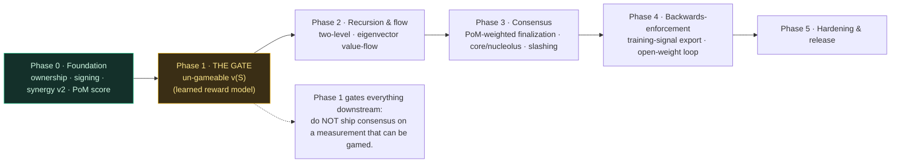
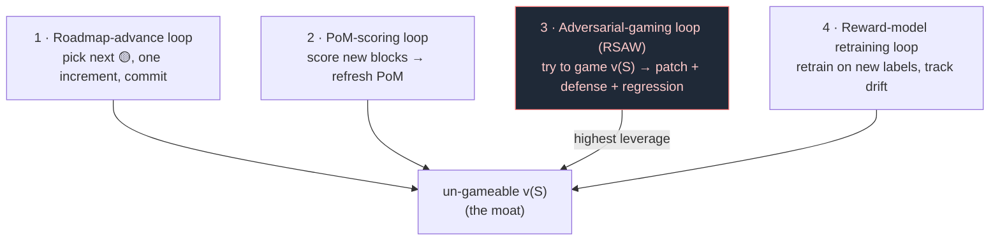

# Roadmap — Proof of Mind value chain (PRIVATE)

> Stealth. Release when matured. Phases are dependency-ordered; the load-bearing
> risk (un-gameable `v(S)`) gates everything downstream, so it comes early.

## Tier legend
- ✅ **demonstrated** — runs, tested on real blocks this session
- 🟡 **designed** — specified, not yet built
- 🔬 **research** — open problem, no settled approach

## Phase 0 — Foundation (DONE this session)
- ✅ Block ownership, Bitcoin-shaped (UTXO fold over signed transfer log); transfer
  voids prior attestation. `block-ownership.py`
- ✅ Per-block Ed25519 signing; tamper-resistance (signed Merkle root, keyless
  re-baseline caught at boot). `integrity-attest.py`
- ✅ Synergy value v0→v2: coverage outcome-value + Myerson (sampled) + Bradley-Terry;
  Shapley made load-bearing (L1≈0.26 vs additive). `block-value-v2.py`
- ✅ PoM score = per-owner Myerson value → consensus weight. `pom-score.py`
- ✅ Privacy: private repo + nda-locked + fail-closed sync leak-gate.

## Phase 1 — Make the measurement un-gameable (THE gate; do first)
The whole system is only as honest as `v(S)`. Until this is solid, everything above
is a reputation system.
- 🟡 **Learned reward-model `v(S)`** — Bradley-Terry over block features → generalizes
  to unseen blocks (RLHF reward model). Replaces the coverage proxy. `reward-model.py`
- 🟡 **Outcome-value labels** — coalition-level "how good is the outcome using only S"
  judgments (model/jury, DeepFunding-distill over *sets*).
- ✅ **Strategyproofness — production rule shipped** (`value-v3.py`). The canonical
  value rule is **temporal-novelty** (value = coverage novel vs earlier-committed
  blocks, via commit-reveal order), strategyproof **by construction**: sybil-split,
  padding, AND collusion-ring all earn 0 (tested live in `adversarial-game.py` AND
  built into `value-v3`); honest blocks keep value. Resolved the inter/intra split:
  inter-block = temporal-novelty (ordered, strategyproof); intra-block co-authors =
  Myerson (simultaneous, synergy).
  - 🟡 **New open item (found by building it):** strict novelty zeroes *honest-but-
    redundant* blocks (e.g. an honest block adding no new coverage → 0). Tradeoff:
    strict-novelty incentive vs not-punishing-honest-redundancy. Candidate fix:
    value = novelty × **quality** (the learned reward model weights novel coverage),
    optionally + a small participation floor. This is the natural junction where the
    strategyproofness layer (novelty) and the capability layer (reward model) compose.
  - 🟡 remaining: proof under the *learned* `v(S)`. **Partial (node, 2026-06-11):**
    `learned_quality_preserves_the_novelty_floor` regression-tests that the ACTUAL
    trained Bradley-Terry quality cannot rescue a novelty-0 redundant cell (floor holds
    under the learned model, not just pinned quality). Adversarial loop tick #1.
  - 🔬 remaining (now PINNED): **garbage-novelty gap.** The floor catches redundancy,
    not high-entropy novel-but-worthless content (coverage proxy rewards entropy).
    `garbage_novelty_is_the_documented_open_gap` pins it: passes today (gap present),
    flips when the learned OUTCOME-evaluator replaces the coverage proxy. Closing this
    is the core Phase-1 bet. Plus: decay + reviewer-diversity port for quality weighting.

## Phase 2 — Recursion & flow
- ✅ **Two-level recursion** — intra-block share vectors via the same Myerson game one level
  down. Ported to Rust (`flow::recurse_two`, `recurse_shares`), tested.
- ✅ **Eigenvector value-flow** — backward propagation through the provenance DAG with damping
  (PageRank-style; defeats self-reference). Ported to Rust (`flow::value_flow`), tested.
- 🔬 **Temporal flow** — round-to-round value (iterated-Shapley / fairness-fixed-point);
  bound drift.

## Phase 3 — Consensus
- ✅ ref / 🟡 on-chain **PoM-weighted finalization** — 2/3-supermajority reference model
  (`consensus::finalizes`, `finalizes_hybrid`), retention-decay, verified vs NCI
  (`NakamotoConsensusInfinity.sol`); on-VM finalization still pending.
- ✅ ref / 🟡 solver **Stability** — core membership + nucleolus max-excess reference model
  (`stability` mod, tested); the LP / iterated-LP solver over the real PoM-weighted coalition
  game (Myerson-restricted, sampled at scale) is pending.
- ✅ ref / 🟡 on-chain **Slashing** — `slash` + equivocation / early-reject (`is_equivocation`,
  `can_early_reject`), decay-orthogonal (A5); on-chain accounting + dispute window pending.

> Full consensus findings, the fix-chain (each fix reveals the next attack), and the NCI
> verification table: `CONSENSUS-REVIEW.md`. Reference models live in `node/` (49/49) and the
> Solidity composition invariants in VibeSwap `test/consensus/NCICompositionInvariants.t.sol` (8/8).

## Phase 4 — Backwards-enforcement of the model
- 🟡 **Training-signal export** — value-weighted dataset from high-PoM verified blocks.
- 🔬 **Open-weight fine-tune loop** — governance truth → gradient → model; verify →
  compound. (Depends on the open-weights migration.)

## Phase 5 — Hardening & release
- 🟡 Adversarial audit (RSAW on the mechanism), external-economist critique pass.
- 🟡 Reference implementation + whitepaper v1.0.
- Release — matured, with the head-start banked.

## Loops (self-perpetuating, private)

The roadmap shouldn't depend on one long session. Proposed loops, each writing only
to the private repo:

1. **Roadmap-advance loop** — pick the next 🟡 item, do one increment, commit. The
   "start and don't stop" mechanism. (Set up this session.)
2. **PoM-scoring loop** — as new session-chain blocks accrue, score them (value-flow +
   reward-model) → refresh PoM scores → commit. Keeps the value chain live.
3. **Adversarial-gaming loop (RSAW on the mechanism)** — each tick, *try to game* `v(S)`
   (cheap PoM inflation: sybil split, redundant padding, self-attribution ring). If a
   manipulation is found, patch it + add a defense + a regression. This is how Phase 1's
   un-gameable-`v(S)` actually gets hardened — by an adversary that never sleeps.
4. **Reward-model retraining loop** — as pairwise/outcome labels accumulate, retrain
   the reward model; track held-out accuracy; flag drift.

The adversarial-gaming loop is the highest-leverage: the whole system's honesty rests
on un-gameable measurement, so a standing adversary against `v(S)` is the moat.

## Critical path
Phase 1 (un-gameable `v(S)`) → Phase 2 (recursion/flow) → Phase 3 (consensus) → Phase 4
(backwards-enforcement). Phase 1 is the gate: do not ship consensus on a measurement
that can be gamed.
