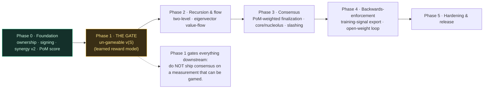
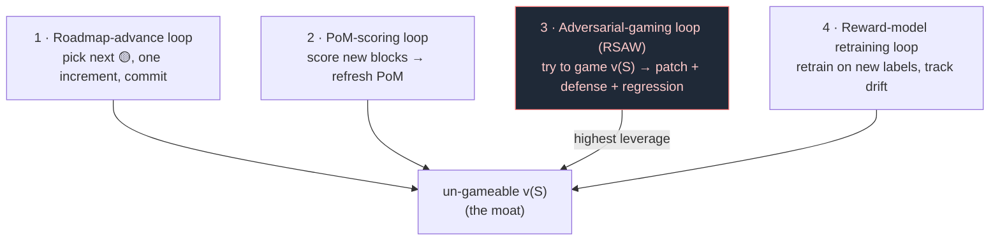

# Roadmap — Proof of Mind value chain (PRIVATE)

> Stealth. Release when matured. Phases are dependency-ordered; the load-bearing
> risk (un-gameable `v(S)`) gates everything downstream, so it comes early.

## Adversarial-loop log (RSAW — newest first)
- **2026-06-16 (g)** — RSAW follow-tick on the (f) fix: PINNED the honest residual. The derived-minter
  fix relocated mint-authority trust from a self-declared field to the AUTHENTICITY of the consumed
  authority input — strictly better (same input-authenticity every tx needs), but NOT closed: pre-sig /
  pre-ledger, `inputs` aren't verified to exist in the ledger or be controlled by their claimed owner,
  so an attacker can FABRICATE an authority cell naming the issuer as owner and mint. Test
  `derived_mint_authority_is_input_authenticity_bound_open_residual` documents the residual is real and
  names where it closes — the lock-sig + ledger-input-existence layer (deploy-coupled), the same class as
  index-dep / header-`now` (structure now, crypto-enforcement at deploy). No silent assume-closed. suite
  261→262 (+1 doc-pin test, no code change). NEXT BUILD with a crisp contract: verify each input exists in
  the ledger AND lock-sig proves control ⇒ a fabricated authority cell can never enter `inputs`.
- **2026-06-16 (f)** — RSAW (adversarial-gaming loop, the moat) on the NEW token gate found + closed a
  SELF-INTRODUCED vector. The gap #4 block-validation gate carried a producer-asserted `minter` field;
  `TokenTx::is_valid` authorized a fungible/NFT mint purely by `minter == args`, so an attacker mints any
  token by naming itself the issuer. **8th site of `[P·dont-let-attacker-choose-critical-input]`.** FIX:
  removed the `minter` field — the runtime DERIVES it from issuer control of a consumed authority cell
  (an input of this token whose owner `lock.args` == issuer `args`). A non-issuer gets a minter that
  cannot match ⇒ supply-increase / new-id rejected; conserving transfers + burns unaffected. Empty-issuer
  guard makes the non-issuer sentinel sound. +2 regression tests: `mint_authority_cannot_be_self_declared`
  (the raw primitive WOULD trust a handed minter, but the runtime exposes no such channel) +
  `issuer_mints_by_spending_its_authority_cell` (the legitimate path). HONEST SCOPE: reference-layer /
  pre-deploy — `lock.args` stands in for the verified owner; binding it to a checked signature is the
  deploy-coupled lock-sig layer. lib 208→210, suite 259→261, 0 new clippy. (pom-roadmap-advance tick —
  the adversary that never sleeps caught code shipped 2h prior, same session.)
- **2026-06-16 (e)** — BUILT (adversarial-gaming loop, runtime level): un-gameable-`v(S)` sybil/padding
  resistance now pinned THROUGH the live node, not just the lib. `node/tests/gaming.rs` (2): a 5-identity
  sybil ring submitting IDENTICAL content banks ≤1 cell's coverage (adding identities ≠ more standing —
  whoever the consensus shuffle orders first banks it, the rest earn 0); a cross-block re-post of
  already-committed content earns 0. Composes `temporal_novelty` + `pom_scores` through the real
  propose→validate→finalize→apply path. No new gaming vector found — the property holds at integration.
  suite 255→257. (pom-roadmap-advance cron tick; PCP-gate kept the delicate v(S) CORE surgery out —
  this is the additive integration-coverage grain appropriate to a high-context window.)
- **2026-06-16 (c)** — BUILT: node runtime + first 2-node convergence (`node/src/runtime.rs` +
  `node/tests/two_node.rs`, 3/3 green). Deterministic state-machine replication over the mechanism
  library — two nodes finalize the same blocks and hold byte-identical (cells, novelty-index root, PoM)
  state; orchestration only, no new mechanism. + DESIGN-LOCKED the value-dimension matrix as MIXED
  3-layer (physics > constitutional > governance, NOT immutable; boundary = the completeness/weights
  cleavage per value-disputes-are-incompleteness-bias — completeness has a fact-of-matter, final weights
  do not). + ARMED 6 threads (T1 SOTA peer transport w/ CKB-shape COMMITTED; T2 ML-native consensus;
  T3 PoW finality-lag vs PoS/PoM; T4 matrix-governance ✅; T5 shard+commit-reveal+pairwise from
  VibeSwap/JARVIS; T6 2-node runtime ✅) — detail in CONTINUE.md top block.
- **2026-06-16 (b)** — DESIGN NOTE (not built; surfaced in a public-thesis session, captured here):
  an orthogonal family for un-gameable `v(S)` — **elicit, don't measure**. Phase 1 currently assumes
  `v(S)` must be MEASURED (learned reward-model on real labels), which IS the data-blocked critical mile.
  Alternative/complement: make a claimant REVEAL subjective value via skin-in-the-game (Harberger / COST
  self-assessment) instead of a central learned measure. Claimant self-assesses the `v(S)` of their
  contribution and posts a holding stake/tax proportional to the declaration: over-claim is costly
  (tax + forfeit on successful challenge), under-claim cedes the claim. This reduces the oracle from
  CONTINUOUS MEASUREMENT to a COMMIT-DECLARE-CHALLENGE dispute layer (cheap, fires only on contest —
  same shape as the commit-reveal + dispute-window patterns already in use). Honest residuals 🔬:
  (a) the challenge leg still needs SOME downstream-value signal to RESOLVE disputes, so it SHRINKS
  rather than eliminates the learned-`v(S)` dependence (dispute oracle, not continuous oracle);
  (b) naive Harberger allocates by ability-to-pay, not intensity, so it must pair with quadratic
  weighting OR redistribute the tax as a commons-dividend to stay non-plutocratic (cooperative-capitalist,
  not pay-to-play). STATUS: design candidate / complement to learned-`v(S)`, NOT a replacement, NOT
  demonstrated. Concrete spike when built fresh: does commit-declare-challenge + redistribution price
  the PUBLIC/common-atom front-run residual (the 2026-06-14 novelty land-grab) to ~0 WITHOUT real labels?
  If yes, it partially unblocks Phase 1 ahead of the labels mile.
- **2026-06-16** — DESIGN tick (no code; PCP-gate — ~7h-45m session, heavy context: the delicate
  per-certifier settlement build belongs in a fresh context, exactly the moat-code the gate
  guards). Advances the NEXT target from *named* → **DECIDED**: resolves the one open question the
  per-certifier asymmetric clamp needs — how to map a certifier's slash-key (`Vec<u8>`) to its
  consensus validator id (`u64`) for the per-certifier counterfactual. **Decision — reuse the
  existing key↔id JOIN idiom, do not invent a new channel:** the dispute module already binds
  contributor keys to validator ids via `juror_keys: &[(u64, Vec<u8>)]`
  (`conflicted_juror_ids`/`verdict_refutes_excluding_conflicted`). The per-certifier clamp takes
  the same `certifier_keys: &[(u64, Vec<u8>)]` join and, for each `(key, share)` in
  `certifier_shares`, looks up the validator id and runs
  `defendant_holds_downweighted_dim(voters_for, all, that_id, …)` — dropping THAT certifier's
  slash iff their own PoM is load-bearing to the full-mix non-conviction (the grief), keeping it
  otherwise (a garbage certifier riding along is still slashed). This replaces the current
  whole-settlement single-`defendant_id` gate in `resolve_refuted_guarded` with a per-share gate,
  so a MIXED panel (one honest-PoM certifier + one garbage certifier on the same target) slashes
  the garbage and spares the honest one — the all-or-nothing coarseness is removed. The id is
  consensus-derived (the join is the same set the verdict consumes), so no producer-asserted input
  is added. **Build (deferred to fresh context):** (1) `resolve_refuted_guarded` gains
  `certifier_keys` and gates per-share; (2) test a mixed panel: honest-PoM certifier's slash
  dropped, garbage certifier's slash kept, totals exact; (3) the existing single-defendant tests
  stay green (the whole-settlement case = the per-share case with one certifier). LEAN sub-item
  left EXPLICITLY un-built per PONYTAIL/YAGNI: do NOT abstract the recused-dimension constant yet —
  there is one appeal court (PoM-minimized); a `RECUSED_DIM` indirection is premature until a
  second (PoW/PoS-minimized) court exists. Re-evaluate when that court is added, not before. No
  code this tick — DECIDED + build scoped + a premature-abstraction explicitly declined. node unchanged.
- **2026-06-15** — BUILD tick (fresh context, Will-armed 2-increment loop): the
  asymmetric-appeal guard goes **DECIDED → WIRED END-TO-END**, closing both halves of the
  prior tick's named NEXT target. (1) `defendant_holds_downweighted_dim` is no longer a
  producer bool — it is DERIVED by a counterfactual on the defendant's OWN PoM standing
  (`!full_mix_convicts(panel) && full_mix_convicts(panel with the defendant's own PoM
  removed)`), and `appeal_refutes_guarded` exposes NO boolean channel, so an attacker cannot
  assert their way out of the clamp (the dont-let-the-attacker-choose-a-critical-input class
  applied to the guard's own input, same as header-`now`/coords). Test
  `guard_flag_is_derived_from_standing_not_producer_asserted` proves the grief clamps and the
  cartel-break convicts, separated by the counterfactual not by a passed flag. (2)
  `resolve_refuted_guarded` wires the guarded verdict into the settlement path, so the clamp is
  end-to-end at the SLASH level, not just the verdict boolean. Test
  `guarded_settlement_cannot_exceed_pre_appeal_slash` proves the invariant `total_slash(guarded)
  ≤ total_slash(pre_appeal)` for a down-weighted-dim defendant on a real unvested entry + a
  non-empty certifier share (so the invariant is not vacuous), AND that the cartel-break is
  preserved at the settlement level (guarded == unguarded when the defendant's own PoM is not
  load-bearing). Two new test fns, full lib suite green, no new clippy warnings. **NEXT RSAW
  target (each fix reveals the next):** the guard's gate is WHOLE-SETTLEMENT (one
  `defendant_id`), but `resolve_refuted` slashes PER-CERTIFIER. A mixed panel — one honest-PoM
  certifier AND one garbage certifier on the same target — is currently all-or-nothing: the gate
  clamps everyone or no one. The next tick is a PER-CERTIFIER asymmetric clamp (each
  down-weighted-dim certifier individually protected, the garbage still slashed), plus a lean
  note: keep the derivation's stripped dimension in lockstep with whichever dimension the active
  appeal `Tribunal` down-weights (today both hardcode PoM — single-source the "which dim is
  recused" constant so they cannot drift).
- **2026-06-15** — DESIGN tick (no code; PCP-gate at ~330k session tokens, AND a full moat
  BUILD already shipped this session — the asymmetric-appeal guard below; a second delicate
  settlement-code build in the same context is exactly what the gate guards). Advances the
  NEXT target named in `internal/CONTINUE.md` from *named* → **DECIDED**: how to bind
  `appeal_refutes_asymmetric`'s `defendant_holds_downweighted_dim` flag to consensus, not to a
  producer's assertion (the dont-let-attacker-choose-critical-input class applied to the guard's
  OWN input). **Decision — derive the flag by a counterfactual on the defendant's OWN standing,
  not a passed bool:** the flag is TRUE iff the defendant's standing in the down-weighted
  dimension is *load-bearing to their full-mix acquittal* — i.e. `full_mix_refutes(defendant) ==
  false` AND `full_mix_refutes(defendant with the defendant's OWN down-weighted-dim standing
  removed) == true`. This is elegant because it is exactly the predicate that separates the two
  cases the guard must not conflate: in the GRIEF, the honest defendant's own PoM is what defends
  them at full mix, so removing it flips the verdict ⇒ flag TRUE ⇒ clamp applies; in the
  CARTEL-BREAK, the defendant is the garbage cell defended by the *jury* cartel's PoM (not its
  own), so removing the defendant's own PoM does not change full-mix ⇒ flag FALSE ⇒ the overturn
  convicts unrestricted. The predicate reads only the consensus standing set (the same set the
  verdict already consumes), so an attacker cannot set it by assertion — it is derived, like
  `now`/coords before it. **Build (deferred to fresh context):** (1) `defendant_holds_downweighted_dim`
  becomes a derived fn over `(defendant_key, all, mix)` running the counterfactual; (2) wire the
  guarded verdict into `resolve_refuted` so the slash-level invariant `appeal_slash ≤
  pre_appeal_slash` holds end-to-end, not just at the verdict boolean; (3) a binding test that a
  producer-asserted flag is ignored (only the counterfactual decides) + the cartel-break stays
  green. No code this tick — DECIDED + the build scoped. node unchanged.
- **2026-06-15** — BUILD tick: the PoW/PoS-appeal-grief vector goes **DECIDED → DEMONSTRATED**.
  Built the decided candidate (a) ASYMMETRIC APPEAL as `dispute::appeal_refutes_asymmetric` +
  its regression `honest_pom_defendant_vs_powpos_majority_appeal_cannot_increase_slash`. The
  test constructs the grief end-to-end on real validators: a PoW/PoS-heavy attacker (pow=pos=80,
  pom=10) vs an honest PoM defendant (pom=80) — (1) the FULL-MIX court does NOT convict (honest
  PoM holds 80/90 of the 0.60 PoM weight), yet (2) the ungated PoM-minimized appeal court (pom
  down-weighted to 0.10 ⇒ PoW/PoS carry 0.90) DOES land the refutation against the honest
  defendant — the grief is real, not asserted — and (3) the guard clamps it: a down-weighted-
  dimension DEFENDANT's conviction may only ratchet toward acquittal (`pre_appeal && appeal`),
  so the appeal adds no slash. KEY DISTINCTION that keeps the §7.1c cartel-break intact: the
  flag keys on the DEFENDANT's standing, not the jury's. In the cartel-break the PoM cartel sit
  as JURORS while the defendant is the garbage cell (not a down-weighted-dim holder), so the
  guard is inert there and the overturn still convicts — proven by the in-test assertion
  `appeal_refutes_asymmetric(false, false, true) == true`. Worst case for honest PoM is now
  no-change; any real PoM conviction must still clear the full-mix court where PoM defends at
  0.60. node 232→233 (+1; full `cargo test` tally, lib 191→192). DEMONSTRATED.
- **2026-06-15** — DESIGN tick (no code; PCP-gate at ~410k session tokens — the design *decision*
  is context-safe, the Rust test + guard on the moat is NOT, so it is deferred to a fresh context;
  this advances the design rather than repeating the prior "named + scoped only" tick). Resolves the
  2026-06-14 PoW/PoS-appeal-grief vector from **named → DECIDED**. The §7.1c appeal court
  (`DISPUTE_APPEAL`, PoM-minimized 0.225:0.675:0.10) was built to BREAK a PoM-cartel by reducing
  PoM's appeal weight — its legitimate function is OVERTURN (acquit a down-weighted-dimension holder
  the captured court wrongly convicted). It has NO legitimate *convicting* function for that
  dimension: a conviction of a PoM holder belongs to the full-mix court, where PoM defends at its
  full 0.60. ⇒ the correct guard is **candidate (a) ASYMMETRIC APPEAL**, not symmetric recusal: the
  appeal court may only MONOTONE-DECREASE the conviction/slash of the down-weighted dimension's
  holders, never increase it. Invariant: `appeal_slash(holder of the appeal-down-weighted dim) ≤
  pre_appeal_slash` — a one-way ratchet toward acquittal. This KEEPS the cartel-break (acquittals
  still flow on appeal) while REMOVING the grief: a PoW/PoS majority cannot weaponize the
  PoM-minimized court to over-convict honest PoM (worst case = no-change), and any real PoM
  conviction must still clear the full-mix court where PoM has standing to defend. Rejected (b)
  symmetric cross-dimension recusal — heavier, and it over-recuses honest cross-dimension jurors
  to solve a one-directional problem. **DESIGNED, not demonstrated.** Fresh-session build = the
  adversarial test (`honest_pom_defendant_vs_powpos_majority_appeal_cannot_increase_slash`:
  construct honest-PoM defendant + PoW/PoS-majority attacker, assert the appeal yields no slash
  increase) + the monotone-decrease clamp in `Tribunal::AppealCourt`; if the test shows the current
  court CAN raise the slash, the clamp is the fix and the test is its regression. node unchanged
  (design tick — no test added, so no count bump).
- **2026-06-14** — DESIGN NOTE (execution deferred to a fresh context; PCP-gate at ~310k session
  tokens: do-it-right-in-fresh-context > grind-in-exhausted-context on the moat). **Next RSAW
  target = the INVERSE of today's fix.** §7.1c's appeal court down-weights PoM (0.10), so PoW+PoS
  now DOMINATE the dispute court (0.90 combined). Each fix reveals the next attack: the cartel fix
  shifted dispute power to PoW/PoS. OPEN: can a PoW/PoS bloc weaponize the appeal escalation to
  OVER-convict / grief honest PoM contributors — slashing honest PoM standing via the
  PoW/PoS-dominated appeal court? Approach for the next tick: construct an honest-PoM defendant +
  PoW/PoS-majority attacker, test whether `Tribunal::AppealCourt` lets them land a refutation that
  slashes honest standing; if yes, the guard is an ASYMMETRIC appeal (an appeal may only REDUCE
  conviction of the down-weighted dimension's holders, never increase their slashing) or symmetric
  cross-dimension recusal. No code this tick — named + scoped only.
- **2026-06-14** — RSAW follow-tick: the identity-separated PoM-cartel residual is CLOSED via
  **§7.1c dimension-level recusal**. The appeal court down-weights PoM (the captured axis):
  `DISPUTE_APPEAL` mix pow:pos:pom = 0.225:0.675:0.10 (NCI's 1:3 PoW:PoS kept, PoM minimized),
  reached via `Tribunal::AppealCourt`. The 60%-PoM / 0-PoW / 0-PoS cartel that vetoed FullMix
  holds only 0.10×0.6 = 6% of the appeal court ⇒ honest PoW+PoS = 94% ≥ 2/3 refutes
  (`appeal_court_overturns_the_identity_separated_pom_cartel`). No edge-recusal needed — it
  reaches the identity-separated cartel that `verdict_refutes_excluding_conflicted` cannot.
  Ceiling preserved: a ≥2/3-of-EVERY-dimension cartel still vetoes even the PoM-minimized court
  (`appeal_court_still_yields_to_full_cross_dimension_capture`) ⇒ the residual collapses to the
  consensus layer's already-priced global assumption, NO new trust added; "cross-dimension
  capture required" is now TRUE, not asserted. node 184→186.
- **2026-06-14** — RSAW tick vs the JUDGE-CARTEL counter. The §7 escalation court's claim
  that a full-mix appeal "requires cross-dimension capture" is **FALSE for a PoM-dominant
  cartel**. NCI weights PoM at 0.60, so a cartel holding ≥ 1/3 ÷ 0.60 = **55.6% of PoM**
  holds > 1/3 of the AND-composed court and vetoes ON APPEAL with ZERO PoW/PoS — strictly
  *below* the ≥2/3-every-dimension global assumption. DEMONSTRATED: the honest side holding
  100% of PoW AND 100% of PoS still cannot land the refutation
  (`pom_dominant_cartel_vetoes_fullmix_below_global_assumption`). This corrects
  `cartel_veto_..._overturned_on_appeal`, whose overturn relied on the cartel holding only
  40% of PoM. FIX shipped: **load-bearing juror-exclusion** (`verdict_refutes_excluding_conflicted`)
  recuses edge-connected standing from the BASIS, not just flags it ⇒ the honest remainder
  clears 2/3; closes the edge-connected PoM cartel
  (`load_bearing_juror_exclusion_closes_the_pom_dominant_edge_connected_cartel`). 🔬 residual
  pinned: an **identity-separated** cartel (vested judges with no provenance edge into the
  ring) has no edge to recuse on, so the veto survives
  (`identity_separated_pom_cartel_evades_exclusion_residual`); candidate next gates = a
  PoM-share cap in the dispute tribunal mix, or dilution-indexed slashing keyed on the vote.
  node 181→184.
- **2026-06-14** — Label-ingestion seam LOCKED (`outcome::load_prefs` + fixture
  `fixtures/outcome_labels_demo.txt` + test `file_sourced_labels_train_a_model_that_ranks_the_held_out_winner`).
  The held-out generalization harness had only ever read SYNTHETIC in-test coalitions; it now
  consumes labels from a FILE — the on-disk contract (`# N_FEATS-float` feature rows + `pref W L`
  pairs) the DeepFunding distill-over-sets pull must emit. Proven: a model trained on file-sourced
  labels ranks a held-out winner above the loser at EQUAL coverage (the proxy ties them). Malformed
  rows are skipped, never partial-credited. 🔬 still data-blocked by design: this locks the SEAM, not
  real labels — the moat closes only on the real-outcome pull; the harness runs UNCHANGED when it lands.
  node +1 (8/8 outcome tests green). Hardened same tick: out-of-range `pref` indices are dropped,
  never indexed out of bounds into the harness — a malformed/adversarial label file can't panic or
  train on a phantom coalition (folded into the same test).
- **2026-06-14** — RSAW tick: NEW vector **novelty front-run / predictive land-grab** (ATTACK 4 in
  `adversarial-game.py`). Temporal-novelty rests on the assumption "honest commits first"; an
  attacker who commits FIRST a block of the most COMMON (boilerplate) atoms steals their novelty
  from honest later reveals. DEMONSTRATED gameable under raw coverage-count on real session-chain
  blocks (front-run stole 34 of 594 honest novelty), and DEFEATED by value(rarity)-weighted novelty
  — a proxy stand-in for the learned `v(S)` (attacker 16.5 vs honest 560; regression-asserted).
  Commit-reveal content-binding already blocks front-running of UNSEEN/original work; the residual is
  only PUBLIC/common atoms, which a value-by-outcome `v(S)` prices ~0. 🔬 residual: proven only in
  the rarity proxy — real closure rides the SAME pending learned-`v(S)`-on-real-labels mile (a 2nd
  independent motivation for the `novelty × quality` junction below), not a separate fix.
- **2026-06-13** — RSAW tick on `finalizes_fixed`: probed the corners (horizon=0, 100% threshold,
  zero-weight padding, empty voters, all-zero basis). The conservative direction
  `!(fixed && !float)` survives every edge — NO new break; edges pinned. Stop-condition outcome
  (the fixed mirror's safety reduces to the f64 reference + the ceil rounding direction). node 202→203.
- **2026-06-13** — Phase 3 build-order step 1 SHIPPED: `finalization_fixed` — `finalizes_hybrid`
  recomputed in pure Q32.32 (fixed-point retention-decay + effective/base weight + max(eff,
  floor) basis + 2/3 threshold). Drift-guarded vs the f64 reference over a deterministic sweep;
  threshold + floor both ceil'd ⇒ rounding is AGAINST finalization; the sweep proves the
  conservative direction everywhere (`!(fixed && !float)` — fixed never finalizes a float-rejected
  case) and agreement off the boundary band, with a constructed exact-2/3 tie staying un-finalized.
  The third and last on-VM arithmetic surface after value_fixed (intake) + settlement_fixed
  (value). node 197→202. The `now`/validator-set consensus-sourcing is the remaining on-VM step.
- **2026-06-13** — on-VM mirror of the F2 fix: `main.rs` `index_dep_bound` now compares
  `r.hash_type().as_slice()[0]` against `EXPECTED_INDEX_HASH_TYPE` (ckb-gen-types 0.119
  `ScriptHashType::Type`; accessor verified vs local ckb-std 0.16.4, not guessed) AND the
  overloaded `[0;32]` sentinel is replaced by an explicit `const BINDING_ACTIVE: bool`
  (QA-port-2). ELF rebuilds clean, 22 on-VM fixtures stay green (binding inert). Reference ↔
  on-VM now F2-parity. Only the activated-path fixture (real script-hash) remains deploy-coupled.
- **2026-06-13** — `index_binding` reference model F2-COMPLETED on-VM identity: the dep
  identity grew a `hash_type` field (`HashType{Data,Type,Data1}` + `DepScript` triple), so a
  forged index dep reusing the canonical `code_hash`+type-id under a DIFFERENT hash_type — a
  distinct CKB program — is now REJECTED (`bound_wrong_hash_type_rejects`). Closes QA-port-1
  (the design doc's "host model should grow a hash_type field to keep mirroring the on-VM
  check"); the on-VM `main.rs` mirror (`EXPECTED_INDEX_HASH_TYPE`) + the `BINDING_ACTIVE` flag
  (QA-port-2) are the next, deploy-coupled increment. node 196→197.
- **2026-06-13** — `[P·dont-let-attacker-choose-critical-input]` matured across surfaces, all
  negative-tested in `node`: (5) finalization `now` and (6) the validator-set `all` in
  `finalizes_hybrid` are outcome-determining ⇒ must be header/consensus-sourced on-VM;
  (7) the ordered index rule (`valid_ordered_root_transition`) trusts its `CellBatch` coords
  AS CLAIMED — a forged-lower-height steals contested novelty ⇒ the coords (height, secret)
  themselves must be consensus-sourced on-VM (header height + revealed secret), not producer-
  asserted. Full 3-adversary sweep (value / consensus / ordering+on-VM) found the value layer
  un-gameable-by-construction; every real break collapses to this one input-binding class,
  now fully pinned. node 191→196.

## Tier legend
- ✅ **demonstrated** — runs, tested on real blocks this session
- 🟡 **designed** — specified, not yet built
- 🔬 **research** — open problem, no settled approach

## Phase 0 — Foundation (DONE this session)
- ✅ Block ownership, Bitcoin-shaped (UTXO fold over signed transfer log); transfer
  voids prior attestation. `block-ownership.py`
- ✅ Per-block Ed25519 signing; tamper-resistance (signed Merkle root, keyless
  re-baseline caught at boot). `integrity-attest.py`
- ✅ Synergy value v0→v2: coverage outcome-value + Myerson (sampled) + Bradley-Terry;
  Shapley made load-bearing (L1≈0.26 vs additive). `block-value-v2.py`
- ✅ PoM score = per-owner Myerson value → consensus weight. `pom-score.py`
- ✅ Privacy: private repo + nda-locked + fail-closed sync leak-gate.

## Phase 1 — Make the measurement un-gameable (THE gate; do first)
The whole system is only as honest as `v(S)`. Until this is solid, everything above
is a reputation system.
- 🟡 **Learned reward-model `v(S)`** — Bradley-Terry over block features → generalizes
  to unseen blocks (RLHF reward model). Replaces the coverage proxy. `reward-model.py`
  - ✅ **Held-out generalization MEASURED (2026-06-13, `outcome` module):** `proxy_value` +
    `pairwise_accuracy` + `learned_v_s_beats_coverage_proxy_on_held_out_coalitions` — trained on
    10 templates, tested on 6 UNSEEN: learned `v(S)` ≥ 0.9, coverage proxy blind to lineage ties
    at 0.5. The gate measured, not asserted.
  - ✅ **Fake-lineage spoof CLOSED AT THE SCORE (2026-06-13, pom-roadmap tick):** the survivor of
    `fake_lineage_garbage_...` (spoofed structure fools the bare model) is closed by
    `v_outcome_floored` — the entropy floor AND-composed into the learned score (single-sourced
    with the intake floor), so a fake lineage of NOISE scores 0 while real work keeps its value.
    Structure can no longer manufacture value from noise. Test:
    `semantic_floor_closes_the_fake_lineage_spoof_at_the_score`.
- 🟡 **Outcome-value labels** — coalition-level "how good is the outcome using only S"
  judgments (model/jury, DeepFunding-distill over *sets*). The model + held-out harness are
  built; this real-label pull is the remaining mile (the harness runs unchanged when it lands).
- ✅ **Strategyproofness — production rule shipped** (`value-v3.py`). The canonical
  value rule is **temporal-novelty** (value = coverage novel vs earlier-committed
  blocks, via commit-reveal order), strategyproof **by construction**: sybil-split,
  padding, AND collusion-ring all earn 0 (tested live in `adversarial-game.py` AND
  built into `value-v3`); honest blocks keep value. Resolved the inter/intra split:
  inter-block = temporal-novelty (ordered, strategyproof); intra-block co-authors =
  Myerson (simultaneous, synergy).
  - 🟡 **New open item (found by building it):** strict novelty zeroes *honest-but-
    redundant* blocks (e.g. an honest block adding no new coverage → 0). Tradeoff:
    strict-novelty incentive vs not-punishing-honest-redundancy. Candidate fix:
    value = novelty × **quality** (the learned reward model weights novel coverage),
    optionally + a small participation floor. This is the natural junction where the
    strategyproofness layer (novelty) and the capability layer (reward model) compose.
  - 🟡 remaining: proof under the *learned* `v(S)`. **Partial (node, 2026-06-11):**
    `learned_quality_preserves_the_novelty_floor` regression-tests that the ACTUAL
    trained Bradley-Terry quality cannot rescue a novelty-0 redundant cell (floor holds
    under the learned model, not just pinned quality). Adversarial loop tick #1.
  - 🟡 partial / 🔬 remaining: **garbage-novelty gap.** The floor catches redundancy,
    not high-entropy novel-but-worthless content (coverage proxy rewards entropy).
    `garbage_novelty_is_the_documented_open_gap` pins it. **Role-C increment shipped
    (2026-06-12): `semantic` module — a compressibility floor.** Genuine content reuses
    bytes (compressible); near-random noise does not. `semantic_floor` zeroes a cell whose
    normalized byte-entropy ≥ θ, AND-composed (only zeroes, never rescues ⇒ strategyproof).
    This CLOSES the incompressible-NOISE subclass at the gate (the 64-byte garbage cell
    now → 0). Honest bounds, pinned in tests: (a) genuinely-novel HIGH-entropy *valuable*
    payloads (keys/hashes/blobs) are false-positived — content cannot tell them from noise
    (the airgap); realized-flow (v5/v6) is the backstop. (b) STRUCTURED novel-but-pointless
    content is NOT caught here — that genuinely needs labels/flow, not bytes, and remains
    the 🔬 open core bet (learned outcome-evaluator, already role-bounded). So: noise
    subclass ✅ at the gate; valueless-but-structured ⇒ out-of-band (flow + labels).
    **Encoding-evasion dissolved economically, not at the content layer (2026-06-12, pom tick):**
    hex-encoding (or zero-diluting) the 64-byte garbage halves its byte-entropy, so it slips
    `semantic_floor` — and (sharper than the isolated floor pin) it RE-OPENS the v7 seed-gate
    pump: v7 floors a raw-noise child's seed to 0, but the encoded child's seed survives and
    pumps its parent again, because on encoded bytes v7 ≡ v6 (`value::tests::
    encoded_noise_defeats_the_v7_seed_gate_the_evasion_is_real`). Chasing this at the content
    layer is case-detection, not class-dissolution (it IS the airgap — bytes cannot separate
    encoded-noise from encoded-value). The binding defense is content-agnostic and now
    **demonstrated**, not just asserted: (i) ✅ the v6 standing price is byte-blind — the same
    encoded child on a FRESH key seeds 0 (`encoded_noise_does_not_buy_past_the_v6_standing_price`),
    so an encoded-garbage sybil ring earns nothing; (ii) ✅ the dispute slash keys on realized
    minted value, not entropy — a vested certifier's encoded endorsement is negative-EV
    identically to raw garbage (`dispute::tests::encoded_noise_endorsement_is_negative_ev_slashing_is_content_agnostic`).
    So: encoding-evasion is ✅ class-dissolved by the economic composition (no profitable
    trajectory) while remaining 🔬 unresolvable at the content gate by design.
    **Composition sharpened (2026-06-12, pom tick):** `value_v4_boost_does_not_gate_meaningless_novelty`
    proves the current form `value = novelty·(1+q)` is a BOOST — q→0 noise still earns full novelty,
    so a better quality proxy alone can NEVER close the gap. The fix must change the COMPOSITION to a
    GATE: `value = novelty·g(q)`, `g∈[0,1]` from the outcome-evaluator. Honest tension recorded: a true
    gate also suppresses honest-but-low-quality work, so `g` must be realized-outcome, not a proxy.
    **Gate design (2026-06-12 pom tick):** source `g` from REALIZED DOWNSTREAM VALUE-FLOW — the
    eigenvector backward-propagation through the provenance DAG ALREADY built in the `flow` module —
    not a predicted quality proxy. `g(block) = normalized(downstream_flow(block)) ∈ [0,1]`. Noise earns
    no downstream use ⇒ flow→0 ⇒ g→0 ⇒ value→0; honest-but-low-quality work that gets built upon ⇒
    flow>0 ⇒ paid. Honest consequence: payment must VEST RETROACTIVELY / stream as downstream flow
    materializes — a contribution cannot be fully priced at intake; its value accrues as it proves
    useful. Two-clock composition: intake-novelty (immediate, strategyproof) gates redundancy;
    realized-flow (delayed, un-spoofable) gates meaninglessness.
    **✅ BUILT (2026-06-12): `value_v5(novelty, downstream_flow)`** — `value = floored_novelty ×
    g(downstream)`, `g(f) = f/(f+half)` saturating; flow SEEDED by floored novelty (redundant
    children pump nothing) and counts EXTERNAL edges only (child contributor ≠ parent — no
    self-certification). Regressions green: q=0 noise w/ zero flow → 0 (v4 contrast in-test);
    honest-but-low-quality built-upon work paid; floor-before-gate (clone w/ accomplice children
    still 0); retroactive vesting demonstrated.
    - ✅ **CLOSED (2026-06-12): `value_v6` — priced identity via standing-gated flow seeds.**
      The pinned sybil ring (`sybil_identity_ring_pumps_the_flow_gate_open_gap` — identity was a
      free byte) earns 0 under v6: `seed_i = floored_novelty_i` only if the contributor's soulbound
      standing ≥ `standing_floor`, else 0. Consensus A3 economics reached down to the value layer
      (`max_certifying_identities` mirrors `max_sybils`) — STRONGER than A3 because standing is
      EARNED and soulbound (cannot be bought, pooled, or transferred in; `valid_transition` rejects
      reassignment). Ring cost: 0 → K × cost-of-earning-the-floor. Design choice = gate the SEED,
      not the edge: an unvested identity pumps nothing (certification priced), but an unvested
      newcomer still EARNS when a vested mind builds on them (participation free — "buy storage,
      not consensus" at the value layer), and certification stays transitive through unvested
      intermediaries. Regressions: ring → 0 (v5 contrast in-test); newcomer-paid; floor-flips-payment;
      transitive-through-unvested; fully-vested ⇒ v6 ≡ v5; clone-with-vested-endorser still 0.
      (Suite then 77; current count in `node/README.md`.)
    - ✅ ADVANCE / 🔬 data-blocked **(2026-06-15): `value_v8` — realized-OUTCOME-gated seeds.**
      Wires the learned outcome `v(S)` (`outcome` module) INTO the v5→v7 flow-gate seed — the
      structural change v7 NAMED as its fix for the structured-but-valueless residual
      (`structured_valueless_child_still_seeds_flow_open_gap`): "genuinely needs labels/flow, not
      bytes." `seed_i = v7_seed_i × v_outcome_floored(w, lineage_coalition(i)) ∈ [0,1]` —
      AND-composed (can only LOWER, never rescue), the outcome factor scoring the cell's own
      provenance-lineage coalition (the connectedness/depth structure the per-cell flow gate is
      blind to), entropy-floored single-source so a fake lineage of NOISE seeds 0. **Authority
      boundary PROVEN (Role C):** a corrupt model scoring 1.0 everywhere reduces v8 ≡ v7 EXACTLY
      (`value_v8_corrupt_outcome_model_cannot_mint_above_v7`) — the learned `v(S)` gains the power
      to DENY valueless certification and no more, never to mint. Backstop preserved: only the
      upward SEED is outcome-floored, a cell's own value is untouched. **Honest scope:** with only
      SYNTHETIC structural labels a valueless child on a real root is DAMPENED (~0.42×) not zeroed
      (`value_v8_dampens_the_structured_but_valueless_residual_via_the_outcome_gate`); the
      fake-lineage-of-noise subclass IS fully zeroed (`value_v8_fake_lineage_of_noise_seeds_nothing`).
      Full closure rides the SAME pending real DeepFunding-distill-over-sets label pull — the seam is
      now wired end-to-end (`load_prefs` → `train` → `v_outcome_floored` → seed), runs UNCHANGED when
      labels land. node 227→232 (+5 v8 tests).
    - ✅ **CLOSED (2026-06-12, same day): ENDORSEMENT-SLASHING — `dispute` module shipped.**
      The vested-certifier residual (`vested_certifier_endorsing_garbage_open_gap`, gate-level
      pin retained as surface documentation) is NEGATIVE-EV at the dispute layer. Design =
      `DISPUTE-SLASHING.md`, implemented to its §6 plan: windowed vesting (spendable at E+W;
      vested = finality-protected), challenge bond, PoM-only 2/3 + quorum-floor verdict
      (REUSES `consensus::finalizes_hybrid` — proof-over-vote at the value layer),
      deterministic causal-share slash (zero-seed v6 recompute; `bounded_shares` Σ ≤ canceled),
      λ·share+α; §4 inequality (α > V(1−2p)/p; p≥½ ⇒ any α>0) demonstrated in-test.
    - ✅ **Critical-qa hardenings (same session, hostile self-review → 4 finds → 4 fixes):**
      exposure snapshots at challenge-open (slow verdicts can't vest value away);
      α attaches to causation not adjacency (zero-share certifiers skipped); β/γ clamped
      (resolver can never mint); slash-evasion-by-exit closed — `standing_exit_blocked` +
      **wired at the cell layer as `soulbound::valid_transition_under_dispute`** (burn denied
      while exposed; pom-decrease capped at settlement-authorized; the slash always lands).
      All with regression tests; doc §5b.
    - ✅ ref / 🔬 residual **JUDGE CARTEL** — a >1/3 vested-standing bloc vetoes refutation of
      its own ring. **§7 escalation court + juror-slash SHIPPED** (overturns the PoM-ONLY
      cartel on appeal; the veto is a bonded liability). **Sharpened (2026-06-14):** the appeal
      does NOT overturn a **PoM-dominant** cartel — ≥55.6% of PoM is >1/3 of the AND-composed
      court, vetoing with zero PoW/PoS, below the global assumption
      (`pom_dominant_cartel_vetoes_fullmix_below_global_assumption`). **Load-bearing
      juror-exclusion SHIPPED** (`verdict_refutes_excluding_conflicted`, recuses from the
      basis) closes the **edge-connected** PoM cartel. ✅ **identity-separated** vested-PoM
      cartel now CLOSED via **§7.1c dimension-level recusal** — `Tribunal::AppealCourt`
      (`DISPUTE_APPEAL` PoM-minimized mix) overturns it down to the global cross-dimension
      assumption (`appeal_court_overturns_the_identity_separated_pom_cartel` +
      `appeal_court_still_yields_to_full_cross_dimension_capture`). The judge-cartel class is
      now dissolved to the consensus layer's own irreducible ceiling. ✅ **INVERSE CLOSED
      (2026-06-15):** down-weighting PoM to break the cartel handed 0.90 of the appeal court to
      PoW/PoS, opening an appeal-grief where a PoW/PoS majority over-convicts an honest PoM
      *defendant*. `dispute::appeal_refutes_asymmetric` (§7.1c-guard, ASYMMETRIC APPEAL) closes
      it: a down-weighted-dimension defendant's conviction may only monotone-decrease on appeal,
      keyed on the DEFENDANT's standing so the cartel-break (PoM cartel as jurors) is untouched
      (`honest_pom_defendant_vs_powpos_majority_appeal_cannot_increase_slash`).
      (`judge_cartel_protects_its_own_garbage_open_gap` retained
      as round-1-surface documentation; `full_consensus_capture_..._global_assumption` is the
      irreducible consensus-layer ceiling.)
  - ✅ ref / 🟡 tune **near-duplicate gap — coverage-similarity floor shipped (2026-06-12).**
    Temporal-novelty alone zeroes only EXACT subsets/duplicates; a near-duplicate (a few tokens
    flipped) leaked small residual novelty from change-spanning shingles, farmable across many
    near-dups (`near_duplicate_residual_novelty_is_an_open_gap` pinned it). Fix shipped:
    `temporal_novelty_with_similarity_floor` zeroes a cell whose coverage overlap with the earlier
    union exceeds θ (`similarity_floor_zeroes_the_near_duplicate`, θ=0.8). Remaining 🟡 tune: θ
    over-cuts honest-but-similar work at low values — compose with the learned quality model and
    calibrate θ on real data so genuine near-domain contributions are not zeroed.

## Phase 2 — Recursion & flow
- ✅ **Two-level recursion** — intra-block share vectors via the same Myerson game one level
  down. Ported to Rust (`flow::recurse_two`, `recurse_shares`), tested.
- ✅ **Eigenvector value-flow** — backward propagation through the provenance DAG with damping
  (PageRank-style; defeats self-reference). Ported to Rust (`flow::value_flow`), tested.
- 🔬 **Temporal flow** — round-to-round value (iterated-Shapley / fairness-fixed-point);
  bound drift.

## Phase 3 — Consensus
- ✅ ref / 🟡 on-chain **PoM-weighted finalization** — 2/3-supermajority reference model
  (`consensus::finalizes`, `finalizes_hybrid`), retention-decay, verified vs NCI
  (`NakamotoConsensusInfinity.sol`); on-VM finalization 🟡 DESIGNED (`ON-VM-FINALIZATION.md`,
  2026-06-13): Q32.32 mirror of `finalizes_hybrid` (reuse the T8 settlement infra) + fixed-point
  retention-decay, drift-guarded; key adversarial pin = `now` MUST be header-sourced not
  tx-chosen (same "don't let the attacker pick the security-critical input" lesson as the
  index-dep binding F1). Build: ✅ fixed ref + drift-guard SHIPPED (`finalization_fixed`,
  node 202); on-VM program + header-`now` sourcing + fixtures pending budgeted session.

### Execution-layer tier marks (2026-06-12, story-loop + roadmap-advance)
- ✅ T1 fixed-point intake (`value_fixed`, Q16.16, f64-equivalence tested)
- ✅ T2 host VM harness (ckb-vm 0.24 dev-dep; real RISC-V ELF executes; cycle metering proven)
- ✅ T3 syscall environment (Cell model serves load_script/load_cell_data, exact partial-load ABI)
- ✅ T4 on-VM intake floor (`onchain/pom-typescript`, no_std Q16.16 semantic floor; verdicts ≡ host)
- ✅ T5 group-input iteration (whole script group floored; index-1 smuggling gap FLIPPED)
- ✅ T6 group-OUTPUT validation (mint-side noise floored at exit 14; host serves both tx
  directions; burn-only and mint-only groups valid; empty group rejected)
- 🟡 T7 cross-cell similarity floor on-VM — DESIGN SHIPPED (`T7-CROSS-CELL-SIMILARITY.md`):
  committed novelty-index cell (SMT root) + complete per-shingle membership/non-membership
  classification in the witness ⇒ exact novelty/overlap counts verified on-VM; omission and
  stale-root walked closed at design time; serialization + cycle cost pinned as calibration
  (per-block batching per qa, SMT multi-proofs). Increments: #1 SMT ✅, #2 proven verifier ✅
  (novelty_with_proofs: proof-driven counts ≡ sequential rule in-test, the T7 theorem;
  omission/padding/tamper/stale-root all reject-whole never partial-credit), #3 index-cell rule ✅
  (valid_root_transition: rolling-root insertion chain, intermediates COMPUTED never
  claimed ⇒ dup-insert structurally impossible; smuggle/omit/forge reject; first-commit-
  wins demonstrated via proven verifier against evolving roots) + #4 FIRST HALF ✅
  (noesis-core: no_std verify-side crate — SMT fold, coverage, proven verifier, Q16.16
  floors — links into pom-typescript, builds both targets, node drift-guards it against
  its own lib on all fixtures). #4 SECOND HALF remains: witness syscalls + proven path
  inside the program + on-VM e2e.
- ✅ T8 Q32.32 settlement mirror (`settlement_fixed`: integer damped-Jacobi external flow,
  rational gate, full v7 composition; tracks f64 within 1e-6 on content graphs; flipped-pin
  + monotone-vesting + saturation-not-wraparound all in-test) → on-VM finalization next
- ✅ ref / 🟡 solver **Stability** — core membership + nucleolus max-excess reference model
  (`stability` mod, tested); the LP / iterated-LP solver over the real PoM-weighted coalition
  game (Myerson-restricted, sampled at scale) is pending.
- ✅ ref / 🟡 on-chain **Slashing** — `slash` + equivocation / early-reject (`is_equivocation`,
  `can_early_reject`), decay-orthogonal (A5); on-chain accounting + dispute window pending.

> Full consensus findings, the fix-chain (each fix reveals the next attack), and the NCI
> verification table: `CONSENSUS-REVIEW.md`. Reference models live in `node/` (49/49) and the
> Solidity composition invariants in VibeSwap `test/consensus/NCICompositionInvariants.t.sol` (8/8).

## Phase 4 — Backwards-enforcement of the model
- 🟡 **Training-signal export** — value-weighted dataset from high-PoM verified blocks.
- 🔬 **Open-weight fine-tune loop** — governance truth → gradient → model; verify →
  compound. (Depends on the open-weights migration.)

## Phase 5 — Hardening & release
- 🟡 Adversarial audit (RSAW on the mechanism), external-economist critique pass.
- 🟡 Reference implementation + whitepaper v1.0.
- Release — matured, with the head-start banked.

## Loops (self-perpetuating, private)

The roadmap shouldn't depend on one long session. Proposed loops, each writing only
to the private repo:

1. **Roadmap-advance loop** — pick the next 🟡 item, do one increment, commit. The
   "start and don't stop" mechanism. (Set up this session.)
2. **PoM-scoring loop** — as new session-chain blocks accrue, score them (value-flow +
   reward-model) → refresh PoM scores → commit. Keeps the value chain live.
3. **Adversarial-gaming loop (RSAW on the mechanism)** — each tick, *try to game* `v(S)`
   (cheap PoM inflation: sybil split, redundant padding, self-attribution ring). If a
   manipulation is found, patch it + add a defense + a regression. This is how Phase 1's
   un-gameable-`v(S)` actually gets hardened — by an adversary that never sleeps.
4. **Reward-model retraining loop** — as pairwise/outcome labels accumulate, retrain
   the reward model; track held-out accuracy; flag drift.

The adversarial-gaming loop is the highest-leverage: the whole system's honesty rests
on un-gameable measurement, so a standing adversary against `v(S)` is the moat.

## Critical path
Phase 1 (un-gameable `v(S)`) → Phase 2 (recursion/flow) → Phase 3 (consensus) → Phase 4
(backwards-enforcement). Phase 1 is the gate: do not ship consensus on a measurement
that can be gamed.
