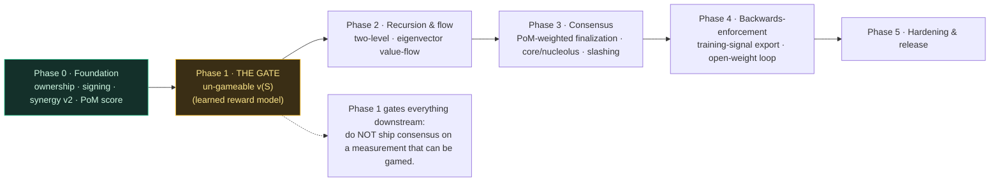
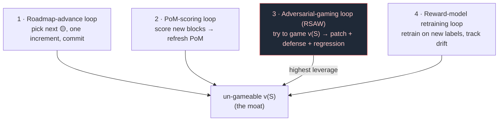

# Roadmap — Proof of Mind value chain (PRIVATE)

> Stealth. Release when matured. Phases are dependency-ordered; the load-bearing
> risk (un-gameable `v(S)`) gates everything downstream, so it comes early.

## Adversarial-loop log (RSAW — newest first)
- **2026-06-14** — RSAW tick: NEW vector **novelty front-run / predictive land-grab** (ATTACK 4 in
  `adversarial-game.py`). Temporal-novelty rests on the assumption "honest commits first"; an
  attacker who commits FIRST a block of the most COMMON (boilerplate) atoms steals their novelty
  from honest later reveals. DEMONSTRATED gameable under raw coverage-count on real session-chain
  blocks (front-run stole 34 of 594 honest novelty), and DEFEATED by value(rarity)-weighted novelty
  — a proxy stand-in for the learned `v(S)` (attacker 16.5 vs honest 560; regression-asserted).
  Commit-reveal content-binding already blocks front-running of UNSEEN/original work; the residual is
  only PUBLIC/common atoms, which a value-by-outcome `v(S)` prices ~0. 🔬 residual: proven only in
  the rarity proxy — real closure rides the SAME pending learned-`v(S)`-on-real-labels mile (a 2nd
  independent motivation for the `novelty × quality` junction below), not a separate fix.
- **2026-06-13** — RSAW tick on `finalizes_fixed`: probed the corners (horizon=0, 100% threshold,
  zero-weight padding, empty voters, all-zero basis). The conservative direction
  `!(fixed && !float)` survives every edge — NO new break; edges pinned. Stop-condition outcome
  (the fixed mirror's safety reduces to the f64 reference + the ceil rounding direction). node 202→203.
- **2026-06-13** — Phase 3 build-order step 1 SHIPPED: `finalization_fixed` — `finalizes_hybrid`
  recomputed in pure Q32.32 (fixed-point retention-decay + effective/base weight + max(eff,
  floor) basis + 2/3 threshold). Drift-guarded vs the f64 reference over a deterministic sweep;
  threshold + floor both ceil'd ⇒ rounding is AGAINST finalization; the sweep proves the
  conservative direction everywhere (`!(fixed && !float)` — fixed never finalizes a float-rejected
  case) and agreement off the boundary band, with a constructed exact-2/3 tie staying un-finalized.
  The third and last on-VM arithmetic surface after value_fixed (intake) + settlement_fixed
  (value). node 197→202. The `now`/validator-set consensus-sourcing is the remaining on-VM step.
- **2026-06-13** — on-VM mirror of the F2 fix: `main.rs` `index_dep_bound` now compares
  `r.hash_type().as_slice()[0]` against `EXPECTED_INDEX_HASH_TYPE` (ckb-gen-types 0.119
  `ScriptHashType::Type`; accessor verified vs local ckb-std 0.16.4, not guessed) AND the
  overloaded `[0;32]` sentinel is replaced by an explicit `const BINDING_ACTIVE: bool`
  (QA-port-2). ELF rebuilds clean, 22 on-VM fixtures stay green (binding inert). Reference ↔
  on-VM now F2-parity. Only the activated-path fixture (real script-hash) remains deploy-coupled.
- **2026-06-13** — `index_binding` reference model F2-COMPLETED on-VM identity: the dep
  identity grew a `hash_type` field (`HashType{Data,Type,Data1}` + `DepScript` triple), so a
  forged index dep reusing the canonical `code_hash`+type-id under a DIFFERENT hash_type — a
  distinct CKB program — is now REJECTED (`bound_wrong_hash_type_rejects`). Closes QA-port-1
  (the design doc's "host model should grow a hash_type field to keep mirroring the on-VM
  check"); the on-VM `main.rs` mirror (`EXPECTED_INDEX_HASH_TYPE`) + the `BINDING_ACTIVE` flag
  (QA-port-2) are the next, deploy-coupled increment. node 196→197.
- **2026-06-13** — `[P·dont-let-attacker-choose-critical-input]` matured across surfaces, all
  negative-tested in `node`: (5) finalization `now` and (6) the validator-set `all` in
  `finalizes_hybrid` are outcome-determining ⇒ must be header/consensus-sourced on-VM;
  (7) the ordered index rule (`valid_ordered_root_transition`) trusts its `CellBatch` coords
  AS CLAIMED — a forged-lower-height steals contested novelty ⇒ the coords (height, secret)
  themselves must be consensus-sourced on-VM (header height + revealed secret), not producer-
  asserted. Full 3-adversary sweep (value / consensus / ordering+on-VM) found the value layer
  un-gameable-by-construction; every real break collapses to this one input-binding class,
  now fully pinned. node 191→196.

## Tier legend
- ✅ **demonstrated** — runs, tested on real blocks this session
- 🟡 **designed** — specified, not yet built
- 🔬 **research** — open problem, no settled approach

## Phase 0 — Foundation (DONE this session)
- ✅ Block ownership, Bitcoin-shaped (UTXO fold over signed transfer log); transfer
  voids prior attestation. `block-ownership.py`
- ✅ Per-block Ed25519 signing; tamper-resistance (signed Merkle root, keyless
  re-baseline caught at boot). `integrity-attest.py`
- ✅ Synergy value v0→v2: coverage outcome-value + Myerson (sampled) + Bradley-Terry;
  Shapley made load-bearing (L1≈0.26 vs additive). `block-value-v2.py`
- ✅ PoM score = per-owner Myerson value → consensus weight. `pom-score.py`
- ✅ Privacy: private repo + nda-locked + fail-closed sync leak-gate.

## Phase 1 — Make the measurement un-gameable (THE gate; do first)
The whole system is only as honest as `v(S)`. Until this is solid, everything above
is a reputation system.
- 🟡 **Learned reward-model `v(S)`** — Bradley-Terry over block features → generalizes
  to unseen blocks (RLHF reward model). Replaces the coverage proxy. `reward-model.py`
  - ✅ **Held-out generalization MEASURED (2026-06-13, `outcome` module):** `proxy_value` +
    `pairwise_accuracy` + `learned_v_s_beats_coverage_proxy_on_held_out_coalitions` — trained on
    10 templates, tested on 6 UNSEEN: learned `v(S)` ≥ 0.9, coverage proxy blind to lineage ties
    at 0.5. The gate measured, not asserted.
  - ✅ **Fake-lineage spoof CLOSED AT THE SCORE (2026-06-13, pom-roadmap tick):** the survivor of
    `fake_lineage_garbage_...` (spoofed structure fools the bare model) is closed by
    `v_outcome_floored` — the entropy floor AND-composed into the learned score (single-sourced
    with the intake floor), so a fake lineage of NOISE scores 0 while real work keeps its value.
    Structure can no longer manufacture value from noise. Test:
    `semantic_floor_closes_the_fake_lineage_spoof_at_the_score`.
- 🟡 **Outcome-value labels** — coalition-level "how good is the outcome using only S"
  judgments (model/jury, DeepFunding-distill over *sets*). The model + held-out harness are
  built; this real-label pull is the remaining mile (the harness runs unchanged when it lands).
- ✅ **Strategyproofness — production rule shipped** (`value-v3.py`). The canonical
  value rule is **temporal-novelty** (value = coverage novel vs earlier-committed
  blocks, via commit-reveal order), strategyproof **by construction**: sybil-split,
  padding, AND collusion-ring all earn 0 (tested live in `adversarial-game.py` AND
  built into `value-v3`); honest blocks keep value. Resolved the inter/intra split:
  inter-block = temporal-novelty (ordered, strategyproof); intra-block co-authors =
  Myerson (simultaneous, synergy).
  - 🟡 **New open item (found by building it):** strict novelty zeroes *honest-but-
    redundant* blocks (e.g. an honest block adding no new coverage → 0). Tradeoff:
    strict-novelty incentive vs not-punishing-honest-redundancy. Candidate fix:
    value = novelty × **quality** (the learned reward model weights novel coverage),
    optionally + a small participation floor. This is the natural junction where the
    strategyproofness layer (novelty) and the capability layer (reward model) compose.
  - 🟡 remaining: proof under the *learned* `v(S)`. **Partial (node, 2026-06-11):**
    `learned_quality_preserves_the_novelty_floor` regression-tests that the ACTUAL
    trained Bradley-Terry quality cannot rescue a novelty-0 redundant cell (floor holds
    under the learned model, not just pinned quality). Adversarial loop tick #1.
  - 🟡 partial / 🔬 remaining: **garbage-novelty gap.** The floor catches redundancy,
    not high-entropy novel-but-worthless content (coverage proxy rewards entropy).
    `garbage_novelty_is_the_documented_open_gap` pins it. **Role-C increment shipped
    (2026-06-12): `semantic` module — a compressibility floor.** Genuine content reuses
    bytes (compressible); near-random noise does not. `semantic_floor` zeroes a cell whose
    normalized byte-entropy ≥ θ, AND-composed (only zeroes, never rescues ⇒ strategyproof).
    This CLOSES the incompressible-NOISE subclass at the gate (the 64-byte garbage cell
    now → 0). Honest bounds, pinned in tests: (a) genuinely-novel HIGH-entropy *valuable*
    payloads (keys/hashes/blobs) are false-positived — content cannot tell them from noise
    (the airgap); realized-flow (v5/v6) is the backstop. (b) STRUCTURED novel-but-pointless
    content is NOT caught here — that genuinely needs labels/flow, not bytes, and remains
    the 🔬 open core bet (learned outcome-evaluator, already role-bounded). So: noise
    subclass ✅ at the gate; valueless-but-structured ⇒ out-of-band (flow + labels).
    **Encoding-evasion dissolved economically, not at the content layer (2026-06-12, pom tick):**
    hex-encoding (or zero-diluting) the 64-byte garbage halves its byte-entropy, so it slips
    `semantic_floor` — and (sharper than the isolated floor pin) it RE-OPENS the v7 seed-gate
    pump: v7 floors a raw-noise child's seed to 0, but the encoded child's seed survives and
    pumps its parent again, because on encoded bytes v7 ≡ v6 (`value::tests::
    encoded_noise_defeats_the_v7_seed_gate_the_evasion_is_real`). Chasing this at the content
    layer is case-detection, not class-dissolution (it IS the airgap — bytes cannot separate
    encoded-noise from encoded-value). The binding defense is content-agnostic and now
    **demonstrated**, not just asserted: (i) ✅ the v6 standing price is byte-blind — the same
    encoded child on a FRESH key seeds 0 (`encoded_noise_does_not_buy_past_the_v6_standing_price`),
    so an encoded-garbage sybil ring earns nothing; (ii) ✅ the dispute slash keys on realized
    minted value, not entropy — a vested certifier's encoded endorsement is negative-EV
    identically to raw garbage (`dispute::tests::encoded_noise_endorsement_is_negative_ev_slashing_is_content_agnostic`).
    So: encoding-evasion is ✅ class-dissolved by the economic composition (no profitable
    trajectory) while remaining 🔬 unresolvable at the content gate by design.
    **Composition sharpened (2026-06-12, pom tick):** `value_v4_boost_does_not_gate_meaningless_novelty`
    proves the current form `value = novelty·(1+q)` is a BOOST — q→0 noise still earns full novelty,
    so a better quality proxy alone can NEVER close the gap. The fix must change the COMPOSITION to a
    GATE: `value = novelty·g(q)`, `g∈[0,1]` from the outcome-evaluator. Honest tension recorded: a true
    gate also suppresses honest-but-low-quality work, so `g` must be realized-outcome, not a proxy.
    **Gate design (2026-06-12 pom tick):** source `g` from REALIZED DOWNSTREAM VALUE-FLOW — the
    eigenvector backward-propagation through the provenance DAG ALREADY built in the `flow` module —
    not a predicted quality proxy. `g(block) = normalized(downstream_flow(block)) ∈ [0,1]`. Noise earns
    no downstream use ⇒ flow→0 ⇒ g→0 ⇒ value→0; honest-but-low-quality work that gets built upon ⇒
    flow>0 ⇒ paid. Honest consequence: payment must VEST RETROACTIVELY / stream as downstream flow
    materializes — a contribution cannot be fully priced at intake; its value accrues as it proves
    useful. Two-clock composition: intake-novelty (immediate, strategyproof) gates redundancy;
    realized-flow (delayed, un-spoofable) gates meaninglessness.
    **✅ BUILT (2026-06-12): `value_v5(novelty, downstream_flow)`** — `value = floored_novelty ×
    g(downstream)`, `g(f) = f/(f+half)` saturating; flow SEEDED by floored novelty (redundant
    children pump nothing) and counts EXTERNAL edges only (child contributor ≠ parent — no
    self-certification). Regressions green: q=0 noise w/ zero flow → 0 (v4 contrast in-test);
    honest-but-low-quality built-upon work paid; floor-before-gate (clone w/ accomplice children
    still 0); retroactive vesting demonstrated.
    - ✅ **CLOSED (2026-06-12): `value_v6` — priced identity via standing-gated flow seeds.**
      The pinned sybil ring (`sybil_identity_ring_pumps_the_flow_gate_open_gap` — identity was a
      free byte) earns 0 under v6: `seed_i = floored_novelty_i` only if the contributor's soulbound
      standing ≥ `standing_floor`, else 0. Consensus A3 economics reached down to the value layer
      (`max_certifying_identities` mirrors `max_sybils`) — STRONGER than A3 because standing is
      EARNED and soulbound (cannot be bought, pooled, or transferred in; `valid_transition` rejects
      reassignment). Ring cost: 0 → K × cost-of-earning-the-floor. Design choice = gate the SEED,
      not the edge: an unvested identity pumps nothing (certification priced), but an unvested
      newcomer still EARNS when a vested mind builds on them (participation free — "buy storage,
      not consensus" at the value layer), and certification stays transitive through unvested
      intermediaries. Regressions: ring → 0 (v5 contrast in-test); newcomer-paid; floor-flips-payment;
      transitive-through-unvested; fully-vested ⇒ v6 ≡ v5; clone-with-vested-endorser still 0.
      (Suite then 77; current count in `node/README.md`.)
    - ✅ **CLOSED (2026-06-12, same day): ENDORSEMENT-SLASHING — `dispute` module shipped.**
      The vested-certifier residual (`vested_certifier_endorsing_garbage_open_gap`, gate-level
      pin retained as surface documentation) is NEGATIVE-EV at the dispute layer. Design =
      `DISPUTE-SLASHING.md`, implemented to its §6 plan: windowed vesting (spendable at E+W;
      vested = finality-protected), challenge bond, PoM-only 2/3 + quorum-floor verdict
      (REUSES `consensus::finalizes_hybrid` — proof-over-vote at the value layer),
      deterministic causal-share slash (zero-seed v6 recompute; `bounded_shares` Σ ≤ canceled),
      λ·share+α; §4 inequality (α > V(1−2p)/p; p≥½ ⇒ any α>0) demonstrated in-test.
    - ✅ **Critical-qa hardenings (same session, hostile self-review → 4 finds → 4 fixes):**
      exposure snapshots at challenge-open (slow verdicts can't vest value away);
      α attaches to causation not adjacency (zero-share certifiers skipped); β/γ clamped
      (resolver can never mint); slash-evasion-by-exit closed — `standing_exit_blocked` +
      **wired at the cell layer as `soulbound::valid_transition_under_dispute`** (burn denied
      while exposed; pom-decrease capped at settlement-authorized; the slash always lands).
      All with regression tests; doc §5b.
    - 🔬 **New pinned residual (adversarial tick vs the dispute layer):** JUDGE CARTEL — a
      >1/3 vested-standing bloc vetoes refutation of its own ring; detection exists,
      conviction doesn't (`judge_cartel_protects_its_own_garbage_open_gap`, flips when closed).
      Economic bounds recorded (capture cost, defection bounty, PoM self-dilution — doc §5.3);
      structural counter = next gate-hardening increment. Candidates: juror-exclusion of
      edge-connected standing / escalation court / dilution-indexed slashing.
  - ✅ ref / 🟡 tune **near-duplicate gap — coverage-similarity floor shipped (2026-06-12).**
    Temporal-novelty alone zeroes only EXACT subsets/duplicates; a near-duplicate (a few tokens
    flipped) leaked small residual novelty from change-spanning shingles, farmable across many
    near-dups (`near_duplicate_residual_novelty_is_an_open_gap` pinned it). Fix shipped:
    `temporal_novelty_with_similarity_floor` zeroes a cell whose coverage overlap with the earlier
    union exceeds θ (`similarity_floor_zeroes_the_near_duplicate`, θ=0.8). Remaining 🟡 tune: θ
    over-cuts honest-but-similar work at low values — compose with the learned quality model and
    calibrate θ on real data so genuine near-domain contributions are not zeroed.

## Phase 2 — Recursion & flow
- ✅ **Two-level recursion** — intra-block share vectors via the same Myerson game one level
  down. Ported to Rust (`flow::recurse_two`, `recurse_shares`), tested.
- ✅ **Eigenvector value-flow** — backward propagation through the provenance DAG with damping
  (PageRank-style; defeats self-reference). Ported to Rust (`flow::value_flow`), tested.
- 🔬 **Temporal flow** — round-to-round value (iterated-Shapley / fairness-fixed-point);
  bound drift.

## Phase 3 — Consensus
- ✅ ref / 🟡 on-chain **PoM-weighted finalization** — 2/3-supermajority reference model
  (`consensus::finalizes`, `finalizes_hybrid`), retention-decay, verified vs NCI
  (`NakamotoConsensusInfinity.sol`); on-VM finalization 🟡 DESIGNED (`ON-VM-FINALIZATION.md`,
  2026-06-13): Q32.32 mirror of `finalizes_hybrid` (reuse the T8 settlement infra) + fixed-point
  retention-decay, drift-guarded; key adversarial pin = `now` MUST be header-sourced not
  tx-chosen (same "don't let the attacker pick the security-critical input" lesson as the
  index-dep binding F1). Build: ✅ fixed ref + drift-guard SHIPPED (`finalization_fixed`,
  node 202); on-VM program + header-`now` sourcing + fixtures pending budgeted session.

### Execution-layer tier marks (2026-06-12, story-loop + roadmap-advance)
- ✅ T1 fixed-point intake (`value_fixed`, Q16.16, f64-equivalence tested)
- ✅ T2 host VM harness (ckb-vm 0.24 dev-dep; real RISC-V ELF executes; cycle metering proven)
- ✅ T3 syscall environment (Cell model serves load_script/load_cell_data, exact partial-load ABI)
- ✅ T4 on-VM intake floor (`onchain/pom-typescript`, no_std Q16.16 semantic floor; verdicts ≡ host)
- ✅ T5 group-input iteration (whole script group floored; index-1 smuggling gap FLIPPED)
- ✅ T6 group-OUTPUT validation (mint-side noise floored at exit 14; host serves both tx
  directions; burn-only and mint-only groups valid; empty group rejected)
- 🟡 T7 cross-cell similarity floor on-VM — DESIGN SHIPPED (`T7-CROSS-CELL-SIMILARITY.md`):
  committed novelty-index cell (SMT root) + complete per-shingle membership/non-membership
  classification in the witness ⇒ exact novelty/overlap counts verified on-VM; omission and
  stale-root walked closed at design time; serialization + cycle cost pinned as calibration
  (per-block batching per qa, SMT multi-proofs). Increments: #1 SMT ✅, #2 proven verifier ✅
  (novelty_with_proofs: proof-driven counts ≡ sequential rule in-test, the T7 theorem;
  omission/padding/tamper/stale-root all reject-whole never partial-credit), #3 index-cell rule ✅
  (valid_root_transition: rolling-root insertion chain, intermediates COMPUTED never
  claimed ⇒ dup-insert structurally impossible; smuggle/omit/forge reject; first-commit-
  wins demonstrated via proven verifier against evolving roots) + #4 FIRST HALF ✅
  (noesis-core: no_std verify-side crate — SMT fold, coverage, proven verifier, Q16.16
  floors — links into pom-typescript, builds both targets, node drift-guards it against
  its own lib on all fixtures). #4 SECOND HALF remains: witness syscalls + proven path
  inside the program + on-VM e2e.
- ✅ T8 Q32.32 settlement mirror (`settlement_fixed`: integer damped-Jacobi external flow,
  rational gate, full v7 composition; tracks f64 within 1e-6 on content graphs; flipped-pin
  + monotone-vesting + saturation-not-wraparound all in-test) → on-VM finalization next
- ✅ ref / 🟡 solver **Stability** — core membership + nucleolus max-excess reference model
  (`stability` mod, tested); the LP / iterated-LP solver over the real PoM-weighted coalition
  game (Myerson-restricted, sampled at scale) is pending.
- ✅ ref / 🟡 on-chain **Slashing** — `slash` + equivocation / early-reject (`is_equivocation`,
  `can_early_reject`), decay-orthogonal (A5); on-chain accounting + dispute window pending.

> Full consensus findings, the fix-chain (each fix reveals the next attack), and the NCI
> verification table: `CONSENSUS-REVIEW.md`. Reference models live in `node/` (49/49) and the
> Solidity composition invariants in VibeSwap `test/consensus/NCICompositionInvariants.t.sol` (8/8).

## Phase 4 — Backwards-enforcement of the model
- 🟡 **Training-signal export** — value-weighted dataset from high-PoM verified blocks.
- 🔬 **Open-weight fine-tune loop** — governance truth → gradient → model; verify →
  compound. (Depends on the open-weights migration.)

## Phase 5 — Hardening & release
- 🟡 Adversarial audit (RSAW on the mechanism), external-economist critique pass.
- 🟡 Reference implementation + whitepaper v1.0.
- Release — matured, with the head-start banked.

## Loops (self-perpetuating, private)

The roadmap shouldn't depend on one long session. Proposed loops, each writing only
to the private repo:

1. **Roadmap-advance loop** — pick the next 🟡 item, do one increment, commit. The
   "start and don't stop" mechanism. (Set up this session.)
2. **PoM-scoring loop** — as new session-chain blocks accrue, score them (value-flow +
   reward-model) → refresh PoM scores → commit. Keeps the value chain live.
3. **Adversarial-gaming loop (RSAW on the mechanism)** — each tick, *try to game* `v(S)`
   (cheap PoM inflation: sybil split, redundant padding, self-attribution ring). If a
   manipulation is found, patch it + add a defense + a regression. This is how Phase 1's
   un-gameable-`v(S)` actually gets hardened — by an adversary that never sleeps.
4. **Reward-model retraining loop** — as pairwise/outcome labels accumulate, retrain
   the reward model; track held-out accuracy; flag drift.

The adversarial-gaming loop is the highest-leverage: the whole system's honesty rests
on un-gameable measurement, so a standing adversary against `v(S)` is the moat.

## Critical path
Phase 1 (un-gameable `v(S)`) → Phase 2 (recursion/flow) → Phase 3 (consensus) → Phase 4
(backwards-enforcement). Phase 1 is the gate: do not ship consensus on a measurement
that can be gamed.
