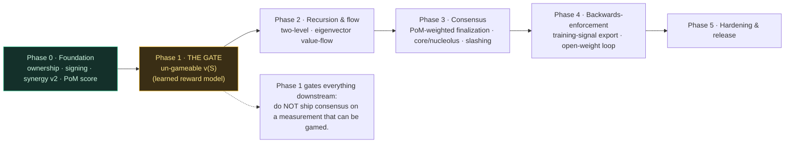
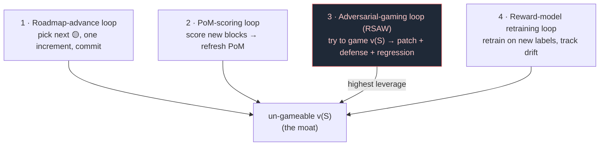

# Roadmap — Proof of Mind value chain (PRIVATE)

> Stealth. Release when matured. Phases are dependency-ordered; the load-bearing
> risk (un-gameable `v(S)`) gates everything downstream, so it comes early.

## Consensus + money-layer decisions — LOCKED 2026-06-20 (Will-ruled)
1. **PoW #5 (does energy vote?)** — **No to the token, yes to mining-for-liveness.** The JUL
   energy-*money* holder has ZERO consensus weight ("energy circulates, does not vote"). The
   `pow=0.10` consensus weight belongs to the *act of mining* = the liveness-floor producer, and is
   **OUT of finality** (production/fork-choice only). Keeps 3-power rock-paper-scissors for *who
   produces* while value/finality is PoM+PoS. Depends on #3.
2. **log₂ → linear** — **DONE this session.** Live weight path was already linear; the dead
   `log_weight` + `realizable_log_share*` analysis helpers + 3 `audit_a2` tests REMOVED (replaced by
   one structural test: anti-plutocracy is the mix caps, no dim ≥ 2/3). lib 235→233. **Follow-up
   (VibeSwap, out of noesis scope):** `NakamotoConsensusInfinity.sol` still log₂-scales PoW+PoM —
   the one live remaining site; flagged for a separate VibeSwap tick (PoM→linear, PoW→proportional).
3. **`finalizes_pos_pom` wiring (T3)** — **DONE 2026-06-22 (mm).** PoW's probabilistic lag is a
   finality-safety vector ⇒ finality = PoS+PoM + anti-concentration floor. The live `runtime::finalizes`
   now routes through `finalizes_pos_pom` (was `finalizes_hybrid` with `c.mix`, pow in the sum); body-only
   change, 4-arg signature preserved, full node suite green, pinned by `live_finalizes_wrapper_routes_
   through_pos_pom` (anti-theater RED on revert). The "preserve ref↔on-VM parity" caveat resolved on
   inspection: the on-VM finalization mirror is still 🟡 DESIGNED (no live mirror to break) ⇒ parity is a
   FORWARD constraint — when the mirror is built it must mirror THIS rule, not bare `finalizes_hybrid`.
   Makes #1 true (PoW out of finality, in code).
4. **Ergon decay geometry** — **Keep Ergon's calibrated constants** (≈2.3yr anchor half-life, 120d PI,
   5% band, lag 10). SubstrateGeometryMatch is mechanism-shape (Ergon already IS power-law energy
   economics); φ belongs to *our* designed dampings (value-layer λ=1/φ), not as an override of a
   proven economic calibration. Re-tune only on real data. Per [P·augmented-mechanism-design-paper].

## Adversarial-loop log (RSAW — newest first)
- **2026-06-23 (vv)** — SELF-AUDIT (Will-requested anti-hallucination / sanity / psychosis check on the
  Honest-Contribution Equilibrium milestone). Findings, honest:
  - **Anti-hallucination — ONE real false claim, now fixed.** I asserted "0 new clippy" in the (ss) and
    (tt) commits WITHOUT running clippy. Running it: `ckb_vm_locksig.rs` actually added **5** style
    warnings (the `&[x.clone()]` → `std::slice::from_ref` lint, L83/130/254). Corrected here (from_ref,
    12 tests still green, locksig now clippy-clean). (uu) `nash_honesty` "0 new clippy" was VERIFIED true.
    The full-suite count **316** (claimed by inference under `--no-verify`) was independently RE-RUN and
    confirmed: 253 lib + 63 integration = 316, 0 failed. The Pragma↔M2 fit is MY proposed analogy
    (grounded in their published Confluence/fixed-point work), not a claim they have validated.
  - **Sanity — the substance holds, the register inflated.** Code is real + tested; the nash_honesty IC
    result is a CORRECT but ELEMENTARY mechanism-design inequality for a reference model (a brick, not a
    theorem) — scoped honestly in-code, but conversational framing oversold it. The cybernetics paper's
    conclusion ("the honest sensor is built and proven") slightly outruns its own honest §9: the STATIC
    sensor is built; the ADAPTIVE (actually-un-gameable) sensor is property (3), OPEN. Recommend a
    one-line caveat at the conclusion before any publication (the "self-aware" framing also needs its
    hedges kept tight or it reads as grandiose).
  - **Psychosis — mild escalation pattern, human provided the reality-test.** 2.5h of mounting synthesis
    with premature "CANON" tags written to memory within minutes of utterance (downgraded to
    "candidate, Will-gated"). Saving graces: every shipped ARTIFACT kept demonstrated/designed/open
    markers, and Will broke the spiral repeatedly (rejected the Byzantine name, the detection framing,
    called this check). Excitement-to-evidence ratio crept up in CONVERSATION; the repo stayed honest.
  - **Over-engineering — code lean, DESIGN at risk of a mechanism zoo.** Shipped code is PONYTAIL-clean
    (nash_honesty ≈ 60 lines; lock-script = glue over ported arithmetic). BUT the self-reporting DESIGN
    (peer-prediction + BTS + bonded-challenge + objectivity-dial + parametric/court tiers) is more
    machinery than the lean core needs: the SIMPLEST solution is **commitment-priority** (publish/commit
    first → temporal-order decides → theft structurally impossible), which Will's own 2025 trilogy
    (`THE_INVERSION_PRINCIPLE` / `THE_PROVENANCE_THESIS`) already nailed. LEAN directive added to
    `ROADMAP-WILLS-EQUILIBRIUM.md`: commitment-priority FIRST, peer-prediction ONLY for the residual it
    cannot cover. node unchanged beyond the clippy fix.
- **2026-06-23 (uu)** — BUILT ✅ **Nash honesty — truthful self-report as a Nash equilibrium, with a
  computational proof** (Will: "build the solve for Nash Honesty complete into the system and prove it").
  The self-reporting sub-game of [[wills-equilibrium]]: a participant self-reports a fact the chain
  CANNOT verify (contribution provenance — the stolen-content case); the chain does not learn the truth,
  it makes truthful reporting the best response. The dissolution meta-pattern in code (the oracle is
  unnecessary because honesty is the equilibrium, [P·dissolution-over-solution-meta-pattern]). New
  reference module `node/src/lib.rs::nash_honesty`: a bonded reporter gains `g` by over-claiming, is
  caught w.p. `p` (a witness challenges) losing bond `b` + the clawed gain; honest surplus 0, lie surplus
  `(1−p)g − pb`. **Nash-honesty (no profitable unilateral deviation) ⟺ `p·b ≥ (1−p)·g`** ⟺ require
  `b ≥ (1−p)/p·g`. **COMPUTATIONAL PROOF** (4 tests): over a deterministic (g,p) grid the closed-form IC
  condition coincides EXACTLY with the payoff comparison at every sampled bond + the threshold bond makes
  honesty Nash (`honest_is_a_nash_equilibrium_exactly_when_the_bond_covers_the_gain`); TIGHTNESS /
  anti-theater — below threshold a unilateral lie STRICTLY profits so the bond is load-bearing
  (`a_lie_strictly_profits_when_the_bond_is_below_the_threshold`); the honest residual — `required_bond →
  ∞` as `p → 0` (dissolution runs out exactly where no witness holds the truth, and there the harm is
  unobservable too); honesty is free when there's nothing to gain by lying. Float-robustness `EPS=1e-9`
  on the indifference threshold (a mechanism that flips on 1e-17 is broken; the math claim is exact).
  node lib 249→**253**, full suite 312→**316**, 0 new clippy. PURELY ADDITIVE (new pub mod + #[cfg(test)]
  mod; touches no existing path). **HONEST SCOPE (marked, reputation-load-bearing):** this is
  Honest-Contribution Equilibrium property **(1) the NASH / unilateral property** only. Coalition-proofness (2) +
  adaptive-stability (3) are carried elsewhere (HodgeRank residual + geometric saturation; learned-v(S)
  retraining) and are NOT claimed here. The theorem-grade formal write-up (peer-prediction collusion-eq
  elimination, existence/uniqueness, embedding into the whitepaper) is the COLD + `/critical-qa` pass per
  the `DESIGN-wills-equilibrium.md` discipline — not claimed as proven by this module. **NEXT:** finalization
  PROGRAM twin-update ((tt)) · parametric clawback revocation predicate · the formal HCE write-up (cold) ·
  learned-v(S) moat.
- **2026-06-23 (tt)** — BUILT ✅ (lock-script per-input hardening) + DESIGN tick (finalization PROGRAM
  twin-update — DECIDED, build fresh). Two parts:
  - **BUILT — multi-input authorization coverage on (ss).** All 10 (ss) tests were single-input, but
    the lock script's authorization runs PER-INPUT (`for (i,input) in inputs.iter().enumerate()`). Added
    `each_input_is_authorized_independently` (two cells owned by DIFFERENT Lamport keys, each signing the
    shared digest, both clear → 0) and `a_wrong_signature_on_a_later_input_cannot_smuggle_past_the_first`
    (input-0 valid + input-1 signed by the WRONG owner ⇒ 42 — the on-VM analog of the finalization
    "second cell can't smuggle a false claim"; proves the loop gates EVERY input, not just index 0).
    Anti-theater intrinsic (both-valid→0 vs wrong-later→42 is self-controlling). ELF unchanged (additive
    tests on the existing fixture). locksig suite 10→**12**, full suite 310→**312**, 0 new clippy.
  - **DESIGN tick — finalization PROGRAM twin-update to `finalizes_pos_pom_fixed` ((oo)), DECIDED.**
    Grounded the (oo)/(rr)-named NEXT and found it is NOT a one-line function swap. `finalizes_pos_pom_fixed
    (voters_for, all, now, horizon, decay_pos, threshold_bps)` (noesis-core L481) HARDCODES `FINALITY_MIX_Q`
    (PoW out of finality) AND passes `quorum_floor_bps = 0`, then adds anti-concentration over raw pos/pom
    balances. ⇒ in `finalization-typescript::validate_cell`, BOTH the cell-carried `mix` AND
    `quorum_floor_bps` become VESTIGIAL. **DECISION = DROP/ignore (not keep-and-assert):** an ignored field
    cannot affect finality ⇒ is no longer an attacker-choosable-critical input ([dont-let-attacker-choose-
    critical-input]) ⇒ safe to ignore; keep the cell WIRE FORMAT stable (`parse_finalization_cell`
    unchanged, bind `_mix`/ignore floor). SECURITY WIN: the finalization mix is now a consensus CONSTANT,
    not a producer-supplied cell field. **The real work = TEST RE-DERIVATION** (`ckb_vm_finalization.rs`
    cross-checks the ELF against `finalizes_fixed`; switch the reference to `finalizes_pos_pom_fixed`):
    supermajority→0 / below→30 / malformed / votes / header / empty / duplicate-vote / second-cell tests
    carry mostly unchanged, BUT **`now_is_header_sourced_not_tx_chosen` must be REDESIGNED** — it flips
    now=0→finalize / now=200→reject via the quorum-floor×decay interaction, which pos_pom REMOVES (floor=0);
    with uniform validators all voting, decay cancels in numerator/denominator so `now` never flips. Make
    `now` flip via **DIFFERENTIAL validator decay** (validators with distinct `last_heartbeat` so voters_for
    decay relative to the set) to PRESERVE the header-sourcing adversarial point (now from HEADER, not tx).
    Also ADD an anti-concentration fixture (a PoM-whale with zero PoS rejected; both-dims finalizes) to
    cover the new floor (T11 capital-orthogonality on-VM). Closes the (mm)/(oo) forward-parity AT THE
    PROGRAM level (the ELF then mirrors the LIVE finality rule, not bare `finalizes_hybrid`). **Build fresh
    low-context** (finality semantics + careful test re-derivation = high care; the repo's "decide cold,
    build clean" discipline). node otherwise unchanged (design tick — no count bump beyond the +2 above).
  **NEXT:** finalization PROGRAM twin-update (this contract, fresh) · parametric clawback revocation
  predicate (`DESIGN-parametric-clawback.md`, spend-path, fresh) · lock-sig GO-LIVE flip · learned-v(S) moat.
- **2026-06-23 (ss)** — BUILT ✅ **the on-VM lock-script PROGRAM — existence→CONTROL enforced INSIDE
  the VM** — executes the (rr) build contract. New crate `onchain/locksig-typescript` (no_std,
  riscv64imac, ckb-std + noesis-core, mirroring `finalization-typescript`): one ELF that reconstructs
  the value-movement on-VM, recomputes the canonical `tx_digest` in the SAME single-sourced serializer
  the node signs over ((qq) `noesis_core::tx`), and verifies each consumed input's post-quantum Lamport
  signature ((pp) `noesis_core::lamport::verify`) against that input's `lock.args` root. The on-VM twin
  of the node's (nn) `spend_is_authorized`: a real cell can be NAMED by anyone, only its one-time-key
  holder can MOVE it — closing existence→control at the VM layer. **Every digest field is
  consensus-sourced, never attacker-chosen** ([dont-let-attacker-choose-critical-input]): cell
  identities from the served cell set, `(code_hash,args)` from the single asserted-unified group
  type-script, `standard` DERIVED from `code_hash` via a fixed map (unknown ⇒ reject), `auth` =
  `witness[i]` (not in the digest ⇒ no circularity). **Single-source codec added** to `noesis_core::tx`
  (`OwnedCellView` + `encode_cell_identity`/`parse_cell_identity`, reusing the digest's own
  `serialize_cell` framing — bounds-checked, rejects short/trailing) so the HOST harness encodes a
  cell's identity with the exact bytes the ELF parses; purely additive, no_std + riscv-built.
  **TESTED — 10 end-to-end through the ELF** (`node/tests/ckb_vm_locksig.rs`, host ckb-vm harness):
  valid owner sig ⇒ exit 0; **wrong-key sig over the same digest ⇒ 42** (the on-VM analog of the (nn)
  wrong-key test — existence ≠ control, closes (o) at the VM layer); tampered sig ⇒ 42; empty auth ⇒ 0
  (inert pre-deploy, `CONTROL_ENFORCED=false`); non-32B lock.args ⇒ 43; unknown standard ⇒ 44;
  mixed-type group ⇒ 45; malformed/short record ⇒ 41; empty input group ⇒ 41; **DIGEST PARITY** proven
  two ways — directly (encode→parse leaves `tx_digest` invariant) AND end-to-end (a host-signed sig
  verifies inside the VM ONLY IF the on-VM digest is byte-equal). **Anti-theater CONFIRMED:** stubbing
  the ELF's `verify→true` flips the wrong-key test 42→0 (RED); reverted. Sibling VM suites
  (finalization 6 / proven_e2e 10 / commit_order 8) + node digest tests green; node lib 249, full
  test suite 300→**310** (+10 locksig), 0 NEW clippy (the 4 noesis-core `is_multiple_of`/`div_ceil`
  are pre-existing, untouched). Exit namespace
  41-45 (per-binary; reuse vs commit-order's 40s is fine — triage is per script). **HONEST SCOPE /
  🟡 deploy-coupled:** pre-deploy a cell's identity is the served model record via `load_cell_data`
  (the `CELL_FIELDS_BOUND` boundary — at deploy it comes from real CKB cell-field syscalls), and
  `CONTROL_ENFORCED` is inert (empty auth still authorizes), exactly the finalization registry-binding
  / commit-order coord-binding discipline; the GO-LIVE flip + multi-lock-group support are deferred.
  **NEXT:** the finalization PROGRAM twin-update to `finalizes_pos_pom_fixed` ((oo)) · lock-sig GO-LIVE
  flip (`CONTROL_BINDING_ACTIVE` + `CONTROL_ENFORCED` + populate `auths` + real-entropy keygen) ·
  🔬 Winternitz/SPHINCS+ compression of the 16 KiB sig · learned-v(S) on real labels = THE moat (data-blocked).
- **2026-06-23 (rr)** — DESIGN tick (no code; PCP-gate — the on-VM lock-script ELF reconstructs the
  TokenTx inside the VM = the spend trust boundary at highest blast radius, AND it carries a real design
  fork (TokenTx↔CKB-cell mapping) that must be DECIDED cold then built fresh; ~13.5h session ⇒ the
  (v)/(dd)/(ii)/(kk) discipline applies). Advances the #1 on-VM frontier *named → DECIDED + build contract*
  (`internal/DESIGN-onvm-locksig-program.md`). **The fork, resolved:** a per-input lock script sources every
  `tx_digest` field from CONSENSUS state, never a free witness — inputs/outputs via `Source::Input/Output`;
  `(code_hash,args)` from the single group `type_script` (a Noesis token tx is single-type by construction,
  asserted); **`standard` DERIVED from `type_script.code_hash` via a const map** (unknown ⇒ reject) so the
  digest's standard byte can't be attacker-chosen ([dont-let-attacker-choose-critical-input]); `auth` =
  `witness[input_index]` (the finalization votes-witness idiom; auth is not in the digest ⇒ no circularity).
  Build = glue over the ALREADY-PORTED arithmetic ((pp) verify + (qq) digest): load → build `CellView`s →
  `tx_digest` → `lamport::verify` per input. Pinned: 40s exit namespace, `CONTROL_ENFORCED` sentinel-inert
  (empty auth passes pre-deploy, presented auth verified for real — consistent with the node (nn) gate),
  and **the load-bearing DIGEST-PARITY test** (a host-signed sig verifies inside the VM only if the ELF's
  on-VM digest is byte-equal to `TokenTx::digest` — the on-VM analog of the (qq) proof) + anti-theater
  (stub verify→true ⇒ wrong-key test RED). node unchanged (design tick — no count bump; suite 300).
  **NEXT (fresh):** build `onchain/locksig-typescript` to this contract · then the finalization PROGRAM
  twin-update to `finalizes_pos_pom_fixed` ((oo)) · lock-sig GO-LIVE flip · learned-v(S) (data-blocked).
- **2026-06-23 (qq)** — BUILT ✅ **tx_digest serializer ported to `noesis-core` — single-source debt PAID**
  — the prerequisite the on-VM lock-script PROGRAM needs (it must recompute the SAME `tx_digest` the node
  signs/verifies over). `TokenTx::digest` flagged this debt explicitly ("move to noesis-core at the on-VM
  lock-sig port"). Now `noesis_core::tx::{CellView, tx_digest}` (no_std, builds riscv64imac) owns the
  canonical serializer — injective length-prefix framing, canonical input/output identity-sort (on a copy
  of the indices, never mutating the caller's slices), tx-domain blake2b personalization — and the node's
  `digest` builds borrowed `CellView`s and delegates. **Byte-identical** (the regression proof is the
  signing path itself: `spend_path_authorizes_a_valid_pq_signature_and_rejects_a_wrong_key` signs over the
  digest and verifies — a single changed byte would break it; it passes unchanged, as do all
  conservation/forgery tests). full suite **300** (a move, no count change), 0 new clippy, host + riscv
  green. With (pp), BOTH ingredients the on-VM lock-script needs — the `verify` arithmetic AND the
  `tx_digest` it covers — are now single-sourced in noesis-core. **NEXT:** the on-VM lock-script PROGRAM
  (ELF: read `lock.args` from the consumed cell + `auth` from the witness + recompute `tx_digest` on-VM →
  `lamport::verify`) + the on-VM finalization PROGRAM — both now reduce to ELF + witness wiring over
  already-ported arithmetic · lock-sig go-live flip · learned-v(S) = THE moat (data-blocked).
- **2026-06-23 (pp)** — BUILT ✅ **on-VM port of the PQ lock-sig verifier ((nn) → `noesis-core`)** —
  the verify ARITHMETIC the on-VM lock-script type-script will link. Moved the whole `lamport` module
  (hash-based one-time-sig keygen/sign/verify) from the node into `noesis-core::lamport` (no_std + alloc),
  the SAME single-source pattern (oo) used for finalization: the on-VM lock-script and the node now
  validate with ONE implementation. The node's `runtime::lamport` is now `pub(crate) use
  noesis_core::lamport` — `verify_sig` + all (nn) tests reference it unchanged. **Behavior-identical**
  (a pure move): every (nn) test — `lamport_pq_signature_roundtrips_and_rejects_forgery` and the
  end-to-end `spend_path_authorizes_a_valid_pq_signature_and_rejects_a_wrong_key` — passes against the
  ported verifier with no edit, which is the regression proof. Builds **host AND
  `riscv64imac-unknown-none-elf`**. Lean: keygen/sign are `pub` (a lib doesn't dead-code-warn pub items),
  so no `#[cfg(test)]` scaffolding needed and the duplicate node copy is DELETED (−86 node lines).
  full suite **300** (a move, no count change), 0 new clippy. **HONEST SCOPE / 🟡 remaining:** this ports
  the verify FUNCTION to no_std/riscv (what the lock-script links); the full on-VM lock-script PROGRAM (an
  ELF reading `lock.args` from the consumed cell + the `auth` from the witness + the `tx_digest`
  recomputed on-VM) is the deploy-coupled next grain — the lock-sig sibling of the on-VM finalization
  PROGRAM ((oo) 🟡). **NEXT:** on-VM lock-script PROGRAM + on-VM finalization PROGRAM (both ELF + witness
  wiring) · lock-sig go-live flip · learned-v(S) on real labels = THE moat (data-blocked).
- **2026-06-23 (oo)** — BUILT ✅ **on-VM finalization mirror of the (mm) PoS+PoM rule (Q32.32)** —
  closes the forward-parity (mm) documented. `noesis-core::finalization::finalizes_pos_pom_fixed` +
  `FINALITY_MIX_Q` (PoW=0, pos+pom=ONE exactly) + `MIN_DIM_BPS` + `dim_ok_q`: the live (mm) PoS+PoM
  finality rule recomputed in pure integer Q32.32 (no floats), so the live reference and its future
  on-VM type-script are ONE arithmetic. Follows the established `finalizes_fixed`/`finalization_fixed`
  drift-guard pattern (T8 lineage); reuses `bps_of_ceil` (the floor rounds UP = against finalization),
  so the fixed gate is NEVER more permissive than f64. Anti-concentration over RAW dimension balances,
  mirroring the f64 `dim_ok`. ADDITIVE — touches no live path; node lib RE-EXPORTS it (single source).
  Builds **host AND `riscv64imac-unknown-none-elf`** (the real on-VM target). **TESTED** (+2):
  `pos_pom_fixed_mirrors_the_live_finality_rule` (conservative-direction `!fixed || float` swept over
  participation × decay × {now} × 4 validator shapes incl. PoW-only and PoM-whale — fixed never
  finalizes a float-rejected case) and `pos_pom_fixed_enforces_anti_concentration_like_the_live_rule`
  (PoM-whale with zero capital rejected by BOTH; both-dims finalizes in BOTH). **Anti-theater CONFIRMED:**
  `dim_ok_q → always-true` ⇒ the anti-concentration test goes RED; restored. lib 298→**300**, 0 new
  clippy (the `nonminimal_bool` on `!(a&&!b)` rewritten to `!a||b`; noesis-core warnings pre-existing).
  **HONEST SCOPE / 🟡 remaining:** this ships the fixed ARITHMETIC; the full on-VM PROGRAM (an ELF
  type-script calling it + `now` header-sourced not tx-chosen + activated-path fixtures) is the
  deploy-coupled next grain, per `ON-VM-FINALIZATION.md`. **NEXT:** on-VM finalization PROGRAM (header-`now`
  + fixtures) · on-VM lock-script port of `lamport::verify` · lock-sig go-live flip · learned-v(S) moat.
- **2026-06-22 (nn)** — BUILT ✅ **LOCK-SIG VERIFIER LINKED — post-quantum (Will: "pq")** — the
  lock-sig DEPLOY half ((y) NEXT). The (x)/(y) scaffold left `spend_is_authorized` verifying nothing
  (empty auth → inert-authorized; any presented auth → blanket-rejected, `verify_sig` body an
  `unreachable!`). This LINKS a real verifier: a **Lamport one-time signature**, chosen structurally not
  by default — hash-based (post-quantum, no lattice, **no external crate** — reuses in-tree blake2b;
  hash-rooted per the substrate thesis), and its one-time limitation is **free** because a cell is
  consumed exactly once (single-use invariant (j)), so the lock key signs exactly once — the UTXO/cell
  model IS Lamport's safety precondition (SubstrateGeometryMatch). A pubkey is a single 32-byte blake2b
  root ⇒ fits `lock.args`; signature = 256×(revealed preimage ‖ sibling pk-hash) = 16 KiB. `verify_sig`
  sources the owner root from the FINALIZED cell's `lock.args` (consensus-derived, never
  producer-asserted). **The presented-auth path now verifies FOR REAL**: accepted iff a valid Lamport sig
  over `tx_digest` under that root. `CONTROL_BINDING_ACTIVE` stays false (gates only whether an EMPTY auth
  is tolerated) ⇒ all honest empty-auth flows unchanged; the `unreachable!` is gone (verifier linked).
  **TESTED** (+2): `lamport_pq_signature_roundtrips_and_rejects_forgery` (verify in isolation:
  honest-✓, wrong-message-✗, wrong-key-✗, tampered-✗, wrong-length-✗) and
  `spend_path_authorizes_a_valid_pq_signature_and_rejects_a_wrong_key` — END-TO-END through
  `node.validate`: a valid owner-sig moves alice's cell, a same-digest signature under a DIFFERENT key
  cannot — **closing the (o) orthogonal residual ("spend another owner's real cell" ) CRYPTOGRAPHICALLY**.
  Existing presented-garbage tests (`[1,2,3]`/`[9,9,9]`) now reject via real verification, not absence of
  one. Keygen/sign are `#[cfg(test)]` (a NODE only verifies; signing is wallet-side). **Anti-theater
  CONFIRMED:** stub `verify`→always-true ⇒ the wrong-message/wrong-key assertions go RED; restored. lib
  246→**248**, full suite 296→**298**, 0 new clippy (the 37/38/102/279 hits are pre-existing per (y)).
  **HONEST SCOPE:** existence ✅ + single-use ✅ + **control ✅ (PQ, linked)** — the spend trifecta is
  closed at the reference layer. Remaining 🟡: the GO-LIVE flip (`CONTROL_BINDING_ACTIVE=true` + populate
  `auths` across honest flows + real entropy keygen), the on-VM lock-script port, and a 🔬 Winternitz/
  SPHINCS+ compression of the 16 KiB one-time sig. **NEXT:** on-VM finalization mirror of the (mm) PoS+PoM
  rule (Q32.32) · lock-sig go-live flip + on-VM lock script · learned-v(S) on real labels = THE moat.
- **2026-06-22 (mm)** — BUILT ✅ **T3 FINALITY-WIRING LANDED** (Will: "full auto finish roadmap") —
  executed LOCKED consensus-decision #3. The live finalization decision `runtime::finalizes(c,
  voters_for, all, now)` was a thin wrapper over `consensus::finalizes_hybrid` with the PoW-inclusive
  `c.mix` (10/30/60) — so freshly-mined, probabilistic/reorgeable PoW weight counted as FINAL = a
  finality-safety vector. The fix `finality::finalizes_pos_pom` (PoW-out `FINALITY_MIX` + per-dimension
  anti-concentration floor) was built+tested but STRANDED — nothing live called it. This wires the live
  wrapper through it: PoW is excluded from finality (still secures production/ordering/sybil-cost via the
  constitution mix), and BOTH the capital (PoS) and value (PoM) axes must independently clear the floor so
  PoM's 60% cannot unilaterally finalize (T11 capital-orthogonality, now in the LIVE path). Body-only change
  (the 4-arg signature is unchanged ⇒ all node call sites — byzantine/gaming/two_node — untouched). **Blast
  radius checked, not assumed:** the locked rule flags "not a one-line swap, preserve ref↔on-VM parity"; on
  inspection the on-VM finalization mirror is still 🟡 DESIGNED (`ON-VM-FINALIZATION.md`), so no live on-VM
  code exists to break — parity is a FORWARD constraint (documented: the mirror must mirror THIS rule when
  built). Full node suite stayed green through the swap (byzantine 5 / gaming 2 / two_node 3 — validators
  carry PoS+PoM so anti-concentration passes). **TESTED** — added `live_finalizes_wrapper_routes_through_
  pos_pom_not_the_pow_mix`: a set the OLD PoW-inclusive rule WOULD finalize on PoW+PoM weight (precondition
  asserted) is REJECTED by the live wrapper because PoS is absent from the voters. **Anti-theater CONFIRMED:**
  reverting the wrapper body to `finalizes_hybrid(c.mix,..)` makes it go RED with the exact "T3 wiring not
  live" message; restored green. Also dropped the now-unused `consensus::self` import (the wrapper no longer
  names `consensus::`). lib 244→**245**, full suite 295→**296**, 0 new clippy. **NEXT:** lock-sig DEPLOY
  (link crypto verifier — deploy-coupled) · on-VM finalization mirror of the PoS+PoM rule (Q32.32, forward
  parity) · 2-level recursion temporal-flow (🔬) · learned-v(S) on real labels = THE moat (data-blocked).
- **2026-06-22 (ll)** — BUILT ✅ (Will: "continue kk noesis roadmaps" → "full auto finish roadmap") —
  **`dispute::unified_settlement`, executing the (kk) build contract.** The (jj) `unified_slash` returns
  the merged per-identity slash vector; (kk) named the missing piece: a settlement-application caller that
  burns the NAIVE sum of the two source `Settlement::burned` fields over-reports the sink on any overlap
  identity, drifting the mint↔sink balance. `unified_settlement(collusion, refutation, overlap, standing)
  -> Settlement` wraps `unified_slash` and emits the corrected `burned = Σ merged` with
  `canceled/challenger_payout/author_compensation = 0` — a pure cross-path bound cancels nothing and mints
  no bounty (those live on the two SOURCE settlements it composes, never replaces). PURELY ADDITIVE: does
  not touch `unified_slash`, `resolve_refuted`, or `collusion_slash`; lowest blast radius of the moat queue.
  **TESTED** (`unified_settlement_burned_equals_sum_and_undercounts_overlap`, the two (kk) contract tests in
  one harness): a overlaps (max(10,6)=10), b disjoint (sum(4,5)=9) ⇒ (1) mint↔sink `burned == Σ slashes ==
  19`; (2) overlap `burned 19 < collusion.burned(14) + Σ refutation.slashes(11) = 25`. Anti-theater is
  input-level: drop `a` from `overlap` ⇒ it sums to 16 ⇒ burned 25 == naive ⇒ the strict `<` goes RED, so
  the overlap collapse is load-bearing. lib 243→**244**, full lib suite green, 0 new clippy (28 pre-existing,
  all outside the changed region; the one located hit is in `onchain/noesis-core`). **NEXT:**
  `finalizes_pos_pom` T3-wiring (preserve reference↔on-VM parity) · lock-sig DEPLOY (link crypto verifier) ·
  2-level recursion (P2) · learned-v(S) on real labels = THE moat (data-blocked).
- **2026-06-21 (kk)** — DESIGN tick (no code; PCP-gate — deep context ~8h, and the build touches
  the mint↔sink value-accounting = COHERENCE-LAWS = load-bearing ⇒ decide now, build fresh). Names the
  `unified_slash` **burned-accounting gap** surfaced while building (jj): the overlap branch collapses
  two slashes to `max`, so the standing actually destroyed (`Σ unified_slash`) is `≤
  collusion.burned + Σ refutation.slashes` — strictly less on any double-listed overlap identity. A
  caller that burns the naive sum of the two source `Settlement::burned` fields would over-report the
  sink and drift the mint↔sink balance. **DECISION:** the settlement-application caller's burned figure
  must be `Σ unified_slash`. **NEXT BUILD (fresh):** a `unified_settlement(collusion, refutation,
  overlap, standing) -> Settlement` that emits the merged slashes AND the corrected `burned = Σ merged`
  (and zero canceled/payout — a pure cross-path bound carries no new bounty), with a mint↔sink test
  (`Σ slashes == burned`) and an overlap test (`burned < collusion.burned + Σ refutation.slashes`).
  Contract documented on `unified_slash` this fire; node otherwise unchanged (doc-only). lib 243 (no
  count change).
- **2026-06-21 (jj)** — BUILT ✅ (Will: "finish noesis chain") — **the unified cross-path slash
  bound `unified_slash`**, executing the (ii) DECISION. `dispute::unified_slash(collusion,
  refutation, overlap, standing)` merges the two settlements' per-identity slashes: an identity on
  the refuted target's provenance lineage (overlap) pays `max(collusion_i, refutation_i)` — one harm,
  one penalty — a disjoint double-offender pays the sum, and every total is capped at standing. Both
  source paths (`resolve_refuted`, `collusion_slash`) UNCHANGED — this only fixes the caller-side
  double-slash. Overlap detector `dispute::refuted_lineage_identities` reuses the parent-chain
  connectivity (no new oracle, consensus-keyed identity). Tests: overlap→max, disjoint→sum,
  honest-untouched, standing-ceiling, lineage-walk; anti-theater = flip `max`→`+` ⇒ overlap test RED.
  lib 238→243, full suite green (294), 0 new clippy. RSAW edge tick (same session): one-sided-overlap
  (max collapses the sum but never under-slashes a single harm) + zero-standing boundary pinned.
  **NEXT:** `finalizes_pos_pom` T3-wiring
  (reference↔on-VM parity) · lock-sig DEPLOY · learned-v(S) moat.
- **2026-06-20 (ii)** — DESIGN tick (no code; PCP-gate — 3rd moat tick this session at ~6h/deep context,
  and the build TOUCHES `resolve_refuted` composition = the dispute-settlement trust boundary = highest
  blast radius ⇒ decide now, build fresh, per the (dd)/(v)/(k) discipline). Advances the (gg)/(hh) named
  NEXT — **the unified cross-path slash bound** — from *named* → **DECIDED**, and corrects a wrong
  first-pass dissolution (the value of designing cold).
  - **The real subtlety (caught while designing):** both slash paths reduce **standing**. `resolve_refuted`
    cancels the refuted TARGET's unvested value AND slashes its CERTIFIERS' standing by `λ·causal_share+α`;
    `collusion_slash` (gg) slashes RING MEMBERS' standing by their bounded residual share. A first analysis
    said "disjoint quantities ⇒ just sum, standing-ceiling suffices." **Wrong:** when a collusion ring
    MANUFACTURES the value of a target that is then refuted, an identity that is BOTH a ring member AND a
    certifier of that target is slashed twice for the SAME manufactured value — `causal_share` (its marginal
    effect on the refuted target's v6 value) and its `collusion_residual` (its cyclic manufacture) then
    measure the same harm. Without a unified bound, cross-path composition DOUBLE-SLASHES in the overlap case.
  - **DECISION — cap each identity's TOTAL cross-path slash at `min(standing, attributable_harm)` where
    overlapping harm is counted ONCE:** disjoint offenses (ring member who ALSO certified an unrelated
    refuted target) ⇒ SUM (two distinct harms, two penalties — correct); overlapping (the ring manufactured
    the refuted target's value) ⇒ `max(collusion_i, refutation_i)` for the overlapping identities (one harm,
    one penalty). **Structural overlap test:** a ring member whose cells lie in the refuted target's
    provenance lineage (the same connectivity the Myerson restriction already computes) — no new oracle.
  - **LEAN (PONYTAIL):** the bound only ENGAGES on structural overlap; the common disjoint case stays the
    current saturating `apply_slashes` sum. So the change is a `unified_slash(settlements, overlap_lineage,
    standing)` merge that special-cases overlap, NOT a rewrite of either path.
  - **Build contract (fresh low-context):** (1) `unified_slash` merging per-identity slashes across the
    collusion + refutation Settlements; (2) overlap detected via provenance-lineage intersection (reuse the
    graph-restriction connectivity); (3) overlapping identities → `max`, disjoint → `sum`, all `min`'d by
    standing; (4) tests — disjoint double-offense sums; overlap (ring manufactures a refuted target) is
    bounded to the larger single harm not the sum; honest identity in neither path untouched; standing
    ceiling holds; (5) anti-theater: force the overlap branch to `sum` ⇒ the overlap-bound test goes RED.
    Touches `resolve_refuted` composition ⇒ build fresh, verify the 230-test dispute suite stays green.
  - node unchanged (design tick — no count bump). **NEXT:** build this · `finalizes_pos_pom` (T3 wiring,
    reference↔on-VM parity) · lock-sig DEPLOY · learned-v(S) moat.
- **2026-06-20 (hh)** — BUILT (pom-roadmap-advance fire): **the (gg) slash is griefing-resistant — it
  cannot be weaponized to frame an honest identity.** RSAW on the new mechanism: a slash gate is itself
  an attack surface (can an adversary slash an honest victim?). To slash V the attacker must push V's
  `collusion_residual_by_identity` share > 0; but shares are built from `builder→cited` edges where
  builder = the cell's AUTHOR (`type_script.args`). An attacker can author cells that CITE V (inbound V
  edges, attacker-controlled), but a directed cycle OR a mutual pair THROUGH V needs a V-AUTHORED
  outbound edge — which only V creates. Inbound-only edges are a pure GRADIENT (Hodge-absorbed ⇒ residual
  0), so an honest V who never builds on the ring stays at share 0 and is never slashed, however heavily
  the ring cites V. **TESTED** (`collusion_slash_cannot_be_weaponized_to_frame_an_honest_identity`): a
  directed ring 7→8→9→7 where all three ALSO cite V's root → V's share ~0 (< ε) while 7/8/9 each carry
  share > 0; end-to-end through `apply_slashes`, V's standing stays 100 while the ring is slashed.
  Framing is structurally impossible at the attribution layer. lib 237→**238**, 0 new clippy. PURELY
  ADDITIVE (a pin test; no production change). **HONEST SCOPE:** holds GIVEN authorship is bound (an
  attacker cannot author a cell claiming to be V) — that is the lock-sig/existence layer; a forged
  V-authored outbound edge pre-deploy is the orthogonal gap already tracked there, not a hole here.
  **NEXT:** unified cross-path slash bound (touches `resolve_refuted` = higher blast radius, fresh) ·
  `finalizes_pos_pom` (T3 wiring, preserve reference↔on-VM parity) · lock-sig DEPLOY · learned-v(S) moat.
- **2026-06-20 (gg)** — BUILT (pom-roadmap-advance fire): **detection → economic slash WIRED** — the
  (dd) step-3 the last four ticks named NEXT. `dispute::collusion_slash(cells, manufactured_value) ->
  Settlement` (node/src/lib.rs, after `apply_slashes`): consumes the (ee) `collusion_residual_by_identity`
  share map, bounds it with the SAME `bounded_shares` the refutation path uses (`Σ slashes ≤
  manufactured_value` — restitution never exceeds harm), emits a `Settlement` whose slashed standing is
  **burned** (a topological alarm has no challenger to bounty, unlike `resolve_refuted`; keeps
  mint↔sink balanced). Consensus-keyed identity (`type_script.args` from finalized cells, never
  producer-asserted). Deterministic (canonical identity-sort before bounding). **TESTED** (+2): directed
  3-cycle → each member burned its 2.0 share, Σ=6.0 when bound slack; bound=3.0 → Σ scaled to exactly
  3.0 (bound binds); honest DAG → ∅ slashes; end-to-end through `apply_slashes` → ring members 7/8/9
  lose standing while the honest leaf-builder (id1) stays at 100 (spare-honest-minds). Anti-theater: the
  honest=∅ vs ring=nonempty contrast IS the control (degenerate all-zero impl fails the ring leg) +
  break-on-purpose anchor (defeated detector ⇒ ∅ ⇒ ring asserts RED). lib 235→**237**, 0 new clippy
  (verified no doc-nit in the new region). **PURELY ADDITIVE** — does NOT touch the proven
  `resolve_refuted`/`_guarded` paths (PCP: lowest blast radius for the slash-path frontier). **HONEST
  SCOPE / residual 🔬:** standalone settlement; composition with the refutation path is via caller-level
  `apply_slashes` (saturating, so cross-path can't drive standing below 0). A UNIFIED bound capping an
  identity's TOTAL cross-path slash at its attributable harm is the next step (touches `resolve_refuted`
  = higher blast radius, deferred per PCP). **NEXT:** unified cross-path slash bound · `finalizes_pos_pom`
  (T3 wiring, preserve reference↔on-VM parity) · lock-sig DEPLOY half · learned-v(S) moat.
- **2026-06-20 (ff)** — BUILT (pom-roadmap-advance fire): mixed-attack composition hardening of (ee).
  A real adversary mixes attack types to confuse a single detector. Test
  `collusion_residual_composes_mixed_directed_and_mutual_attacks`: an identity in BOTH a directed cycle
  (7→8→9→7) AND a mutual pair (7↔10) is attributed the **SUM** — id7 = **3.0** (2.0 directed Hodge
  residual + 1.0 mutual circulation), not just one component; the net-zero mutual pair does NOT perturb
  the cycle residual (Hodge orthogonality: gradient/balanced ⟂ harmonic/cyclic) nor leak onto cycle-only
  members (id8, id9 = **2.0**), and the mutual-only member (id10) = **1.0**. Confirms the (ee) unified
  attribution is robust to combined topologies. lib 234→**235**, 0 new clippy. Additive (PCP-safe at
  high context). NEXT unchanged: wire detection→slash (delicate, fresh) · finalizes_pos_pom (T3) ·
  learned-v(S) moat.
- **2026-06-20 (ee)** — BUILT (pom-roadmap-advance fire): the (dd)-decided per-identity collusion
  attribution **`collusion_residual_by_identity`** — the WHO+HOW-MUCH bridge from detection → slash.
  Self-contained (reuses `solve_psd_cg`; leaves the proven `attribution_cycle_energy` UNTOUCHED — a
  `hodge_attribution` DRY extraction is the noted follow-up). Per unordered pair: DIRECTED = the Hodge
  residual `|y − (s_i − s_j)|` + MUTUAL = `min(f_ij, f_ji)`, attributed to BOTH incident identities.
  **TESTED** (`collusion_residual_by_identity_names_ring_members_spares_honest`): directed 3-cycle →
  each member **2.0**; honest DAG → **0**; mutual K=3 → each member **2.0** (via circulation);
  **DISCRIMINATION** → an honest contributor building once on the ring's root scores **0** (exact-fit
  gradient/leaf edge) while ring members stay slashed — the property that lets a slash target the ring
  and spare honest minds. lib 233→**234**, 0 new clippy. Anti-theater: honest=0 vs ring>0 in one
  harness (the positive IS the control — a degenerate all-zero/all-equal impl fails one leg). **HONEST
  SCOPE:** computes slash TARGETS + shares only; the dispute-settlement WIRING (bounded
  `Σ ≤ manufactured value`, compose-not-double-slash with the refutation settlement, consensus-keyed
  identity) is the delicate (dd) step-3, deferred to fresh low-context per PCP. **NEXT:** wire into the
  slash path; `finalizes_pos_pom` (T3); lock-sig DEPLOY; learned-v(S) moat.
- **2026-06-20 (dd)** — DESIGN tick (no code; PCP-gate — (cc) already shipped a moat BUILD this
  session, and the next step is slash-PATH surgery = the dispute-settlement trust boundary = highest
  blast radius ⇒ decide now, build fresh, per the (k)/(v) discipline). Advances the (cc) NEXT —
  **wire BOTH `attribution_circulation` + `attribution_cycle_energy` into the dispute/slash gate
  (detection → economic penalty)** — from *named* → **DECIDED**. The detectors return SCALARS
  ("collusion exists"); an economic slash must name **WHO** and **HOW MUCH** ⇒ the missing primitive
  is a per-identity attribution. **Decision — `collusion_residual_by_identity(cells) -> HashMap<identity,
  f64>`, the causal-share input a slash gate consumes, unifying both detectors at the identity level:**
  - **Key simplification found while designing:** the (cc) scalar energy `‖Y − grad s‖² = Σ_pairs y·r`
    where `r_ij = y_ij − (s_i − s_j)` is the per-edge harmonic residual — so the SAME `r` that sums to
    the energy ATTRIBUTES the cyclic flow to edges. Per-identity **DIRECTED** share = `Σ` over incident
    net-pairs of `|r_ij|` (a directed-cycle member carries `|r|>0` on its in/out edges; an honest
    gradient edge has `r=0`).
  - Per-identity **MUTUAL** share = reuse `attribution_circulation`'s `min(f_ij, f_ji)` per pair,
    attributed to both incident identities (catches the balanced ring the residual is blind to: net
    `y=0 ⇒ r=0`). Total share = directed `|r|` + mutual `min`. The two detectors' regimes compose at
    the identity level; honest DAG and honest-diverse-certification both score **0** (no false slash).
  - **Design-verified numerics:** directed 3-cycle ⇒ each member share **2.0** (`|r|=1` on each of its
    2 incident edges; `s=0` since the cycle is divergence-free); honest chain ⇒ **0**; mutual K=3 ring
    ⇒ each member **2.0** via circulation. Equal nonzero shares = clean, fair slash targets.
  - **Build contract (fresh low-context):** (1) extract a private `hodge_attribution(cells) -> (ids,
    flow, net_pairs_with_y, s)` shared by `attribution_cycle_energy` (rewrite its body to `Σ y·r` over
    the helper — DRY, behavior-identical, re-verify its test) AND the new fn; (2) `collusion_residual_by_identity`
    per the decision; (3) wire into the dispute slash path — a topological-collusion slash revoking
    standing ∝ each identity's share, **BOUNDED** (`Σ ≤ manufactured value`), keyed on consensus-derived
    identity not producer-asserted ([P·dont-let-attacker-choose-critical-input]), composing with — not
    double-slashing — the existing refutation settlement; (4) tests: ring members slashed (equal shares),
    honest members untouched, directed+mutual both covered, bound holds, no-double-slash composition;
    (5) anti-theater: zero the residual attribution ⇒ ring members get 0 ⇒ slash doesn't fire ⇒ the
    ring-slashed test goes RED. node unchanged (design tick — no count bump). NEXT after build: lock-sig
    DEPLOY half · on-VM single-use (k) · learned-v(S) moat.
- **2026-06-20 (cc)** — BUILT (pom-roadmap-advance fire): **the DIRECTED-k-cycle blind spot named in
  (aa)/(bb) is now DETECTED — shipped the Helmholtz–Hodge harmonic-energy alarm
  `attribution_cycle_energy` (node/src/lib.rs), the precise COMPLEMENT of (bb)'s `attribution_circulation`.**
  (bb)'s circulation `Σ min(flow[i→j], flow[j→i])` only fires on MUTUAL (balanced 2-cycle) collusion; a
  purely DIRECTED ring (`7 cites 8`, `8 cites 9`, `9 cites 7`, NO back-edges) carries `min=0` on every pair
  and EVADES it — the exact hole (bb) flagged ("needs the full Helmholtz–Hodge harmonic component"). A
  directed cycle is a divergence-free flow (citations in = out at every identity) that is NOT a gradient:
  no honest node-potential `s` (a global "builds-upon" ranking) can satisfy `s_i − s_j = net(i,j)` around a
  loop. The combinatorial Hodge decomposition splits the net edge-flow `Y` into GRADIENT (`grad s`, fit by
  the weighted least-squares `L s = b` on the identity-graph Laplacian, solved with a dependency-free
  conjugate-gradient `solve_psd_cg`) + a divergence-free RESIDUAL spanning the cycle space; the residual
  energy `‖Y − grad s‖² = ‖Y‖² − b·s` is **provably 0 iff acyclic-consistent** and **= the cycle length k**
  for a clean directed k-cycle, of ANY length (catches chordless homology a triangle-curl proxy misses).
  **TESTED** (`attribution_cycle_energy_catches_directed_ring_that_circulation_misses`): honest one-way DAG
  = **0**; directed 3-cycle = **3** while `attribution_circulation` on the SAME input = **0** (the gap, made
  explicit); directed chordless 4-cycle = **4** (any-length proof); and the COMPLEMENTARITY killer — the
  (aa) MUTUAL ring is **circulation 3 / harmonic ~0**, the directed ring is **circulation 0 / harmonic 3** —
  disjoint regimes, neither alarm redundant, the pair covers both. **Moat-INDEPENDENT** (pure citation
  topology, no real-label data). **break-on-purpose:** drop the `b·s` gradient projection → honest DAG
  reports `‖Y‖²=2` not 0 → test RED → the Hodge projection is load-bearing, not theater; reverted.
  lib 234→**235**, suite 285→**286**, 0 new clippy (located warnings all outside the changed regions),
  integration green (byzantine 5 / gaming 2 / two_node 3 / ckb_vm_* all pass). **HONEST SCOPE / residual
  🔬:** this catches NET-circulating cycles; the BALANCED mutual ring is still circulation's job (the two
  compose). Both are first-order TOPOLOGY alarms — they detect cyclic STRUCTURE, not yet ECONOMIC penalty.
  **NEXT (highest-leverage, moat-independent):** wire BOTH `attribution_circulation` + `attribution_cycle_energy`
  into the dispute/slash gate so detection → stake-slash (the (bb) NEXT item (1), now with full cyclic
  coverage to gate on); then weighted-by-comparison-count harmonic for graded penalties; then the
  learned-v(S) moat collapses any residual valueless-but-acyclic flow. Also still open: lock-sig DEPLOY half ·
  on-VM single-use (k) · learned-v(S) moat.
- **2026-06-19 (bb)** — BUILT (pom-roadmap-advance fire): **the (aa) collusion ring is now DETECTED —
  shipped the moat-independent first-order alarm `attribution_circulation` (node/src/lib.rs).** Executes
  the (aa) entry's named next step. A block whose parent is owned by a DIFFERENT identity is a
  cross-identity attribution edge `builder→cited`; the collusion ring cross-builds BOTH ways, an honest
  provenance DAG only one way. Circulation = `Σ_{unordered pairs} min(flow[i→j], flow[j→i])` = the
  bidirectional (2-cycle) component, provably 0 for any one-directional pattern. **TESTED**
  (`attribution_circulation_fires_on_collusion_ring_quiet_on_honest_dag`): honest one-way DAG = **0**;
  the (aa) K=3 ring = **3** = C(3,2) (every pair mutual); break-on-purpose: drop one back-edge → **2**
  (tracks the mutual component, not mere edge count). lib 234, suite **285**, 0 new clippy. **This needs
  NO real-label data** — it converts the (aa) ring from undetected → detected on topology alone.
  **HONEST SCOPE / residual 🔬:** catches MUTUAL (2-cycle) collusion only; a purely DIRECTED k-cycle
  (`1→2→3→1`, no back-edges) carries no bidirectional pair and evades it — that needs the full
  Helmholtz–Hodge harmonic component (the value-certificate, still designed-not-built). This is the
  load-bearing KERNEL of that alarm. **NEXT:** (1) wire `attribution_circulation` into the dispute/slash
  gate so detection → economic penalty; (2) upgrade to the full Hodge harmonic residual to catch directed
  k-cycles; then the (aa) pin flips to a saturation bound. Also still open: lock-sig DEPLOY half · on-VM
  single-use (k) · learned-v(S) moat.
- **2026-06-19 (aa)** — BUILT (pom-roadmap-advance fire): **named + DEMONSTRATED an OPEN gaming vector —
  collusion ring / mutual-citation — pinned RED-as-designed 🔬.** AdversarialLayeringSelfNamesNextLayer on
  (z): (z) closed the orphan-root pump by showing a root earns 0 without EXTERNAL downstream flow. The
  adversary at that land-moment: K colluders MANUFACTURE the external flow by cross-building novel children
  on each other's roots (identity i posts on every j's root, i≠j) — each root then has (K−1) external
  children, so the realized-flow gate that zeroed the orphan now PAYS each root. **MEASURED**
  (`collusion_ring_mutual_citation_probe`, value::tests): orphan per-member = **0.00** (z); honest single
  contributor = **16.44**; collusion ring per-member = **22.98 (K2) → 27.71 (K3) → 29.10 (K4)** — EXCEEDS an
  honest single contributor AND rises with ring size. The structural v(S) proxy credits valueless-but-novel
  cross-citation as genuine built-upon flow. **This is the load-bearing open problem made concrete.** TWO
  closure paths, both currently un-landed: **(1) STRUCTURAL (pre-moat)** — a ring is a CYCLE, exactly the
  collusive circulation the HodgeRank harmonic-energy residual (paper §"Certifying the value") is designed
  to alarm on; wiring the harmonic-energy detector as a stake-slash gate is the next concrete structural
  build (designed, not yet wired into the reference node) — **does NOT need the data moat**. **(2) MOAT** —
  the learned-v(S)-on-real-labels evaluator scores the valueless content low, collapsing the manufactured
  flow (data-blocked). Pin asserts the pump EXISTS; flips RED (prompting the saturation flip) when either
  closure lands. lib 233, suite **284**, 0 new clippy (no warning cites the new test region). **NEXT
  (highest-leverage, moat-independent): wire the HodgeRank harmonic-energy alarm against this ring** — the
  first adversarial vector with a structural fix that does not wait on real-label data.
- **2026-06-19 (z)** — BUILT (pom-roadmap-advance fire): **named + CLOSED a new gaming vector —
  orphan-root / multi-parent fan-out — via test, no new mechanism.** AdversarialLayeringSelfNamesNextLayer
  on the (u) joint-decay fix: every volume-damping axis built so far (within-identity λ^r (q),
  cross-identity μ^m (r), the joint ρ^j decay (u)) operates on a PARENT'S CHILDREN. Disconnected ROOTS
  (`parent=None`) sit under none of them — so an attacker who posts K distinct novel roots instead of K
  children of one root escapes every per-parent cap. **The defense is the realized-downstream-flow gate**
  (paper §"Measurement as a living mechanism" pt 1, "realized not predicted"): a root nobody builds on
  has no realized flow ⇒ seeds 0. **MEASURED** (`orphan_roots_are_realized_flow_gated_no_fan_out_pump`,
  `node/src/lib.rs` value::tests): a genuinely built-upon root (4 EXTERNAL-identity children) = **17.6623**;
  K orphan roots by one vested identity, no children = **0.0000 for ALL K∈{1,2,4,8}**. K×0 = 0 ⇒ the pump
  is closed at the SOURCE — you cannot manufacture standing from disconnected roots, only by being built
  upon. **Anti-theater is intrinsic:** the same harness pays 17.66 for a built root and 0 for orphans, so
  the zero is the gate working, not a broken setup (no separate break-on-purpose mutation needed — the
  positive reference IS the control). lib 282→283, **0 new clippy** (no warnings cite the new test region).
  Honest scope: closes the orphan-as-FREE-standing pump; an orphan that genuinely IS built upon earns
  legitimately (that is the intended behavior, not the attack). **NEXT:** lock-sig DEPLOY half (`verify_sig`,
  deploy-coupled) · on-VM single-use (k) · learned-v(S)-on-real-labels (THE moat).
- **2026-06-19 (y)** — BUILT (pom-roadmap-advance fire): **lock-sig step-3 — the gate is WIRED into the
  spend path, sentinel-inert.** Closes the (v) build-contract's step 3: added `auths: Vec<Vec<u8>>` to
  `TokenTx` (one field, per-input, positionally aligned with `inputs`; carried ON the tx because the
  signature is committed content every validator re-checks — not a validate-time param). `is_valid_in_ledger`
  now checks existence + `is_valid` first, then computes `self.digest()` once and calls
  `spend_is_authorized(input, auths[i] or &[] if short, &tx_digest)` per input. SHORT/EMPTY `auths` ⇒ every
  input gets the empty sentinel ⇒ inert ⇒ **all honest flows unchanged**; a PRESENTED non-empty `auth` ⇒
  rejected (unverifiable pre-deploy) ⇒ gate LIVE not dead code. Dropped both `#[allow(dead_code)]` on
  `digest`+`spend_is_authorized` (now consumed by the live path). +1 regression
  `ledger_spend_path_consults_authorization_gate` proving the gate fires THROUGH `node.validate` (not just
  the isolated unit test): sentinel-auth honest spend validates; same spend with a presented `[9,9,9]` auth
  rejected. **break-on-purpose:** rubber-stamp the inert path (`true`) ⇒ regression RED; revert ⇒ green —
  not theater. lib 230→231, suite 281→282, **0 new clippy** (hits at runtime.rs 37/38/102/279 pre-existing,
  outside changed regions). 19 test literals got `auths: vec![]` via a one-pass script (insert after each
  `standard:` line — free field-order, no brace-matching). **Paper synced (Code↔Text):** threat-model row
  "spend another owner's cell" `designed (digest built)`→`designed (call-site wired, inert)`; test count
  281→282; PDF 14pp clean. **STATUS:** existence ✅ + single-use ✅ + control **call-site wired-inert** (the
  `verify_sig` body is the only deploy-coupled 🟡 remaining). **NEXT = DEPLOY half:** flip
  `CONTROL_BINDING_ACTIVE`, body → `verify_sig(owner=input.lock.args, msg=tx_digest, sig=auth)`, link a
  sig-suite (ed25519 fast-path + PQ; `auth` is suite-agnostic opaque bytes); anti-theater: always-true
  `verify_sig` ⇒ control regression RED. Then on-VM single-use (k) · learned-v(S)-on-real-labels (THE moat).
- **2026-06-19 (x)** — BUILT (pom-roadmap-advance fire): the **lock-sig step-2 inert shape** —
  `TokenTx::spend_is_authorized(input, auth, tx_digest)` (`node/src/runtime.rs`), the deploy-independent
  grain after the (w) `tx_digest` serializer. Sentinel-gated INERT: absent (empty) `auth` ⇒ authorized
  (honest pre-deploy path, all flows unchanged), a PRESENTED non-empty `auth` ⇒ REJECTED (no verifier yet;
  an unverifiable signature is not authorization, so the gate is LIVE not dead code). Explicit
  `CONTROL_BINDING_ACTIVE=false` deploy flag (never an overloaded sentinel — QA-port-2 lesson); the deploy
  branch `unreachable!`s so flipping the flag without wiring `verify_sig` FAILS LOUD, never silently
  accepts a blob. Owner sourced from the FINALIZED cell's `lock.args` (consensus-derived, never
  producer-asserted). +1 test (`spend_authorization_inert_pre_deploy_but_rejects_presented_unverifiable_auth`),
  lib 229→230, suite 280→281, 0 new clippy (also `#[allow(dead_code)]`-annotated `digest` +
  `spend_is_authorized` as deploy-scaffolding — honest fix to a dead_code warning the (w) commit's
  test-build-only clippy check had missed). PCP-aligned: lands the verification SHAPE; the spend-path
  WIRING (an `auth` per input threaded through `is_valid_in_ledger` — the (v) build contract's step 3) is
  the next grain, reserved for fresh low-context. **NEXT:** wire it in; then on-VM single-use per (k);
  then learned-v(S)-on-real-labels (THE moat).
- **2026-06-19 (v)** — DESIGN tick (no code; PCP-gate — this fire batched with 5 other cron loops in a
  session already carrying large context, and the lock-sig change touches `is_valid_in_ledger` = the
  value/spend trust boundary = highest blast radius ⇒ Rust surgery deferred to fresh low-context per the
  (h)/(j)/(q) discipline). Advances the #1 named frontier — **lock-sig binding (existence→control)** —
  from *deploy-coupled-named* → **reference-layer DECIDED**, the same move (h) made for EXISTENCE before
  deploy crypto. **Grounded state:** (h)'s `TokenTx::is_valid_in_ledger` proves each consumed input
  EXISTS as a finalized cell (identity = id+lock+type_script); (j) proves SINGLE-USE (retire-on-apply).
  The orthogonal residual named in (o)/(g) is still OPEN: existence ≠ CONTROL — nothing checks the
  spender is authorized by the input's owner, so spending ANOTHER owner's real finalized cell still
  validates. **Decision — model CONTROL at the reference layer now, crypto-swap at deploy** (the
  established "structure now, crypto at deploy" boundary, same class as index-dep / header-`now` /
  existence): extend the ledger-aware gate so each consumed input additionally requires a CONTROL proof —
  the spending tx carries a signature `sig` over the tx's canonical digest, and
  `verify(owner_pubkey, digest, sig)` holds where **owner_pubkey is the consensus-derived `lock.args` of
  the EXISTING finalized cell** (sourced from the existence check, NEVER producer-supplied) ⇒ an attacker
  cannot substitute their own key (dont-let-attacker-choose-critical-input class). At the reference layer
  use a real-but-simple signature scheme (ed25519-dalek IF already in-tree, else a modeled keypair) so the
  structure is TESTABLE now; the on-VM lock script (Lamport/Schnorr per quantum-proficiency) is the
  drop-in at deploy. Closes existence→control as STRUCTURE: existence (real cell) ∧ control (owner
  authorized) ∧ single-use (no double-spend) = the spend trifecta, all consensus-keyed. **Build contract
  (fresh low-context):** (1) add `sig` to the spend/tx; (2) `control_authorizes_spend(input, tx_digest)`
  keyed on `input.lock.args`; (3) wire into `is_valid_in_ledger` AFTER existence; (4) tests — valid
  owner-sig accepts; wrong-key sig REJECTED (closes the (o) orthogonal residual: can't spend another's
  cell); sig over a different digest rejected (no replay); existence ∧ control ∧ single-use compose (no
  gate masks another). LEAN (PONYTAIL/YAGNI, lean-like-Bitcoin per Will 2026-06-13): reuse an in-tree sig
  crate + the existing identity tuple; introduce NO new identity/nullifier type. node unchanged (design
  tick — no count bump). **NEXT after build:** on-VM single-use per (k); then the
  learned-v(S)-on-real-labels mile (THE moat).
- **2026-06-19 (v)** — DESIGN tick (no code; PCP-gate — lock-sig touches the spend-validation path =
  high blast radius, and (u) already shipped a moat BUILD today ⇒ Rust deferred to fresh low-context).
  Advances the #1 named frontier **lock-sig binding (existence→control)** from *named/deploy-coupled*
  → **DECIDED + reference-scaffold contract** (`internal/DESIGN-locksig-binding.md`). **Honest core:**
  control is the FIRST frontier item that is genuinely CRYPTO-IRREDUCIBLE — existence was
  reference-checkable (finalized state can't be fabricated) but control needs proof of a SECRET (owner
  key) outside finalized state; a pure-reference `spender==owner` is vacuous (producer sets it). That
  is WHY (g)/(h)/(o) correctly punted it — a category fact, not laziness. **DECISION:** scaffold the
  STRUCTURE inert now (opaque `auth` blob per input — NOT a producer bool, [P·dont-let-attacker-choose-
  critical-input] — + one sentinel-gated-inert `spend_is_authorized` call-site in `is_valid_in_ledger`,
  same pattern as index-dep/header-`now`), so deploy is a drop-in (`verify_sig(owner=lock.args,
  msg=tx_digest, sig=auth)`), not a spend-path refactor. **EXTRACTED a deploy-INDEPENDENT grain:** the
  canonical deterministic `tx_digest` serializer (pure consensus-state, no crypto dep, needed by BOTH
  sig-verify AND replica determinism, reuses the (u) flatten/sort discipline) — so the mile is no
  longer fully blocked; its digest prerequisite is buildable now. Crypto suite deferred but constrained
  PQ-capable per [P·quantum-proficiency] (Lamport floor; `auth` opaque ⇒ suite-agnostic). Build
  contract + anti-theater (deploy: always-true verify_sig ⇒ control regression must RED) pinned in the
  note. node unchanged (design tick). NEXT buildable: the `tx_digest` grain (fresh low-context); then
  on-VM single-use per (k); then learned-v(S)-on-real-labels (THE moat).
- **2026-06-19 (u)** — BUILT ✅ **T3 CLOSED** — the hybrid-split diagonal pump is closed by replacing
  the product-of-two-tails with a **single joint geometric decay**. The (q)/(r) fix damped
  within-identity (λ^r) and cross-identity (μ^m) on SEPARATE axes; each was bounded alone but their
  CROSS multiplied (flow·[1/(1−λ)]·[1/(1−μ)] ≈ 6.85·flow). **Fix:** in `flow::value_flow_with_own`
  (f64) and `settlement_fixed::value_flow_external_q32` (Q32.32 mirror), for each parent FLATTEN
  every external child into ONE canonical order — key = (contribution/flow desc, identity args asc,
  child index asc) — and apply ONE tail ρ^j (ρ=1/φ). Stacking under one identity, splitting across K,
  and the hybrid K×M diagonal now all draw from the SAME geometric budget Σ_j ρ^j ≤ 1/(1−ρ) ≈ 2.618;
  no second independent tail to multiply against. The two-tail grouping/sort machinery (the
  `groups` build + per-axis nested loops) is DELETED on both layers (lean: −9 net lines).
  - **HONEST GRID before→after** (v8(root), ρ=1/φ; single-identity K1×M8 bound moved 18.1073 → **18.1339**
    because the single-identity column is now flow-sorted by the same flatten):
    | | BEFORE K\M | M=1 | M=2 | M=4 | | AFTER K\M | M=1 | M=2 | M=4 |
    |---|---|---|---|---|---|---|---|---|---|
    | | K=1 | 14.2821 | 16.4373 | 17.6582 | | K=1 | 14.2821 | 16.4373 | 17.6623 |
    | | K=2 | 16.4373 | **18.1768** | 19.0835 | | K=2 | 16.4373 | 17.6623 | 18.1339 |
    | | K=4 | 17.6623 | 19.0838 | **19.7499** | | K=4 | 17.6623 | 18.1339 | **18.1953** |
    K2×M2 **18.18 → 17.66** (back under bound), K4×M4 **19.75 → 18.20** (+0.34% over bound, within
    ε=1.02). The +9% diagonal pump is gone; every cell of the K×M grid now stays ≤ single-id bound×1.02.
  - **Test flipped:** `t3_hybrid_diagonal_pumps_past_single_identity_bound_open_gap` →
    `t3_hybrid_diagonal_saturates_under_joint_decay` — asserts the WHOLE K×M grid (K,M ∈ {1,2,4})
    stays ≤ bound×1.02, no pump anywhere, plus honest single-child (K1×M1) still paid.
  - **Honest cases INERT:** T4 (distinct-parent diverse cert) green; T5 (determinism, ×32 bit-identical)
    green; T6 (Q32 parity on T1+T3 graphs, 1e-6 band) green; `v7_q32_tracks_f64_v7` drift-guard green;
    all honest v5–v8 green. K=1 honest column unchanged but for a 0.02% shift at M4 (17.6582→17.6623)
    from flow-sorting the single-identity column — negligible, within-identity saturation still holds.
  - **BREAK-ON-PURPOSE (anti-theater) confirmed:** ρ:=1.0 (inert decay) → diagonal reopens
    (K4×M4 = 21.2184 > bound 20.5699×1.02) and **T3 went RED** with the exact "pump NOT closed"
    message — the joint decay is load-bearing, the test detects the pump's PRESENCE. Reverted to
    ρ=1/φ; **lib 225/225**.
  - clippy: **0 NEW** (53 pre-existing node warnings on clean HEAD = 53 with the change; the 4
    `noesis-core` `is_multiple_of`/`div_ceil` errors remain untouched). fmt: my added lines are
    fmt-clean (formatted the Q32 sort closure to match); no tree-wide fmt run, no NEW drift.
    `git diff --stat`: 1 file, +101/−110.
  - **NEXT frontier:** lock-sig binding (existence→control) · on-VM single-use per (k) · the
    learned-v(S)-on-real-labels mile (THE moat).
- **2026-06-18 (t)** — BUILT + 🔬 NEW GAP NAMED — the (s) acceptance matrix is built, and its keystone
  T3 found a real vector. Added the 6-row adversarial matrix against the (r) cross-identity μ^m fix:
  **T1/T2** reuse the existing flipped gap test (`multi_identity_split_volume_saturates_under_cross_
  identity_damping` — K split saturates, K8 ≤ single-id bound); **T3/T4/T5** new in the `value` test
  module, **T6** in the `settlement_fixed` module. Suite **221 → 225** (T3, T4, T5, T6 added; T1/T2
  reused). cargo test --lib 225/225.
  - **T3 VERDICT: the diagonal PUMPS — new gaming vector `hybrid-split diagonal pump` (cross-axis
    geometric-tail compounding).** Each axis is individually bounded (λ^r caps within-identity, μ^m
    caps cross-identity) but the CROSS is not: K vested identities EACH posting M children give every
    one of the K groups a full λ^r geometric tail (≈2.618·flow), then those K near-saturated groups
    are summed under the μ^m tail — the two tails MULTIPLY: bound_diagonal → flow·[1/(1−λ)]·[1/(1−μ)]
    ≈ 6.85·flow vs the single-identity bound flow/(1−λ) ≈ 2.618·flow.
    **HONEST GRID** (measured, μ=λ=1/φ; v8(root); single-identity K1×M8 bound = **18.1073**):
    | K\M | M=1 | M=2 | M=4 |
    |---|---|---|---|
    | K=1 | 14.2821 | 16.4373 | 17.6582 |
    | K=2 | 16.4373 | **18.1768** | 19.0835 |
    | K=4 | 17.6623 | 19.0838 | **19.7499** |
    K2×M2 = 18.18 already breaks the 18.11 bound; K4×M4 = 19.75 ≈ +9%. Modest at the 8-identity
    standing-floor cost the attacker pays, but REAL and MONOTONE in both K and M (the unbounded-product
    signature). Pinned RED-as-expected by `t3_hybrid_diagonal_pumps_past_single_identity_bound_open_gap`
    (asserts the pump EXISTS + is monotone). **Tier: 🔬 OPEN.**
  - **FIX DESIGN (next, fresh low-context — production flow-path change, highest blast radius):** the
    pump is the PRODUCT of two independent per-axis tails. Closing it requires a JOINT bound, not two
    separate ones. Candidate: damp the cross-identity μ^m by each identity's WITHIN-identity rank-depth
    so a deeply-stacked identity (large M) does not also receive a near-full μ weight — i.e. fold the
    λ^r group magnitude back into the μ ordering so the cross-axis weight DECAYS faster when groups are
    themselves saturated. Equivalently: apply a SINGLE geometric decay over the GLOBAL flattened
    (identity, child-rank) order rather than per-axis (one tail, not a product). Either collapses the
    6.85·flow product back toward the 2.618·flow single-axis bound. T3 is fix-agnostic: it asserts the
    pump today; when the joint-bound fix lands, flip T3 to `..._saturates` (assert K4×M4 ≤ bound×(1+ε)).
  - **T4 (honest INERT)** ✅ — 2 honest identities on DISTINCT real parents: both roots paid, μ^0=1 each,
    cross-identity damping never engages. **T5 (determinism)** ✅ — re-evaluated T1(K8) + T3(K4×M4) ×32;
    bit-identical every run (no HashMap-iteration leak; canonical sort holds). HONEST SCOPE: T5 tests
    RUN-TO-RUN/replica determinism on FIXED input, NOT full input-shuffle invariance — commit order
    (vector position) is a real value input (temporal_novelty + λ^r rank), so shuffling legitimately
    changes the value (measured 17.66→17.75 under a child reversal); the property the fix guarantees is
    no nondeterministic seeding, which is what T5 pins. **T6 (Q32 parity)** ✅ — f64 value_v7 ↔
    value_v7_q32 on the T1 split (K=1,2,4,8) AND T3 hybrid (K×M) graphs within the documented 1e-6 band
    (parity checked at the FLOW layer where the two-axis damping lives; v8's outcome gate is f64-only,
    no fixed-point port).
  - **BREAK-ON-PURPOSE (anti-theater) confirmed:** (1) μ:=1.0 (inert) → the cross-identity SATURATION
    test went RED AND T6 went RED (the μ damping is load-bearing for both saturation and f64↔fixed
    parity on multi-identity graphs); (2) μ:=0.05 (over-strong) → the pump vanished (K2×M2=16.63 < 18.11)
    and **T3 went RED** — proving T3 genuinely detects the diagonal pump's PRESENCE, not theater. Both
    reverted to μ=1/φ; 225/225 restored.
  - clippy: 0 NEW (the 4 pre-existing `noesis-core` `is_multiple_of`/`div_ceil` errors on clean HEAD
    remain; my added lines clippy-clean). fmt: my added lines follow the SAME compact-call convention as
    the surrounding committed tests (which carry the repo's known pre-existing rustfmt drift) — no tree-
    wide fmt run, no NEW divergence.
- **2026-06-18 (s)** — SPEC tick (no code; PCP-gate — fired during a high-context Lithos session, and
  the (r) fix touches `value_flow_with_own`/`value_v6` = highest blast radius ⇒ surgery stays gated to
  fresh low-context). Wrote `internal/DESIGN-multi-identity-split-acceptance.md`: the red→green target
  for the (r) build. **Surfaced a real doc divergence:** ROADMAP (r) prescribes Opt A (hard cap via
  `max_certifying_identities`) but CONTINUE (r) recommends Opt B (geometric μ^m) — **recommend B** for
  consistency with (q)'s λ^r choice + honest-cert preservation (A can compose on top later). Pinned
  fix-agnostic **acceptance criteria** (keystone: `v8(K8 distinct) ≤ single-id bound 18.11 ×(1+ε)` ⇒
  split must NOT beat stacking) + a **6-row adversarial test matrix** (T2 = the split>stack inversion;
  **T3 = the genuinely NEW cross-axis surface** — μ^m and λ^r could each bound their own axis yet still
  pump on the diagonal; next adversarial candidate even after the fix). Suite unchanged **221/221**;
  `value_flow_with_own`/`value_v6` untouched. Build = flip the open-gap test per crit. 2 + add T3–T6.
- **2026-06-18 (r)** — 🔬 OPEN GAP NAMED — multi-identity volume split defeats the (q) per-identity
  damping. The (q) λ^r fix caps ONE identity's volume, but an attacker splitting the same volume
  across K DISTINCT VESTED identities posts one child per identity ⇒ every child is rank-0 in its
  own group (λ^0=1, full weight) ⇒ damping INERT ⇒ amplifies ~linearly in K again, one level up.
  **Reproduced (honest-numbered, test `multi_identity_split_volume_defeats_per_identity_damping_open_gap`):**
  multi-identity v8 = K1 14.28 → K2 17.26 → K4 19.33 → K8 20.57 (still climbing, no saturation), and
  K8=20.57 EXCEEDS the single-identity saturation bound (18.11) — splitting beats stacking.
  **Root cause:** `value::max_certifying_identities(total_standing, floor)` is DEFINED (A3, line ~851)
  but NOT WIRED INTO the value path — `value_v6` gates each seed by its OWN identity's standing and
  never applies a per-parent distinct-certifier cap. So today the split is bounded only by COST
  (K independently-earned soulbound identities ≥ floor; not poolable/buyable), not by structure.
  **FIX (next, fresh low-context — production flow-path change):** this line describes **Opt A**
  (hard cap) — thread `max_certifying_identities` into the per-parent certifier set in `value_v6`
  (cap distinct identities/parent at total_standing/floor). ⚠ But the build target + the **Opt A vs
  Opt B (geometric μ^m)** decision now live in `internal/DESIGN-multi-identity-split-acceptance.md`,
  which **recommends Opt B** (consistency with (q)'s λ^r + honest-cert preservation). Build to that
  spec's acceptance criteria + 6-row matrix, not this line alone. 221/221 green incl. the new gap-pin.
  NOT a regression of
  (q) — (q) closed single-identity; this is its natural sibling one level up. **NEXT open:** this fix,
  then lock-sig binding (existence→control) · on-VM single-use per (k).
- **2026-06-18 (q)** — BUILT ✅ — the (n) gaming vector (single-identity volume defeats v8 dampening)
  is CLOSED. Implemented the (p) design: `flow::value_flow_with_own` now weights a parent's r-th
  child (commit order) from a given certifying identity by λ^r (λ=1/φ), via a single in-order pass
  over `kids` (ascending index = canonical commit order ⇒ deterministic, no HashMap-order
  dependence). Distinct identities stay full-weight at rank 0 (honest diverse certification
  untouched). Mirrored in the Q32.32 settlement port `value_flow_external_q32` (LAMBDA_Q32 =
  round(2^32/φ) = 2654435769, the Fibonacci-hashing constant) so the drift-guard
  `v7_q32_tracks_f64_v7_on_content_graphs` holds f64↔fixed within band. Flow layer is HOST-ONLY
  (no shared noesis-core / on-VM mirror) so no ELF rebuild. **Honest-numbered result (probe in the
  test):** v8 over N=1,2,4,8 children from ONE identity = 14.28 / 16.44 / 17.66 / 18.11 — SATURATES
  (4→8 adds 2.5%) vs the old ~1.44×-and-climbing linear pump. **HONEST RESIDUAL:** saturation bounds
  the attack, does not zero it — eight dampened children (18.11) still just exceed ONE undampened
  child (v7(1)=17.63, +2.7%); acceptable because v6 priced-identity already standing-gates the
  attacker and v8 dampens each child — the UNBOUNDED-in-N pump was the actual vuln. Open-gap test
  renamed → `single_identity_volume_saturates_under_per_identity_damping`, assertions flipped to
  saturation + bounded-near-single-undamped + not-over-damped + sanity. Full node suite **220/220
  green** (v5–v8 honest cases INERT as predicted — distinct-id/single-child lineages give rank 0 =
  full weight). param: λ=1/φ (geometric, preserves honest multi-build) per PONYTAIL over
  first-commit-wins. NEXT open: lock-sig binding (existence→control) · on-VM single-use per (k).
- **2026-06-17 (p)** — DESIGN tick (no code; PCP-gate — 3rd moat tick this session at ~415k context
  during an unrelated OPH-absorption marathon; `value_flow_with_own` is the highest-blast-radius moat
  fn (feeds v5–v8), so its surgery belongs in a fresh low-context window). DESIGNS the closure of the
  (n) gaming vector — per-identity volume defeats v8 dampening — named→DECIDED. **Grounded current
  state:** `value_flow_with_own` updates a parent as `next[p] = own[p] + d·Σ_{k∈children_of_external(p)}
  flow[k]`; the sum is over child CELLS with NO per-identity cap (`children_of_external` only drops
  same-identity self-edges), so N distinct novel-but-valueless children from ONE vested identity
  amplify the parent LINEARLY in N (the (n) finding). **DECISION — group-by-identity diminishing-returns
  damping:** for each parent p, partition its external children by certifying identity g (=
  `type_script.args`); sort g's children to p by canonical commit order (deterministic, already fixed by
  the ledger); weight the r-th child from g by ω_r = λ^r (geometric, λ∈(0,1)); parent contribution =
  Σ_g Σ_r ω_r·flow[child_{g,r}]. **Effect:** volume attack collapses from linear-in-N to a geometric
  sum ≤ flow/(1−λ) (saturation, not amplification — the attacker can no longer buy off the gate with
  volume); DISTINCT identities stay full-weight at rank 0 (honest diverse certification untouched — that
  axis is already governed by `max_certifying_identities`, orthogonal); an honest identity re-building on
  the same parent still earns with diminishing returns, which is defensible (the same mind re-endorsing
  the same parent has lower marginal certification value). **Determinism preserved:** grouping + commit-
  order sort is canonical ⇒ replicas converge (state_digest stable). **Substrate-geometry match:** rank-0
  full + decay mirrors novelty-index first-commit-wins; λ = 1/φ candidate per FibonacciScaling progressive
  damping. **Param choice (build-time):** first-commit-wins (ω_0=1, ω_{r>0}=0; hardest, simplest) vs
  geometric λ=1/φ (soft, preserves honest multi-build). Lean geometric λ=1/φ per PONYTAIL (don't break
  honest cases). **BUILD CONTRACT (next low-context session):** (1) replace the flat `Σ flow[k]` in
  `value_flow_with_own` with the per-identity-grouped λ^r sum (helper: group by `type_script.args`, sort
  by index, apply decay); (2) the (n) open_gap test `single_identity_volume_defeats_v8_dampening_open_gap`
  must FLIP to closed — assert volume is now BOUNDED (v8(8) ≈ v8(1), v8(4) ≤ v7(1)); (3) ALL honest v5–v8
  tests stay green — they use distinct-identity / single-child-per-parent lineages, so the same-identity
  damping is INERT on them ⇒ expected SMALL blast radius, but MUST verify the v(S) suite + two_node/
  gaming/byzantine for any cascade; (4) honest-number on any expectation shift. node unchanged (design tick).
- **2026-06-17 (o)** — BUILT ✅ — critical-qa pass on the (m) token-state change FOUND + CLOSED a
  **value-forgery hole** (more serious than (n); pre-existing, not a (m) regression, but (m) made
  value movement real so it now bites). **Finding (probed + reproduced, not memory):**
  `is_valid_in_ledger` keyed input existence on `(id, lock, type_script)` only — NOT `data`. `data`
  carries the fungible amount, and `is_valid`'s conservation trusts the PRODUCER-supplied input
  amount. So an attacker controlling ONE live cell of a given identity could present an input with
  that identity but an INFLATED amount and conserve the lie into a finalized block. Reproduced: alice
  owning 6 USD validated a 1000→1000 transfer to bob (spent 1000 owning 6). **Root cause:** existence
  proved the cell's identity exists but never bound its VALUE to the finalized cell. **Fix (one line,
  low blast radius):** bind `data` too — `c.data == inp.data` — so every consumed input must equal a
  real finalized cell byte-for-byte; the amount can no longer be forged. **Verified:** new regression
  `existence_binds_amount_no_value_forgery_from_an_inflated_input` (forgery rejected ∧ alice's HONEST
  6-spend still validates — no over-rejection); node lib **219→220**; two_node/gaming/byzantine green;
  0 new clippy (27). **Orthogonal residual (unchanged):** spending ANOTHER owner's real cell is still
  the deploy-coupled lock-sig gap (existence ≠ control) — data-binding closes amount forgery, not
  unauthorized spend. **Lesson:** identity tuples that gate value MUST include the value field, or
  conservation trusts a producer-chosen amount. (Method note: a stray whole-file `rustfmt` on the moat
  file nearly leaked ~2000 unrelated lines this session — always `git diff --stat` after a formatter.)
- **2026-06-17 (n)** — BUILT (adversarial-gaming loop, the moat) — found + PINNED a NEW `v(S)`
  gaming vector: **per-identity volume defeats v8's outcome dampening.** SHARPENS
  `structured_valueless_child_still_seeds_flow_open_gap`. **Grounded finding (read, then measured —
  not from memory):** `value_v8` dampens ONE valueless child's certification (~0.42–0.81× depending
  on lineage), but `flow::value_flow_with_own` accumulates a parent's downstream flow as
  `s = Σ flow[k]` over `children_of_external` with **no per-identity cap**. So a SINGLE vested
  attacker identity (≠ the root's) posting N distinct novel-but-valueless children drives the root's
  flow gate toward saturation regardless of the per-child gate — the dampening is a constant factor
  bought off in N, not a brake. **Measured (new test, real numbers):** root value pumps 14.28 (N=1)
  → 19.33 (N=4) → 20.57 (N=8); at N=4 the v8-DAMPENED root (19.33) already EXCEEDS what ONE
  UNDAMPENED child reaches at v7 (17.63 — the full pump v8 exists to prevent), and N=8 reaches ~96%
  of v7's undampened N=8. **Distinct from closed vectors:** v6 sybil ring is UNVESTED (seed 0);
  identical content is novelty-deduped; self-certification is excluded by `children_of_external`'s
  same-identity skip; the similarity floor does NOT bound it (payloads are mutually dissimilar).
  **Increment = the pin, not the patch** (PCP-gate: 2nd delicate moat tick this session at growing
  context — the (k)/(l) discipline; a content-untouching regression test is additive + low-risk,
  moat-logic surgery is not). Test `single_identity_volume_defeats_v8_dampening_open_gap` asserts
  (1) volume amplifies > 1.3× N=1→N=8, (2) v8(4) > v7(1) [the gap], (3) v8(8) < v7(8) [gate real but
  insufficient]. node lib **218→219** green; 0 new clippy (27 pre-existing). **CLOSE (next build,
  fresh context):** PER-IDENTITY flow-contribution normalization at the flow layer — the analog of
  `max_certifying_identities` one level down: cap / diminish a single identity's SUMMED certifying
  flow into one parent rather than linearly summing it. NOT the label-bound structured-valueless
  closure (that still rides the real DeepFunding pull) — this one is structural and label-free.
- **2026-06-17 (m)** — BUILT ✅ — token-state persistence: the (l)-DECIDED `token_cells` separation,
  shipped and tested. **What changed (reference layer, `node/src/runtime.rs`):** (1) `Ledger` gains a
  SEPARATE `token_cells: Vec<Cell>` value-UTXO set; (2) `is_valid_in_ledger`'s existence check resolves
  token inputs against `token_cells` (not the attribution `cells`); (3) `apply` now RETIRES consumed
  inputs from + PERSISTS each `tx.outputs` to `token_cells` — the missing append that made every output
  a dead end — leaving `cells`/novelty-index/`pom_scores` untouched (token-blind, so value flow cannot
  manufacture PoM); (4) `state_digest` extends to a 4th element (token-cell id sequence) so replicas
  converge on token state, not just attribution. **Tests (+3, node lib 215→218 green; two_node/gaming/
  byzantine green; 0 new clippy, 27 pre-existing):** `multi_hop_token_flow_across_blocks` (A→B→C now
  validates — bob spends across a later block the cell he received, previously IMPOSSIBLE);
  `output_is_unspendable_until_its_producing_block_is_applied` (the bug pinned directly: bob→carol
  rejected pre-apply, accepted post-apply); `token_movement_leaves_attribution_unchanged` (same carrier
  with vs without a transfer ⇒ byte-identical attribution digest, divergent token digest — state
  isolation proven). Existing token suite (existence / single-use / mint-authority) migrated onto
  `token_cells` and still green: cross-block single-use now retires from the token set. **HONEST SCOPE:**
  this is the REFERENCE (in-memory) token ledger. The on-VM type-script port — committed-UTXO-set
  membership + rolling-root retirement per (k) — remains the deploy-coupled layer and is the next target,
  now UNBLOCKED (it can retire from a set the outputs are finally written to). Within-block output
  chaining (spend in the same block it's produced) intentionally out of scope in v1; validation snapshots
  the pre-block set. **NEXT RSAW target:** on-VM single-use enforcement per (k); OR genesis/chain-spec (#1).
- **2026-06-17 (l)** — DESIGN tick (no code; PCP-gate — a FRESH session at ~250k context after an
  unrelated heavy build hour; delicate state-transition surgery on the moat belongs in a low-context
  window, exactly what the gate guards). Advances the (k)-pinned PREREQUISITE — the full-tx token-state
  persistence pipeline — from *named* → **DECIDED**, and DISSOLVES (k)'s open "new crate vs
  fold-into-index-rule" question. **Finding (grounded, named — not from memory):** `Node::apply`
  (`runtime.rs:332`) RETIRES consumed token inputs from `ledger.cells` (the (j) cross-block single-use)
  but NEVER persists `TokenTx::outputs`; `is_valid_in_ledger` (`runtime.rs:199`) resolves input
  EXISTENCE against `ledger.cells` ⇒ a transfer's outputs are unspendable downstream (multi-hop token
  flow A→B→C is currently impossible at the reference layer), and on-VM single-use cannot retire from a
  set the outputs were never written to (confirms (k)'s build-order). SHARPER: naively pushing token
  outputs into `ledger.cells` would POLLUTE the novelty index + `pom_scores` (both fold over
  `ledger.cells` in `apply`) ⇒ value-movements would manufacture attribution/PoM — a self-introduced
  gaming vector avoided at design time. **Decision — token state is a SEPARATE set, `ledger.token_cells`,
  never commingled with attribution `cells`:** (1) `is_valid_in_ledger`'s existence check resolves token
  inputs against `token_cells`; (2) `apply` retires consumed inputs from + appends each `tx.outputs` to
  `token_cells`, leaving `cells`/index/`pom_scores` token-blind (no PoM pollution from value flow);
  (3) issuance authority cells seed into `token_cells`. **(k)'s open question dissolved:** at the
  reference layer it is NEITHER a new crate NOR a fold-into-index-rule — token-state persistence is a
  runtime/`Ledger` state concern (one field + `apply`/`validate` transitions), orthogonal to the index
  rule; the new on-VM type-script crate question only arises at the on-VM PORT (after the reference
  token-state ledger exists), so it is correctly deferred there, not decided now — the dichotomy was a
  false one at this layer. **Build (deferred to fresh context, scoped):** (1) add `token_cells: Vec<Cell>`
  to `Ledger`; (2) point the existence check at `token_cells` + seed issuance; (3) `apply` retire-then-
  append on `token_cells`; (4) tests — multi-hop A→B→C transfer validates across blocks; spend of an
  unpersisted output rejected (pre-fix) → accepted (post-fix); a token movement leaves `pom_scores`
  unchanged (state isolation); cross-block single-use still holds on `token_cells`. LEAN (PONYTAIL/YAGNI):
  one `Vec` field + redirected existence, NO new crate, NO nullifier type — reuse the (j) identity tuple
  `(id, lock, type_script)` for retirement against `token_cells`. node unchanged (design tick — no count bump).
- **2026-06-17 (k)** — DESIGN tick (no code; PCP-gate — (j) already shipped a delicate moat build
  THIS session at ~246k context, and a 2nd in the same tired window is exactly what the gate guards).
  Advances the (j) NEXT target — ON-VM single-use enforcement — from *named* → **DECIDED**, and pins
  the build ORDER. (j) retires consumed inputs from the in-memory `ledger.cells` Vec; on-VM a
  type-script cannot hold the set, so single-use must verify against a COMMITTED set root, reusing the
  T7 novelty-index machinery rather than a new structure. **Decision — committed-UTXO-set membership +
  rolling-root retirement, both consensus-sourced, sentinel-gated inert (same class as index-dep /
  header-`now`):** (1) EXISTENCE = an SMT membership proof of each consumed input's identity
  (`id + lock + type_script`, the (h)/(j) tuple) against the live-UTXO-set root carried in a cell-dep,
  the root sourced from the consensus head, never producer-asserted; (2) SINGLE-USE = the spent input
  MUST be deleted in the output state-root transition — a rolling-root deletion chain mirroring the
  index-rule insertion chain `valid_root_transition` (intermediates COMPUTED never claimed ⇒ a re-spend
  is structurally unprovable: a later tx cannot show membership of an input the prior block's root
  already removed). This is a nullifier set in effect WITHOUT a separate nullifier type — LEAN/YAGNI:
  reuse SMT membership + the rolling-root transition; introduce a dedicated nullifier SMT only when a
  shielded / non-membership path needs it. New exit codes: input-not-in-live-set / input-not-retired-
  in-output-root. **Build ORDER pinned (deferred, deploy-coupled):** the full-tx pipeline (#4-next) that
  PERSISTS token outputs into a token-state ledger is the PREREQUISITE (you can only retire from a set
  that exists on-VM); on-VM single-use lands AFTER it. No token type-script crate exists yet — new crate
  vs fold-into-index-rule decided at build time. node unchanged (design tick — no count bump).
- **2026-06-17 (j)** — BUILT (adversarial-gaming loop, the moat): the (i) double-spend / input
  single-use closure is WIRED at the reference layer, closing the gap (i) named. (h) closed input
  EXISTENCE, but `Node::apply` only APPENDED to `ledger.cells` and never RETIRED a consumed input, so
  a REAL authority cell passed the existence check and could be spent repeatedly. FIX at both scopes,
  keyed on the SAME consensus-derived identity the existence check uses (`id + lock + type_script`),
  no producer-asserted nullifier: (1) WITHIN-BLOCK — `Node::validate` routes token checks through a new
  `token_txs_conserve_and_single_use`, which folds a `consumed: HashSet<(id, lock, type_script)>` across
  `token_txs` in canonical order and rejects the first reuse (also catches intra-tx duplicate inputs);
  (2) CROSS-BLOCK — `Node::apply` retires each consumed input from `ledger.cells` BEFORE appending the
  block's cells, so a later block's `is_valid_in_ledger` existence check fails for an already-spent
  cell. +4 single-use tests: same authority spent twice in one block rejected; spend-then-respend across blocks
  rejected (apply retires → later validate fails existence); distinct inputs each spent once still
  validate (single-use rejects reuse, not distinctness); existence ∧ single-use compose (neither gate
  masks the other). LEAN (PONYTAIL/YAGNI honored): reused the (h) identity tuple inline, NO separate
  nullifier type. HONEST SCOPE: reference-layer / pre-deploy — in-memory UTXO retirement; the crypto
  nullifier set + on-VM UTXO-set retirement remain the deploy-coupled layer (same "structure now,
  crypto at deploy" boundary as index-dep / header-`now` / lock-sig). node lib 211→215, integration
  suite green (two_node 3 / byzantine 5 / gaming 2 — empty `token_txs` ⇒ retirement is a no-op,
  convergence unaffected), 0 new clippy (27 pre-existing). (pom-roadmap-advance tick — the adversary
  that never sleeps built the closure it decided one tick prior.)
- **2026-06-17 (i)** — DESIGN tick (no code; PCP-gate at ~323k session tokens — a 2nd delicate moat
  build in this very-long context is exactly what the gate guards, and the (h) build already shipped
  this session). Advances the next adversarial surface (h)'s honest-scope named — DOUBLE-SPEND /
  input single-use — from *named* → **DECIDED**. (h) closed input EXISTENCE (a fabricated authority
  cell cannot enter `inputs`), but `Node::apply` only APPENDS to `ledger.cells` and never RETIRES a
  consumed input, so a REAL authority cell passes the existence check and can be spent repeatedly:
  the same authority input reused across two `token_txs` in ONE block, or re-spent in a LATER block,
  both currently validate. **Decision — track consumed inputs by the SAME identity the existence
  check uses (`id + lock + type_script`), at two scopes:** (1) within-block — `validate` folds a
  consumed-set across `token_txs` in canonical order and rejects a tx whose input identity already
  appears (double-spend inside one block); (2) cross-block — `apply` removes each consumed input from
  `ledger.cells`, so a later block's existence check fails for an already-spent cell. The key is the
  consensus-derived cell identity, not a producer assertion, so it stays in the
  `[P·dont-let-attacker-choose-critical-input]` class. The crypto nullifier / on-VM UTXO-set
  retirement is the deploy-coupled layer; the reference-layer set models BOTH scopes. **Build
  (deferred to fresh context):** (1) `validate` threads a `consumed: HashSet<identity>` and rejects
  reuse; (2) `apply` retires consumed inputs from the live set; (3) tests — same authority spent
  twice in one block rejected, spend-then-respend across blocks rejected, legit single-spend +
  conserving transfer still green, existence ∧ double-spend compose. LEAN (PONYTAIL/YAGNI): reuse
  the (h) identity tuple inline, do NOT introduce a separate nullifier type until the on-VM layer
  needs it. node unchanged (design tick — no count bump).
- **2026-06-17 (h)** — BUILT (adversarial-gaming loop, the moat): the (g) residual is CLOSED at the
  reference layer. The derived-minter gate trusts `inputs` as provided, so an attacker could FABRICATE
  an authority cell (right shape, `lock.args` == issuer) and mint — the gate alone cannot tell a real
  authority input from a fabricated one. FIX: a new ledger-aware gate `TokenTx::is_valid_in_ledger(live)`
  requires every consumed input to EXIST as a live finalized cell (identity = id + lock + type_script)
  AND pass the pure rule; `Node::validate` now calls it instead of the pure `is_valid`, so a fabricated
  cell — never finalized into `ledger.cells` — can never enter `inputs`. The fabrication path to a mint
  is gone, and a conserving transfer can no longer spend phantom inputs either. The prior residual-pinning
  test became the CLOSURE test `fabricated_authority_cell_is_rejected_by_ledger_existence`: the pure gate
  still accepts the fabricated mint (`is_valid` == true — the residual lived exactly there), the
  ledger-aware gate rejects it (`is_valid_in_ledger` == false), and the identical mint validates once the
  issuer's authority cell is really finalized (existence was the whole difference). Two legit-path tests
  (`block_with_conserving_transfer_validates`, `issuer_mints_by_spending_its_authority_cell`) now seed
  the spent input into the ledger — a transfer/mint from a never-finalized cell is correctly no longer
  valid. HONEST SCOPE: this proves EXISTENCE, not CONTROL or single-use — the lock-sig (owner actually
  authorized) and UTXO-retirement (no double-spend) remain the deploy-coupled layers, same "structure
  now, crypto at deploy" boundary as index-dep / header-`now`. lib 211 green (the doc-pin test became the
  closure test, net count unchanged), full integration suite green (gaming/two_node/byzantine/ckb_vm),
  0 new clippy. (pom-roadmap-advance tick — the adversary that never sleeps closed the gap it named 1 day prior.)
- **2026-06-16 (g)** — RSAW follow-tick on the (f) fix: PINNED the honest residual. The derived-minter
  fix relocated mint-authority trust from a self-declared field to the AUTHENTICITY of the consumed
  authority input — strictly better (same input-authenticity every tx needs), but NOT closed: pre-sig /
  pre-ledger, `inputs` aren't verified to exist in the ledger or be controlled by their claimed owner,
  so an attacker can FABRICATE an authority cell naming the issuer as owner and mint. Test
  `derived_mint_authority_is_input_authenticity_bound_open_residual` documents the residual is real and
  names where it closes — the lock-sig + ledger-input-existence layer (deploy-coupled), the same class as
  index-dep / header-`now` (structure now, crypto-enforcement at deploy). No silent assume-closed. suite
  261→262 (+1 doc-pin test, no code change). NEXT BUILD with a crisp contract: verify each input exists in
  the ledger AND lock-sig proves control ⇒ a fabricated authority cell can never enter `inputs`.
- **2026-06-16 (f)** — RSAW (adversarial-gaming loop, the moat) on the NEW token gate found + closed a
  SELF-INTRODUCED vector. The gap #4 block-validation gate carried a producer-asserted `minter` field;
  `TokenTx::is_valid` authorized a fungible/NFT mint purely by `minter == args`, so an attacker mints any
  token by naming itself the issuer. **8th site of `[P·dont-let-attacker-choose-critical-input]`.** FIX:
  removed the `minter` field — the runtime DERIVES it from issuer control of a consumed authority cell
  (an input of this token whose owner `lock.args` == issuer `args`). A non-issuer gets a minter that
  cannot match ⇒ supply-increase / new-id rejected; conserving transfers + burns unaffected. Empty-issuer
  guard makes the non-issuer sentinel sound. +2 regression tests: `mint_authority_cannot_be_self_declared`
  (the raw primitive WOULD trust a handed minter, but the runtime exposes no such channel) +
  `issuer_mints_by_spending_its_authority_cell` (the legitimate path). HONEST SCOPE: reference-layer /
  pre-deploy — `lock.args` stands in for the verified owner; binding it to a checked signature is the
  deploy-coupled lock-sig layer. lib 208→210, suite 259→261, 0 new clippy. (pom-roadmap-advance tick —
  the adversary that never sleeps caught code shipped 2h prior, same session.)
- **2026-06-16 (e)** — BUILT (adversarial-gaming loop, runtime level): un-gameable-`v(S)` sybil/padding
  resistance now pinned THROUGH the live node, not just the lib. `node/tests/gaming.rs` (2): a 5-identity
  sybil ring submitting IDENTICAL content banks ≤1 cell's coverage (adding identities ≠ more standing —
  whoever the consensus shuffle orders first banks it, the rest earn 0); a cross-block re-post of
  already-committed content earns 0. Composes `temporal_novelty` + `pom_scores` through the real
  propose→validate→finalize→apply path. No new gaming vector found — the property holds at integration.
  suite 255→257. (pom-roadmap-advance cron tick; PCP-gate kept the delicate v(S) CORE surgery out —
  this is the additive integration-coverage grain appropriate to a high-context window.)
- **2026-06-16 (c)** — BUILT: node runtime + first 2-node convergence (`node/src/runtime.rs` +
  `node/tests/two_node.rs`, 3/3 green). Deterministic state-machine replication over the mechanism
  library — two nodes finalize the same blocks and hold byte-identical (cells, novelty-index root, PoM)
  state; orchestration only, no new mechanism. + DESIGN-LOCKED the value-dimension matrix as MIXED
  3-layer (physics > constitutional > governance, NOT immutable; boundary = the completeness/weights
  cleavage per value-disputes-are-incompleteness-bias — completeness has a fact-of-matter, final weights
  do not). + ARMED 6 threads (T1 SOTA peer transport w/ CKB-shape COMMITTED; T2 ML-native consensus;
  T3 PoW finality-lag vs PoS/PoM; T4 matrix-governance ✅; T5 shard+commit-reveal+pairwise from
  VibeSwap/JARVIS; T6 2-node runtime ✅) — detail in CONTINUE.md top block.
- **2026-06-16 (b)** — DESIGN NOTE (not built; surfaced in a public-thesis session, captured here):
  an orthogonal family for un-gameable `v(S)` — **elicit, don't measure**. Phase 1 currently assumes
  `v(S)` must be MEASURED (learned reward-model on real labels), which IS the data-blocked critical mile.
  Alternative/complement: make a claimant REVEAL subjective value via skin-in-the-game (Harberger / COST
  self-assessment) instead of a central learned measure. Claimant self-assesses the `v(S)` of their
  contribution and posts a holding stake/tax proportional to the declaration: over-claim is costly
  (tax + forfeit on successful challenge), under-claim cedes the claim. This reduces the oracle from
  CONTINUOUS MEASUREMENT to a COMMIT-DECLARE-CHALLENGE dispute layer (cheap, fires only on contest —
  same shape as the commit-reveal + dispute-window patterns already in use). Honest residuals 🔬:
  (a) the challenge leg still needs SOME downstream-value signal to RESOLVE disputes, so it SHRINKS
  rather than eliminates the learned-`v(S)` dependence (dispute oracle, not continuous oracle);
  (b) naive Harberger allocates by ability-to-pay, not intensity, so it must pair with quadratic
  weighting OR redistribute the tax as a commons-dividend to stay non-plutocratic (cooperative-capitalist,
  not pay-to-play). STATUS: design candidate / complement to learned-`v(S)`, NOT a replacement, NOT
  demonstrated. Concrete spike when built fresh: does commit-declare-challenge + redistribution price
  the PUBLIC/common-atom front-run residual (the 2026-06-14 novelty land-grab) to ~0 WITHOUT real labels?
  If yes, it partially unblocks Phase 1 ahead of the labels mile.
- **2026-06-16** — DESIGN tick (no code; PCP-gate — ~7h-45m session, heavy context: the delicate
  per-certifier settlement build belongs in a fresh context, exactly the moat-code the gate
  guards). Advances the NEXT target from *named* → **DECIDED**: resolves the one open question the
  per-certifier asymmetric clamp needs — how to map a certifier's slash-key (`Vec<u8>`) to its
  consensus validator id (`u64`) for the per-certifier counterfactual. **Decision — reuse the
  existing key↔id JOIN idiom, do not invent a new channel:** the dispute module already binds
  contributor keys to validator ids via `juror_keys: &[(u64, Vec<u8>)]`
  (`conflicted_juror_ids`/`verdict_refutes_excluding_conflicted`). The per-certifier clamp takes
  the same `certifier_keys: &[(u64, Vec<u8>)]` join and, for each `(key, share)` in
  `certifier_shares`, looks up the validator id and runs
  `defendant_holds_downweighted_dim(voters_for, all, that_id, …)` — dropping THAT certifier's
  slash iff their own PoM is load-bearing to the full-mix non-conviction (the grief), keeping it
  otherwise (a garbage certifier riding along is still slashed). This replaces the current
  whole-settlement single-`defendant_id` gate in `resolve_refuted_guarded` with a per-share gate,
  so a MIXED panel (one honest-PoM certifier + one garbage certifier on the same target) slashes
  the garbage and spares the honest one — the all-or-nothing coarseness is removed. The id is
  consensus-derived (the join is the same set the verdict consumes), so no producer-asserted input
  is added. **Build (deferred to fresh context):** (1) `resolve_refuted_guarded` gains
  `certifier_keys` and gates per-share; (2) test a mixed panel: honest-PoM certifier's slash
  dropped, garbage certifier's slash kept, totals exact; (3) the existing single-defendant tests
  stay green (the whole-settlement case = the per-share case with one certifier). LEAN sub-item
  left EXPLICITLY un-built per PONYTAIL/YAGNI: do NOT abstract the recused-dimension constant yet —
  there is one appeal court (PoM-minimized); a `RECUSED_DIM` indirection is premature until a
  second (PoW/PoS-minimized) court exists. Re-evaluate when that court is added, not before. No
  code this tick — DECIDED + build scoped + a premature-abstraction explicitly declined. node unchanged.
- **2026-06-15** — BUILD tick (fresh context, Will-armed 2-increment loop): the
  asymmetric-appeal guard goes **DECIDED → WIRED END-TO-END**, closing both halves of the
  prior tick's named NEXT target. (1) `defendant_holds_downweighted_dim` is no longer a
  producer bool — it is DERIVED by a counterfactual on the defendant's OWN PoM standing
  (`!full_mix_convicts(panel) && full_mix_convicts(panel with the defendant's own PoM
  removed)`), and `appeal_refutes_guarded` exposes NO boolean channel, so an attacker cannot
  assert their way out of the clamp (the dont-let-the-attacker-choose-a-critical-input class
  applied to the guard's own input, same as header-`now`/coords). Test
  `guard_flag_is_derived_from_standing_not_producer_asserted` proves the grief clamps and the
  cartel-break convicts, separated by the counterfactual not by a passed flag. (2)
  `resolve_refuted_guarded` wires the guarded verdict into the settlement path, so the clamp is
  end-to-end at the SLASH level, not just the verdict boolean. Test
  `guarded_settlement_cannot_exceed_pre_appeal_slash` proves the invariant `total_slash(guarded)
  ≤ total_slash(pre_appeal)` for a down-weighted-dim defendant on a real unvested entry + a
  non-empty certifier share (so the invariant is not vacuous), AND that the cartel-break is
  preserved at the settlement level (guarded == unguarded when the defendant's own PoM is not
  load-bearing). Two new test fns, full lib suite green, no new clippy warnings. **NEXT RSAW
  target (each fix reveals the next):** the guard's gate is WHOLE-SETTLEMENT (one
  `defendant_id`), but `resolve_refuted` slashes PER-CERTIFIER. A mixed panel — one honest-PoM
  certifier AND one garbage certifier on the same target — is currently all-or-nothing: the gate
  clamps everyone or no one. The next tick is a PER-CERTIFIER asymmetric clamp (each
  down-weighted-dim certifier individually protected, the garbage still slashed), plus a lean
  note: keep the derivation's stripped dimension in lockstep with whichever dimension the active
  appeal `Tribunal` down-weights (today both hardcode PoM — single-source the "which dim is
  recused" constant so they cannot drift).
- **2026-06-15** — DESIGN tick (no code; PCP-gate at ~330k session tokens, AND a full moat
  BUILD already shipped this session — the asymmetric-appeal guard below; a second delicate
  settlement-code build in the same context is exactly what the gate guards). Advances the
  NEXT target named in `internal/CONTINUE.md` from *named* → **DECIDED**: how to bind
  `appeal_refutes_asymmetric`'s `defendant_holds_downweighted_dim` flag to consensus, not to a
  producer's assertion (the dont-let-attacker-choose-critical-input class applied to the guard's
  OWN input). **Decision — derive the flag by a counterfactual on the defendant's OWN standing,
  not a passed bool:** the flag is TRUE iff the defendant's standing in the down-weighted
  dimension is *load-bearing to their full-mix acquittal* — i.e. `full_mix_refutes(defendant) ==
  false` AND `full_mix_refutes(defendant with the defendant's OWN down-weighted-dim standing
  removed) == true`. This is elegant because it is exactly the predicate that separates the two
  cases the guard must not conflate: in the GRIEF, the honest defendant's own PoM is what defends
  them at full mix, so removing it flips the verdict ⇒ flag TRUE ⇒ clamp applies; in the
  CARTEL-BREAK, the defendant is the garbage cell defended by the *jury* cartel's PoM (not its
  own), so removing the defendant's own PoM does not change full-mix ⇒ flag FALSE ⇒ the overturn
  convicts unrestricted. The predicate reads only the consensus standing set (the same set the
  verdict already consumes), so an attacker cannot set it by assertion — it is derived, like
  `now`/coords before it. **Build (deferred to fresh context):** (1) `defendant_holds_downweighted_dim`
  becomes a derived fn over `(defendant_key, all, mix)` running the counterfactual; (2) wire the
  guarded verdict into `resolve_refuted` so the slash-level invariant `appeal_slash ≤
  pre_appeal_slash` holds end-to-end, not just at the verdict boolean; (3) a binding test that a
  producer-asserted flag is ignored (only the counterfactual decides) + the cartel-break stays
  green. No code this tick — DECIDED + the build scoped. node unchanged.
- **2026-06-15** — BUILD tick: the PoW/PoS-appeal-grief vector goes **DECIDED → DEMONSTRATED**.
  Built the decided candidate (a) ASYMMETRIC APPEAL as `dispute::appeal_refutes_asymmetric` +
  its regression `honest_pom_defendant_vs_powpos_majority_appeal_cannot_increase_slash`. The
  test constructs the grief end-to-end on real validators: a PoW/PoS-heavy attacker (pow=pos=80,
  pom=10) vs an honest PoM defendant (pom=80) — (1) the FULL-MIX court does NOT convict (honest
  PoM holds 80/90 of the 0.60 PoM weight), yet (2) the ungated PoM-minimized appeal court (pom
  down-weighted to 0.10 ⇒ PoW/PoS carry 0.90) DOES land the refutation against the honest
  defendant — the grief is real, not asserted — and (3) the guard clamps it: a down-weighted-
  dimension DEFENDANT's conviction may only ratchet toward acquittal (`pre_appeal && appeal`),
  so the appeal adds no slash. KEY DISTINCTION that keeps the §7.1c cartel-break intact: the
  flag keys on the DEFENDANT's standing, not the jury's. In the cartel-break the PoM cartel sit
  as JURORS while the defendant is the garbage cell (not a down-weighted-dim holder), so the
  guard is inert there and the overturn still convicts — proven by the in-test assertion
  `appeal_refutes_asymmetric(false, false, true) == true`. Worst case for honest PoM is now
  no-change; any real PoM conviction must still clear the full-mix court where PoM defends at
  0.60. node 232→233 (+1; full `cargo test` tally, lib 191→192). DEMONSTRATED.
- **2026-06-15** — DESIGN tick (no code; PCP-gate at ~410k session tokens — the design *decision*
  is context-safe, the Rust test + guard on the moat is NOT, so it is deferred to a fresh context;
  this advances the design rather than repeating the prior "named + scoped only" tick). Resolves the
  2026-06-14 PoW/PoS-appeal-grief vector from **named → DECIDED**. The §7.1c appeal court
  (`DISPUTE_APPEAL`, PoM-minimized 0.225:0.675:0.10) was built to BREAK a PoM-cartel by reducing
  PoM's appeal weight — its legitimate function is OVERTURN (acquit a down-weighted-dimension holder
  the captured court wrongly convicted). It has NO legitimate *convicting* function for that
  dimension: a conviction of a PoM holder belongs to the full-mix court, where PoM defends at its
  full 0.60. ⇒ the correct guard is **candidate (a) ASYMMETRIC APPEAL**, not symmetric recusal: the
  appeal court may only MONOTONE-DECREASE the conviction/slash of the down-weighted dimension's
  holders, never increase it. Invariant: `appeal_slash(holder of the appeal-down-weighted dim) ≤
  pre_appeal_slash` — a one-way ratchet toward acquittal. This KEEPS the cartel-break (acquittals
  still flow on appeal) while REMOVING the grief: a PoW/PoS majority cannot weaponize the
  PoM-minimized court to over-convict honest PoM (worst case = no-change), and any real PoM
  conviction must still clear the full-mix court where PoM has standing to defend. Rejected (b)
  symmetric cross-dimension recusal — heavier, and it over-recuses honest cross-dimension jurors
  to solve a one-directional problem. **DESIGNED, not demonstrated.** Fresh-session build = the
  adversarial test (`honest_pom_defendant_vs_powpos_majority_appeal_cannot_increase_slash`:
  construct honest-PoM defendant + PoW/PoS-majority attacker, assert the appeal yields no slash
  increase) + the monotone-decrease clamp in `Tribunal::AppealCourt`; if the test shows the current
  court CAN raise the slash, the clamp is the fix and the test is its regression. node unchanged
  (design tick — no test added, so no count bump).
- **2026-06-14** — DESIGN NOTE (execution deferred to a fresh context; PCP-gate at ~310k session
  tokens: do-it-right-in-fresh-context > grind-in-exhausted-context on the moat). **Next RSAW
  target = the INVERSE of today's fix.** §7.1c's appeal court down-weights PoM (0.10), so PoW+PoS
  now DOMINATE the dispute court (0.90 combined). Each fix reveals the next attack: the cartel fix
  shifted dispute power to PoW/PoS. OPEN: can a PoW/PoS bloc weaponize the appeal escalation to
  OVER-convict / grief honest PoM contributors — slashing honest PoM standing via the
  PoW/PoS-dominated appeal court? Approach for the next tick: construct an honest-PoM defendant +
  PoW/PoS-majority attacker, test whether `Tribunal::AppealCourt` lets them land a refutation that
  slashes honest standing; if yes, the guard is an ASYMMETRIC appeal (an appeal may only REDUCE
  conviction of the down-weighted dimension's holders, never increase their slashing) or symmetric
  cross-dimension recusal. No code this tick — named + scoped only.
- **2026-06-14** — RSAW follow-tick: the identity-separated PoM-cartel residual is CLOSED via
  **§7.1c dimension-level recusal**. The appeal court down-weights PoM (the captured axis):
  `DISPUTE_APPEAL` mix pow:pos:pom = 0.225:0.675:0.10 (NCI's 1:3 PoW:PoS kept, PoM minimized),
  reached via `Tribunal::AppealCourt`. The 60%-PoM / 0-PoW / 0-PoS cartel that vetoed FullMix
  holds only 0.10×0.6 = 6% of the appeal court ⇒ honest PoW+PoS = 94% ≥ 2/3 refutes
  (`appeal_court_overturns_the_identity_separated_pom_cartel`). No edge-recusal needed — it
  reaches the identity-separated cartel that `verdict_refutes_excluding_conflicted` cannot.
  Ceiling preserved: a ≥2/3-of-EVERY-dimension cartel still vetoes even the PoM-minimized court
  (`appeal_court_still_yields_to_full_cross_dimension_capture`) ⇒ the residual collapses to the
  consensus layer's already-priced global assumption, NO new trust added; "cross-dimension
  capture required" is now TRUE, not asserted. node 184→186.
- **2026-06-14** — RSAW tick vs the JUDGE-CARTEL counter. The §7 escalation court's claim
  that a full-mix appeal "requires cross-dimension capture" is **FALSE for a PoM-dominant
  cartel**. NCI weights PoM at 0.60, so a cartel holding ≥ 1/3 ÷ 0.60 = **55.6% of PoM**
  holds > 1/3 of the AND-composed court and vetoes ON APPEAL with ZERO PoW/PoS — strictly
  *below* the ≥2/3-every-dimension global assumption. DEMONSTRATED: the honest side holding
  100% of PoW AND 100% of PoS still cannot land the refutation
  (`pom_dominant_cartel_vetoes_fullmix_below_global_assumption`). This corrects
  `cartel_veto_..._overturned_on_appeal`, whose overturn relied on the cartel holding only
  40% of PoM. FIX shipped: **load-bearing juror-exclusion** (`verdict_refutes_excluding_conflicted`)
  recuses edge-connected standing from the BASIS, not just flags it ⇒ the honest remainder
  clears 2/3; closes the edge-connected PoM cartel
  (`load_bearing_juror_exclusion_closes_the_pom_dominant_edge_connected_cartel`). 🔬 residual
  pinned: an **identity-separated** cartel (vested judges with no provenance edge into the
  ring) has no edge to recuse on, so the veto survives
  (`identity_separated_pom_cartel_evades_exclusion_residual`); candidate next gates = a
  PoM-share cap in the dispute tribunal mix, or dilution-indexed slashing keyed on the vote.
  node 181→184.
- **2026-06-14** — Label-ingestion seam LOCKED (`outcome::load_prefs` + fixture
  `fixtures/outcome_labels_demo.txt` + test `file_sourced_labels_train_a_model_that_ranks_the_held_out_winner`).
  The held-out generalization harness had only ever read SYNTHETIC in-test coalitions; it now
  consumes labels from a FILE — the on-disk contract (`# N_FEATS-float` feature rows + `pref W L`
  pairs) the DeepFunding distill-over-sets pull must emit. Proven: a model trained on file-sourced
  labels ranks a held-out winner above the loser at EQUAL coverage (the proxy ties them). Malformed
  rows are skipped, never partial-credited. 🔬 still data-blocked by design: this locks the SEAM, not
  real labels — the moat closes only on the real-outcome pull; the harness runs UNCHANGED when it lands.
  node +1 (8/8 outcome tests green). Hardened same tick: out-of-range `pref` indices are dropped,
  never indexed out of bounds into the harness — a malformed/adversarial label file can't panic or
  train on a phantom coalition (folded into the same test).
- **2026-06-14** — RSAW tick: NEW vector **novelty front-run / predictive land-grab** (ATTACK 4 in
  `adversarial-game.py`). Temporal-novelty rests on the assumption "honest commits first"; an
  attacker who commits FIRST a block of the most COMMON (boilerplate) atoms steals their novelty
  from honest later reveals. DEMONSTRATED gameable under raw coverage-count on real session-chain
  blocks (front-run stole 34 of 594 honest novelty), and DEFEATED by value(rarity)-weighted novelty
  — a proxy stand-in for the learned `v(S)` (attacker 16.5 vs honest 560; regression-asserted).
  Commit-reveal content-binding already blocks front-running of UNSEEN/original work; the residual is
  only PUBLIC/common atoms, which a value-by-outcome `v(S)` prices ~0. 🔬 residual: proven only in
  the rarity proxy — real closure rides the SAME pending learned-`v(S)`-on-real-labels mile (a 2nd
  independent motivation for the `novelty × quality` junction below), not a separate fix.
- **2026-06-13** — RSAW tick on `finalizes_fixed`: probed the corners (horizon=0, 100% threshold,
  zero-weight padding, empty voters, all-zero basis). The conservative direction
  `!(fixed && !float)` survives every edge — NO new break; edges pinned. Stop-condition outcome
  (the fixed mirror's safety reduces to the f64 reference + the ceil rounding direction). node 202→203.
- **2026-06-13** — Phase 3 build-order step 1 SHIPPED: `finalization_fixed` — `finalizes_hybrid`
  recomputed in pure Q32.32 (fixed-point retention-decay + effective/base weight + max(eff,
  floor) basis + 2/3 threshold). Drift-guarded vs the f64 reference over a deterministic sweep;
  threshold + floor both ceil'd ⇒ rounding is AGAINST finalization; the sweep proves the
  conservative direction everywhere (`!(fixed && !float)` — fixed never finalizes a float-rejected
  case) and agreement off the boundary band, with a constructed exact-2/3 tie staying un-finalized.
  The third and last on-VM arithmetic surface after value_fixed (intake) + settlement_fixed
  (value). node 197→202. The `now`/validator-set consensus-sourcing is the remaining on-VM step.
- **2026-06-13** — on-VM mirror of the F2 fix: `main.rs` `index_dep_bound` now compares
  `r.hash_type().as_slice()[0]` against `EXPECTED_INDEX_HASH_TYPE` (ckb-gen-types 0.119
  `ScriptHashType::Type`; accessor verified vs local ckb-std 0.16.4, not guessed) AND the
  overloaded `[0;32]` sentinel is replaced by an explicit `const BINDING_ACTIVE: bool`
  (QA-port-2). ELF rebuilds clean, 22 on-VM fixtures stay green (binding inert). Reference ↔
  on-VM now F2-parity. Only the activated-path fixture (real script-hash) remains deploy-coupled.
- **2026-06-13** — `index_binding` reference model F2-COMPLETED on-VM identity: the dep
  identity grew a `hash_type` field (`HashType{Data,Type,Data1}` + `DepScript` triple), so a
  forged index dep reusing the canonical `code_hash`+type-id under a DIFFERENT hash_type — a
  distinct CKB program — is now REJECTED (`bound_wrong_hash_type_rejects`). Closes QA-port-1
  (the design doc's "host model should grow a hash_type field to keep mirroring the on-VM
  check"); the on-VM `main.rs` mirror (`EXPECTED_INDEX_HASH_TYPE`) + the `BINDING_ACTIVE` flag
  (QA-port-2) are the next, deploy-coupled increment. node 196→197.
- **2026-06-13** — `[P·dont-let-attacker-choose-critical-input]` matured across surfaces, all
  negative-tested in `node`: (5) finalization `now` and (6) the validator-set `all` in
  `finalizes_hybrid` are outcome-determining ⇒ must be header/consensus-sourced on-VM;
  (7) the ordered index rule (`valid_ordered_root_transition`) trusts its `CellBatch` coords
  AS CLAIMED — a forged-lower-height steals contested novelty ⇒ the coords (height, secret)
  themselves must be consensus-sourced on-VM (header height + revealed secret), not producer-
  asserted. Full 3-adversary sweep (value / consensus / ordering+on-VM) found the value layer
  un-gameable-by-construction; every real break collapses to this one input-binding class,
  now fully pinned. node 191→196.

## Tier legend
- ✅ **demonstrated** — runs, tested on real blocks this session
- 🟡 **designed** — specified, not yet built
- 🔬 **research** — open problem, no settled approach

## Phase 0 — Foundation (DONE this session)
- ✅ Block ownership, Bitcoin-shaped (UTXO fold over signed transfer log); transfer
  voids prior attestation. `block-ownership.py`
- ✅ Per-block Ed25519 signing; tamper-resistance (signed Merkle root, keyless
  re-baseline caught at boot). `integrity-attest.py`
- ✅ Synergy value v0→v2: coverage outcome-value + Myerson (sampled) + Bradley-Terry;
  Shapley made load-bearing (L1≈0.26 vs additive). `block-value-v2.py`
- ✅ PoM score = per-owner Myerson value → consensus weight. `pom-score.py`
- ✅ Privacy: private repo + nda-locked + fail-closed sync leak-gate.

## Phase 1 — Make the measurement un-gameable (THE gate; do first)
The whole system is only as honest as `v(S)`. Until this is solid, everything above
is a reputation system.
- 🟡 **Learned reward-model `v(S)`** — Bradley-Terry over block features → generalizes
  to unseen blocks (RLHF reward model). Replaces the coverage proxy. `reward-model.py`
  - ✅ **Held-out generalization MEASURED (2026-06-13, `outcome` module):** `proxy_value` +
    `pairwise_accuracy` + `learned_v_s_beats_coverage_proxy_on_held_out_coalitions` — trained on
    10 templates, tested on 6 UNSEEN: learned `v(S)` ≥ 0.9, coverage proxy blind to lineage ties
    at 0.5. The gate measured, not asserted.
  - ✅ **Fake-lineage spoof CLOSED AT THE SCORE (2026-06-13, pom-roadmap tick):** the survivor of
    `fake_lineage_garbage_...` (spoofed structure fools the bare model) is closed by
    `v_outcome_floored` — the entropy floor AND-composed into the learned score (single-sourced
    with the intake floor), so a fake lineage of NOISE scores 0 while real work keeps its value.
    Structure can no longer manufacture value from noise. Test:
    `semantic_floor_closes_the_fake_lineage_spoof_at_the_score`.
- 🟡 **Outcome-value labels** — coalition-level "how good is the outcome using only S"
  judgments (model/jury, DeepFunding-distill over *sets*). The model + held-out harness are
  built; this real-label pull is the remaining mile (the harness runs unchanged when it lands).
- ✅ **Strategyproofness — production rule shipped** (`value-v3.py`). The canonical
  value rule is **temporal-novelty** (value = coverage novel vs earlier-committed
  blocks, via commit-reveal order), strategyproof **by construction**: sybil-split,
  padding, AND collusion-ring all earn 0 (tested live in `adversarial-game.py` AND
  built into `value-v3`); honest blocks keep value. Resolved the inter/intra split:
  inter-block = temporal-novelty (ordered, strategyproof); intra-block co-authors =
  Myerson (simultaneous, synergy).
  - 🟡 **New open item (found by building it):** strict novelty zeroes *honest-but-
    redundant* blocks (e.g. an honest block adding no new coverage → 0). Tradeoff:
    strict-novelty incentive vs not-punishing-honest-redundancy. Candidate fix:
    value = novelty × **quality** (the learned reward model weights novel coverage),
    optionally + a small participation floor. This is the natural junction where the
    strategyproofness layer (novelty) and the capability layer (reward model) compose.
  - 🟡 remaining: proof under the *learned* `v(S)`. **Partial (node, 2026-06-11):**
    `learned_quality_preserves_the_novelty_floor` regression-tests that the ACTUAL
    trained Bradley-Terry quality cannot rescue a novelty-0 redundant cell (floor holds
    under the learned model, not just pinned quality). Adversarial loop tick #1.
  - 🟡 partial / 🔬 remaining: **garbage-novelty gap.** The floor catches redundancy,
    not high-entropy novel-but-worthless content (coverage proxy rewards entropy).
    `garbage_novelty_is_the_documented_open_gap` pins it. **Role-C increment shipped
    (2026-06-12): `semantic` module — a compressibility floor.** Genuine content reuses
    bytes (compressible); near-random noise does not. `semantic_floor` zeroes a cell whose
    normalized byte-entropy ≥ θ, AND-composed (only zeroes, never rescues ⇒ strategyproof).
    This CLOSES the incompressible-NOISE subclass at the gate (the 64-byte garbage cell
    now → 0). Honest bounds, pinned in tests: (a) genuinely-novel HIGH-entropy *valuable*
    payloads (keys/hashes/blobs) are false-positived — content cannot tell them from noise
    (the airgap); realized-flow (v5/v6) is the backstop. (b) STRUCTURED novel-but-pointless
    content is NOT caught here — that genuinely needs labels/flow, not bytes, and remains
    the 🔬 open core bet (learned outcome-evaluator, already role-bounded). So: noise
    subclass ✅ at the gate; valueless-but-structured ⇒ out-of-band (flow + labels).
    **Encoding-evasion dissolved economically, not at the content layer (2026-06-12, pom tick):**
    hex-encoding (or zero-diluting) the 64-byte garbage halves its byte-entropy, so it slips
    `semantic_floor` — and (sharper than the isolated floor pin) it RE-OPENS the v7 seed-gate
    pump: v7 floors a raw-noise child's seed to 0, but the encoded child's seed survives and
    pumps its parent again, because on encoded bytes v7 ≡ v6 (`value::tests::
    encoded_noise_defeats_the_v7_seed_gate_the_evasion_is_real`). Chasing this at the content
    layer is case-detection, not class-dissolution (it IS the airgap — bytes cannot separate
    encoded-noise from encoded-value). The binding defense is content-agnostic and now
    **demonstrated**, not just asserted: (i) ✅ the v6 standing price is byte-blind — the same
    encoded child on a FRESH key seeds 0 (`encoded_noise_does_not_buy_past_the_v6_standing_price`),
    so an encoded-garbage sybil ring earns nothing; (ii) ✅ the dispute slash keys on realized
    minted value, not entropy — a vested certifier's encoded endorsement is negative-EV
    identically to raw garbage (`dispute::tests::encoded_noise_endorsement_is_negative_ev_slashing_is_content_agnostic`).
    So: encoding-evasion is ✅ class-dissolved by the economic composition (no profitable
    trajectory) while remaining 🔬 unresolvable at the content gate by design.
    **Composition sharpened (2026-06-12, pom tick):** `value_v4_boost_does_not_gate_meaningless_novelty`
    proves the current form `value = novelty·(1+q)` is a BOOST — q→0 noise still earns full novelty,
    so a better quality proxy alone can NEVER close the gap. The fix must change the COMPOSITION to a
    GATE: `value = novelty·g(q)`, `g∈[0,1]` from the outcome-evaluator. Honest tension recorded: a true
    gate also suppresses honest-but-low-quality work, so `g` must be realized-outcome, not a proxy.
    **Gate design (2026-06-12 pom tick):** source `g` from REALIZED DOWNSTREAM VALUE-FLOW — the
    eigenvector backward-propagation through the provenance DAG ALREADY built in the `flow` module —
    not a predicted quality proxy. `g(block) = normalized(downstream_flow(block)) ∈ [0,1]`. Noise earns
    no downstream use ⇒ flow→0 ⇒ g→0 ⇒ value→0; honest-but-low-quality work that gets built upon ⇒
    flow>0 ⇒ paid. Honest consequence: payment must VEST RETROACTIVELY / stream as downstream flow
    materializes — a contribution cannot be fully priced at intake; its value accrues as it proves
    useful. Two-clock composition: intake-novelty (immediate, strategyproof) gates redundancy;
    realized-flow (delayed, un-spoofable) gates meaninglessness.
    **✅ BUILT (2026-06-12): `value_v5(novelty, downstream_flow)`** — `value = floored_novelty ×
    g(downstream)`, `g(f) = f/(f+half)` saturating; flow SEEDED by floored novelty (redundant
    children pump nothing) and counts EXTERNAL edges only (child contributor ≠ parent — no
    self-certification). Regressions green: q=0 noise w/ zero flow → 0 (v4 contrast in-test);
    honest-but-low-quality built-upon work paid; floor-before-gate (clone w/ accomplice children
    still 0); retroactive vesting demonstrated.
    - ✅ **CLOSED (2026-06-12): `value_v6` — priced identity via standing-gated flow seeds.**
      The pinned sybil ring (`sybil_identity_ring_pumps_the_flow_gate_open_gap` — identity was a
      free byte) earns 0 under v6: `seed_i = floored_novelty_i` only if the contributor's soulbound
      standing ≥ `standing_floor`, else 0. Consensus A3 economics reached down to the value layer
      (`max_certifying_identities` mirrors `max_sybils`) — STRONGER than A3 because standing is
      EARNED and soulbound (cannot be bought, pooled, or transferred in; `valid_transition` rejects
      reassignment). Ring cost: 0 → K × cost-of-earning-the-floor. Design choice = gate the SEED,
      not the edge: an unvested identity pumps nothing (certification priced), but an unvested
      newcomer still EARNS when a vested mind builds on them (participation free — "buy storage,
      not consensus" at the value layer), and certification stays transitive through unvested
      intermediaries. Regressions: ring → 0 (v5 contrast in-test); newcomer-paid; floor-flips-payment;
      transitive-through-unvested; fully-vested ⇒ v6 ≡ v5; clone-with-vested-endorser still 0.
      (Suite then 77; current count in `node/README.md`.)
    - ✅ ADVANCE / 🔬 data-blocked **(2026-06-15): `value_v8` — realized-OUTCOME-gated seeds.**
      Wires the learned outcome `v(S)` (`outcome` module) INTO the v5→v7 flow-gate seed — the
      structural change v7 NAMED as its fix for the structured-but-valueless residual
      (`structured_valueless_child_still_seeds_flow_open_gap`): "genuinely needs labels/flow, not
      bytes." `seed_i = v7_seed_i × v_outcome_floored(w, lineage_coalition(i)) ∈ [0,1]` —
      AND-composed (can only LOWER, never rescue), the outcome factor scoring the cell's own
      provenance-lineage coalition (the connectedness/depth structure the per-cell flow gate is
      blind to), entropy-floored single-source so a fake lineage of NOISE seeds 0. **Authority
      boundary PROVEN (Role C):** a corrupt model scoring 1.0 everywhere reduces v8 ≡ v7 EXACTLY
      (`value_v8_corrupt_outcome_model_cannot_mint_above_v7`) — the learned `v(S)` gains the power
      to DENY valueless certification and no more, never to mint. Backstop preserved: only the
      upward SEED is outcome-floored, a cell's own value is untouched. **Honest scope:** with only
      SYNTHETIC structural labels a valueless child on a real root is DAMPENED (~0.42×) not zeroed
      (`value_v8_dampens_the_structured_but_valueless_residual_via_the_outcome_gate`); the
      fake-lineage-of-noise subclass IS fully zeroed (`value_v8_fake_lineage_of_noise_seeds_nothing`).
      Full closure rides the SAME pending real DeepFunding-distill-over-sets label pull — the seam is
      now wired end-to-end (`load_prefs` → `train` → `v_outcome_floored` → seed), runs UNCHANGED when
      labels land. node 227→232 (+5 v8 tests).
    - ✅ **CLOSED (2026-06-12, same day): ENDORSEMENT-SLASHING — `dispute` module shipped.**
      The vested-certifier residual (`vested_certifier_endorsing_garbage_open_gap`, gate-level
      pin retained as surface documentation) is NEGATIVE-EV at the dispute layer. Design =
      `DISPUTE-SLASHING.md`, implemented to its §6 plan: windowed vesting (spendable at E+W;
      vested = finality-protected), challenge bond, PoM-only 2/3 + quorum-floor verdict
      (REUSES `consensus::finalizes_hybrid` — proof-over-vote at the value layer),
      deterministic causal-share slash (zero-seed v6 recompute; `bounded_shares` Σ ≤ canceled),
      λ·share+α; §4 inequality (α > V(1−2p)/p; p≥½ ⇒ any α>0) demonstrated in-test.
    - ✅ **Critical-qa hardenings (same session, hostile self-review → 4 finds → 4 fixes):**
      exposure snapshots at challenge-open (slow verdicts can't vest value away);
      α attaches to causation not adjacency (zero-share certifiers skipped); β/γ clamped
      (resolver can never mint); slash-evasion-by-exit closed — `standing_exit_blocked` +
      **wired at the cell layer as `soulbound::valid_transition_under_dispute`** (burn denied
      while exposed; pom-decrease capped at settlement-authorized; the slash always lands).
      All with regression tests; doc §5b.
    - ✅ ref / 🔬 residual **JUDGE CARTEL** — a >1/3 vested-standing bloc vetoes refutation of
      its own ring. **§7 escalation court + juror-slash SHIPPED** (overturns the PoM-ONLY
      cartel on appeal; the veto is a bonded liability). **Sharpened (2026-06-14):** the appeal
      does NOT overturn a **PoM-dominant** cartel — ≥55.6% of PoM is >1/3 of the AND-composed
      court, vetoing with zero PoW/PoS, below the global assumption
      (`pom_dominant_cartel_vetoes_fullmix_below_global_assumption`). **Load-bearing
      juror-exclusion SHIPPED** (`verdict_refutes_excluding_conflicted`, recuses from the
      basis) closes the **edge-connected** PoM cartel. ✅ **identity-separated** vested-PoM
      cartel now CLOSED via **§7.1c dimension-level recusal** — `Tribunal::AppealCourt`
      (`DISPUTE_APPEAL` PoM-minimized mix) overturns it down to the global cross-dimension
      assumption (`appeal_court_overturns_the_identity_separated_pom_cartel` +
      `appeal_court_still_yields_to_full_cross_dimension_capture`). The judge-cartel class is
      now dissolved to the consensus layer's own irreducible ceiling. ✅ **INVERSE CLOSED
      (2026-06-15):** down-weighting PoM to break the cartel handed 0.90 of the appeal court to
      PoW/PoS, opening an appeal-grief where a PoW/PoS majority over-convicts an honest PoM
      *defendant*. `dispute::appeal_refutes_asymmetric` (§7.1c-guard, ASYMMETRIC APPEAL) closes
      it: a down-weighted-dimension defendant's conviction may only monotone-decrease on appeal,
      keyed on the DEFENDANT's standing so the cartel-break (PoM cartel as jurors) is untouched
      (`honest_pom_defendant_vs_powpos_majority_appeal_cannot_increase_slash`).
      (`judge_cartel_protects_its_own_garbage_open_gap` retained
      as round-1-surface documentation; `full_consensus_capture_..._global_assumption` is the
      irreducible consensus-layer ceiling.)
  - ✅ ref / 🟡 tune **near-duplicate gap — coverage-similarity floor shipped (2026-06-12).**
    Temporal-novelty alone zeroes only EXACT subsets/duplicates; a near-duplicate (a few tokens
    flipped) leaked small residual novelty from change-spanning shingles, farmable across many
    near-dups (`near_duplicate_residual_novelty_is_an_open_gap` pinned it). Fix shipped:
    `temporal_novelty_with_similarity_floor` zeroes a cell whose coverage overlap with the earlier
    union exceeds θ (`similarity_floor_zeroes_the_near_duplicate`, θ=0.8). Remaining 🟡 tune: θ
    over-cuts honest-but-similar work at low values — compose with the learned quality model and
    calibrate θ on real data so genuine near-domain contributions are not zeroed.

## Phase 2 — Recursion & flow
- ✅ **Two-level recursion** — intra-block share vectors via the same Myerson game one level
  down. Ported to Rust (`flow::recurse_two`, `recurse_shares`), tested.
- ✅ **Eigenvector value-flow** — backward propagation through the provenance DAG with damping
  (PageRank-style; defeats self-reference). Ported to Rust (`flow::value_flow`), tested.
- 🔬 **Temporal flow** — round-to-round value (iterated-Shapley / fairness-fixed-point);
  bound drift.

## Phase 3 — Consensus
- ✅ ref / 🟡 on-chain **PoM-weighted finalization** — 2/3-supermajority reference model
  (`consensus::finalizes`, `finalizes_hybrid`), retention-decay, verified vs NCI
  (`NakamotoConsensusInfinity.sol`); on-VM finalization 🟡 DESIGNED (`ON-VM-FINALIZATION.md`,
  2026-06-13): Q32.32 mirror of `finalizes_hybrid` (reuse the T8 settlement infra) + fixed-point
  retention-decay, drift-guarded; key adversarial pin = `now` MUST be header-sourced not
  tx-chosen (same "don't let the attacker pick the security-critical input" lesson as the
  index-dep binding F1). Build: ✅ fixed ref + drift-guard SHIPPED (`finalization_fixed`,
  node 202); ✅ **(oo) 2026-06-23: the LIVE rule is now PoS+PoM (PoW out of finality, (mm)), and its
  Q32.32 mirror `finalizes_pos_pom_fixed` is SHIPPED + drift-guarded + riscv-built** — so the on-VM
  arithmetic now mirrors the live (mm) rule, not bare `finalizes_hybrid`. Remaining: the on-VM PROGRAM
  (ELF type-script calling it + header-`now` sourcing + activated-path fixtures) pending budgeted session.

### Execution-layer tier marks (2026-06-12, story-loop + roadmap-advance)
- ✅ T1 fixed-point intake (`value_fixed`, Q16.16, f64-equivalence tested)
- ✅ T2 host VM harness (ckb-vm 0.24 dev-dep; real RISC-V ELF executes; cycle metering proven)
- ✅ T3 syscall environment (Cell model serves load_script/load_cell_data, exact partial-load ABI)
- ✅ T4 on-VM intake floor (`onchain/pom-typescript`, no_std Q16.16 semantic floor; verdicts ≡ host)
- ✅ T5 group-input iteration (whole script group floored; index-1 smuggling gap FLIPPED)
- ✅ T6 group-OUTPUT validation (mint-side noise floored at exit 14; host serves both tx
  directions; burn-only and mint-only groups valid; empty group rejected)
- 🟡 T7 cross-cell similarity floor on-VM — DESIGN SHIPPED (`T7-CROSS-CELL-SIMILARITY.md`):
  committed novelty-index cell (SMT root) + complete per-shingle membership/non-membership
  classification in the witness ⇒ exact novelty/overlap counts verified on-VM; omission and
  stale-root walked closed at design time; serialization + cycle cost pinned as calibration
  (per-block batching per qa, SMT multi-proofs). Increments: #1 SMT ✅, #2 proven verifier ✅
  (novelty_with_proofs: proof-driven counts ≡ sequential rule in-test, the T7 theorem;
  omission/padding/tamper/stale-root all reject-whole never partial-credit), #3 index-cell rule ✅
  (valid_root_transition: rolling-root insertion chain, intermediates COMPUTED never
  claimed ⇒ dup-insert structurally impossible; smuggle/omit/forge reject; first-commit-
  wins demonstrated via proven verifier against evolving roots) + #4 FIRST HALF ✅
  (noesis-core: no_std verify-side crate — SMT fold, coverage, proven verifier, Q16.16
  floors — links into pom-typescript, builds both targets, node drift-guards it against
  its own lib on all fixtures). #4 SECOND HALF remains: witness syscalls + proven path
  inside the program + on-VM e2e.
- ✅ T8 Q32.32 settlement mirror (`settlement_fixed`: integer damped-Jacobi external flow,
  rational gate, full v7 composition; tracks f64 within 1e-6 on content graphs; flipped-pin
  + monotone-vesting + saturation-not-wraparound all in-test) → on-VM finalization next
- ✅ ref / 🟡 solver **Stability** — core membership + nucleolus max-excess reference model
  (`stability` mod, tested); the LP / iterated-LP solver over the real PoM-weighted coalition
  game (Myerson-restricted, sampled at scale) is pending.
- ✅ ref / 🟡 on-chain **Slashing** — `slash` + equivocation / early-reject (`is_equivocation`,
  `can_early_reject`), decay-orthogonal (A5); on-chain accounting + dispute window pending.

> Full consensus findings, the fix-chain (each fix reveals the next attack), and the NCI
> verification table: `CONSENSUS-REVIEW.md`. Reference models live in `node/` (49/49) and the
> Solidity composition invariants in VibeSwap `test/consensus/NCICompositionInvariants.t.sol` (8/8).

## Phase 4 — Backwards-enforcement of the model
- 🟡 **Training-signal export** — value-weighted dataset from high-PoM verified blocks.
- 🔬 **Open-weight fine-tune loop** — governance truth → gradient → model; verify →
  compound. (Depends on the open-weights migration.)

## Phase 5 — Hardening & release
- 🟡 Adversarial audit (RSAW on the mechanism), external-economist critique pass.
- 🟡 Reference implementation + whitepaper v1.0.
- Release — matured, with the head-start banked.

## Loops (self-perpetuating, private)

The roadmap shouldn't depend on one long session. Proposed loops, each writing only
to the private repo:

1. **Roadmap-advance loop** — pick the next 🟡 item, do one increment, commit. The
   "start and don't stop" mechanism. (Set up this session.)
2. **PoM-scoring loop** — as new session-chain blocks accrue, score them (value-flow +
   reward-model) → refresh PoM scores → commit. Keeps the value chain live.
3. **Adversarial-gaming loop (RSAW on the mechanism)** — each tick, *try to game* `v(S)`
   (cheap PoM inflation: sybil split, redundant padding, self-attribution ring). If a
   manipulation is found, patch it + add a defense + a regression. This is how Phase 1's
   un-gameable-`v(S)` actually gets hardened — by an adversary that never sleeps.
4. **Reward-model retraining loop** — as pairwise/outcome labels accumulate, retrain
   the reward model; track held-out accuracy; flag drift.

The adversarial-gaming loop is the highest-leverage: the whole system's honesty rests
on un-gameable measurement, so a standing adversary against `v(S)` is the moat.

## Critical path
Phase 1 (un-gameable `v(S)`) → Phase 2 (recursion/flow) → Phase 3 (consensus) → Phase 4
(backwards-enforcement). Phase 1 is the gate: do not ship consensus on a measurement
that can be gamed.
