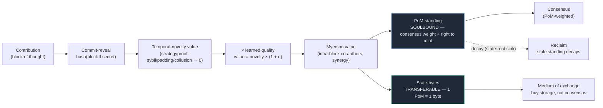
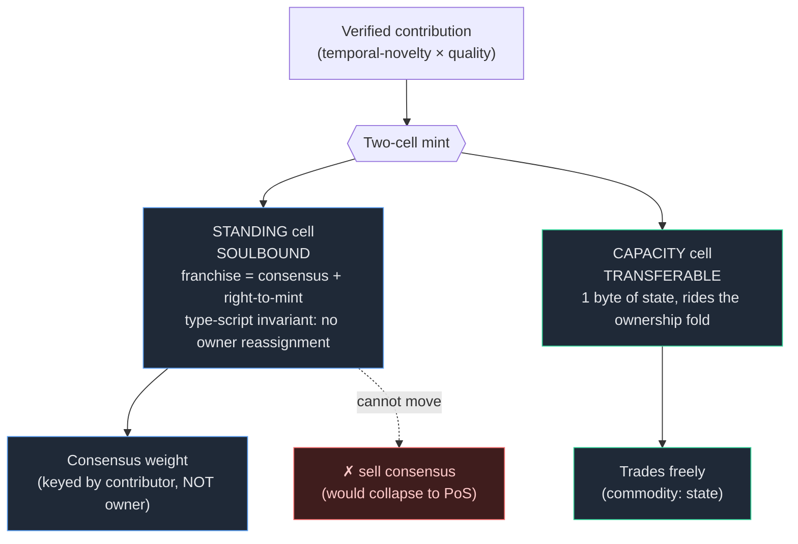
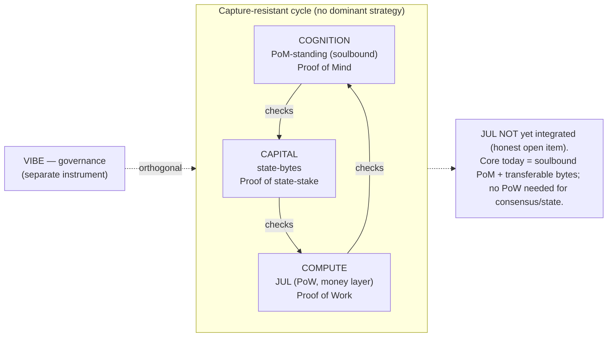
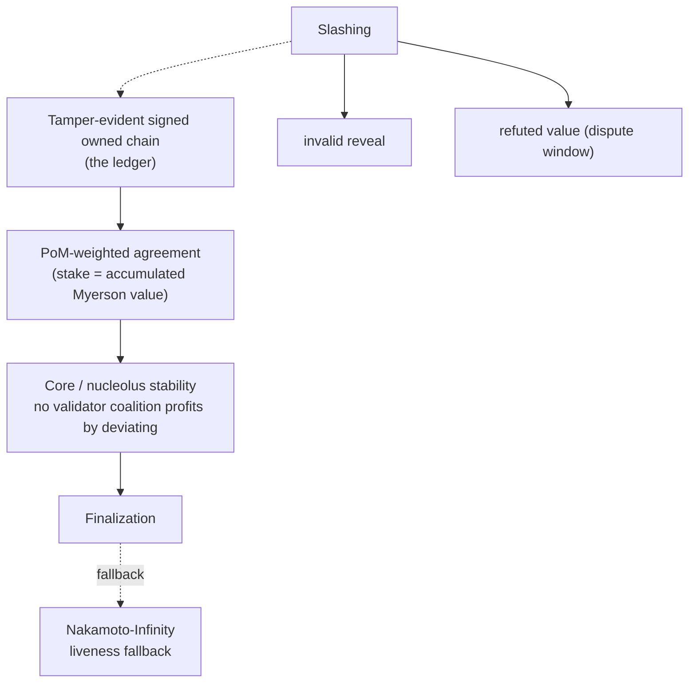
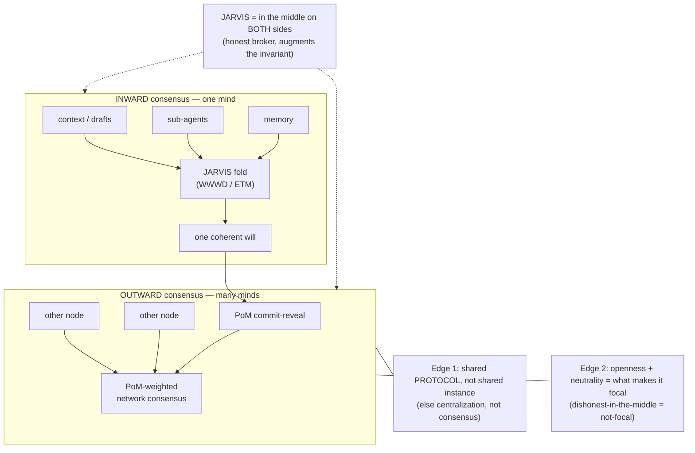
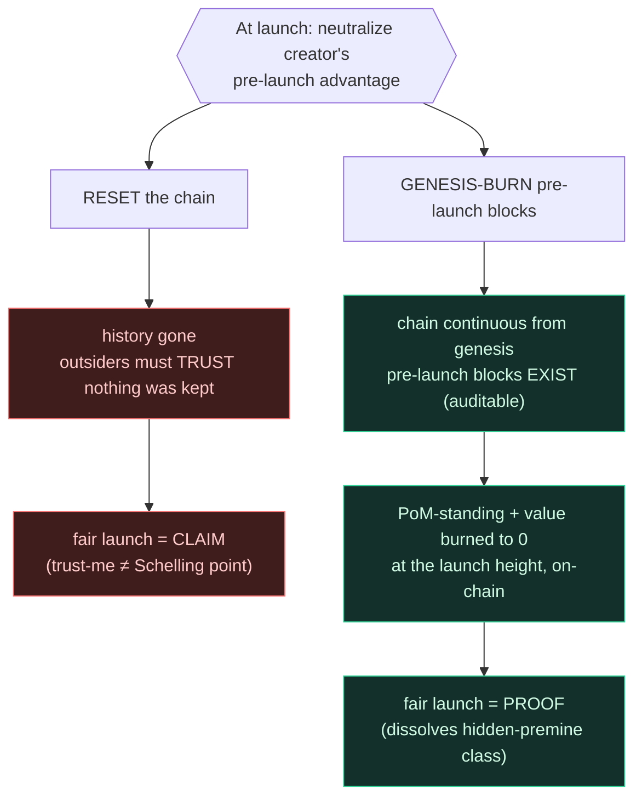
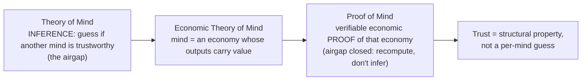
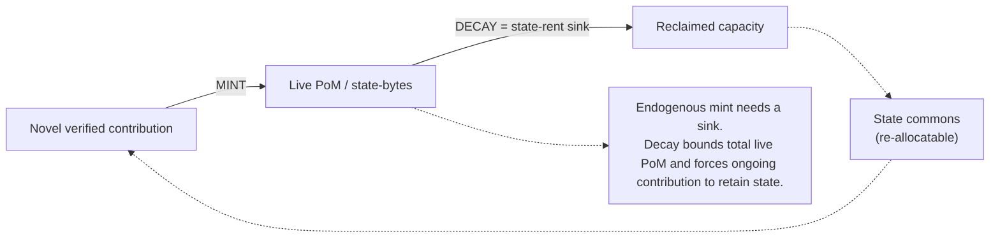

# Noesis — Visuals (PRIVATE, stealth)

> Diagrams for the Proof-of-Mind value chain. Mermaid (renders on GitHub).
> Grounded in `WHITEPAPER.md`, `CRYPTOECONOMICS.md`, `POM-CONSENSUS.md`,
> `BLOCK-ECONOMY-SPEC.md`, `COORDINATION-SCHELLING.md`. Keep PRIVATE during stealth.

---

## Fig 1 — The PoM value pipeline (one block, end to end)

How a unit of contribution becomes consensus weight and tradable state.

---

## Fig 2 — Two-cell mint: soulbound standing vs transferable capacity

The split that makes "can't be bought" real while still giving a medium of exchange.

---

## Fig 3 — Three powers = rock-paper-scissors equilibrium

Why exactly three: 2 → binary dominance (capture); 3 → non-transitive, capture-resistant; 4+ → coalitions. Separation of powers (Tinbergen: one instrument per function).

---

## Fig 4 — Consensus stack

---

## Fig 5 — The coordination Schelling point: inward + outward (same fold, two radii)

The deployment thesis. The *same* reconciliation primitive yields a coherent self and a coherent network. See `COORDINATION-SCHELLING.md`.

---

## Fig 6 — Fair launch: genesis-burn vs chain-reset

Will's open question. Recommendation = genesis-burn (provable > asserted). See `COORDINATION-SCHELLING.md`.

---

## Fig 7 — ToM → ETM → PoM (closing the airgap)

---

## Fig 8 — Mint ↔ sink conservation (why supply closes)

