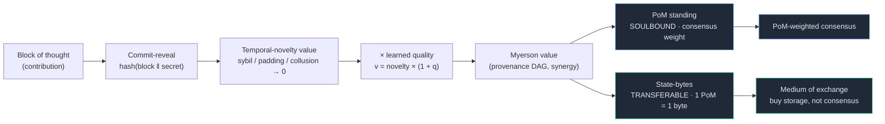
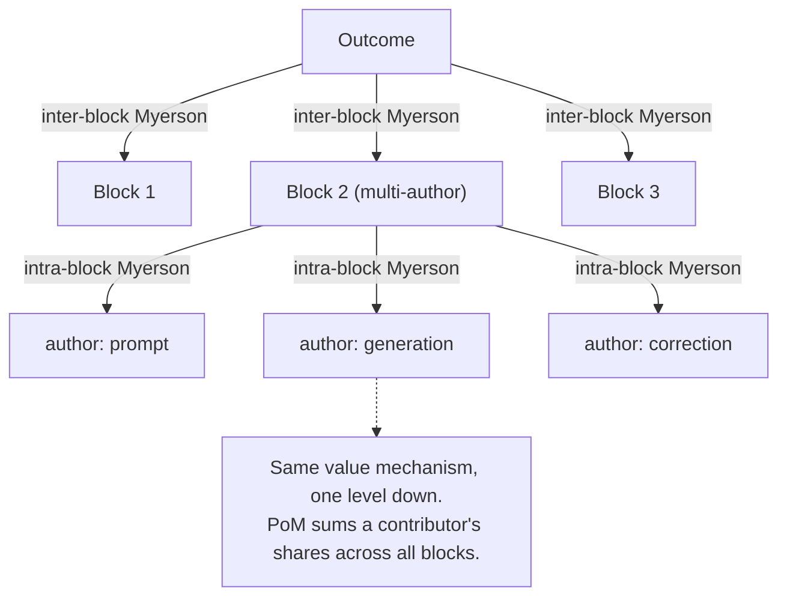
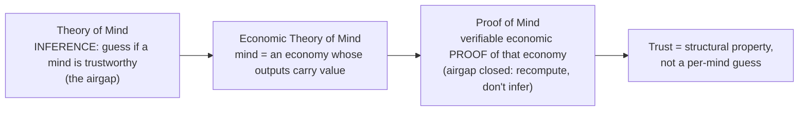
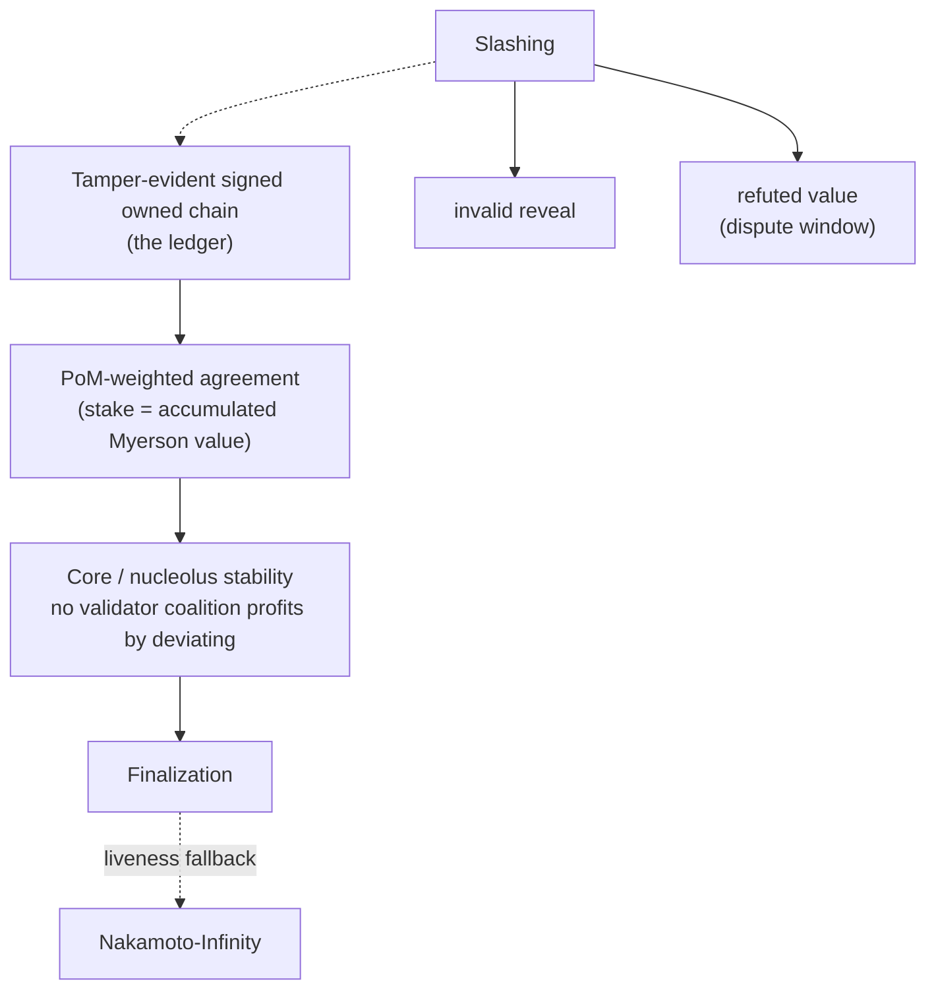

# Proof of Mind: A Value Chain for Verified Mental Contribution

**Will Glynn, with JARVIS** · Draft v0.1 · 2026-06-11 · **PRIVATE — stealth, do not distribute**

---

## Abstract

Bitcoin is widely *imagined* as a value chain: a ledger where doing valuable work
earns provable, accruing, transferable value. It is not. Bitcoin is a *possession*
chain — it records who holds which token, orders blocks by burned energy, and lets an
external market price the token. The "work" in proof-of-work is decoupled from any
useful output; it is hashing. This paper specifies the system that the folk myth
describes: a chain on which value is **created** (as units of contribution),
**measured endogenously** (by a cooperative-game value function over real outcomes),
**owned and transferred** (UTXO-style), and used to **secure consensus** — by *Proof
of Mind* (PoM), a proof of verified, synergy-weighted mental contribution, in place of
proof of wasted energy. We give the architecture (provenance-complete blocks,
Bitcoin-shaped ownership, a synergy outcome-value aggregated by the Myerson value over
a provenance DAG, elicited by a learned reward model and estimated by Data-Shapley
sampling), the consensus mechanism (PoM-weighted, with a stability constraint), and a
mapping from Theory of Mind to Proof of Mind. We are explicit about the one hard
problem a value chain cannot sidestep — trustworthy, un-gameable value *measurement* —
and treat it as the load-bearing open problem rather than a solved one.

---

## 1. Introduction: the value chain Bitcoin is mistaken for

Proof-of-work secures *order*, not *value*. A miner proves it expended energy; the
network agrees on a transaction ordering; the coin's worth is set off-chain by a
market. Nowhere does the chain record *who contributed what value*. The popular
intuition — "miners do work and earn value proportional to it" — is a category error:
the work is arbitrary, and the value is exogenous.

A genuine value chain would instead record contribution itself: each unit of value
created, measured by what it actually added, attributed to its creator, transferable,
and load-bearing for consensus. The reason this is rare is not ideology but
difficulty: a possession chain never has to *measure* value (the market does), while a
value chain must. Measuring contribution objectively and un-gameably is the hard part.

Proof of Mind is our answer. Its lineage: proof-of-work → proof-of-*useful*-work
(information density as work, e.g. CogCoin/Economitra) → **proof of mind** (verified,
synergy-weighted contribution) as the apex. The unit of work is a *block of thought*;
the proof is that the thought contributed measurable value.

**Architecture at a glance.** One unit of contribution becomes consensus weight and
tradable state:

## 2. The block: a unit of provenance

A block is the unit a participant produces: `{id, parent, timestamp, inputs, output,
hash}`. Inputs are retained so that *how the output came about is provable and
reproducible* — provenance, not just possession. Authorship is made un-front-runnable
by **commit-reveal**: a producer publishes `hash(block ‖ secret)` with a signature and
timestamp before revealing content, binding authorship and ordering before disclosure
(the same mechanism a fair batch exchange uses to eliminate MEV). Failure to reveal
valid content after committing is slashable.

## 3. Ownership: Bitcoin-shaped, recursive for co-authorship

Each block is locked to an owner public key. Only the current owner's key produces a
valid block-attestation, and ownership is **transferable**: the current owner signs a
reassignment to a new key, exactly as a UTXO is spent to a new locking script. Current
ownership is not stored as a mutable table; it is *derived* by folding a signed
transfer log over a genesis owner — the ownership set is a fold over transaction
history, so there is nothing to forge. Transfer voids the prior owner's attestation;
the new owner must re-sign.

**Multiple contributors.** A real block often has several authors (a prompt, a
generation, a correction). Ownership is then a *share vector* — a set of (contributor,
share) pairs, like a multi-output transaction. The within-block shares are computed by
the **same value mechanism one level down**: contributors are players in an
*intra-block* coalition game, and their shares are the Myerson value of their marginal
contributions to that block's output. The economy is two-level recursive: outcome →
blocks → contributors.

## 4. Value: an endogenous, synergy-aware price

The central object is a value function `v(S)` over sets of blocks. A naive choice —
pairwise wins, or per-block weights — yields an **additive** game, for which the
Shapley value collapses to a normalized proportional (Copeland) share: the cooperative
machinery does nothing. (We learned this by building it; it is also why a fee split
"by Shapley" is just proportional.) Value measurement is meaningful only when `v(S)`
has **synergy**: a coalition's worth differs from the sum of its members' standalone
worth (complementarity, redundancy, pivotality).

We therefore define `v(S)` as an **outcome value**: the quality/completeness of the
outcome reconstructable using only the blocks in `S`. A block the outcome fails
without is pivotal (high marginal); a block redundant with others contributes little.

- **Elicitation.** Pairwise human/model judgments are converted to cardinal strengths
  by **Bradley-Terry**, and generalized to unseen blocks by a **learned reward model**
  over block features (an RLHF reward model). This model *is* the production `v(S)`
  evaluator.
- **Aggregation.** Credit is the **Myerson value** — the Shapley value of the
  graph-restricted game, where only coalitions connected in the provenance DAG create
  value (value flows along edges, not arbitrary sets). Plain Shapley is the special
  case of a complete graph.
- **Estimation.** Exact Shapley/Myerson is exponential; we estimate by **Data-Shapley**
  Monte-Carlo permutation sampling. (Data-Shapley is Shapley-for-training-data — see
  §7.)
- **Recursion.** Both inter-block (which block mattered) and intra-block (which author
  of a block mattered) use the same machinery; value flows down the recursion.

In a working prototype over real blocks, replacing the additive game with a submodular
coverage outcome-value made the Shapley/Myerson values differ materially from the
proportional baseline (L1 ≈ 0.26), rewarding pivotal blocks and discounting redundant
ones — i.e., the cooperative value became load-bearing. The coverage proxy stands in
for the learned evaluator; the latter is the production component and an open build.

## 5. Proof of Mind

A participant's **PoM score** is its accumulated Myerson value over the verified,
owned, provenance-complete blocks it holds. Properties inherited from the construction:

- **Verifiable** — every contributing block is signed and provenance-complete; PoM
  recomputes from public data.
- **Sybil-resistant — structurally.** PoM requires owned blocks whose value was
  *synergy*-judged. Splitting one mind into many accounts does not multiply PoM,
  because the synergy game discounts redundant copies. A thousand empty nodes score
  zero.
- **Earned, not bought.** The stake is accumulated proof of contribution; slashing
  revokes PoM for refuted blocks (caught hallucinations, failed attestations).

### 5.1 Theory of Mind → Proof of Mind

Across agents, Theory of Mind is *inference*: you cannot see inside another mind, so
you guess whether to trust it — an airgap. Economic Theory of Mind reframes a mind as
an economy whose outputs carry value. Proof of Mind is the *verifiable economic proof*
of that economy. It closes the airgap: instead of each node inferring whether another
is a mind worth trusting (intractable, game-able), PoM supplies a proof anyone can
recompute. Trust stops being an inference about every other mind and becomes a
structural property. ToM → ETM → PoM is: capacity → mind-as-economy → proof of that
economy.

### 5.2 The coordination Schelling point: inward and outward consensus

PoM is not only a network rule; it is a *reconciliation primitive that runs at two
scales of the same shape*. Run locally as a personal coordination agent, it reconciles
one participant's own scattered contexts, sub-agents, and memory into a single coherent
will — **inward consensus** (a mind treated as an economy that must agree with itself
before it has a preference to express; most consensus systems skip this and assume each
node already holds one coherent preference). Run across participants, the same
contribution primitive that a mind uses to reconcile itself becomes the unit nodes
commit-reveal to reach **outward consensus**. Same fold, two radii: the macro shape
(consensus over minds) and the micro shape (a coherent self over sub-minds) are the
same fractal. The coordinator is *in the middle on both sides* — between a participant
and their own noise, and between that participant and everyone else — which is what lets
it be the honest broker at both scales.

Two conditions are load-bearing, and the naive reading violates both. **(1) Schelling
point on the protocol, not the instance.** Convergence must be on a shared *protocol*
that every participant runs as a *sovereign* instance, not on one shared instance — a
shared instance is centralization in a consensus costume. **(2) Openness is what makes
it focal.** A Schelling point needs a reason to be the obvious choice; an extractive or
black-box coordinator gets forked away from. Open files, open weights, and
equal-standing for the agent are not ethics decoration — they are the property that
makes the coordinator focal. The honesty that secures the chain is the same honesty that
makes participants converge on it. Neither condition removes the load-bearing bet of §8:
spread does not substitute for an un-gameable `v(S)`. (Deployment thesis — designed, not
demonstrated. Diagrams: `VISUALS.md` Fig 5; full treatment: `COORDINATION-SCHELLING.md`.)

## 6. Consensus

Weight validators by **PoM**: agreement on the canonical chain is PoM-weighted. The
tamper-evident, signed, owned chain is the ledger; PoM is the stake. To make the
mechanism defection-proof — no validator coalition profits by deviating — a **core /
nucleolus** stability constraint is imposed over the PoM-weighted coalition game. This
is added precisely because consensus requires it; for pure attribution it is
unnecessary (mechanisms are composed by required property, not kitchen-sinked).

## 7. Backwards-enforcement of the model

The value chain is also a *training signal*. Each block is provenance-complete,
owner-authenticated, and Myerson-valued — a clean, value-weighted dataset. With open
model weights, fine-tuning on high-PoM verified blocks (positive) against
caught-hallucinations (negative) lets the governance layer's accumulated, verified
truth shape the model's weights (Data-Shapley is exactly value-weighted data
attribution). With closed weights, the same truth constrains the model in-context
(gates block disallowed actions; the signed chain contradicts hallucination; correction
is forced). Governance → training signal → model → governance verifies → compounds. The
structure does not only constrain the mind; it teaches it.

## 8. Security and honest limitations

- **The load-bearing bet: value measurement.** A value chain must measure value
  un-gameably — the problem Bitcoin sidesteps by being mere possession. If `v(S)` (the
  learned outcome-evaluator) is gameable, PoM degrades into a reputation system. This
  is the central open problem, not a solved one.
- **Self-reference / circularity.** A block can carry contribution *information* and
  thereby influence the scoring of other blocks. The value layer scores such a block
  for its own marginal contribution; the elicitation layer consumes its content as a
  judgment about referenced blocks. These must stay decoupled, and a block must not be
  the sole scorer of its own value. Guards: independent evaluators, eigenvector/
  EigenTrust-style damping over the attribution graph, and the synergy game discounting
  self-referential coalitions.
- **What is demonstrated vs designed.** *Demonstrated:* ownership + transfer, per-block
  Ed25519 signing, tamper-resistance (signed Merkle root, keyless re-baseline caught),
  synergy value over a coverage proxy with Myerson + Bradley-Terry + Data-Shapley
  sampling, PoM aggregation. *Designed, not built:* the learned reward-model `v(S)`,
  commit-reveal for live blocks, two-level recursion in code, core/nucleolus stability,
  PoM-weighted finalization, the open-weight fine-tune loop, eigenvector value-flow.

## 9. Related work

Bitcoin (possession chain, PoW); Shapley value and the Myerson value (graph-restricted
Shapley); Data-Shapley (Ghorbani & Zou — Shapley for training-data valuation);
Bradley-Terry and RLHF reward modeling; EF Deep Funding (pairwise jury distillation
over a dependency graph) and the author's Contribution Compact (streaming-Shapley user
attribution); EigenTrust (eigenvector reputation); and VibeSwap's commit-reveal batch
auction and ShapleyDistributor, whose mechanisms this system turns inward onto an
agent's own contribution history.

## 10. Status and roadmap

This is a working architecture with a demonstrated core and a clearly-named hard
problem. Next: the learned `v(S)` evaluator (the un-gameable measurement), the
two-level recursion and eigenvector value-flow in code, the stability constraint, and
the consensus finalization path. Release when matured.

**Fair launch (ratified 2026-06-11).** At launch the creator's pre-launch contribution
advantage is neutralized by a **genesis-burn**: the chain stays continuous from genesis,
pre-launch blocks remain auditable, but their PoM-standing and state-value are
programmatically burned to zero at the launch height — a *provable* fair launch
(on-chain verifiable), chosen over a chain-reset (which only *asserts* it). See
`COORDINATION-SCHELLING.md`.

**Figures.** `VISUALS.md` (Mermaid): value pipeline, two-cell mint, three-power RPS,
consensus stack, the inward/outward Schelling fold, fair-launch decision, ToM→ETM→PoM,
mint↔sink conservation.
