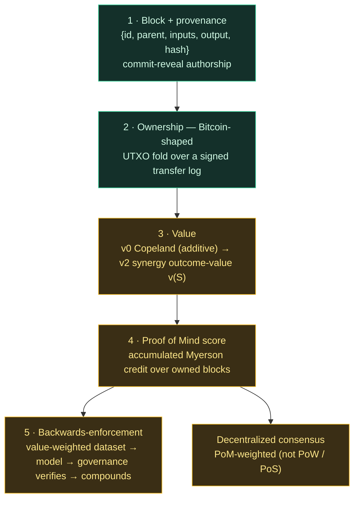
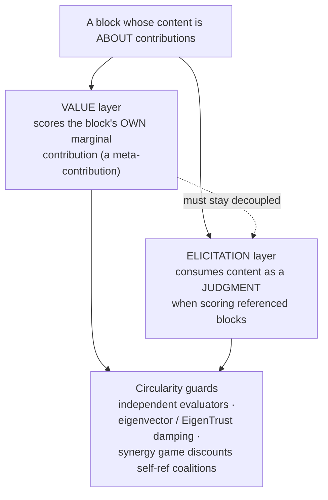

# The Block Economy — PRIVATE (2026-06-11)

> Will: *"keep this all in a private repo for now, I'm tired of being front-run. I want a
> couple weeks to myself on this idea, then release it when it's mature and I have a head
> start for once."* This repo has NO public remote. Do not sync. Do not publish.

A unified system that turns JARVIS's own session history into a verifiable, owned,
valued contribution economy — and, through that, a realistic basis for decentralized
consensus and for backwards-enforcing the model layer from the governance layer.

## Framing: the value chain Bitcoin is mistaken for (Will, 2026-06-11)

Bitcoin is a *possession* chain — it records who holds which token, ordered by burned
energy; value is exogenous (the market prices it), and the "work" is decoupled from
anything useful. What people *think* Bitcoin is — a ledger where valuable work earns
provable, accruing, flowing value, where "proof of work" means proof you *did*
something worth something — is a folk myth. **This network makes that myth literal.**
Value is created (blocks), measured *endogenously* (Myerson/Shapley over real
outcome-synergy), owned (UTXO), flows (transfer + two-level recursion), and secures
consensus (PoM, not PoW). Proof of **Mind** replaces proof of wasted energy.

Load-bearing caveat: a literal value chain must *measure* value trustworthily — the
one hard problem Bitcoin sidesteps by being mere possession (the market measures value
off-chain; we measure it on-chain). A trustworthy `v(S)` is the entire bet. The
strategyproof FLOOR (temporal-novelty: sybil/padding/collusion → 0) is demonstrated; the
LEARNED `v(S)` that would beat a fixed structural proxy is a DESIGN thesis whose first
real-data test (DeepFunding) came back **null** — unsupported, not refuted; see
OUTCOME-EVALUATOR.md and the status ledger. Get the learned measure right and this is a
value chain; fall back to the floor and it is a strategyproof reputation system, not a
gamed one. Lineage: PoW → proof-of-useful-work (CogCoin / Economitra: information density
as work) → **Proof of Mind** (verified synergy-valued contribution) is the apex.

## The stack (each layer demonstrated, not asserted)

1. **Block + provenance.** A block is the unit a session produces:
   `{id, parent, timestamp, prompt(input), response(output), checkpoints, hash}`. The
   inputs are present so *how the output came about is provable* (Will's requirement).
   Hardening: **commit-reveal** authorship — a producer commits `hash(block‖secret)` +
   signature + timestamp before revealing content, so authorship and ordering are
   un-front-runnable (VibeSwap's MEV-elimination applied to JARVIS's own provenance; the
   50%-invalid-reveal slash maps to commit-without-valid-reveal).

2. **Ownership — Bitcoin-shaped** (`block-ownership.py`, proven). Each block is locked to
   an owner public key; only the current owner's key produces a valid attestation, and
   ownership is transferable — the current owner signs a reassignment to a new key, like
   spending a UTXO. Current ownership is *derived* by folding a signed transfer log over a
   genesis owner (no mutable table to forge). Transfer voids the prior attestation; the new
   owner must re-sign. Start: a single genesis owner (Will); model is multi-owner.

3. **Value — credit as a share of a whole** (`block-value.py`, proven for v0).
   **Honest finding from building it (and Will's challenge confirmed it):** Shapley is *for
   coalition games*, and the game I first built — `v(S)` = total pairwise wins — is **additive**.
   For an additive game `φ_i = v({i})`, so Shapley collapses to the normalized **Copeland**
   win-share: the 2^N coalition machinery computes the same answer as a trivial normalization.
   **Shapley is ceremonial there; it is not being used effectively.** Pairwise comparison yields
   a *ranking* (ordinal/additive), which has no coalition synergy for Shapley to chew on. This
   is exactly what the cooperative-game-elicitation-stack warns: *Shapley operates on v, it does
   not produce v* — pairwise was the elicitation masquerading as the value.
   - **v0 (shipped, honest label):** normalized Copeland share from pairwise wins. NOT "Shapley
     value" — call it what it is.
   - **v1 (the real maturation):** a **synergy-bearing outcome-value** `v(S)` = the
     quality/completeness of the outcome reconstructable using ONLY the blocks in S. Pivotal
     block (outcome fails without it) → high marginal; redundant block → low. Elicit coalition
     outcome-values (model/jury, DeepFunding-distill over *sets* not *pairs*); Shapley over THAT
     is meaningful and the multiplicativity (synergy) is real. This is what the head-start is for.

4. **Proof of Mind (PoM) score.** An agent's PoM = its accumulated Shapley credit across
   *verified, owned, provenance-complete* blocks. This is what makes decentralized consensus
   realistic: weight validators by **proof of verified mental contribution** rather than PoW
   (energy) or PoS (capital). Sybil-resistance is structural — credit requires owned blocks
   whose value was pairwise-judged and whose provenance is signed; you cannot fabricate PoM
   without actually producing verifiable, valued work. (Connects the existing MessagingPoM /
   proof-of-mind line to a concrete, computable score.)

5. **Backwards-enforcement of the model.** The block economy *is a training signal*. Each
   block is provenance-complete, owner-authenticated, and Shapley-valued — i.e. a clean,
   value-weighted dataset. With **open weights** (the sovereignty direction), fine-tune on
   high-PoM verified blocks (positive) vs caught-hallucinations (negative): the governance
   layer's accumulated truth shapes the weights. With closed weights, the same truth enforces
   the model in-context (gates block, the signed chain contradicts hallucination, correction
   is forced). Governance → training signal → model → governance verifies → **compounds**.
   The cage doesn't only constrain the mind; it teaches it. That is the maximally-moral-agent
   loop made mechanical.

## Why this unifies everything (the reason it's worth a head start)

| Borrowed from | Used as |
|---|---|
| Bitcoin | block ownership + transferable rights (UTXO fold) |
| VibeSwap commit-reveal | un-front-runnable block authorship |
| VibeSwap Shapley | value aggregation (multiplicative shares) |
| DeepFunding pairwise distillation | value elicitation |
| Contribution-graph | assignment of credit to owners |
| Merkle + Ed25519 signing | tamper-resistance of the whole |
| PoM / proof-of-mind | consensus weight from verified contribution |

It is JARVIS applying VibeSwap's own mechanisms to itself (internalize-own-protocols), and
it closes the airgap on the agent's own provenance and value.

## Math roadmap for an intelligent value-flow mechanism (Will's question, 2026-06-11)

We don't need *new* math — we need to assemble the *right known* pieces. Minimal
intelligent stack:

1. **Elicitation → cardinal value:** Bradley-Terry / Elo over pairwise judgments
   (principled, replaces the ad-hoc win-count). Pairwise stays as the human/jury signal.
2. **Value of a SET (synergy):** a learned **outcome-evaluator / reward model** for
   `v(S)` = outcome quality using only the blocks in S. This is DeepFunding's distill and
   is literally an RLHF reward model. The load-bearing ML piece.
3. **Aggregation on the graph:** **Myerson value** (Shapley restricted to graph-connected
   coalitions) over the provenance DAG — not plain Shapley, because value flows along parent
   links, not arbitrary sets. Estimate with **Data-Shapley / Monte-Carlo permutation sampling**
   (exact is 2^N). Data-Shapley (Ghorbani-Zou) is exactly Shapley-for-training-data = "blocks
   as training signal."
4. **Flow / propagation:** recursive Shapley on the DAG (DeepFunding transitive recursion) or
   a GNN — value propagates backward to the blocks a result built on.

Add-by-required-property (augmented-mechanism-design discipline; do NOT kitchen-sink):
fairness → Shapley/Myerson · graph-restriction → Myerson · stability/no-fork → core or
nucleolus (only if consensus needs it) · strategyproofness/anti-sybil → mechanism design +
the contribution-graph Goodhart defenses (decay, reviewer-diversity, split-credit) · scale →
sampling · temporal (round-to-round) → fairness-fixed-point / iterated-Shapley.

Net: **Data-Shapley + RLHF reward-modeling on a provenance graph.** Known math, assembled.

## Multi-contributor & self-referential blocks (Will's design hypotheticals, 2026-06-11)

**A block with multiple contributors.** Single-owner UTXO is too coarse. A block
locks to a *share-vector* — a set of (contributor, share) pairs, like a multi-output
tx / cap table. The within-block shares are computed by the SAME value mechanism one
level down: the contributors are players in an *intra-block* coalition game, shares =
Shapley/Myerson of their marginal contribution to that block's output. The economy is
**two-level recursive**: outcome → blocks (inter-block Myerson) → contributors
(intra-block Myerson). This is DeepFunding's transitive recursion + the influence-DAG,
now load-bearing. PoM then sums a contributor's shares across all blocks.

**A block whose content is itself about contributions.** It plays TWO roles in TWO
layers, and decoupling them is the point (elicitation-stack):
1. **Value layer** scores the block's OWN marginal contribution to the outcome (a
   meta-contribution, scored like any block).
2. **Elicitation layer** consumes the block's CONTENT as a judgment when scoring the
   blocks it references (a signal, not a value).

Circularity guard (a block must not be the sole scorer of its own value): independent
evaluators for attribution-blocks + eigenvector/PageRank damping over the attribution
graph + the synergy game discounting self-referential coalitions (a ring of
self-attributing blocks has low *outcome* value). Same Goodhart defenses as the
contribution-graph, applied recursively. Open: formalize the two-level recursion +
the eigenvector value-flow (EigenTrust-style) for the attribution graph.

## Status (honest)

- **Demonstrated:** ownership + transfer (Bitcoin-shaped), per-block signing, tamper-
  resistance (Ed25519-signed merkle root, keyless re-baseline caught). **Value v2**
  (`block-value-v2.py`): submodular **coverage** outcome-value → Shapley + **Myerson**
  (sampled, Data-Shapley style) + **Bradley-Terry** elicitation. Synergy now captured
  (`L1|Shapley−Copeland| = 0.26`) — Shapley is load-bearing, rewarding pivotal / penalizing
  redundant blocks. (v0's pairwise game was additive ⇒ Shapley ceremonial; caught by Will,
  fixed.) Audit: ShapleyDistributor.sol = weighted-proportional (additive-Shapley, honest
  for fees); contribution-graph = clean (disclaims computing Shapley).
- **Designed, not built:** commit-reveal authorship for new blocks; outcome-value synergy
  layer (true multiplicativity); PoM aggregation across blocks; open-weight fine-tune loop;
  multi-owner operation; full input-context capture per block.
- **Exposure note:** tamper-resistance + Bitcoin-shaped ownership concepts and the hooks were
  already pushed to the public WGlynn/JARVIS substrate earlier today, before this stealth
  decision. The crown jewels — `block-value.py` (pairwise→Shapley), PoM derivation, and this
  spec — are NOT public. Decision pending: make the public repo private / scrub today's
  commits / accept and keep only new work private.
