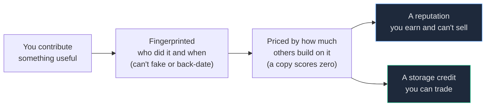
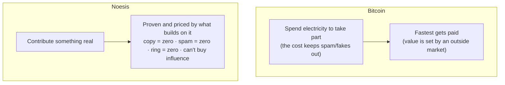

# Noesis, for normal people

*Proof of Mind with no math and no jargon — the 5-minute version of the full paper, for the 99% who will never read it.*

---

## The one-sentence version

Bitcoin makes people **spend electricity** to take part — and that cost is what keeps spam and fake accounts out. Noesis keeps them out a better way: by only paying for **genuine useful contribution.** Same protection, but the thing you put in is real work — and you can't fake it, copy it, or buy your way in.

## First, what Bitcoin really did (and didn't do)

Most people think Bitcoin works like this: *you do valuable work, you earn coins for it.* That's not quite it. Miners spend electricity racing to solve a hard puzzle, and whoever wins gets the coins. Here's the part people miss: that electricity isn't pointless — **the cost is the point.** Making participation expensive is exactly what keeps spammers and fake accounts out when there's no one in charge to police them. It's a clever, real solution. What it *isn't* is useful work in its own right — the puzzle itself doesn't produce anything extra, and what a coin is worth gets decided somewhere else, by the market. (Noesis actually keeps proof-of-work for the one job it's genuinely best at: turning energy into stable, spendable money. More on that near the end — it's a strength, not a flaw.)

But Bitcoin *did* do something genuinely new: it created a **market that couldn't exist before** — owning money that no government or bank controls. Nobody had a way to do that. Bitcoin built the missing piece, and a whole market appeared.

That's the real lesson, and it's the one we're copying. **Every leap in this space is someone building the missing piece for a market that couldn't exist yet.** Bitcoin did it for *ownership*. Noesis does it for *contribution* — getting paid, provably and fairly, for useful thinking. The thing people always imagined Bitcoin was, finally built.

## What Noesis actually does

Picture a shared record where every time someone contributes something genuinely useful — an idea, a fix, a piece of work — it gets:

1. **Written down with a fingerprint**, so we know exactly who did it and when, and it can't be faked or back-dated.
2. **Priced by how much it actually mattered** — not how loud you were, but whether other people's work ended up building on yours. A truly new, pivotal idea scores high. A copy of what someone already said scores zero.
3. **Turned into two things:** a *reputation* you earn and can never sell (your standing), and a kind of *storage credit* you can trade.

The score is called **Proof of Mind**. Where Bitcoin proves you burned electricity, this proves you contributed thought.

## How it decides what something is worth

Here's the neat part. Noesis doesn't have a committee or a fixed formula deciding what your work is worth. It lets a **market** decide — the same way Bitcoin lets the market decide what a coin is worth. The "price" of your contribution is simply **how much other people's work ends up building on it.** Useful work gets built on; useless work doesn't. The chain just watches what gets built on what, and pays accordingly.

## The clever part: you can't cheat it

The obvious worry: *"won't people just spam fake contributions to farm points?"* It comes down to one rule — **you only get paid for genuinely new work that others actually build on** — and every kind of cheating breaks against it:

- **Copying earns nothing.** Only genuinely *new* contribution counts. Repeat what's there, score zero.
- **Spamming a thousand variations earns nothing.** Flooding hits a hard ceiling; volume can't pump your score.
- **Ganging up to praise each other earns nothing.** A ring of friends citing each other in a circle produces no *real* outside work building on them — and the system can tell the difference between a real chain of building and a circle of back-scratching.
- **Your reputation can't be bought.** You can buy *storage space*, but you can't buy *influence*. That stops it from becoming "whoever has the most money wins" — which is what almost every other crypto system quietly becomes. **You can buy storage; you cannot buy consensus.**

That's the quiet trick: Bitcoin uses *electricity* to make cheating expensive; Noesis builds the same protection into *how it measures value*, so spam and fakes simply score zero — no burning required.

## Why this is bigger than one app

When the base layer pays people to be honest and useful, **everything built on top inherits it.** Take DeFi (crypto finance): today every app has to fight manipulation and people skimming value in the middle, and most lose. On Noesis, providing an honest price or real liquidity is the thing that earns — and manipulating a market earns nothing, because it's just value moving in a circle. "Honest finance" stops being a promise an app has to make and becomes the default the ground already rewards. Being honest is simply the highest-paying move, at every level.

## It doesn't fight other projects — it invites them

Most crypto projects compete to be "the one chain everybody uses." Noesis is built to be the first chain that *doesn't have to win that fight at all.* Every other chain is in a zero-sum war for the same prize, and a fork *splits* a community in two. Noesis does the opposite: it can take useful work from *any* other chain, re-price it fairly, and fold it into one shared record without anyone losing what they built. A rival joining in keeps everything. So the older projects aren't rivals to beat — they're the prototypes this was learned from, and the fight isn't won, it's simply dissolved. **The message to every other chain isn't "come compete." It's "come join us."** (The piece that does this inside one chain is built and tested; the bridge that pulls in a *foreign* chain is designed but not yet built.)

## You're already credited — before you even sign up

Here's the part that flips how joining works. To be *credited* on Noesis, you don't need an account or a wallet — credit is just a record that says "this useful work came from you," tied to something you already have (a code repo, a dataset, an email). So Noesis can give credit to the whole existing world of contributors *before any of them join.* When you do show up, you're not starting from zero — you're **claiming what's already provably yours.** And it's opt-in by design: the credit just sits there with your name on it until you decide to claim it, you can wave it off if you'd rather not be listed, and nothing is ever paid out for you without your say-so.

## Proof of work has a real home here

None of this means proof-of-work is useless — just the opposite. Bitcoiners are right that it's essential and not "waste," and Noesis keeps it for the one job it does better than anything: turning real energy into sound money. Noesis's money side is a proof-of-work coin (proportional, in the style of *Ergon*) designed to stay roughly stable and be *spent* rather than hoarded. So the whole picture is simple: **proof-of-work makes the money; proof-of-mind earns the standing; stakeholders keep their say.** Each does only what it's best at. If you love proof-of-work, there's a real, honored place for it here — this isn't a rival to it, it's where it finally fits.

## When it launches, Will gives up his head start

Will is building this first, which would normally let him rack up a big early lead before anyone else joins. He's choosing **not to keep it.** At launch, all the points earned during the private building phase get **wiped to zero**, on the public record, so everyone can verify it — and everyone starts even. A fair start you can *check*, not just trust.

## The honest part (what's done, what isn't)

- **Done and tested:** the ownership and fingerprinting, the pricing that rewards genuinely new contributions, the anti-cheating (spam, fake accounts, and citation rings all score zero in our tests).
- **Still being figured out:** the hardest piece — teaching the system to judge *"how good was this contribution, really?"* reliably and un-fakeably. That's the make-or-break problem, and we're honest that it's not finished, just well-started. The plan for it isn't a fixed formula (those always get gamed) — it's a measure that keeps learning and adapting faster than anyone can game it.

That's the whole idea: **a record where good thinking earns provable, fair credit — and copying, spamming, ganging up, and buying your way in all earn nothing.**

---

*Next step up: the [litepaper](NOESIS-LITEPAPER.md). The full whitepaper has the math.*
