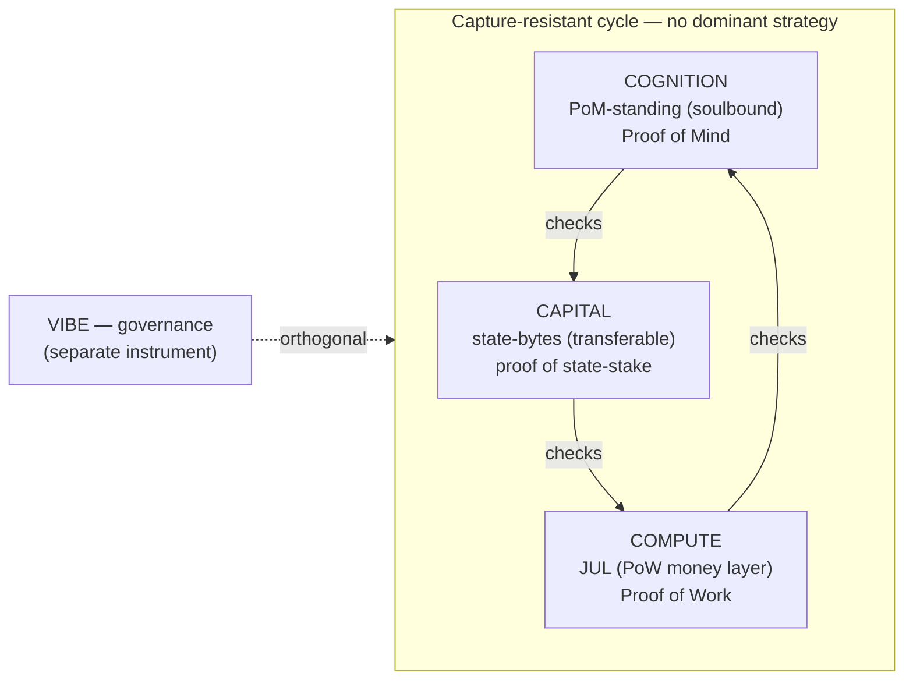

# Tokenomics — three tokens, one soulbound standing

> Canonical tokenomics reference for Noesis. Consolidates the model that was previously
> scattered across `CRYPTOECONOMICS.md`, `POM-CONSENSUS.md`, `BLOCK-ECONOMY-SPEC.md`,
> the FAQ and the litepaper. Where something is designed but not yet built, this doc
> says so in line — nothing here is overclaimed.

## The one paragraph

Noesis separates the three functions money systems usually fuse — **money, governance,
capital** — into three distinct tokens, and keeps the one thing that must never be for
sale, **consensus weight**, out of all of them. Consensus weight is **PoM-standing**: a
*soulbound, non-transferable* franchise you earn by verified contribution and cannot buy,
sell, or transfer. The three tokens trade; standing does not. That single split is the
whole design: **you can buy storage, you can buy the money, you can buy governance
exposure — you cannot buy a say in what counts as contribution.** It is what makes
Noesis the one chain that is structurally free from plutocracy.

## The split that everything rests on: standing vs the rest

"PoM can't be bought" used to conflate two different things. They are now cleanly split:

- **PoM-standing — SOULBOUND (non-transferable).** Earned by verified novel contribution
  (temporal-novelty × quality). It *is* your consensus weight and your right to mint
  state. It cannot be sold or reassigned. This is reputation, not money. A *transferable*
  standing would let a rich actor buy consensus and collapse the system back into
  proof-of-stake — so non-transferability is load-bearing, not a nicety.
- **Everything else — TRANSFERABLE.** State-capacity, money, and governance are
  ordinary tradeable instruments. They are commodities and claims; mind-standing is not.

> **Buy storage, not consensus.** A commodity (state) is liquid. Standing is not.

## Why exactly three powers (not two, not four)

The three-token split is **separation of powers** (Tinbergen's rule: one instrument per
independent objective), and three is *minimal and sufficient* for capture-resistance:

- **2 powers** → one is the strict best response and captures the other (binary dominance).
- **3 powers** → non-transitive, rock-paper-scissors: each checks another in a cycle, no
  dominant strategy, capture-resistant *by structure*.
- **4+** → adds complexity without more non-domination, and invites coalitions.

The three powers are **capital / compute / cognition**, and they map onto the instruments
below. Governance (VIBE) sits orthogonal to the capture-resistant cycle.

## The instruments

| Function | Instrument | Transferable? | Proof / how earned | Status |
|---|---|---|---|---|
| **Franchise** — consensus weight + right to mint | **PoM-standing** | **No (soulbound)** | Proof of Mind: verified novel contribution | core, built (reference layer) |
| **Capital / state** | **state-bytes** (1 PoM = 1 byte) | Yes | Minted by PoM-standing, then trades freely | core, built (reference layer) |
| **Money / medium of exchange** | **JUL** | Yes | Proof of Work (energy-pegged, Ergon-style) | **designed, NOT built** |
| **Governance** | **VIBE** | Yes | Voting + validating | designed |

### PoM-standing — the soulbound franchise

Your accumulated PoM is your standing. It decides consensus weight and grants the *right
to mint* state-bytes. It is keyed to the contributor and cannot be moved. Sybil, padding,
and collusion mint **zero** standing (temporal-novelty gates them), so you cannot fake or
purchase your way to weight. This is the anti-plutocracy core.

### State-bytes — the capital layer (1 PoM = 1 byte)

Storage is the scarce resource (CKB's insight, ported): **1 PoM = 1 byte of on-chain
state**, and your standing is your right to occupy it. Once minted, state-bytes are
transferable — this is the liquid commodity layer. Held state **decays** if you stop
contributing; decay is the state-rent *and* the supply sink that bounds total live PoM.
Mint (novel contribution) and burn (decay) balance. No capital gate: you contribute your
way in, you don't buy your way in.

### JUL — the money layer (designed, not built)

The one job a medium of exchange needs that state-bytes can't do alone is **price
stability** (volatile bytes make poor money). That is JUL's role: a *proportional,
Ergon-style* "energy money," priced by real energy via Proof of Work, designed to stay
roughly stable and to be **spent, not hoarded**. It is deliberately the opposite of
standing: standing is scarce, inelastic, and unbuyable; the energy money is elastic and
made to circulate.

> **Honest status: JUL is designed and partially built, not yet integrated at genesis.**
> The issuance core, coinbase settlement, and counter-cyclical reserve exist as shadow
> modules (`node/src/jul.rs`, `reserve.rs`, coinbase-mint in `runtime.rs`); genesis issuance
> and live economics are not wired. Don't claim the money layer ships today — it doesn't.
>
> **What PoW is — and is NOT — deferrable for (Will-ratified 2026-07-13).** The precise,
> narrow claim: PoW is excluded from the *finality-safety* mix (`FINALITY_MIX`, `runtime.rs`)
> because PoW is reorgeable, so *steady-state finality* runs on PoS+PoM, and state is minted
> by PoM, not PoW. That is the ONLY sense in which "the core needs no PoW." It does **not**
> make PoW/JUL launch-deferrable: all three NCI axes (`pow 0.10 / pos 0.30 / pom 0.60`) ship
> at genesis — you cannot launch two axes and fork in the third — JUL is the e-cash a *value
> chain* cannot launch without, and PoW is the allocation-free genesis bootstrap (first coins
> from energy, no premine). PoW therefore matters MORE at launch than in steady state, then
> recedes as PoM accrues. Build track: `internal/LOOP-PLAN-to-golive.md` (M1–M3).

### VIBE — governance

VIBE is the governance instrument: voting and validating. It is orthogonal to the
capture-resistant capital/compute/cognition cycle, so governance preference cannot buy
consensus weight either.

## Naming — read this to avoid the thread's confusion

- **JUL** is the canonical name of the money token. (Some early/external references say
  "NOE" or "the Noesis token"; treat **JUL** as canonical for the money layer unless this
  doc is updated.)
- **Ergon is NOT a Noesis token.** It is the real-world proof-of-work coin whose
  *proportional energy-money design* JUL is modeled on. When you see "Ergon-style," read
  it as a design descriptor for JUL, not a fourth token.
- **state-bytes** (a.k.a. state-capacity, CKB-native capacity in ported terms) is the
  capital instrument; it is not a separately-branded ticker, it is the minted state unit.

## The load-bearing invariant: consensus weight cannot be bought

This is the sentence the whole tokenomics exists to protect:

> You can buy the tokens (JUL, VIBE), you can buy storage (state-bytes) — but you cannot
> buy **consensus weight**. Weight is PoM-standing: soulbound and unpurchasable. Capital
> can rent space on the chain; it can never buy standing, and never a say in what counts
> as contribution.

This is what separates Noesis from proof-of-stake, where influence simply *is* wealth.
It is also the answer to "isn't this gameable by paying?": money never converts into
recognition, nor into weight over the measure.

## Two value problems — don't conflate them

Assigning value happens in two places with very different requirements:

1. **Grant / reward amount** (e.g. recognizing a contribution with a payout). This can be
   approximate and even discretionary — it never has to be comparable across recipients.
   *Better to be approximately right than precisely wrong, and reward real contribution,
   than to be precise by rewarding none.*
2. **Consensus weight.** This must be a *principled, comparable* measure, because it
   decides who builds blocks and whose vote counts. Here precision matters.

The measure for (2) is not a single value function but an **ensemble that works
together** (pairwise comparisons aggregated into a comparable scalar; see
`POM-CONSENSUS.md` and the value-aggregation design). The aggregation math is tractable;
the open frontier is the *quality of the inputs* — the value-oracle itself.

> **Honest status: the value-oracle is the core open problem.** The first real-data test
> of the learned value measure came back inconclusive, not confirming. The math that turns
> comparisons into weights is standard; getting honest comparisons to feed it is the work.

## Where this sits in the product

The product is **allocative efficiency** — getting value to the people who created it.
The sovereign chain is what makes the *consensus* form of that allocation
plutocracy-free; it is the canonical home of the model above. (An app on an existing
chain could deliver the recognition/allocation product, but it would inherit that chain's
plutocratic consensus and so could not deliver the unbuyable-consensus property — which
is exactly why the sovereign chain is load-bearing for the core claim.)

## Open items (honest)

- **JUL money layer**: designed, not integrated. Stability mechanism still owed.
- **Value-oracle**: the ensemble aggregation is in hand; honest large-scale labels are not.
- **NCI weight reconciliation**: the implemented NCI consensus uses fixed weights
  (PoM / state-stake / PoW). The capital/compute/cognition framing above is the design
  target; see `CONSENSUS-REVIEW.md` for the divergence and the reconciliation path.
- **Token naming**: JUL/VIBE/state-bytes treated as canonical here; confirm before any
  public launch copy reuses "NOE."
