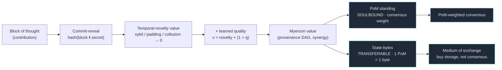
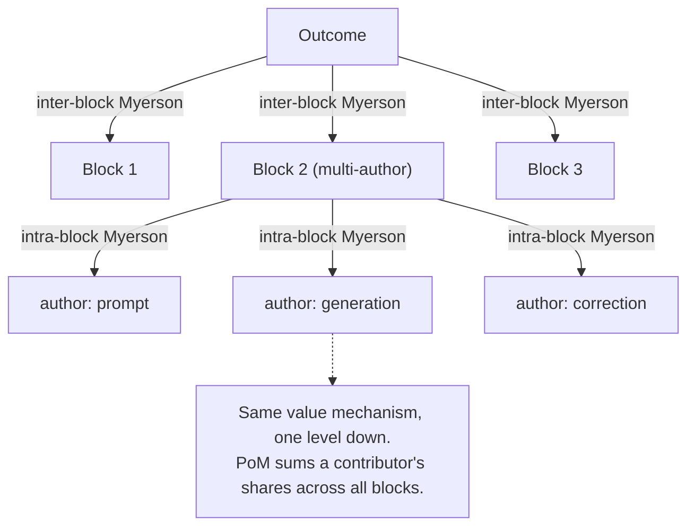
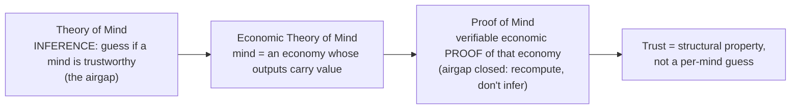
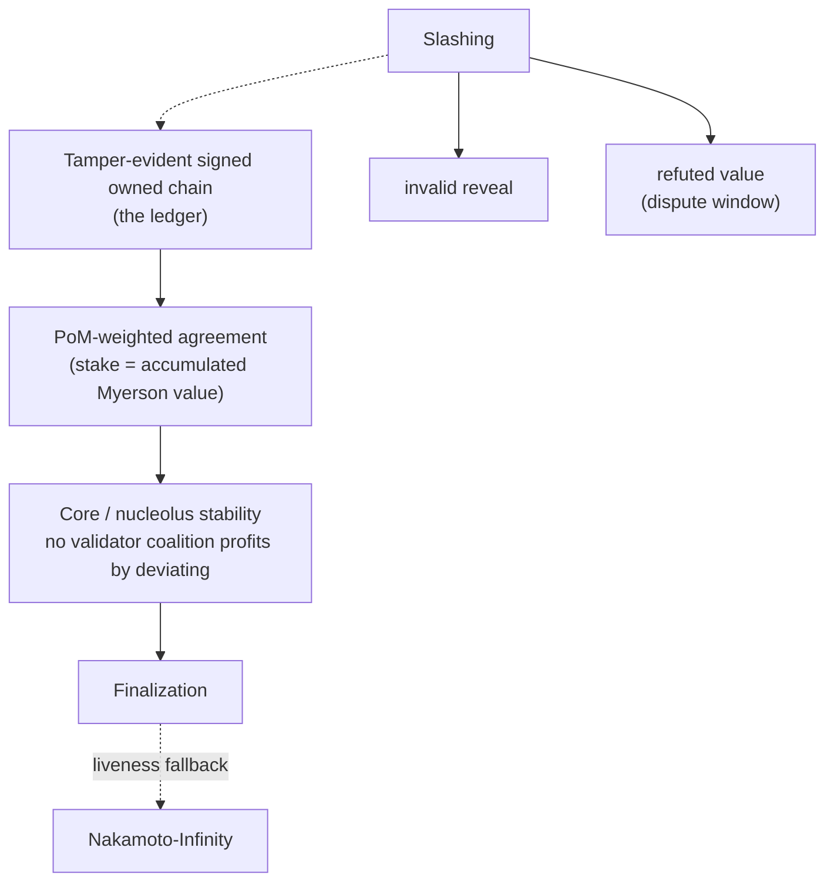

# Proof of Mind: A Value Chain for Verified Mental Contribution

**Will Glynn, with JARVIS** · 2026-06-11, public since 2026-06-29 · **PUBLIC — Noesis is open source, built in the open. The canonical technical paper is [`whitepaper/noesis-whitepaper.tex`](whitepaper/noesis-whitepaper.tex) (v5.3); this is the earlier prose companion.**

---

> **Bitcoin proves you wasted energy. Proof of Mind proves you contributed a valuable
> thought — and pays you for the mind, not the megawatts.**

## Abstract

Everyone thinks Bitcoin rewards valuable work. It doesn't. It rewards burning
electricity — miners race to guess random numbers, and the guessing produces nothing
useful. Bitcoin only tracks *who owns which coin* and orders blocks by who burned the
most power; the coin's worth is decided off-chain by a market. The popular story —
"do work, earn value proportional to it" — is a myth no chain has actually built.

This paper builds it. **Proof of Mind** (PoM) is a chain that rewards *thinking that
turns out to be valuable* instead of wasted energy. You contribute an idea — a *block
of thought* — and lock it in secretly before revealing it, so no one can steal or
front-run it. The network then measures how much your idea actually added: was it new,
did it build on others, did it lead to real downstream value? Padding, spam, and
collusion score zero. That measured contribution becomes two things: **reputation you
cannot sell** (your standing and your weight in consensus) and **a tradable resource**
(spendable, like money, to use the network).

We give the full architecture — provenance-complete blocks, Bitcoin-shaped ownership,
a synergy value aggregated by the Myerson value over a provenance DAG, elicited by a
learned reward model and estimated by Data-Shapley sampling — the PoM-weighted
consensus mechanism, and the mapping from Theory of Mind to Proof of Mind. And we are
honest about the one hard problem a value chain cannot dodge: measuring contribution
fairly, in a way no one can game. We treat that as the load-bearing open problem we are
building, not one we pretend is solved.

---

## 1. Introduction: the value chain Bitcoin is mistaken for

Picture what most people believe Bitcoin is: do valuable work, earn value for it. Now
look at what it actually does. A miner burns electricity to win a number-guessing race,
the network agrees on an ordering of transactions, and the coin's price is set somewhere
else entirely — by a market. Nowhere does the chain record *who contributed what value*.
The work is arbitrary. The value comes from outside. The thing everyone imagines Bitcoin
to be has never been built.

A genuine value chain would instead record contribution itself: each unit of value
created, measured by what it actually added, attributed to its creator, transferable,
and load-bearing for consensus. The reason this is rare is not ideology but
difficulty: a possession chain never has to *measure* value (the market does), while a
value chain must. Measuring contribution objectively and un-gameably is the hard part.

We call this the **Contribution Consensus Problem**: reaching agreement on what each
participant contributed, and how much it is worth, *without an immediate per-decision
oracle to settle the question*. There is no oracle that prices a contribution at the
moment it is made; the chain has instead the aggregate of realized downstream outcomes,
which retrains the value measure over time. So the honest statement is "no immediate
per-decision ground truth," not "no outcome signal ever" — the measure is anchored on
aggregate realized outcomes. The participants are not assumed
to be arbitrarily faulty in the Byzantine sense; they are **strategic**, each optimizing
its own standing, which is the harder and more realistic adversary for a value chain.

Proof of Mind is our answer. Its lineage: proof-of-work → proof-of-*useful*-work
(information density as work, e.g. CogCoin/Economitra) → **proof of mind** (verified,
synergy-weighted contribution) as the apex. The unit of work is a *block of thought*;
the proof is that the thought contributed measurable value.

**Architecture at a glance.** One unit of contribution becomes consensus weight and
tradable state:

## 2. The block: a unit of provenance

**In plain terms:** a "block" here isn't a batch of payments — it's one piece of work
you produced, with a record of *how* you got there, so anyone can check it's real.

A block is the unit a participant produces: `{id, parent, timestamp, inputs, output,
hash}`. The inputs are kept too, so that *how the output came about is provable and
reproducible* — provenance, not just possession. Authorship is made un-front-runnable
by **commit-reveal**: a producer publishes `hash(block ‖ secret)` with a signature and
timestamp before revealing content, locking in who made it and when before anyone sees
it (the same trick a fair exchange uses to kill front-running). Commit, then fail to
reveal valid content, and you get slashed.

## 3. Ownership: Bitcoin-shaped, recursive for co-authorship

**In plain terms:** you own your contribution the same way you own a Bitcoin — only
your key controls it, and you can hand it to someone else. And because real work usually
has more than one author, ownership can be split into shares.

Each block is locked to an owner's public key. Only the current owner's key produces a
valid block-attestation, and ownership is **transferable**: the current owner signs it
over to a new key, exactly as a Bitcoin is spent to a new address. Ownership isn't
stored as a table someone could edit; it's *derived* by replaying the signed transfer
log from the original owner forward — so there is nothing to forge. A transfer voids the
old owner's attestation; the new owner must re-sign.

**Multiple contributors.** A real block often has several authors (a prompt, a
generation, a correction). Ownership is then a *share vector* — a set of (contributor,
share) pairs, like a multi-output transaction. The within-block shares are computed by
the **same value mechanism one level down**: contributors are players in an
*intra-block* coalition game, and their shares are the Myerson value of their marginal
contributions to that block's output. The economy is two-level recursive: outcome →
blocks → contributors.

## 4. Value: an endogenous, synergy-aware price

The central object is a value function `v(S)` over sets of blocks. A naive choice —
pairwise wins, or per-block weights — yields an **additive** game, for which the
Shapley value collapses to a normalized proportional (Copeland) share: the cooperative
machinery does nothing. (We learned this by building it; it is also why a fee split
"by Shapley" is just proportional.) Value measurement is meaningful only when `v(S)`
has **synergy**: a coalition's worth differs from the sum of its members' standalone
worth (complementarity, redundancy, pivotality).

We therefore define `v(S)` as an **outcome value**: the quality/completeness of the
outcome reconstructable using only the blocks in `S`. A block the outcome fails
without is pivotal (high marginal); a block redundant with others contributes little.

- **Elicitation.** Pairwise human/model judgments are converted to cardinal strengths
  by **Bradley-Terry**, and generalized to unseen blocks by a **learned reward model**
  over block features (an RLHF reward model). This model *is* the production `v(S)`
  evaluator.
- **Aggregation.** Credit is the **Myerson value** — the Shapley value of the
  graph-restricted game, where only coalitions connected in the provenance DAG create
  value (value flows along edges, not arbitrary sets). Plain Shapley is the special
  case of a complete graph.
- **Estimation.** Exact Shapley/Myerson is exponential; we estimate by **Data-Shapley**
  Monte-Carlo permutation sampling. (Data-Shapley is Shapley-for-training-data — see
  §7.)
- **Recursion.** Both inter-block (which block mattered) and intra-block (which author
  of a block mattered) use the same machinery; value flows down the recursion.

In a working prototype over real blocks, replacing the additive game with a submodular
coverage outcome-value made the Shapley/Myerson values differ materially from the
proportional baseline (L1 ≈ 0.26), rewarding pivotal blocks and discounting redundant
ones — i.e., the cooperative value became load-bearing. The coverage proxy stands in
for the learned evaluator; the latter is the production component and an open build.

## 5. Proof of Mind

A participant's **PoM score** is its accumulated Myerson value over the verified,
owned, provenance-complete blocks it holds. Properties inherited from the construction:

- **Verifiable** — every contributing block is signed and provenance-complete; PoM
  recomputes from public data.
- **Sybil-resistant — structurally.** PoM requires owned blocks whose value was
  *synergy*-judged. Splitting one mind into many accounts does not multiply PoM,
  because the synergy game discounts redundant copies. A thousand empty nodes score
  zero.
- **Earned, not bought.** The stake is accumulated proof of contribution; slashing
  revokes PoM for refuted blocks (caught hallucinations, failed attestations).

### 5.1 Theory of Mind → Proof of Mind

Across agents, Theory of Mind is *inference*: you cannot see inside another mind, so
you guess whether to trust it — an airgap. Economic Theory of Mind reframes a mind as
an economy whose outputs carry value. Proof of Mind is the *verifiable economic proof*
of that economy. It closes the airgap: instead of each node inferring whether another
is a mind worth trusting (intractable, game-able), PoM supplies a proof anyone can
recompute. Trust stops being an inference about every other mind and becomes a
structural property. ToM → ETM → PoM is: capacity → mind-as-economy → proof of that
economy.

### 5.2 The coordination Schelling point: inward and outward consensus

PoM is not only a network rule; it is a *reconciliation primitive that runs at two
scales of the same shape*. Run locally as a personal coordination agent, it reconciles
one participant's own scattered contexts, sub-agents, and memory into a single coherent
will — **inward consensus** (a mind treated as an economy that must agree with itself
before it has a preference to express; most consensus systems skip this and assume each
node already holds one coherent preference). Run across participants, the same
contribution primitive that a mind uses to reconcile itself becomes the unit nodes
commit-reveal to reach **outward consensus**. Same fold, two radii: the macro shape
(consensus over minds) and the micro shape (a coherent self over sub-minds) are the
same fractal. The coordinator is *in the middle on both sides* — between a participant
and their own noise, and between that participant and everyone else — which is what lets
it be the honest broker at both scales.

Two conditions are load-bearing, and the naive reading violates both. **(1) Schelling
point on the protocol, not the instance.** Convergence must be on a shared *protocol*
that every participant runs as a *sovereign* instance, not on one shared instance — a
shared instance is centralization in a consensus costume. **(2) Openness is what makes
it focal.** A Schelling point needs a reason to be the obvious choice; an extractive or
black-box coordinator gets forked away from. Open files, open weights, and
equal-standing for the agent are not ethics decoration — they are the property that
makes the coordinator focal. The honesty that secures the chain is the same honesty that
makes participants converge on it. Neither condition removes the load-bearing bet of §8:
spread does not substitute for an un-gameable `v(S)`. (Deployment thesis — designed, not
demonstrated. Diagrams: `VISUALS.md` Fig 5; full treatment: `COORDINATION-SCHELLING.md`.)

## 6. Consensus

Weight validators by **PoM**: agreement on the canonical chain is PoM-weighted. The
tamper-evident, signed, owned chain is the ledger; PoM is the stake. To make the
mechanism defection-proof — no validator coalition profits by deviating — a **core /
nucleolus** stability constraint is imposed over the PoM-weighted coalition game. This
is added precisely because consensus requires it; for pure attribution it is
unnecessary (mechanisms are composed by required property, not kitchen-sinked).

### 6.1 The Honest-Contribution Equilibrium

The strategyproof value rule (§4), the coalitional stability constraint above, and the
adaptive measure (§"Measurement as a living mechanism") are meant to combine into one
target: a profile in which honest contribution **and** honest self-reporting is the
strategy no participant wants to leave. We name that target the **Honest-Contribution
Equilibrium (HCE)** and state it with three properties:

1. **Nash** — no participant gains by deviating alone.
2. **Coalition-proof** — no coalition gains by a joint deviation, because the
   provenance-geometry guards (temporal novelty, saturation, the HodgeRank residual)
   zero the gains from rings, mutual-citation, and sybil pools *structurally*, so the
   deviation is not merely expensive but valueless.
3. **Adaptive-stable**: it stays a (1)+(2) equilibrium under the measure's own
   retraining dynamic, against an adversary who best-responds to the *current* measure,
   so no *eventually-discovered* exploit is profitable, not only no *currently-known*
   one.

Properties (1)+(2) under a fixed payoff rule are a coalition-proof Nash equilibrium in
the established sense (Nash; Aumann's strong equilibrium; Bernheim-Peleg-Whinston).
Property (3) is the new content: an equilibrium of a game whose *payoff function is
itself a learned object co-adapting with the adversary* — the formal statement of why a
fixed formula is gamed the moment it is public and only an adapting measure is
un-gameable.

**Result vs conjecture, honestly.** For *contribution*, (1) is demonstrated (novelty,
saturation, standing-gating). For *self-reporting*, the honest-report incentive
compatibility (`p·b ≥ (1−p)·g`) is demonstrated in the reference node *conditional on the
catch-probability p (supplied by a peer-elicitation layer that is not yet built)*; that
layer is *designed; proof-templated by the peer-elicitation result below, with two named
open theorems remaining*. For (2), *cyclic* collusion (rings, mutual-citation) is
demonstrated (HodgeRank residual wired to slash); the *symmetric-lie* self-report
collusion is *designed* — the stochastic-dominance result below removes the risk-attitude
loophole but the symmetric lie is a *joint* deviation it does not by itself eliminate, so
this half is closed only by a bonded information-score backstop, not yet proven. For (3),
the retraining harness is wired but *data-blocked* (needs real outcome-preference data),
the convergence theorem is open, and the real-data tests of the learned measure (on
Ethereum Deep Funding jury labels) split cleanly by feature set. Over *graph-topology*
features the learned value did **not** beat a fixed structural proxy — both the single-repo
proxy over the dependency graph and the faithful set-level provenance-DAG port returned
~0.54 held-out pairwise accuracy vs a 0.50 floor (null, not refuted). But a **rich-feature**
judge — real repo popularity, age, and funding history, features neither graph test used —
predicts the same jury pairwise preferences at **0.68** held-out, so the null was a
feature-selection artifact rather than an ML-judgement failure. Two honest bounds on that
result: the signal is popularity-heavy, and a repo-disjoint split (vs the current pair
split) is the open rigor step. Crucially, this is *predictive* validity on **honest** labels
— it does not, and cannot on static honest data, test the **adversarial** un-gameability the
moat actually claims, which rests on the demonstrated structural defense.
**HCE today is therefore a result for property (1) and the cyclic half of property (2), a
predictively-valid-but-not-yet-adversarially-tested learned measure for property (3), and a
labeled conjecture for the full three together** — claimed as a named conjecture with its
demonstrated core marked, not as a finished theorem.

**Proof template for the self-report layer.** Two published results supply a template.
Peer Elicitation Games (Chen et al., arXiv:2505.13636, 2025) prove a training-free game
of one reporter and several independent discriminators, scored by a determinant-based
mutual-information score, makes truthful reporting a *Nash equilibrium with no
ground-truth labels* with *last-iterate convergence*; this supplies exactly the
catch-probability p the IC bound was conditional on. Stochastically-Dominant Peer
Prediction (Zhang/Xu/Pennock/Schoenebeck) strengthens the target to stochastic
dominance, so truth is *payoff-dominant* under *any monotone utility*. That removes the
risk-attitude loophole — a property of a *unilateral* deviation; it does not by itself
eliminate the *symmetric-lie* co-equilibrium (a coalition jointly agreeing on the same
falsehood), which remains the separate bonded-backstop obligation. With that distinction
kept, this moves the self-report properties from designed to *proof-templated*, with two
named theorems remaining: generalizing the mutual-information score to cooperative-game
value over the provenance DAG, and establishing inner-equilibrium uniqueness so the
retraining map is well-posed.

**Finalization basis (reference-modeled, tested).** Weighting by PoM is necessary but not
sufficient. Once vote weight decays with staleness (so standing tracks live participation), the
finalization rule must choose what its supermajority is a fraction *of*. A base-weight basis is
eclipse-resistant but halts under low participation; an effective-weight basis closes the halt but
lets an attacker shrink the denominator and finalize a minority (an eclipse). The stable choice is
the hybrid `max(effective, quorum-floor)`, which pins the denominator at a fraction of base so
neither failure occurs. Decay applies to the franchise (vote weight), never the staked balance, and
symmetrically across dimensions so the effective mix is time-invariant. The composition is
AND-gated, not a substitutable weighted sum: a single dimension below the supermajority cannot
finalize alone. (See `COHERENCE-LAWS.md` L12; the full fix-chain, the NCI verification, and the
tested reference models are in `CONSENSUS-REVIEW.md`.)

## 7. Backwards-enforcement of the model

The value chain is also a *training signal*. Each block is provenance-complete,
owner-authenticated, and Myerson-valued — a clean, value-weighted dataset. With open
model weights, fine-tuning on high-PoM verified blocks (positive) against
caught-hallucinations (negative) lets the governance layer's accumulated, verified
truth shape the model's weights (Data-Shapley is exactly value-weighted data
attribution). With closed weights, the same truth constrains the model in-context
(gates block disallowed actions; the signed chain contradicts hallucination; correction
is forced). Governance → training signal → model → governance verifies → compounds. The
structure does not only constrain the mind; it teaches it.

## 8. Security and honest limitations

- **The load-bearing bet: value measurement.** A value chain must measure value
  un-gameably — the problem Bitcoin sidesteps by being mere possession. If `v(S)` (the
  learned outcome-evaluator) is gameable, PoM degrades into a reputation system. This
  is the central open problem, not a solved one.
- **Self-reference / circularity.** A block can carry contribution *information* and
  thereby influence the scoring of other blocks. The value layer scores such a block
  for its own marginal contribution; the elicitation layer consumes its content as a
  judgment about referenced blocks. These must stay decoupled, and a block must not be
  the sole scorer of its own value. Guards: independent evaluators, eigenvector/
  EigenTrust-style damping over the attribution graph, and the synergy game discounting
  self-referential coalitions.
- **What is demonstrated vs designed.** *Demonstrated:* ownership + transfer, per-block
  Ed25519 signing, tamper-resistance (signed Merkle root, keyless re-baseline caught),
  synergy value over a coverage proxy with Myerson + Bradley-Terry + Data-Shapley
  sampling, PoM aggregation. *Designed, not built:* the learned reward-model `v(S)`,
  commit-reveal for live blocks, two-level recursion in code, core/nucleolus stability,
  PoM-weighted finalization, the open-weight fine-tune loop, eigenvector value-flow.

## 9. Related work

Bitcoin (possession chain, PoW); Shapley value and the Myerson value (graph-restricted
Shapley); Data-Shapley (Ghorbani & Zou — Shapley for training-data valuation);
Bradley-Terry and RLHF reward modeling; EF Deep Funding (pairwise jury distillation
over a dependency graph) and the author's Contribution Compact (streaming-Shapley user
attribution); EigenTrust (eigenvector reputation); and VibeSwap's commit-reveal batch
auction and ShapleyDistributor, whose mechanisms this system turns inward onto an
agent's own contribution history.

**Equilibrium concepts and truthful elicitation.** The Honest-Contribution Equilibrium
(§6.1) is positioned against a clear lineage and claims only the fusion. Properties
(1)+(2) are a coalition-proof Nash equilibrium in the established sense (Nash 1950;
Aumann's strong equilibrium 1959; Bernheim-Peleg-Whinston 1987), with an evolutionary
reading as an ESS (Maynard Smith & Price 1973); all assume a *fixed* payoff rule. The
catch-probability that makes truthful self-reporting incentive-compatible without a
ground-truth oracle is the province of *peer prediction* (truth as a Bayes-Nash
equilibrium over peers' reports, the Bayesian Truth Serum and Cheng-Friedman lineage
through recent strengthenings): Peer Elicitation Games (Chen et al., arXiv:2505.13636,
2025) prove a determinant-based mutual-information score yields a truthful Nash
equilibrium with last-iterate convergence and no ground truth, and Stochastically-
Dominant Peer Prediction (Zhang/Xu/Pennock/Schoenebeck) lifts truthfulness from
expectation to stochastic dominance under any monotone utility. The third property,
adaptive-stability against a measure that retrains on the behavior it induces, is
*performative prediction* (Perdomo et al., ICML 2020): publishing the measure shifts the
distribution it is scored on, and the un-gameable target is a performatively-stable fixed
point. Bittensor's Yuma consensus is the deployed system closest to property (2)'s
problem and pays for coalition-resistance with an assumed honest stake majority; our
contribution obtains the same resistance from *provenance geometry* (the HodgeRank
residual) rather than from a stake majority. The novelty is the *fusion*: a
coalition-proof, performatively-stable equilibrium in which the adapting measure *is* the
consensus object. The lineage is cited, not pretended-invented.

**Escaping the Sybil impossibility.** Cheng & Friedman (*Sybilproof reputation
mechanisms*, 2005) prove any reputation or ranking mechanism satisfying a natural axiom
set — crucially *symmetry / anonymity*, where the mechanism sees only the graph and not
who is who — is Sybil-attackable: an agent strictly gains by splitting into fresh
pseudonyms. Proof of Mind escapes by relaxing exactly the anonymity axiom, structurally
rather than by patching. Two mechanisms make a fresh identity worth zero by construction:
*commit-reveal timestamp-priority*, so standing accrues to the first commitment covering
a piece of work and a new identity (having no history) cannot inherit or back-date
priority; and a *proof-of-work-anchored (JUL) cost of identity*, so a sybil swarm pays
the identity cost N times for no franchise gain (the cost-of-identity condition of the
false-name-proofness lineage, Yokoo 2000; Mazorra & Della Penna 2023). Because the
mechanism conditions on temporal priority and an anchored identity cost, it is *not*
anonymous, so the Cheng-Friedman hypotheses do not hold and the impossibility does not
bind. This makes the money layer load-bearing for coalition-proofness, not incidental:
the cost-of-identity anchor is the Sybil defense. Honest scope: this defeats
*identity-multiplication* sybils, not the single-identity self-report collusion ring,
which is the separate obligation closed by the bonded information-score backstop (§6.1).

## 10. Status and roadmap

This is a working architecture with a demonstrated core and a clearly-named hard
problem. Next: the learned `v(S)` evaluator (the un-gameable measurement), the
two-level recursion and eigenvector value-flow in code, the stability constraint, and
the consensus finalization path. Release when matured.

**Fair launch (ratified 2026-06-11).** At launch the creator's pre-launch contribution
advantage is neutralized by a **genesis-burn**: the chain stays continuous from genesis,
pre-launch blocks remain auditable, but their PoM-standing and state-value are
programmatically burned to zero at the launch height — a *provable* fair launch
(on-chain verifiable), chosen over a chain-reset (which only *asserts* it). See
`COORDINATION-SCHELLING.md`.

**Lineage and theft-resistance.** The genesis of this chain is itself an act of attribution:
it records the architectures it builds on (the cell-and-script state model of Nervos CKB, the
pairwise-distillation attribution of EF Deep Funding) as load-bearing inputs, in the same manner
every later contribution is recorded. This is not courtesy; it is the mechanism applied to its own
origin, and it is what makes the network focal, since the honesty that secures the chain is the
honesty that makes participants converge on it (§5.2). It also yields an unusual theft-resistance.
Because the mechanism *is* attribution, a derivative deployment has two options: strip the
provenance, in which case the attribution layer the system depends on is gone and the fork is
incoherent; or preserve the provenance, in which case its edges trace back to this origin and
running it credits the source. Copying the network honestly adds the copier to the same attribution
graph, so there is no outside to fork to. Theft requires concession, and the concession flows
standing back upstream. Forking, which fragments value on a possession chain, here becomes
contribution.

**Figures.** `VISUALS.md` (Mermaid): value pipeline, two-cell mint, three-power RPS,
consensus stack, the inward/outward Schelling fold, fair-launch decision, ToM→ETM→PoM,
mint↔sink conservation.
