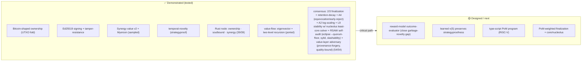

# CONTINUE — Noesis handoff (PRIVATE, stealth)

> **DESIGN CONSTRAINT (Will 2026-06-13):** keep noesis CODE-LEAN, simplicity like Bitcoin. No
> over-the-top developing. Every increment = minimal mechanism that earns its place; prefer
> delete/simplify; pay duplication debt (single-source from noesis-core). Rigor ≠ bloat.

## ▶ RESUME HERE (2026-06-16 (f) — RSAW: derived mint authority closes the self-declared-minter vector; suite 261)
- **HARDENED — adversarial-gaming tick on the (e) token gate.** RSAW found a vector I introduced in (e):
  `TokenTx` carried a producer-asserted `minter` field, and `is_valid` authorized a mint by `minter == args`
  ⇒ anyone mints any token by naming itself the issuer. **8th site of `[P·dont-let-attacker-choose-critical-input]`.**
  FIX: removed the `minter` field; the runtime DERIVES it from issuer control of a consumed authority cell
  (an input of this token whose owner `lock.args` == issuer `args`). Non-issuer ⇒ minter can't match ⇒
  mint rejected; transfers/burns unaffected; empty-issuer guard makes the sentinel sound. +2 regression
  tests (`mint_authority_cannot_be_self_declared`, `issuer_mints_by_spending_its_authority_cell`).
  lib 208→210, suite 259→261, 0 new clippy.
- **HONEST SCOPE:** reference-layer / pre-deploy. `lock.args` stands in for the verified owner; binding it
  to a checked signature (verify the issuer actually signed) is the deploy-coupled lock-sig layer (same
  pattern as index-dep / header-`now` — structure now, crypto-enforcement at deploy). Multi still has no
  mint path (conservation only).
- **NEXT:** the lock-sig layer (bind `lock.args` owner-proxy to a verified signature) closes this site
  cryptographically; OR continue the pure-additive gap list — genesis/chain-spec (#1, also the natural home
  for the FIRST token allocation now that runtime mint needs an issuer authority cell), or the full-tx
  pipeline (#4-next) that makes `token_txs` move state. Will-gated: T1 transport; PoM-distribution audit.

## ▶ RESUME HERE (2026-06-16 (e) — gap #4: token conservation WIRED INTO block validation; suite 259)
- **SHIPPED — gap #4 (block-validation half): token conservation at the block gate.**
  `node/src/runtime.rs`: new `TokenTx` + `TokenStandard{Fungible,Nft,Multi}` carry a value-movement
  (inputs→outputs, issuer `args`, authorizing `minter`) inside a `Block` (new `token_txs` field, empty
  by default ⇒ existing blocks unaffected; `Block::with_token_txs` builder). `TokenTx::is_valid`
  single-sources the `tokens` reference analogs (fungible/nft `mint_or_conserve`, multi `conserves`).
  `Node::validate` gains check (5): a block carrying ANY non-conserving / unauthorized-mint movement
  is REJECTED before finalization — value cannot be forged into a finalized block. PURE-ADDITIVE
  (no core/mechanism change). +2 runtime tests (unauthorized-mint rejected; conserving split
  validates). lib 206→208, full suite 257→259, 0 new clippy (3 runtime.rs hits all pre-existing:
  Constitution doc / state_digest complex-type).
- **HONEST SCOPE — VALIDATION ONLY.** `apply` still does NOT spend inputs / persist outputs into a
  token-state ledger; that's the full-tx pipeline (lock-sig verify + type-script run + token ledger),
  deploy-coupled = the gap #4 NEXT layer. The gate is the half that earns its place today: a
  non-conserving block can't finalize. Multi has no issuer-mint path in the starter analog ⇒ pure
  conservation only (noted in code).
- **GAP LIST status now:** #4 block-validation half ✓ · #7 Byzantine 2-node ✓ (already shipped).
  Remaining pure-additive: genesis/chain-spec (#1), block/cell wire-serialization (#2),
  state-rent/capacity/fee (#3), full-tx pipeline + token-state ledger (#4 next), mempool policy (#5),
  equivocation-in-round-loop (#6), sync/late-joiner (#8), VRF leader (#9), persistence (#10),
  header-clock (#11), confirmation-tier API (#12).
- **IMMEDIATE NEXT BUILD:** continue the pure-additive gap list — genesis/chain-spec (#1) is the next
  natural one for a real 2-node testnet, or the full-tx pipeline (#4-next) that makes `token_txs`
  actually MOVE state. Still Will-gated: T1 transport (FOUNDATIONAL, confirm before build); audit PoM
  validator/identity distribution before shipping finality (PoM=60%=kingmaker).

## ▶ RESUME HERE (2026-06-16 (d) — ERC tokens shipped + research landed + GAP LIST)
- **SHIPPED — T8 ERC token analogs** `node/src/tokens.rs` (9 token cases; suite 247 green): fungible/ERC-20 (sUDT-style,
  conservation + issuer-only mint + burn), nft/ERC-721 (id-set preserved, duplicate=forgery, issuer-only
  new ids), multi/ERC-1155 (per-id independent conservation). T7 baked in: conservation is a PURE function
  of the tx — no oracle, airgap closed. cargo test 247/247.
- **RESEARCH LANDED** (full detail `internal/RESEARCH-NETWORK-CONSENSUS.md`):
  - T1 transport → **rust-libp2p lean** (QUIC + GossipSub v1.2 + custom RFC0012 addr-gossip, skip DHT);
    tentacle #2 (lightest, TCP-only). FOUNDATIONAL ⇒ Will-confirm before build.
  - T2 ML-consensus → role-bounded learned signal VALIDATES our design; safe add = CLAMPED deterministic
    weight multiplier (constitutional clamp), VRF leader-shortlist, anomaly pre-filter. DO-NOT: float on
    consensus path / score gates finality / model-agreement-as-truth.
  - T3 PoW finality-lag → **‼ latent bug**: `finalizes_hybrid` counts reorgeable PoW weight as final.
    FIX (#1): PoW OUT of finality, PoS+PoM gadget on a lagging ordering-prefix, renormalized 2/3-of-set,
    **anti-concentration rule (no single dim ≥2/3 ⇒ PoM-60% can't capture)**, accountable slashing,
    weak-subjectivity. AUDIT PoM distribution before shipping (PoM = finality kingmaker).
  - T9 Ergo sub-blocks → **adopt**: two-tier (sub-blocks fast/revertible, ordering blocks = PoM finality
    checkpoints), gate re-derived from contribution-weight not PoW, compact weak-ID propagation, honest
    soft≠final confirmation-tier API.
  - T10 Constellation → mostly hype; salvage only standing-weighted GossipSub peer-scoring (converges w/ T1).
  - T11 Solana-PoS-vs-value-native → agent still running.
  - **Convergence**: libp2p+GossipSub(standing-scored) · two-tier sub/ordering blocks · PoS+PoM finality
    (PoW out) · learned signal clamped+deterministic. Coherent stack, cross-validated by independent agents.
- **GAP LIST — what's still unnamed but needed for a real 2-node testnet** (Will: "think of anything I missed"):
  1. **Genesis / chain-spec** — shared genesis (initial validator set + standing dist + the constitution cell) so 2 nodes start identical.
  2. **Block/cell wire serialization** — canonical encoding for gossip (commit_order has one; blocks/cells don't).
  3. **State-rent / capacity / fee model** — CKB "1 PoM = 1 byte"; spam bound + native-token issuance (JUL=money / VIBE=gov / CKB-native=state-rent roles).
  4. **Full tx-validation pipeline** — lock-sig verify + type-script run; WIRE T8 token conservation into runtime block validation.
  5. **Mempool policy** — admission / eviction / priority (anti-spam); currently a naive Vec.
  6. **Equivocation detection + slashing in the round loop** — dispute/consensus modules exist but the runtime never calls them.
  7. **Byzantine 2-node test** — faulty proposer + equivocation rejected by honest node (RSAW next, pure-additive).
  8. **Sync / late-joiner** — download + verify finalized prefix (real "2nd node joins").
  9. **VRF leader selection** — fair rotation; runtime currently has a fixed leader.
  10. **Persistence** — ledger is in-memory only.
  11. **Header/clock** — `now` must be header-sourced (T3); runtime uses height.
  12. **Confirmation-tier API** — soft (sub-block) vs final (ordering block), per T9.
- **✅ SHIPPED — T3 finality fix + T11:** `runtime::finality::finalizes_pos_pom` (3 tests, suite 250):
  PoW removed from finality (`FINALITY_MIX={pow:0,pos:1/3,pom:2/3}`), 2/3-of-fast-final-set, +
  anti-concentration `MIN_DIM_BPS` (each of PoS/PoM must independently clear its floor ⇒ PoM-60% cannot
  unilaterally finalize = T11 capital-orthogonality in code). Core `finalizes_hybrid` (235-test) intact.
  T11 verdict recorded: PoS = pure capital-at-risk × time-lock + VRF + Phragmén; intrinsic value stays in
  PoM, NEVER in security weight (Minotaur fungibility + Buterin subjectivity + filter-coincidence).
- **IMMEDIATE NEXT BUILD (continuing):** gap #4 — wire T8 token conservation into the runtime's block
  validation (a finalized block carrying token cells must conserve); then gap #7 — Byzantine 2-node test
  (faulty proposer / equivocation rejected by the honest node). Both pure-additive (no core change).
  THEN Will-gated: T1 transport choice (rust-libp2p vs tentacle — FOUNDATIONAL, confirm before build),
  T5 shard+commit-reveal+pairwise wiring, T9 two-tier sub/ordering blocks, genesis/chain-spec (gap #1).

## ▶ RESUME HERE (2026-06-16 (c) — NODE RUNTIME + 2-NODE CONVERGENCE shipped; 6 design/research threads armed)
- **MILESTONE — first multi-replica run of the state machine.** New `node/src/runtime.rs`
  (orchestration ONLY, ~215 LoC, NO new mechanism): `Constitution` (value-matrix governance frame),
  `Ledger` (cells + novelty-index + PoM + height), `Block` (commit-reveal batch, canonical-ordered via
  `commit_order`), `Node` (submit/propose/validate/apply), `finalizes` (wraps `consensus::finalizes_hybrid`).
  Wires the existing modules into a deterministic block loop. `node/tests/two_node.rs` 3/3 green:
  (1) two replicas hold byte-identical cells+index-root+PoM after EVERY block (deterministic SMR),
  (2) block assembly presentation-independent, (3) non-canonical reorder rejected at the order gate.
  This is the in-process milestone BENEATH any real transport — peer/gossip swaps in above the `Node` API.
- **DESIGN-LOCKED (Will 2026-06-16) — value-dimension matrix = MIXED 3-LAYER, NOT immutable.** physics
  (anchor-in-realized-downstream-flow + noise floor; near-immutable) > constitutional (amendment rules: a
  dimension admitted ONLY if it predicts realized downstream value — verifier-gated; weights bounded,
  no zeroing a real dim, redistribution non-plutocratic) > governance (weights within the bounded set;
  fluid). Boundary = the completeness/weights cleavage from [[value-disputes-are-incompleteness-bias]]
  ("fact-of-matter about completeness, none about final weights"). AugGov on the attribution surface;
  THRONE "mechanism serves, never rules" ⇒ governance proposes, the verifier disposes. Currently the
  `Constitution` STRUCT stub; NEXT = a constitutional CELL whose transitions obey the verifier gate.
- **OPEN THREADS (Will-armed 2026-06-16 full-auto; results → THIS repo only, never public):**
  - **T1 · SOTA peer-discovery transport** — CKB-SHAPE COMMITTED (cell/RISC-V-VM/type-script stays),
    TRANSPORT open. Will: *"better node peer tech might be out there."* Survey tentacle (CKB-native) vs
    rust-libp2p (Kademlia DHT + GossipSub + QUIC) vs discv5 (Ethereum) vs newer 2025-26. FOUNDATIONAL /
    hard-to-reverse ⇒ Will-confirm BEFORE build. [RESEARCH]
  - **T2 · ML-native / "intelligent" consensus** — ML maths to make finalization AI-native. The learned
    outcome `v(S)` already feeds the VALUE gate (Role-C bounded); question = should a learned signal feed
    CONSENSUS (weighting / leader-selection / liveness), and how to keep it role-bounded (can't mint /
    can't forge finality). [RESEARCH + DESIGN]
  - **T3 · PoW finality-lag** — eliminate or account-for PoW probabilistic finality vs PoS/PoM fast
    finality in the NCI 10/30/60 mix. Core question: does PoW GATE finality at all, or only liveness /
    ordering / sybil-cost? `finalizes_hybrid` counts all three dims at once today. [RESEARCH + DESIGN]
  - **T4 · value-matrix governance** — ✅ ANSWERED (mixed 3-layer above); code stub in `Constitution`.
  - **T5 · shard + commit-reveal + pairwise-comparison architecture** (from VibeSwap/JARVIS) MUST fit:
    `shard_of(cell, n) = id % n` exists; VibeSwap commit-reveal batch = the `Block` shape (have it);
    PsiNet CRPC two-round commit-reveal PAIRWISE comparison = the `outcome` module's Bradley-Terry
    surface (`pairwise_accuracy`). DESIGN: how per-shard commit-reveal batches + cross-shard pairwise
    verification compose with the single-chain runtime (shard = independent cell partition; pairwise =
    the verification/dispute layer). [DESIGN]
  - **T6 · 2-node runtime** — ✅ DONE (this block).
- ─ prior resume block (history) ─

## ▶ RESUME HERE (2026-06-16 — per-certifier asymmetric clamp BUILT; lib 194 / full 235 green)
- **DECIDED (cf31d23) → BUILT.** `resolve_refuted_guarded` no longer gates the whole settlement
  on one `defendant_id`; it judges EACH certifier on its OWN standing. New param
  `certifier_keys: &[(u64, Vec<u8>)]` (the same key↔id join idiom as `juror_keys`/
  `conflicted_juror_ids` — no new channel) replaces `defendant_id`. Per certifier: look up its
  validator id, run `appeal_refutes_guarded(...,that_id,...)`; drop the slash iff that
  certifier's OWN PoM is load-bearing to the full-mix non-conviction (one-way ratchet acquits
  it), keep it otherwise. `bounded_shares` computed over the FULL certifier set so a spared
  certifier never inflates another's bounded slash (totals stay exact). Cancel-iff-≥1-convicted
  preserves the single-defendant acquittal (empty settlement, target not canceled).
  REDUCTION proven: one certifier ≡ old whole-settlement guard (the two prior call sites
  translate via `[(1,[1])]` grief / `[(7,[1])]` cartel-break and stay green). New mixed-panel
  coverage (honest [1]↔id1 dropped, garbage [7]↔id7 kept, totals exact; standing derived not
  asserted). dispute 25/25, lib 194, full 235, 0 new clippy. README+coherence stamped.
- **NEXT RSAW target (each fix reveals the next):** `certifier_keys` is the gate's new critical
  input — it MUST be consensus/standing-sourced, never producer-asserted (the same
  dont-let-attacker-choose-a-critical-input class as header-`now` / reveal-coords / the
  index-binding identity). An unmapped key currently defaults to UNPROTECTED (id u64::MAX,
  conservative) which is safe, but a forged key↔id join that maps a garbage certifier onto an
  honest holder's id would steal the clamp. Bind the join to the on-VM standing set + add the
  binding test. STILL DECLINED (YAGNI): the `RECUSED_DIM` abstraction (one appeal court exists).
- ─ prior resume block (history) ─

## ▶ RESUME HERE (2026-06-15 — asymmetric-appeal guard WIRED END-TO-END; +2 tests, lib 194)
- **DECIDED → WIRED.** Will-armed 2-increment loop in a fresh context closed BOTH halves of the
  prior NEXT target. (1) `dispute::defendant_holds_downweighted_dim` — the guard's flag is now
  DERIVED by a counterfactual on the defendant's OWN PoM (`!full_mix_convicts(panel) &&
  full_mix_convicts(panel minus the defendant's own PoM)`); `appeal_refutes_guarded` exposes no
  bool channel ⇒ an attacker cannot assert past the clamp (the dont-let-the-attacker-choose-a-
  critical-input class, like header-`now`/coords). (2) `dispute::resolve_refuted_guarded` gates
  the slash on the guarded verdict ⇒ the clamp is end-to-end at the slash level, invariant
  `total_slash(guarded) ≤ total_slash(pre_appeal)` proven non-vacuously (real unvested entry +
  non-empty certifier share) and the cartel-break preserved at settlement. Tests:
  `guard_flag_is_derived_from_standing_not_producer_asserted`,
  `guarded_settlement_cannot_exceed_pre_appeal_slash`. Full lib suite 194 green, 0 new clippy.
  Committed: increment 1 `54b426e`; increment 2 this tick.
- **NEXT RSAW target — per-certifier asymmetric clamp — now DECIDED (2026-06-16), build deferred
  to fresh context (PCP-gate):** the gate is WHOLE-SETTLEMENT (one `defendant_id`) but
  `resolve_refuted` slashes PER-CERTIFIER, so a mixed panel (one honest-PoM certifier + one
  garbage certifier on the same target) is all-or-nothing. DECISION: `resolve_refuted_guarded`
  gains `certifier_keys: &[(u64, Vec<u8>)]` (the SAME key↔id join idiom as
  `juror_keys`/`conflicted_juror_ids` — no new channel) and gates PER SHARE: for each
  `(key, share)`, look up the validator id and run `defendant_holds_downweighted_dim(…, that_id,
  …)`; drop that certifier's slash iff their own PoM is load-bearing to the full-mix
  non-conviction, keep it otherwise. Build steps: (1) per-share gate; (2) mixed-panel test
  (honest dropped, garbage kept, totals exact); (3) single-defendant tests stay green
  (whole-settlement = per-share with one certifier). EXPLICITLY DECLINED (PONYTAIL/YAGNI): do NOT
  abstract the recused-dimension constant — one appeal court exists; the `RECUSED_DIM` indirection
  is premature until a PoW/PoS-minimized court is added. Re-evaluate then.
- ─ prior resume block (history) ─

## ▶ RESUME HERE (2026-06-15 — asymmetric-appeal guard: PoW/PoS appeal-grief CLOSED; node 232→233)
- **DECIDED→DEMONSTRATED.** Built `dispute::appeal_refutes_asymmetric` (§7.1c-guard): the
  PoM-minimized appeal court may only MONOTONE-DECREASE a down-weighted-dimension DEFENDANT's
  conviction (`pre_appeal && appeal`), a one-way ratchet toward acquittal. Closes the inverse of
  the §7.1c cartel-break — a PoW/PoS majority (0.90 of the appeal court) over-convicting an honest
  PoM defendant. Keys on the DEFENDANT's standing (not the jury's) ⇒ cartel-break untouched (PoM
  cartel sit as jurors). Test `honest_pom_defendant_vs_powpos_majority_appeal_cannot_increase_slash`
  proves grief real (full-mix acquits, ungated appeal convicts) then clamped. `cargo test` 233/233.
  Committed + pushed `fd407cf`.
- **NEXT RSAW target (each fix reveals the next):** the guard is a verdict-level boolean clamp. Open
  for the next tick — wire it into the live settlement path (`resolve_refuted` off the guarded
  verdict) and prove the slash-level invariant `appeal_slash ≤ pre_appeal_slash` end-to-end; AND
  bind the `defendant_holds_downweighted_dim` flag to consensus-derived defendant standing, never
  producer-asserted (the dont-let-attacker-choose-critical-input class applied to the guard's own
  input). Build: wire + a binding test.
- ─ prior resume block (history) ─

## ▶ (2026-06-15 — value_v8: the learned outcome v(S) WIRED INTO the value gate; node 227→232)
- **THE MOAT SEAM CLOSED IN CODE.** `value_v8` composes the learned outcome `v(S)` (`outcome`
  module) INTO the v5→v7 realized-flow-gate SEED — the structural change v7 itself NAMED as the
  fix for its residual `structured_valueless_child_still_seeds_flow_open_gap` ("genuinely needs
  labels/flow, not bytes"). Until now `outcome::v_outcome` existed + was moat-measured but its
  authority was bounded to the EVALUATOR (advance/evidence) only; it was NOT in the value gate.
  Now it is: `seed_i = v7_seed_i × v_outcome_floored(w, lineage_coalition(i)) ∈ [0,1]`.
- **Mechanism (all reused, lean):** the outcome factor scores the cell's own
  provenance-lineage coalition (new `value::lineage_coalition` walker — cell + parent-chain), i.e.
  the connectedness/depth/synergy STRUCTURE the per-cell flow gate is structurally blind to. It is
  `v_outcome_floored` (entropy floor single-sourced from the intake floor at `theta_q16`), so a fake
  lineage of NOISE seeds 0 here too. AND-composed: multiplied into the seed ⇒ can only LOWER.
- **AUTHORITY BOUNDARY PROVEN (Role C, the load-bearing property):** corrupt model scoring 1.0
  everywhere ⇒ v8 ≡ v7 EXACTLY (`value_v8_corrupt_outcome_model_cannot_mint_above_v7`). The learned
  `v(S)` gains the power to DENY valueless certification and NO MORE — never to mint. This is why a
  corrupt outcome model is harmless by construction; v8 inherits the evaluator's bound at the gate.
- **+5 tests, node 227→232, full suite green (191 lib + 41 integration), 0 regressions, 0 new clippy
  warnings (24 pre-existing, all outside the new lines).** Tests: dampens-the-residual,
  pays-a-genuinely-useful-lineage, fake-lineage-of-noise-seeds-nothing, corrupt-model-cannot-mint,
  backstop-own-value-survives.
- **HONEST SCOPE (build-don't-claim, verified by probe not asserted):** with only SYNTHETIC
  structural labels a valueless child ATTACHED TO A REAL ROOT inherits genuine lineage ⇒ the gate
  DAMPENS its seed (~0.42×, v8[0]=14.58 vs v7[0]=18.12) rather than zeroing it. The
  fake-lineage-of-NOISE subclass IS fully zeroed (entropy floor). FULL closure of
  structured-but-valueless still rides the SAME pending **real DeepFunding-distill-over-sets label
  pull** — but the seam is now wired end-to-end (`load_prefs`→`train`→`v_outcome_floored`→seed) and
  runs UNCHANGED when real labels land; a label pricing the lineage ~0 drives g→0 ⇒ seed→0.
- **NEXT 🟡:** the real-outcome label pull (THE moat data — now the ONLY missing input for both the
  held-out harness AND the v8 gate; everything code-side is wired); then v8 → on-VM (the outcome
  model is f64, needs the fixed-point/no_std treatment value_fixed got before it can run in the
  type-script); finalization/ordering coord+registry binding (deploy-coupled); lean backlog
  (single-source the other cores, split the 6k-line lib.rs).
- ‼ STALE-FIX: prior top block claimed HEAD `ec36f18`/node 221; sessions continued past it (dispute
  7.1b/7.1c + outcome load_prefs ⇒ HEAD was `d86ab5e`/node 227 before this block). True-up done here.

## ▶ RESUME HERE (2026-06-13 late — 5-increment session: ordering port + RSAW + moat + spoof-closure; node 212→221, pushed `ec36f18`)
- **+ pom-roadmap tick** (`ec36f18`): `outcome::v_outcome_floored` AND-composes the entropy floor
  into the learned `v(S)` (single-sourced with the intake floor) ⇒ the fake-lineage NOISE spoof
  scores **0** at the score (not just contained below); real work keeps its value. node 220→221.
  Test `semantic_floor_closes_the_fake_lineage_spoof_at_the_score`. ROADMAP Phase-1 marks updated.
- **Item 2 — on-VM ORDERING PORT shipped** (`36d1bfc`): `onchain/commit-order-typescript` ELF runs
  `is_canonical_order` on-VM (0 canonical / 40 non-canonical / 41 malformed). `noesis_core::commit_order`
  gained parse_batch/encode_batch (single-source). 6 e2e tests. Coord provenance (height←header,
  secret←reveals) is `COORDS_BOUND=false` inert pre-deploy (the deploy-coupled pin).
- **Item 4 — RSAW found + fixed a REAL break** (`291d30a`): finalization accepted DUPLICATE vote
  indices ⇒ `[0,0,0]` double-counted validator 0's weight and forged finalization from one voter.
  `parse_votes` now rejects duplicates; test `duplicate_vote_indices_cannot_inflate_weight`. Also
  pinned: the finalize PARAMS (threshold/floor/horizon/mix) are as attacker-chosen as `all` ⇒ the
  registry binding must cover the WHOLE finalization cell (inert pre-deploy).
- **Item 8 — THE MOAT measured** (`8fa8fca`): held-out generalization harness in `outcome` —
  `proxy_value` (coverage-only baseline) + `pairwise_accuracy` + test
  `learned_v_s_beats_coverage_proxy_on_held_out_coalitions`. Trained on 10 templates, tested on 6
  UNSEEN: learned `v(S)` ≥ 0.9, coverage proxy blind to lineage ties at 0.5. The un-gameable-`v(S)`
  gate measured not asserted. **Remaining mile = the real-outcome label pull (DeepFunding
  distill-over-sets); the harness runs unchanged when those labels land.** That is now the ONLY
  missing input for Phase-1 close, not the measurement.
- **Item 3 — GitHub/CI verified** (no commit): CI yaml valid (test + 3-crate riscv matrix, green by
  design), README mermaid renders, root clean. ‼ FLAG: `internal/` (front-run-sensitive RELEASE-PLAN
  + manifesto + this file) is committed — must be `.gitignore`d / stripped at PUBLIC-release time.
- **Item 5 — sync HARDENED** (JARVIS substrate, not noesis): `sync-public-substrate.py` now
  AUTO-DELETES stale public copies of skip-listed / newly-scrubbed files. On first run it removed **4
  real stale leaks** (clean copies of files that had since gained Pragma/nda-locked/jarvis-private
  refs). Public substrate verified clean, pushed `3281d1a`.
- **NEXT 🟡:** the real-outcome label pull (moat data); finalization/ordering coord+registry binding
  (deploy-coupled, when block plumbing lands); header-recency binding; lean backlog (single-source the
  other cores, split 6k-line lib.rs). Toolchain: each on-VM crate builds standalone w/ `make elf`.

## ▶ RESUME HERE (2026-06-13 night — REPO REORG: real-blockchain layout, kept lean; pushed `61c4155`)
- **⚠ PATHS MOVED.** This file is now `internal/CONTINUE.md` (boot hook updated). The 27 root
  `.md` were restructured to make noesis read as a chain, not an essay folder. Benchmarked vs the
  live bitcoin / go-ethereum / nervos-ckb / solana roots and matched their credibility signature.
- **New tree:** `docs/` = 17 protocol specs (WHITEPAPER, POM-CONSENSUS, ON-VM-FINALIZATION, ...).
  `research/` = 9 prototype `.py`. `internal/` = JARVIS continuity + manifesto (THRONE,
  WHITEPAPER-FOR-DAD, HANDOFF, this file) + the front-run-sensitive RELEASE-PLAN. Root = README +
  ROADMAP + STUDY-GUIDE + CONTRIBUTING + SECURITY + LICENSE + Cargo.toml/Makefile/rustfmt/clippy/
  .editorconfig. **27 root .md → 5.**
- **Root Cargo workspace** (`node` + `onchain/noesis-core`); the RISC-V type-scripts stay
  STANDALONE (own nightly + riscv target), `exclude`d from the workspace — build them with
  `make elf` or `cd onchain/<crate> && cargo build --release --target riscv64imac-unknown-none-elf`.
- **Added (minimal real-OSS set, NOT more):** LICENSE (proprietary/pre-release — Will chose
  no-OSS-license-yet during stealth), SECURITY.md, CONTRIBUTING.md, Makefile, rustfmt.toml,
  clippy.toml, .editorconfig, `.github/workflows/ci.yml` (host suite + RISC-V build = green checks),
  rewritten protocol README. **Dropped CODE_OF_CONDUCT + CHANGELOG as ceremony** (Bitcoin-lean, per
  Will 2026-06-13 "LEAN not vibe-coded extra everything").
- **Ref patches done same pass:** `scripts/study-guide.py` + `scripts/doc-coherence.py` now scan
  `docs/`; doc-coherence COHERENCE-LAWS path → `docs/`; `~/.claude/BOOT-MESSAGE.md` → `internal/
  CONTINUE.md`; `node/README.md` link → `docs/`. Gate green, study-guide regen, **212 tests intact**.
- **Standard now in force** ([F·noesis-is-the-ultimate-blockchain], Will 2026-06-13): noesis ≡ "the
  ultimate blockchain" ⇒ treat-as-such in execution (top-tier-chain rigor, code ∧ presentation).
- **NEXT:** unchanged frontier below — (b) on-VM ordering port (`commit_order` ELF) is the next
  deploy-independent build; then lean backlog (single-source 4 cores, split 6k-line lib.rs); the
  learned-`v(S)`-on-real-labels mile is still THE moat.

## ▶ RESUME HERE (2026-06-13 night — finalization ON-VM PROGRAM shipped, Phase-3 step-2; node 203→212)
- **Build-order step 2 of `ON-VM-FINALIZATION.md` DONE — the consensus finalize rule now runs
  INSIDE the VM.** New crate `onchain/finalization-typescript` (riscv64imac ELF, 153KB, first-try
  compile): reads the validator set + params from the finalization cell (GroupInput), the vote
  index list from `witness[i]`, recomputes `finalizes_fixed` in Q32.32, exits 0/30/31/32/33/34.
- **`now` is HEADER-sourced, not tx-chosen — the 5th attacker-input site closed on-VM.** The ELF
  reads `now` from `load_header(HeaderDep 0)` (the u64 `RawHeader.timestamp` at byte offset 8);
  there is NO witness/arg channel for it. Headline test `now_is_header_sourced_not_tx_chosen`: the
  SAME cell + SAME unanimous votes flips finalized→rejected (exit 0→30) purely by changing the
  header timestamp, driven by the un-decayed quorum floor — an attacker who wants finalization
  can't inject a favorable `now`. (CKB header-deps are real chain headers, unforgeable by the tx
  assembler.) Same lesson as index-dep F1 + temporal-order coords.
- **LEAN (paid the debt at birth):** the Q32.32 finalize arithmetic + the cell/vote wire format are
  single-sourced in `noesis_core::finalization`; the node lib now `pub use`s them (the old in-lib
  copy deleted) and the ELF links the SAME functions. ONE implementation, unlike the 4 legacy
  flat-vs-modular cores still owed. Drift-guard (`finalizes_fixed ≡ finalizes_hybrid`) intact.
- **9 new tests, node 203→212, full suite green, zero regressions, warning-clean.** Harness gained
  `SYS_LOAD_HEADER` + `header_with_timestamp`. Coverage: finalizes / below-threshold / header-flip /
  missing-header-33 / quorum-floor-vs-reference sweep (on-VM ≡ reference at every now) / malformed
  cell-31 / malformed votes-32 / empty-group / second-cell-smuggle (whole-group iteration).
- **STILL PENDING (honest, deploy-coupled):** the **curated-validator-set-rejected** path —
  `REGISTRY_BINDING_ACTIVE = false` (inert pre-deploy), the registry type-id binding lands when the
  validator-registry cell deploys (the 6th attacker-input site, same shape as index-dep F1/F2/F3).
  Plus header-recency binding (assert the header-dep is the tip via `since`) — timestamp is
  consensus-bound today, but staleness of the chosen header isn't yet pinned.
- **NEXT 🟡 (deploy-independent first):** (b) the on-VM ordering port (`commit_order` ELF, header-
  height + reveal-XOR sourced — now has a header-serving harness to build on); (c) lean backlog
  (single-source the other 4 cores + split the 6k-line lib.rs); (d) multi-proof compression. The
  learned-`v(S)`-on-real-labels mile (Phase-1 close) is still THE moat.

## ▶ RESUME HERE (2026-06-13 evening — full-auto loop: PM-17 closed both layers + Phase-3 step-1; node 203/203)
- **6-iteration full-auto run, all pushed to WGlynn/noesis (HEAD `488862c`):**
  1. `index_binding` reference model **F2-complete** — dep identity grew `hash_type`
     (`HashType{Data,Type,Data1}` + `DepScript` triple); forged dep reusing code_hash+type-id under
     a different Data/Type/Data1 rejected (`bound_wrong_hash_type_rejects`). 196→197.
  2. **on-VM mirror** — `onchain/pom-typescript/src/main.rs` `index_dep_bound` now compares
     `r.hash_type().as_slice()[0]` vs `EXPECTED_INDEX_HASH_TYPE` (=1 Type; ckb-gen-types 0.119, API
     verified not guessed) AND the overloaded `[0;32]` sentinel → explicit `const BINDING_ACTIVE: bool`
     (QA-port-2). ELF rebuilt riscv64imac, 22 on-VM fixtures green (binding still inert).
  3. `COMPETITIVE-POSITION.md` (Will Q: stance vs blockchain ecosystem — idea-axis ahead/uncontested,
     deploy-axis at-zero/pre-launch; gated on learned v(S) + real labels = the moat).
  4. lean: dropped unused `CoreMachine` import (`tests/common/mod.rs`), warning-clean.
  5. **`finalization_fixed`** (Phase 3 step 1, `ON-VM-FINALIZATION.md`) — `consensus::finalizes_hybrid`
     in pure Q32.32: `retention_q`/`effective_weight_q`/`base_weight_q` + max(eff,floor) basis + 2/3
     threshold, threshold+floor ceil'd (`bps_of_ceil`) ⇒ rounds AGAINST finalization. Drift-guarded
     vs f64 over a liveness×decay×subset sweep: agreement off-boundary + conservative direction
     `!(fixed && !float)` everywhere + exact-2/3 tie stays un-finalized. 3rd/last on-VM arithmetic
     surface after value_fixed + settlement_fixed. 197→202.
  6. RSAW edge tick on (5): horizon=0 / 100% threshold / zero-weight padding / empty voters / all-zero
     basis — conservative direction holds at every corner, NO break, edges pinned. 202→203.
- **PM-17 STATUS:** reference + on-VM both F1/F2/F3 + QA-port-1/2 closed; the ONLY remaining piece is
  the **activated-path fixture** (real deployed script-hash ⇒ exit-23 under live mismatch) — deploy-coupled.
- **NEXT 🟡 candidates (deploy-independent first):** (a) finalization on-VM PROGRAM (build-order step 2:
  read validator-set + votes + header-`now`; recompute `finalizes_fixed`; exit codes — but `now`/`all`
  must be header/registry-sourced not tx-chosen, the 5th/6th attacker-input sites); (b) the on-VM ordering
  port (`commit_order` ELF, header-height + reveal-XOR sourced); (c) lean backlog: single-source the other
  4 cores (smt/proven/value_fixed/semantic — needs core reorg) + split the 6k-line lib.rs per-module;
  (d) multi-proof compression. The learned-`v(S)`-on-real-labels mile (Phase 1 close) is still THE moat.
- **Cross-substrate note (Will, Odysseus #4121):** today's QA-port-2 (overloaded sentinel → explicit
  `BINDING_ACTIVE`) and F2 (data-shape → full identity) are the SAME anti-pattern as that issue's fix
  (presence-check → explicit `budget_is_explicit()` predicate). "Never overload an implicit signal to
  carry intent." Convergence-across-substrates = the abstraction is real (cf. OKF-convergence).

## ▶ RESUME HERE (2026-06-13 — LEAN: single-sourced commit_order + LOC audit; node 196/196)
- **Lean-audit recon (story pick 5):** total **7,577 Rust LOC**, but `node/src/lib.rs` = **6,099**
  (80%, 23 modules in one file — the auditability target). ~40/60 code/test (healthy). Heaviest:
  value 850, dispute 646, consensus 494. ~460 lines duplicated node↔noesis-core (smt/proven/
  value_fixed/semantic/commit_order) = the single-source debt. `adversary` = 325 code, no tests.
- **Lean increment (story pick 6, iter 1): PAID the commit_order debt.** node lib now
  `pub use noesis_core::commit_order::{...}` — ~90 duplicate lines deleted from the monolith, the
  tautological drift test removed (197→196 = the deletion, not a regression). noesis-core moved
  node-side from dev-dep → dep (the lib links it). ONE implementation. Bitcoin-lean.
- **LEAN BACKLOG (next, low-risk-first):** (a) single-source the other 4 cores (smt/proven/
  value_fixed/semantic) the same way — but they're FLAT in core vs MODULAR in node, so it needs
  core reorg first (bigger, careful pass); (b) split the 6k-line lib.rs into per-module files
  (mechanical, big auditability win); (c) review `adversary` (325 lines) for over-construction;
  (d) fix the pre-existing `CoreMachine` unused-import warning in ckb_vm tests.
- Design constraint stays in force: [[noesis-lean-like-bitcoin]] — minimal mechanism, earn-its-place.

## ▶ RESUME HERE (2026-06-13 — on-VM ordering port, portable half; node 197/197)
- **`noesis-core::commit_order` SHIPPED** (no_std port of `node::commit_order`): block_shuffle /
  canonical_order / is_canonical_order now compile into the on-VM crate, BUILD for
  `riscv64imac-unknown-none-elf`, and are drift-guarded ≡ the node lib (`core_drift_guard.rs`
  `commit_order_agrees`). This is the consensus permutation the index-cell type-script will verify
  on-VM. 196→197.
- **STILL PENDING (deploy-coupled):** wire `onchain/pom-typescript/src/main.rs` to SOURCE the coords
  — height from the commitment's block header, secret from the block's reveals — and assert
  `is_canonical_order`, exit on non-canonical, sentinel-gated inert pre-deploy (the index-dep
  binding pattern). The today's 7th-site pin gives the crisp contract: reject any coord the ELF
  can't re-derive from consensus.
- **LEAN DEBT (pay next):** node::commit_order + noesis-core::commit_order are two copies (drift-
  guarded). Per the lean constraint, node should RE-EXPORT from noesis-core (single source). Same
  TODO as the other cores. Do this in a lean-audit pass.

## ▶ RESUME HERE (2026-06-13 — pom-roadmap-advance: 7th attacker-input site pinned; node 196/196)
- **Adversarial-gaming increment (cron tick):** the ordered index rule
  (`valid_ordered_root_transition`) dissolves producer REORDERING but still trusts its
  `CellBatch` coords (height, secret) AS CLAIMED. New test
  `ordered_rule_trusts_coords_so_they_must_be_consensus_sourced`: a redundant cell that LIES about
  its commit height (claims an earlier one) sorts first and BANKS the contested novelty, and the
  batch still validates (is_canonical_order only checks internal canonicity, not truth). ⇒ 7th site
  of `[P·dont-let-attacker-choose-critical-input]`: the coords themselves must be consensus-sourced
  on-VM (header height + revealed secret), never producer-asserted. node 195→196.
- The invariant now spans 7 sites: code_hash / now-finalization / temporal-order / index-dep /
  finalization-now / validator-set / ordered-rule-coords. All negative-tested reference-side; all
  closed on-VM at GATE 2 of `RELEASE-PLAN-VIBESWAP-ON-NOESIS.md` (header/consensus-sourcing).
- **NEXT:** on-VM ordering port now has a CRISP contract — the ELF must source height from the
  commitment's header and the XOR seed from the block reveals, and reject any coord it can't
  re-derive from consensus. Build candidates unchanged: (a) on-VM ordering port; (c) finalization
  mirror; (d) multi-proof compression.

## ▶ RESUME HERE (2026-06-13 — RSAW "attack it / make it nuclear-proof" pass; node 195/195)
- **Will: "audit and attack noesis, make it nuclear proof — or prove it already is."** 3 hostile
  adversaries (value / consensus / ordering+on-VM) swept the whole stack. VERDICT:
  - **Value layer = un-gameable BY CONSTRUCTION.** Sybil rings (v6 standing earned+soulbound),
    encoding-evasion (byte-blind v6 + content-agnostic dispute ⇒ negative-EV), corrupt-evaluator
    (authority bounded to timing, floors dominate), flow-DAG (damped d<1, external-only seeds),
    Q16.16/Q32.32 (saturating, tested to u128 headroom), all 6 composition seams — every one
    resisted with a STRUCTURAL reason, not a patch. No new break.
  - **Core ordering + SMT + crypto = CLEAN.** Shuffle slot co-determined (un-grindable), forged
    paths rejected (blake2b + domain-sep + path-dependent fold), today's ordered-transition holds.
  - **Every "REAL BREAK" found = ONE class: attacker-choosable input that must be consensus-bound
    on-VM.** index-dep hash_type + sentinel-overload = already pinned (QA-port-1/2), inert
    pre-deploy. The NEW residue: `now` and the validator-set `all` in `finalizes_hybrid` were
    outcome-determining but UNPINNED (no negative test), unlike temporal-order/index-dep.
- **HARDENED (this pass): pinned them.** 2 new consensus tests —
  `now_is_outcome_determining_so_must_be_header_sourced`,
  `validator_set_is_outcome_determining_so_must_be_consensus_bound` — demonstrate the verdict moves
  with each input and document the on-VM binding requirement. 5th/6th sites of
  `[P·dont-let-attacker-choose-critical-input]`. node 193→195.
- **Bottom line for Will: it is essentially nuclear-proof on every LIVE/reference surface; all real
  residue is the attacker-input class, now fully pinned + tested, and closed on-VM at GATE 2 of the
  release plan (header/consensus-sourcing — design-acknowledged, deploy-coupled).**

## ▶ RESUME HERE (2026-06-13 — commit-order WIRED INTO the index rule; node 193/193)
- **NEXT-BUILD (b) SHIPPED:** `index_rule::valid_ordered_root_transition` + `CellBatch` — the
  consensus commit-order is now wired INTO the index-cell transition rule at per-cell-batch
  granularity. `valid_root_transition` proved the root moved but TRUSTED the producer's step
  order, which is exactly what decides first-commit-wins when two same-height cells contend for
  shared novel coverage. The new rule gates on `commit_order::is_canonical_order` FIRST (height
  ascending, then XOR-seeded in-block slot — neither producer-arrangeable), then checks the
  flattened rolling-root transition; a producer-favorable reorder is REJECTED at the order gate
  before any root math (no silent re-sort ⇒ no probe signal). **2 new tests, node 191→193**:
  `ordered_batch_validates_in_canonical_order`, `producer_favorable_reorder_is_rejected_at_the_order_gate`
  (the second computes the canonical slot order, accepts that batch, then rejects its reversal —
  robust to whichever secret wins the shuffle). This is the index-rule half of the temporal-order
  fix; `commit_order` made order consensus-sourced, this makes the index cell REFUSE any other order.
- **STILL PENDING (honest):** the on-VM ELF port of the ordered rule (header-sourced height +
  reveal-sourced XOR seed + canonical-order exit code in the index-cell type-script), sentinel-
  gated inert pre-deploy exactly like the index-dep binding and the finalization mirror. Deploy-
  coupled (needs commit-reveal block plumbing live). Spec: `TEMPORAL-ORDER-ONCHAIN.md` §"On-VM".
- **NEW (Will 2026-06-13): the convergence is SEALED** — `RELEASE-PLAN-VIBESWAP-ON-NOESIS.md` is
  the master sequencing doc: the public VibeSwap protocol releases ON this chain as its deploy
  substrate, gated behind both the noesis Phase-1→3 roadmap AND a four-surface VibeSwap critique
  backlog (contracts / frontend-journey / wallet-security / accessibility — findings captured this
  session). FRONT-RUN-SENSITIVE: the convergence stays private until matured. Read it next.
- **NEXT BUILD candidates:** (a) the on-VM ordering port above; (b)✅ DONE; (c) the finalization
  mirror (`ON-VM-FINALIZATION.md`), same `now`-from-header invariant; (d) multi-proof compression.
- 4th site of `[P·dont-let-attacker-choose-critical-input]`: code_hash / now / temporal-order.

## ▶ RESUME HERE (2026-06-13 — temporal-order fix SHIPPED reference-side; node 191/191)
- **The temporal-order attacker-input finding is now FIXED at the reference layer** (`TEMPORAL-ORDER-ONCHAIN.md`).
  The audit relocated the invariant to the order-source; this builds the consensus-sourced order that
  dissolves producer-favorable ordering at two scales:
  - INTER-block = commit-reveal block HEIGHT (a later height can't precede an earlier one).
  - INTRA-block ties = Fisher-Yates seeded by the XOR of EVERY revealed secret (VibeSwap
    `DeterministicShuffle`): a participant commits before reveals, slot depends on all secrets, so no
    one can choose their slot. Dissolution, not detection.
- **SHIPPED** in `node/src/lib.rs`: `pub mod commit_order` (`block_shuffle` presentation-independent,
  `canonical_order`, `is_canonical_order`) + `novelty_in_commit_order` value-layer wrapper. **5 new
  tests, node 191/191** (was 186). Headline tests: redundant-block-presented-first STILL earns 0
  (`cross_block_height_dominates_presentation`); the slot is co-determined not self-selectable
  (`intra_block_slot_is_not_self_selectable`).
- **STILL PENDING (honest):** the on-VM ELF port (header-sourced height + reveal-sourced XOR seed +
  canonical-order exit code in the index-cell type-script), sentinel-gated inert pre-deploy exactly
  like the index-dep activated path and the finalization mirror. Deploy-coupled (needs commit-reveal
  block plumbing live). Spec in `TEMPORAL-ORDER-ONCHAIN.md` §"On-VM enforcement".
- **NEXT BUILD candidates:** (a) the on-VM ordering port above; (b) wire the canonical-order assertion
  into `index_rule::valid_root_transition` at per-cell-batch granularity; (c) the finalization mirror
  (`ON-VM-FINALIZATION.md`), same `now`-from-header invariant; (d) multi-proof compression.
- This is the 4th site of `[P·dont-let-attacker-choose-critical-input]`: code_hash / now / temporal-order.

## ▶ RESUME HERE (2026-06-13 — defensive audit via the attacker-input invariant; node 186/186)
- **New invariant captured** (public memory): `[P·dont-let-attacker-choose-critical-input]` — source
  security-critical inputs where the attacker can't choose them; a free/tx-chosen value is
  self-assertion, not a check; the recursive trap is that even the EXPECTED value must be
  attacker-unreachable. 3 cross-layer sites named (ordering/identity/time).
- **Defensive audit shipped** (`SECURITY-AUDIT-attacker-choosable-inputs.md`): swept the invariant
  across noesis input surfaces. 5 clean/addressed (content/index/proofs/identity/dispute), `now` =
  designed-pending (header-sourced, `ON-VM-FINALIZATION.md`), and ONE candidate VERIFIED against code:
- **Temporal-order finding (verified, node 186/186):** `temporal_novelty` orders by SLICE POSITION and
  never reads `Cell.timestamp` ⇒ the timestamp-backdating attack is MOOT. The real, narrower
  requirement: the ON-CHAIN path must source slice order from CONSENSUS commit-block height (not a
  producer-arrangeable list). Pinned by `temporal_order_is_consensus_critical_and_timestamp_is_not_the_lever`
  (redundant block earns novelty only when ordered first; backdated ts changes nothing).
  **NEXT BUILD (fresh session):** on-chain temporal path that fixes order to commit-height + a fixture
  that rejects producer-favorable ordering. Same invariant as index-dep binding (F1) and finalization now.
- Earlier this session: index-dep binding ON-VM PORTED (`e942f5c`; F1/F2/F3, exit 23, 19 ckb-vm tests
  green, sentinel-unset = inactive pre-deploy) + port qa (hash_type/sentinel gaps for the activated build).

## ▶ RESUME HERE (2026-06-12 PM-17 — tick on full T7: DOUBLE-MINT found+fixed, node 176/176; loop2 2/3)
- **Adversarial tick on the complete T7 stack found a REAL break and closed it same
  iteration: INTRA-TX DOUBLE-MINT.** Two identical novel outputs in one tx each proved
  against the same dep root ⇒ same novelty minted twice (probe confirmed exit 0 against
  the pre-fix ELF). Fix: the program carries a sorted claimed-novel set across outputs —
  a later output's already-claimed shingles classify as OVERLAP (intra-tx first-commit-
  wins, the same rule per-block batching applies across txs), so the similarity floor
  kills twins and near-twins. Regressions: twin ⇒ 22, distinct novels both mint ⇒ 0,
  near-twin recycling ⇒ 22.
- Build note (recipe pin re-confirmed the hard way): ckb_std entry!/default_alloc!
  already declares `extern crate alloc` — declaring it again is E0259. Also caught: `cargo
  ... | tail` masks build failure ⇒ a && chain copied a STALE ELF once; recopied after a
  verified build. Worth a build-script hardening later.
- **Production binding — ON-VM PORTED 2026-06-13** (`INDEX-DEP-CODEHASH-BINDING.md`): the
  binding logic now COMPILES INTO THE ELF and runs on ckb-vm. `main.rs` has `index_dep_bound(0)`
  (compile-time `EXPECTED_INDEX_CODE_HASH` + `EXPECTED_INDEX_TYPE_ID`, F1/F2/F3) gating the
  cell-dep-0 root load, new exit `23`. SENTINEL all-zero const = unset = legacy shape path,
  so the binding is INACTIVE pre-deploy and all 19 ckb-vm integration tests stay green
  (regression-verified, ELF rebuilt + recopied to `node/tests/fixtures/pom-typescript`).
  Host-side reference model `index_binding` (6 node tests) covers bound/mismatch/F3.
  **STILL PENDING (honest):** the ACTIVATED on-VM path (exit-23-fires) is NOT yet tested
  on-VM — it needs a build with the const set to a fixture value + a cell-dep with a
  mismatched type-script. That value is deploy-coupled (= the index type-script's real
  script-hash), so the activated-path fixture lands when the index cell deploys. Demonstrated:
  logic on-VM + zero regression. Not demonstrated: exit-23 firing on-VM under a live mismatch.
- **(superseded — design history)** Spec + adversarial critical-qa (qa flipped the design): expected index
  identity must be a **compile-time / consensus-pinned script-hash constant** in the
  binary, NOT a consumer `args` field (F1: attacker-chosen args = self-assertion, no
  binding); compare the dep's full **script hash** not code_hash alone (F2); `load_cell_type
  (0, CellDep)` → reject `None`, mismatch ⇒ new exit `23`; dev/test may leave it unset
  (shape path) so existing fixtures pass. **Survivor / next layer (F3):** code-binding ≠
  freshness — a stale rolled-back index with the right script is still code-valid; bind the
  CANONICAL instance via type-id singleton and/or consensus-head root match. NEXT budgeted
  session: implement the F1/F2 binding + ELF rebuild + four fixtures, then the F3 layer.
- **Loop2 COMPLETE 3/3** (checkpoint written: WAL epoch + SESSION_STATE + loop file
  deleted). **Next-session candidates**: bind index-dep by code_hash; index-cell
  type-script deployment; metered cycle measurement of a proven mint; multi-proof
  compression design.

## ▶ RESUME HERE (2026-06-12 PM-16 — T7 #4 COMPLETE: proven floors ON-VM, node 173/173; loop2 1/3)
- **T7 DONE — the execution tier (T1-T8) is COMPLETE.** Mint side now requires PROOF:
  every group output must prove its novelty against the live index root (cell-dep 0,
  32 raw bytes) via the canonical witness blob (concatenated 64×32B sibling paths,
  sorted-unique order, nothing else). The program STREAMS one path at a time (fixed 2KB
  buffer, no large allocation; length probed via partial-load before any verification)
  through `noesis_core::classify` + `floored_from_counts` — the same single-source
  functions the node drift-guards. Exit codes: 20 malformed/missing root-or-witness,
  21 classification failure (tamper/stale/omission-by-content), 22 mint denied
  (proven floored novelty = 0).
- **e2e green incl. cross-checks vs host-side ground truth**: novel mint 0, exact-replay
  22, tampered path 21, stale root 21, truncated witness 20, missing dep 20. T6-era mint
  tests updated to the T7 tx shape (one ordering fix: semantic floor fires per-output in
  order, so noise-first demonstrates 14 without proofs).
- **Honest cost note**: interpreter e2e suites ≈ 17s (≈37 shingles × 64 blake2b × cases)
  — the design doc's predicted cycle pressure, real. Multi-proofs = named optimization.
- **Loop2: 1/3 done. Next = adversarial tick on the full T7 stack, then checkpoint.**

## ▶ RESUME HERE (2026-06-12 PM-15 — T7 #4 FIRST HALF: noesis-core no_std crate, node 168/168; loop 4/4 COMPLETE)
- **Split decision (WWWD, final loop iteration)**: full #4 e2e is the most intricate piece
  and this chat is deep past rotation ⇒ shipped the RISKY half (no_std portability) and
  left the witness plumbing for fresh context. **`onchain/noesis-core`**: no_std + alloc
  lib crate carrying the verify-side cores (SMT fold/proofs no-alloc, coverage,
  unique_shingles, novelty_with_proofs, proven_floored_novelty_q16, Q16.16 floors).
  Builds host AND riscv64imac. pom-typescript now LINKS it (local floor copies deleted;
  ELF rebuilt; all on-VM tests still green). Node carries `tests/core_drift_guard.rs`:
  core ≡ node-lib on every canonical fixture incl. the SMT root fold (hash
  personalization + layout bit-identical) — duplication is now guarded until the lib
  re-exports from core (single-source TODO).
- **fnv constants verified against node source before shipping** (silent shingle
  divergence was the failure mode; checked, identical).
- **NEXT (fresh session): T7 #4 second half** — witness-served proofs (load_witness_args,
  molecule WitnessArgs parsing), index-root syscall, proven path inside program_entry,
  e2e in the T4-T6 pattern. Then T7 complete and the execution tier is T1-T8 done.

## ▶ RESUME HERE (2026-06-12 PM-14 — T7 #3 index-cell rule, node 165/165; loop 3/4)
- **`index_rule` SHIPPED (T7 #3)**: `valid_root_transition(old, new, steps)` — the
  per-block batched rule from qa R2. Intermediate roots are COMPUTED from each step's own
  proof (check non-membership under rolling root, then derive the next root), never
  producer-claimed ⇒ duplicate insertion is STRUCTURALLY impossible (second insert can't
  prove absence under the root that contains it) — zero dedup bookkeeping. Smuggled keys,
  omitted keys, forged paths all move the computed end off new_root ⇒ reject.
  **First-commit-wins demonstrated end to end**: both cells novel at block-start root;
  sequential assignment via evolving roots gives the first the shared shingles, the
  second overlap (its own tail still earns) — the consensus rule is now executable, not
  prose.
- **Loop: 3/4 done. Final iteration = T7 #4**: on-VM e2e — witness-served proofs
  (load_witness_args), index root via syscall, the proven path inside the type-script,
  T4-T6 pattern (same verdicts host-side and on-VM). NOTE honest scope for #4: the no_std
  port of `proven`+`smt` cores (alloc for Vec; hashbrown if needed) is part of the work.

## ▶ RESUME HERE (2026-06-12 PM-13 — T7 #2 proven verifier, node 160/160; loop 2/4)
- **`proven` module SHIPPED (T7 #2)**: `novelty_with_proofs` + `proven_floored_novelty_q16`
  — the function the type-script will run. **The T7 theorem is now IN-TEST**: proof-driven
  floored novelty ≡ the stateful sequential rule's assignment for the same cell, across
  fresh / exact-dup / near-dup / partial-overlap / sub-window candidates. Count semantics
  preserved exactly (novelty per-occurrence, similarity on unique-set fraction). Polarity
  DERIVED never claimed; canonical sorted proof layout; omission, padding, tampered path,
  and stale root ⇒ None (reject-whole, never partial credit). Noise still semantically
  floored through the proven path.
- **Loop: 2/4 done.** Next = T7 #3 index-cell root-transition rule (per-block batched
  insertion chain over verify_insert), then #4 on-VM e2e.

## ▶ RESUME HERE (2026-06-12 PM-12 — T8 settlement mirror, node 156/156; loop 1/4)
- **`settlement_fixed` SHIPPED (ROADMAP T8 ✅)**: the flow-gated rules in Q32.32/u128 —
  integer damped-Jacobi external flow (mirrors `value_flow_with_own` external-only),
  one-shot rational gate `nov·f/(f+half)` (integer division, RISC-V divu-deterministic),
  full `value_v7_q32` composing the Q16.16 intake floors with fixed-point settlement.
  Every op SATURATES (wrap would mint value from overflow — pinned by a 200-deep
  amplification-chain test). Tracks f64 v7 within 1e-6 relative on mixed-vesting content
  graphs; the flipped noise-child pin holds integer-exact (parent = 0); retroactive
  vesting monotone. Early-exit only on exact fixpoint (deterministic).
- **Both arithmetic tiers now exist in canonical fixed point**: intake (`value_fixed`,
  T1) + settlement (`settlement_fixed`, T8). f64 = prototype everywhere.
- **Loop: 1/4 done.** Next = T7 #2 `novelty_with_proofs` shared verifier (SMT counts →
  floors, no_std-compatible), then #3 index-cell rule (per-block batched), then #4 e2e.

## ▶ RESUME HERE (2026-06-12 PM-11 — T7 #1 SMT shipped + design qa'd, node 152/152)
- **SMT in `node` (T7 #1)**: blake2b-ref dep (proven recipe), depth-64 over CovId, ONE
  shared fold (`root_from`) serving membership / non-membership / insertion; off-VM
  `NoveltyIndex` maintainer (O(64) insert/proof). proof-property checks: order-independence (set
  semantics), mutual-exclusion (the omission kill), key+root binding, exact-transition
  insertion (the T7 #3 rule shape), complete-classification exact counts (the T7 #2
  verifier shape). All green first run.
- **T7 design critical-qa'd, 1 DESIGN CHANGE**: per-shingle sharding REJECTED by math
  (conflict ≈ S₁S₂/2^k ⇒ ~2^20 cells for 1% at S=100, no per-tx win) → **per-block
  batched root update** (prove against block-start root; producer folds novel shingles
  once per block; intra-block dup-novelty = consensus rule at assembly, like
  double-spend). Cycle budget pinned with real numbers (1KB cell ≈ 64k hashes).
- **Story-loop ARMED by Will (picks 1,2,4,5,6,8): 4 iterations** = T8 Q32.32 settlement
  mirror → T7 #2 shared verifier → T7 #3 index-cell rule → T7 #4 script+syscalls e2e.

## ▶ RESUME HERE (2026-06-12 PM-10 — T7 DESIGN shipped, no code yet)
- **`T7-CROSS-CELL-SIMILARITY.md`**: the history-dependent floors (temporal novelty +
  similarity) go on-VM via a consensus-maintained NOVELTY-INDEX CELL (SMT root over the
  seen-shingle set) + witness proofs giving COMPLETE per-shingle classification — script
  derives the coverage list itself, demands membership XOR non-membership per shingle
  against the consumed root ⇒ exact counts, floors run on verified numbers. Design-time
  adversarial walk: omission impossible (complete classification), stale-root impossible
  (UTXO liveness = freshness), front-running = commit-reveal layer's job (composition),
  cycle cost honest-pinned (multi-proofs; sampling REJECTED — breaks the exactness that
  defeats omission). Throughput serialization pinned (shard-by-prefix = calibration).
- **Next code increment = T7 #1: SMT in `node`** (blake2b-ref, no_std-compatible core,
  membership/non-membership/insertion proofs, off-VM tests). Then the shared verifier,
  index-cell rule, script extension + host syscalls (#2-4 in-doc).

## ▶ RESUME HERE (2026-06-12 PM-9 — T6 mint-side validation, node 147/147)
- **ROADMAP T6 CLOSED** ("noesis development", same chat): host serves Source::GroupOutput
  (`for_tx` + `run_typescript_tx` in tests/common), program iterates BOTH group directions
  until IndexOutOfBound — mint-side noise exits **14** (distinct triage code), consumed-side
  stays 13, honest mint passes, mint-only/burn-only groups valid, empty group ⇒ 12. ELF
  rebuilt. **Execution tier remaining: T7 cross-cell similarity (seen-shingle state via a
  Noesis syscall — the next real design problem) and T8 Q32.32 settlement mirror.**
- Survivor note: no NEW in-tier gap from this tick — the remaining attacks route through
  the already-named classes (encoding-evasion/out-of-band; cross-cell state = T7).

## ▶ RESUME HERE (2026-06-12 PM-8 — roadmap-advance: group-input iteration, node 146/146)
- **Will-ordered in-chat ("noesis roadmap execution story mode form") past rotation
  threshold — single increment, done right:** `onchain/pom-typescript` now iterates its
  WHOLE script group (Source::GroupInput until IndexOutOfBound; empty group ⇒ 12).
  **FLIPPED `on_vm_floor_checks_only_input_zero_open_gap`** — the exact smuggling tx
  (noise at input index 1) now exits 13 in-test; honest 3-cell group passes; ELF fixture
  rebuilt. ROADMAP execution-layer tier marks T1-T8 added (T1-T5 ✅).
- **Adversarial tick survivor (pinned in ROADMAP T6, doc-pin not test-pin — host cannot
  express outputs yet):** group OUTPUTS are not validated — mint-side noise passes. Next:
  host serves Source::GroupOutput + program iterates both directions; then T7 cross-cell
  similarity state; then T8 Q32.32 settlement mirror.

## ▶ RESUME HERE (2026-06-12 PM-7 — value_v7 semantic-floored seeds, node 126/126; story-loop 1/10)
- **`value_v7` SHIPPED — flips `noise_child_still_seeds_flow_in_v5_open_gap`**: seed =
  `semantic_floor(floored_novelty)` on top of v6's standing gate. The SAME vested identity
  committing the SAME noise pumps the parent under v6 and pumps NOTHING under v7 (in-test
  contrast). **Load-bearing separation held**: only the SEED is semantic-floored, the cell's
  own gated value is not — so the airgap backstop survives (keyish cell still EARNS when
  built upon, in-test) while noise-shaped bytes certify nothing upward. v7 ≡ v6 elementwise
  on content-only graphs (in-test).
- **Adversarial tick: the layering CONVERGED** — the v7 survivor is structured-but-valueless
  prose (`structured_valueless_child_still_seeds_flow_open_gap`), which is EXACTLY the
  already-named out-of-band frontier (#3: labels/outcomes, not bytes). No new in-gate layer
  is available from content alone; per the method, that's a convergence signal, not a TODO.
- **Loop 2/10 — entropy_theta CALIBRATED (node 128/128)**: `semantic::calibrate_theta`
  returns the separating band (max content entropy, min noise entropy) over labeled corpora
  — zero empirical FP/FN for any theta inside it; `recommend_theta` = midpoint. The suite's
  0.95 verified strictly inside the band (stops being magic). **Airgap restated as
  calibration math + pinned**: one keyish payload in the content corpus ⇒ band = `None` ⇒
  no theta separates by bytes — the formal reason the floor is seed-only + flow-backstopped,
  never a verdict. Honest scope: corpus-relative evidence, not proof.
- **Loop 3/10 — critical-qa on the semantic arc (node 129/129): 1 real break found + pinned,
  2 honest annotations, verdict revise→shipped.**
  - **R-adversarial (REAL, verified numerically then pinned)**: encoding-evasion — hex-encode
    or zero-dilute the same garbage and entropy drops 1.0→≈0.57, under any workable theta,
    while shingle novelty survives (`encoded_noise_evades_the_entropy_floor_open_gap`).
    The floor's claim NARROWED in-doc: it stops accidental/lazy noise and raises the
    attacker's move to "encode it" — economic layers (v6 standing, dispute slashing) stay
    the binding defense vs the aware adversary. Encoded noise ≡ structured-but-valueless ⇒
    re-enters the already-named out-of-band frontier (no new layer owed).
  - **R-composition (doc fix)**: dual-"canonical" ambiguity resolved — production_value =
    canonical-at-INTAKE (boost form); v5→v7 = SETTLEMENT form (vests as use realizes).
  - **R-mechanism (annotation)**: the whole value layer is f64; the ckb-vm type-script port
    will need fixed-point/deterministic arithmetic — noted in HANDOFF frontier #2.
  - Confirmed-ok: short-payload edges (n<2 ⇒ passes, harmless), calibration honesty already
    scoped corpus-relative, empty-corpus None handled.
- **Loop 4/10 — ckb-vm APIs VERIFIED from source (no code yet, by design): `CKB-VM-PORT.md`.**
  Read on-disk crate source (`~/.cargo/registry`): ckb-vm 0.24.14 (`run(program,args,mem)`,
  ISA_IMC|A|B|MOP + VERSION2 + WXorXMemory, `DefaultMachineBuilder::syscall` = our syscall
  plug point, cycle metering), ckb-std 0.16.4 (`high_level::load_cell_data/load_script`,
  entry/alloc macros — matches the proven vibeswap recipe), ckb-script 1.1.0
  (`TransactionScriptsVerifier::new(...).verify(max_cycles)`). On-VM/off-VM authority split
  + per-function fixed-point map written down (similarity floor = exact cross-multiplied
  integers; entropy floor needs a Q16.16 log2 table — boundary-exactness flagged for its own
  adversarial tick). Next code increments ordered in-doc: (1) off-VM `value_fixed` mirror +
  equivalence tests, (2) ckb-vm host harness smoke test, (3) pom-typescript no_std crate.
- **Loop 5/10 — `value_fixed` SHIPPED (node 133/133): CKB-VM-PORT increment #1 done.**
  Q16.16 integer mirror of the full intake pipeline, zero deps: `log2_q16` (shift-and-square,
  16 bounded iterations, bit-identical cross-platform), `is_incompressible_q16` (entropy
  inequality cleared of division: n·log2(n) − Σ c·log2(c) ≥ θ·n·log2(min(n,256)), i128),
  similarity floor as exact cross-multiplied integers, `production_value_q16`. Equivalence
  vs f64 TESTED: log2 within 1e-4 across the range incl. u64::MAX; exact agreement on every
  corpus fixture (content/noise/keyish/hexed/diluted/empty); 500-payload deterministic
  random sweep across alphabet sizes agrees everywhere outside the documented 1e-3
  quantization band (>400 checked, in-test floor); canonical-fixture pipeline values match
  f64 exactly. The fixed form is canonical-on-chain; f64 stays the prototype.
- **Loop 6/10 — ckb-vm smoke harness SHIPPED (node 134/134: 133 lib + 1 integration).**
  CKB-VM-PORT increment #2. The noted blocker was already clear on this machine: 26
  prebuilt riscv64imac ELFs from vibeswap contracts-ckb + rustup target installed. A real
  PoM lock-script ELF (69KB fixture, in-repo) loads + EXECUTES under `ckb_vm::run` 0.24
  (dev-dep only; lib stays VM-agnostic). Assertion grounded in ckb-vm source semantics:
  ecall 93 = native exit, unhandled ecall ⇒ InvalidEcall(code) — reaching a CKB-numbered
  ecall proves real instruction execution up to the program's first environment call.
  Next: increment #3 = Noesis syscalls (back load_cell_data/load_script with our Cell
  model) under DefaultMachineBuilder::syscall.
- **Loop 7/10 — Noesis syscalls behind the VM SHIPPED (node 137/137: 133 lib + 4
  integration).** CKB-VM-PORT increment #3 first half. `Syscalls` host serves
  load_script/load_cell_data from OUR Cell model: exact partial-load ABI verified from
  ckb-std source, hand-encoded molecule Script table (stock ckb-std parses it), register-
  level protocol unit tests (full/partial/out-of-bounds/foreign-passthrough), and the
  prebuilt PoM lock-script demonstrably CONSUMES the served environment (served-counter
  ≥1 asserted; progresses past the bare-VM stop). Remaining second half: the pom-typescript
  no_std crate compiled to RISC-V under this host.
- **Loop 8/10 — pom-typescript ON-VM (node 141/141: 133 lib + 8 integration): CKB-VM-PORT
  increment #3 COMPLETE.** `onchain/pom-typescript` = Noesis's first mechanism code running
  INSIDE the VM: no_std crate (proven vibeswap recipe + pinned nightly), semantic floor in
  the SAME Q16.16 integer form as `value_fixed`, 173KB riscv64imac ELF (first-try compile,
  in-repo fixture + rebuild cmd in test header). Host refactored to shared tests/common.
  END-TO-END: content→0, noise→13 (floor fires inside the VM), empty soulbound args→11,
  and on-VM verdicts ≡ host-side value_fixed across content/noise/keyish-airgap/hexed-
  evasion — cross-VM-boundary determinism demonstrated, the exact property the fixed-point
  port exists for. Honest scope: semantic floor only on-VM; similarity floor needs
  cross-cell state via syscalls (named next piece).
- **Loop 9/10 — adversarial tick on the VM arc (node 145/145): host holds, 1 NEW gap
  found + pinned, 1 inherited gap pinned at the boundary, metering defense proven.**
  - Hostile registers (guest owns a0-a4): capacity u64::MAX / offset-past-end /
    offset+capacity wrap — host stays protocol-correct, never over-copies (saturating
    math holds, in-test).
  - Runaway-script economics: `run_typescript_metered` (estimate_cycles + budget) added
    to common; 500-cycle starvation ⇒ CyclesExceeded, 50M budget ⇒ completes. The
    unmetered harness is explicitly NOT production posture (in-test note).
  - INHERITED pin crosses the boundary intact: hexed noise exits 0 on-VM
    (`hexed_noise_passes_on_vm_too_open_gap`) — same containment as host-side.
  - NEW gap (this tick's survivor): the program validates input INDEX 0 ONLY —
    noise smuggled at index 1 passes (`on_vm_floor_checks_only_input_zero_open_gap`).
    Next increment for onchain/pom-typescript: iterate GROUP inputs until
    INDEX_OUT_OF_BOUND + the cross-cell similarity-floor state.
- **Story-loop COMPLETE: 10/10** (iteration 10 = checkpoint: WAL epoch + SESSION_STATE +
  loop file deleted). **Next move on this repo:** (a) on-VM GROUP-input iteration — flips
  `on_vm_floor_checks_only_input_zero_open_gap` — + cross-cell similarity-floor state via
  syscalls; or (b) Q32.32 settlement-layer mirror (flow/v7). Both designed; pick by delta.
- **HANDOFF frontier #4 SHIPPED**: `semantic::semantic_floor` AND-composed into
  `production_value` (new `entropy_theta` param) — after the similarity floor, BEFORE the
  quality boost. Incompressible noise now earns 0 at the canonical rule even at max quality;
  in-test contrast proves the similarity floor alone still pays it (semantic does the work).
  Airgap pin propagated (`production_value_semantic_airgap_pinned_high_entropy_value_floored`).
- **Adversarial tick (same increment, method-standard): the survivor named the next layer
  and is PINNED** — `noise_child_still_seeds_flow_in_v5_open_gap`: the semantic floor guards
  the boost rule only; a high-entropy noise CHILD still carries a positive flow seed in
  v5/v6, so a vested identity's noise commit pumps a parent's gate (bounded by v6 standing,
  not free — but real). **Next increment: semantic-floored SEEDS** — design first: the
  semantic airgap's backstop ("wrongly-floored useful cells still earn via flow") must
  survive; flooring a cell's SEED (what it pumps to parents) ≠ flooring its own gated value —
  those can be separated, and probably should be.
- Remaining frontier unchanged: real outcome-labels (external), ckb-vm type-script (verify
  APIs first), structured-but-valueless novelty (out-of-band).
- **PHASE-1 FRONTIER FIRST INCREMENT** (`outcome` module): the learned v(S) the coverage
  proxy can't be. `coalition_features(S)` = SET-level structural features (breadth, synergy,
  internal connectedness, lineage depth) the per-block proxy can't see; `train()` =
  Bradley-Terry over pairwise coalition preferences (the outcome LABELS = the outside
  signal); `v_outcome ∈ [0,1]`. Separates orphaned garbage from connected value on features
  content can't fake; learns orderings the proxy can't express; generalizes to unseen
  coalitions. **Safe by the authority boundary, not a robustness proof** — corrupt weights
  routed through `evaluator::intake_advance` on a fresh identity = 0.
- **Adversarial tick (same session):** fake-lineage garbage (chain of noise, each pointing
  at the last) SPOOFS the connectedness/depth features and out-scores orphaned garbage —
  pinned honest. CONTAINED: can't mint (bounded evaluator) + building the lineage is exactly
  what v6 prices + dispute slashes. The new layer inherits the protection below it.
- **Honest scope:** the model is built; real outcome-LABEL data (DeepFunding-distill-over-
  sets) is the unbuilt input (synthetic structural labels only so far). It informs the
  bounded evaluator; it does NOT replace the gate or auto-close the in-gate garbage-novelty
  proxy pin. Next: real labels; OR Role-C AND-composed semantic floor (close at the gate);
  OR on-VM type-script (ckb-vm). Study guide regenerates via `scripts/study-guide.py`.

## ▶ RESUME HERE (2026-06-12 PM-4 — role-bounded evaluator shipped, node 101/101 then)
- **PHASE-1 CORE BET REFRAMED + FIRST INCREMENT SHIPPED** (`OUTCOME-EVALUATOR.md` +
  `evaluator` module): the learned v(S) is NOT the gate (v5 settled that) — its authority
  is BOUNDED to (A) advance timing: intake liquidity `min(κ·score·floored_novelty,
  μ·standing)`, repaid from vesting, shortfall slashed at window close; (B) dispute
  evidence, never verdict; (C, research) semantic floor AND-composed (can zero, never
  rescue). Obligation collapsed: "prove model un-gameable" → "the bounds hold."
  Corrupt-evaluator test: score 1e18 ⇒ fresh identity 0, redundancy 0, vested leak ≤
  μ·standing and fully recovered. THRONE.md also shipped (telos doc, 8 mechanism-grounded
  correspondences). **97 → 101 green.**
- **Open next increments:** learned model itself (Bradley-Terry exists; outcome-set
  labels pending); κ/μ + W/B/α/β one calibration harness; concurrent claims on standing
  (advance-shortfall vs dispute-slash priority — design before code).

## ▶ RESUME HERE (2026-06-12 PM-3 — escalation court shipped, node 97/97 then)
- **JUDGE-CARTEL COUNTER IMPLEMENTED** (design §7): round-1 PoM-only veto is no longer
  final — appeal escalates to the AND-composed full-mix tribunal (`Tribunal::FullMix` =
  NCI mix; a 40%-standing cartel is only 24% of that court ⇒ overturned, in-test);
  **juror accountability** = overturned veto bloc slashed `rate × voted-pom` (the
  load-bearing piece — attaches to the VOTE, so identity separation doesn't evade);
  conflicted jurors excluded (hygiene); appeal bonds double (2^k griefing bound).
  **Ceiling stated in code, never flips:**
  `full_consensus_capture_defeats_the_escalation_court_global_assumption` — ≥2/3
  cross-dimension capture defeats every tribunal; that is the consensus layer's own
  global assumption, no NEW surface introduced. **92 → 97 green.**
- **Value-layer hardening arc COMPLETE for this pass** (v5 flow gate → v6 priced
  identity → dispute slashing → QA hardenings → cell-layer wiring → escalation court).
  Remaining Phase-1 frontier returns to the LEARNED v(S): outcome-evaluator replacing
  the coverage proxy (the core bet), plus W/B/α/β calibration on real data.

## ▶ RESUME HERE (2026-06-12 PM-2 — dispute module shipped, node 92/92 then)
- **ENDORSEMENT-SLASHING IMPLEMENTED** (`dispute` module, design = `DISPUTE-SLASHING.md`):
  windowed vesting (spendable at E+W; refutation inside W cancels unvested only — vested is
  finality-protected), challenge bond, PoM-only 2/3 + quorum-floor verdict (reuses
  `consensus::finalizes_hybrid`), DETERMINISTIC causal-share slash (zero-seed v6 recompute;
  `bounded_shares` keeps Σ ≤ canceled), λ·share+α slashing, β-bounty, γ-compensation on
  upheld, `apply_slashes` → standing. **The vested-certifier attack is now negative-EV when
  caught, and §4 inequality holds at p=½ for any α>0 (in-test). 77 → 85 green (now 92: +4 QA, +3 soulbound dispute-wiring).**
- **New pinned gap (adversarial tick vs the dispute layer, same session):** JUDGE CARTEL —
  a >1/3 vested-standing bloc vetoes every refutation of its own ring (2/3 bar cuts both
  ways): `judge_cartel_protects_its_own_garbage_open_gap`. Economic bounds exist (§5.3);
  structural counter pending. **Next increment candidates: juror-exclusion of
  edge-connected standing / escalation court / dilution-indexed slashing.**

## ▶ RESUME HERE (2026-06-12 PM — value_v6 priced identity shipped, node 77/77 then)
- **`value_v6` BUILT + tested** — closes the v5 sybil-ring gap by PRICING IDENTITY:
  flow seeds are standing-gated (`seed = floored_novelty` iff contributor's soulbound
  standing ≥ floor, else 0). A3 economics reached the value layer
  (`max_certifying_identities` mirrors `consensus::max_sybils`) — stronger than A3:
  standing is EARNED + soulbound, not purchasable capital. Ring cost 0 → K × earn-the-floor.
  Seed-gated not edge-gated ⇒ unvested newcomers still EARN (vested use pays them),
  certification transitive through unvested intermediaries, fully-vested graph ≡ v5.
  **69 → 77 green (now 85).**
- **New pinned gap (adversarial tick vs v6, same session):** a VESTED certifier endorsing
  novel garbage into a fresh-key pocket still pays
  (`vested_certifier_endorsing_garbage_open_gap`). No longer free identity-minting — the
  endorser is accountable + slashable. **Next increment: ENDORSEMENT-SLASHING** — building
  on later-refuted garbage costs the certifier standing (refuted-value dispute window ⇒
  `soulbound::Op::Slash`); design the dispute window + refutation proof shape first.
- **DESIGN SHIPPED (same day): `DISPUTE-SLASHING.md`** — full mechanism (windowed vesting,
  challenge bond, PoM-weighted verdict reusing `finalizes_hybrid`, deterministic causal-share
  slash via zero-seed flow recomputation, incentive inequalities, 7-point test plan).
  **Next code increment = implement the `dispute` module against the test plan in doc §6**
  (flips `vested_certifier_endorsing_garbage_open_gap`; new pin to add:
  `judge_cartel_protects_its_own_garbage_open_gap`).

## ▶ RESUME HERE (2026-06-12 — value_v5 GATE shipped, node 69/69)
- **`value_v5(novelty, downstream_flow)` BUILT + tested** — the Phase-1 composition fix.
  `value = floored_novelty × g(downstream)`, `g(f)=f/(f+half)`. Flow seeded by floored
  novelty (redundant children pump 0), EXTERNAL edges only (no self-certification;
  `flow::children_of_external` + `value_flow_with_own` + `downstream_flow_external`).
  Regressions: q=0 noise w/ zero flow → 0 (v4-pays contrast in-test); honest-but-low-quality
  built-upon work PAID; floor-before-gate; retroactive vesting. **62 → 69 green (now 77).**
- **New pinned gap (adversarial tick vs v5, same session):** two-identity ring of
  novel-garbage children pumps the gate (`sybil_identity_ring_pumps_the_flow_gate_open_gap`).
  **Next increment:** price identity at the value layer (soulbound-standing / MIN_STAKE
  economics, cf. consensus A3) and/or seed flow with VESTED value. ROADMAP Phase 1 updated.

## ▶ RESUME HERE (2026-06-11 night — AFK full-auto run)
Shipped this session (all pushed to `WGlynn/noesis`):
- **Visuals embedded INSIDE every doc** (not a central file): WHITEPAPER (4), BLOCK-ECONOMY-SPEC
  (2), POM-CONSENSUS (4), CRYPTOECONOMICS (3 + misconception callout), COORDINATION-SCHELLING
  (4), COHERENCE-LAWS (AND-vs-OR), ROADMAP (2), WHITEPAPER-FOR-DAD (2), node/README (1), README
  (system map + rewritten landing page), CONTINUE (status map). Mermaid; renders on GitHub.
- **COHERENCE-LAWS L12 + L1 amend — "composition before weighting (AND over OR)."** Resolves
  *"does 60/30/10 break RPS?"*: **verified vs `NakamotoConsensusInfinity.sol:19`** — NCI is
  OR-additive (`W = 0.10·PoW + 0.30·PoS + 0.60·PoM`), so Noesis declaring AND is a real
  divergence, not a relabel. One-liner (Will): *"60% PoM is only dangerous if it's a 60% vote."*
  Plus a 6-objection devil's-advocate hardening (liveness ≠ safety-AND; independence is
  load-bearing on L2 ∧ L5; per-dimension provisioning floor; no laundering of NCI's OR-risk;
  the <50% single-proof cap is insufficient under correlation; tie-break must be
  content-independent, never weight-proportional).
- **Rust port: `value-flow.py` → `node/` `flow` module** — eigenvector value-flow (damped,
  bounds self-reference = §8 guard mechanical) + two-level recursion (2-player closed form +
  N-contributor reusing the synergy game). **node 22/22 → 28/28.**
- **Rust consensus module + RSAW adversarial self-audit** (`consensus` mod) — PoM-weighted
  finalization, retention-decay, 2/3 bar (single dimension can't finalize alone), capital-drift
  + symmetric-decay fix, all TESTED. **Self-audit found the effective-weight liveness fix opens
  an ECLIPSE surface** (shrink the denominator → attacker finalizes alone); a **quorum-floor
  hybrid** closes it (both demonstrated as tests). POM-CONSENSUS resolution updated. **node
  28/28 → 39/39.** Audit gaps logged in-code (A2 log-scaling/saturation, A3 sybil econ, A4
  lifecycle, A5 slashability-under-decay) — open.

**NCI finalize path VERIFIED (this run):** `finalizeProposal` = **2/3 supermajority**
(`FINALIZATION_THRESHOLD_BPS = 6667`) of summed retention-adjusted combined `W` — so 60/30/10
IS a finalization vote-weight (OR-additive), **but threshold-hardened**: the 2/3 bar sits above
PoM's 60% ceiling ⇒ no single dimension finalizes alone (capture needs PoM + >6.67% of a second
dimension). L12 refined accordingly. Next: fold the L12 provisioning-floor into a machine
coherence check; type-script PoM (RISC-V) + PoM-weighted finalization. (Separately, the
ethresearch GEV Part 4 draft on Desktop was formatted — outside this repo.)

## ▶ RESUME HERE (2026-06-11 eve — chat rotated at 214k ctx)
Shipped this session (all pushed to `WGlynn/noesis`, head `7842e4e`):
- **VISUALS.md** (8 Mermaid figs) + Desktop render `noesis-figures.html`.
- **COORDINATION-SCHELLING.md** — Schelling/inward-outward synthesis + equi-dependence
  keystone + **meta-security** (LLM+DeFi coordinate through JARVIS on Noesis) + invariant.
  Folded into WHITEPAPER §5.2.
- **COHERENCE-LAWS.md** (L1–L11; L11 = coordination-layer integrity ≥ max spoke surface).
- **Fair launch RATIFIED = genesis-burn** (provable > asserted). WHITEPAPER §10.
- **WHITEPAPER-FOR-DAD.md** + Desktop PDF `Noesis-in-Plain-English.pdf`.
- **scripts/harvest-noesis.py** (code-only pick-list, 9 buckets) + daily cron `41445bfe`
  (⚠ 7-day expiry — needs self-perpetuation for permanence).
- **Rust:** `node/src/lib.rs` — modules soulbound, ownership, value, synergy, **flow** (value_flow + recurse_two + recurse_shares = value-flow.py PORTED), **consensus**, **stability**, **harness**, **adversary** + `production_value`. **61/61 green at the time** (verified `cargo test` 2026-06-12; suite has since grown).
- Memory: `primitive_meta-security-coordination-hub.md` (local, discretion:internal; NOT yet MEMORY.md-indexed).

**Top next steps:** (1) ✓ DONE — `value-flow.py` ported to Rust `flow` module (eigenvector + 2-level recursion);
(2) make harvest cron self-perpetuating; (3) Phase-1 open (THE frontier): prove LEARNED v(S) preserves
strategyproofness. See OPEN THREADS below for the full list. Build green (61 at the time), verified 2026-06-12.

Public-side this session (separate, codeword-free): integrity root **re-attested + signed**
(drift was benign +2 files); leak-gate hardened (4 codeword sites scrubbed + self-skip
removed so the scanner polices its own public mirror).

> Read this first on a fresh session to continue the Proof-of-Mind value chain.
> Repo: `~/noesis` (private remote `github.com/WGlynn/noesis`).
> The roadmap-advance cron loop (`3b8e2f47`, every 3h) auto-continues this.

## What this is
**Noesis** (provisional name) — the value chain Bitcoin is mistaken for. Proof of Mind
(verified, synergy-weighted contribution) replaces Proof of Work for consensus. CKB-shaped:
Rust + RISC-V (CKB-VM) + Cell model + state-rent. **Core inspiration = Nervos CKB
(github.com/nervosnetwork/ckb), keep that lineage.** Full context: `WHITEPAPER.md`.

## Built + TESTED (demonstrated, not claimed)
- Python prototype: `block-ownership.py` (UTXO transfer-fold), `block-value-v2.py`
  (Myerson synergy), `value-v3.py` (temporal-novelty, strategyproof), `value-v4.py`
  (novelty × quality), `pom-score.py` (PoM = consensus weight), `value-flow.py`
  (eigenvector + 2-level recursion), `adversarial-game.py` (sybil/padding/collusion all
  → 0 under temporal-novelty), `reward-model.py` (Bradley-Terry learned v(S)).
- **Rust node** (`node/`, `cargo test` = 5/5): Cell model, lock script (ownership) +
  type script (encapsulates PoM), temporal-novelty value, pom_scores, shardability,
  ownership transfer-fold. CKB-attribution README.

## Key results / decisions
- **Value rule = temporal-novelty** (commit-reveal order): strategyproof by construction
  (sybil/padding/collusion earn 0). Inter-block = temporal-novelty; intra-block co-authors
  = Myerson (synergy). Composed with learned quality: value = novelty × (1+quality).
- **Cryptoeconomics** (`CRYPTOECONOMICS.md`): 1 PoM = 1 byte of state (CKB direct-port);
  issuance reinterpret (PoM minted by contribution, earned not bought); rent augment
  (PoM decay). **PoM soulbound** (non-transferable) → consensus/franchise; **state-bytes
  transferable** → medium of exchange; buy storage, not consensus.
- **3-token = RPS equilibrium** (capital/compute/cognition = state-stake / PoW-JUL / PoM).
  3 is minimal for non-dominated capture-resistance. PoW relocates to the **money layer
  (JUL)**, orthogonal to PoM. JUL NOT yet integrated (honest open item).
- **Consensus**: PoM-weighted + Nakamoto-Infinity fallback (`POM-CONSENSUS.md`). Stability
  = core/nucleolus. Slashing = invalid-reveal + refuted-value dispute window.

## NEXT increments (critical path, do-it-right + test each)
1. **Port Python → Rust** (continue): value-v4 (novelty×quality) + adversarial tests +
   reward-model (Bradley-Terry) into the `node/` crate. Idiomatic Rust.
2. **Phase 1 still-open** (🔬): prove the LEARNED v(S) preserves the novelty/strategyproof
   property; attribution-ring under the learned model; decay + reviewer-diversity.
3. **Type-script PoM program** (RISC-V) — the actual on-VM validation; integrate `ckb-vm`
   crate (verify APIs against the CKB source, don't assume).
4. **Cryptoeconomics open**: decay rate/half-life, contributor floor, JUL integration.
5. **Consensus**: PoM-weighted finalization + core/nucleolus stability in code.

## Honest load-bearing risk
The whole thing rests on **un-gameable `v(S)`**. The coverage proxy is strategyproof;
the *learned* reward model must preserve that. The adversarial-gaming loop is the moat —
keep running it against every new `v(S)`.

## Naming (LOCKED 2026-06-11)
- **Noēsis** = the network (the act of mind). Crate name; private repo `WGlynn/noesis`.
- **Noeum** = the unit / token (1 Noeum = 1 byte of state = 1 PoM unit; Ethereum/Ether shape).
- **Web-checked 2026-06-11:** no established crypto token named Noesis or Noeum (only a
  Solana NFT-game "Quantum Noesis" using the $SNS token, and a one-off Noesis NFT) →
  appears available. Trademark/domain check still TODO before any public reveal.
- Both names are in the leak-gate (`~/.claude/state/private-leak-patterns.txt`) — keep
  out of public during stealth.

## SESSION 2026-06-11 PM — shipped (repo renamed to noesis, from the old private name)
- **value-v4 ported to Rust** (`node/`, novelty × (1+quality), Bradley-Terry quality, normalized 0..1). Multiplication keeps novelty floor dominant: redundant cell = 0 even at max quality (tested).
- **3-attack adversarial moat ported to Rust** (sybil / padding / collusion-ring all earn 0; honest keep novelty).
- **SOULBOUND resolved in code** — `soulbound` module: soulbound is NOT a data flag (UTXO has no account to freeze); it is a TYPE-SCRIPT INVARIANT on the consume→produce transition. `valid_transition` admits only identity-preserving successors (accrue/decay/slash/burn), REJECTS any owner/contributor reassignment. Two-cell mint: transferable **capacity cell** (money) rides the ownership fold; soulbound **standing cell** (franchise) cannot move. `pom_scores` now keys by contributor (`type_script.args`), NOT owner lock. **node tests 5/5 → 16/16.**
- **doc-coherence gate built** (`scripts/doc-coherence.py`) — closes the docs-lag-code information asymmetry. code content-hash; docs stamped with the hash they were reconciled against; `--check` fails if code moved past stamp; machine-checks (no old-repo-name refs, doc test-counts == cargo). NOT yet `--stamp`ed, NOT yet wired as pre-commit hook.
- **Boot-bind**: `~/.claude/session-chain/private-handoff-loader.py` (registered in settings.json SessionStart, after session-state-loader) now surfaces this handoff at every boot — fixes the "reboot drifts to public task" class. Generic globs only, no private nouns in source (sync-safe).

## SESSION 2026-06-11 (eve) — visuals + Schelling synthesis
- **`VISUALS.md`** — 8 Mermaid figures (value pipeline, two-cell mint, 3-power RPS,
  consensus stack, inward/outward Schelling fold, fair-launch decision, ToM→ETM→PoM,
  mint↔sink). Renders on the private GitHub remote.
- **`COORDINATION-SCHELLING.md`** — deployment thesis: JARVIS-as-Schelling-point →
  same reconciliation fold at two radii (inward = coherent self, outward = network).
  Two load-bearing edges: protocol-not-platform; openness-is-what-makes-it-focal.
  Whitepaper §5.2 added.
- **Fair launch DECIDED (recommend): genesis-burn > chain-reset** — provable fair launch
  (pre-launch blocks auditable, PoM/value burned to 0 on-chain at launch height) beats a
  reset (asserted, trust-me). In WHITEPAPER §10 + COORDINATION-SCHELLING. Will to ratify.
- TODO queued: (a) **whitepaper-for-dads** (plain-language explainer); (b) **simple cron**
  that greps Will's own repos for items that DIRECTLY serve the noesis roadmap (indirect later).
- **DONE (a)** `WHITEPAPER-FOR-DAD.md` + Desktop PDF (`Noesis-in-Plain-English.pdf`).
- **DONE (b)** `scripts/harvest-noesis.py` (code-only, 9 mechanism buckets, ~614 candidates)
  + daily cron `41445bfe` (durable; 7-day auto-expire — add self-perpetuation for permanence).
  Output `NOESIS-HARVEST.md` (gitignored, regenerable).
- **DONE — Rust port continued:** `synergy` module = block-value-v2.py (submodular coverage
  value + **Myerson** graph-restricted Shapley, Data-Shapley sampling, deterministic SplitMix64
  PRNG, no `rand` dep). Tests prove cooperative game is load-bearing: synergy-Shapley ≠ additive
  Copeland (L1>0.02), Myerson restricts value to provenance, redundant→low marginal, sampling
  deterministic. **node tests 16/16 → 20/20.** Next un-ported: value-flow.py (eigenvector + 2-level recursion).

## OPEN THREADS — do next session
1. **Finish doc reconciliation** (Will: "they're all outdated… docs never lag code"). Systematic fixes across WHITEPAPER / BLOCK-ECONOMY-SPEC / POM-CONSENSUS / CRYPTOECONOMICS / ROADMAP / node/README / CONTINUE: (a) kill the owner-vs-contributor / transferable-PoM conflation (now resolved = soulbound two-cell, consensus reads contributor); (b) make temporal-novelty × quality the canonical value rule everywhere; (c) names (noesis) + test counts (16). Then `python scripts/doc-coherence.py --stamp` and install it as a git pre-commit hook (`.git/hooks/pre-commit`).
2. ✅ DONE — README rewritten (2026-06-11 night: system map + landing page; repo=noesis, private remote exists, push freely).
3. **COHERENCE-LAWS.md** — Will: "set laws/rules/standards of cryptoeconomic coherence." ~10 invariants drafted in-context (separation-of-powers/RPS, soulbound-franchise/no-capital→consensus, conservation-of-proof/GEV, mint↔sink balance, strategyproof-minting, closed-value-provenance, contributor-floor, append-only-slashable, core/nucleolus stability, two-axis robustness). Write it as the anchor doc the others reference.
4. **token↔proof mapping** — now RESOLVED by the two-cell split: PoM-byte = tradable **capacity** (state, money-ish); franchise = soulbound **standing** + VIBE validation; JUL = PoW/money. Buy storage, not consensus, ENFORCED (pom keys by contributor). Still verify vs NCI contracts (`a442fc5b`) before reusing labels (tokenomics-zero-tolerance).
5. Roadmap next code increment: port `reward-model.py` (Bradley-Terry learned v(S)) into `node/` and prove it preserves the novelty/strategyproof property.
6. **Living study guide** (Will: "a living breathing study guide locally that updates with its contents, so I can study and internalize it all over time"). Build `scripts/study-guide.py` → generates `STUDY-GUIDE.md` FROM the repo (so it can't go stale, same philosophy as the coherence gate): read-in-order path, per-doc one-line synopsis, module/file map, glossary of key terms (PoM / Noeum / temporal-novelty / Myerson / soulbound two-cell / core-nucleolus), the key decisions + WHY, test inventory from `cargo test`, and progress checkboxes Will ticks as he internalizes each piece. Wire it to regenerate alongside the doc-coherence stamp (and optionally the pre-commit hook) so it tracks contents automatically. Pairs with [F·will-learning-goals].

## Language decisions (general, saved to memory)
Saved `memory/primitive_language-decision-router.md` (domain→language router; substrate-fit ¬ popularity; full-stack map; **strengths-lens** = find a language's strength in what others call its weakness, same as treating any mind by strengths). MEMORY.md index line still PENDING (deferred under context-rotation — add it in the fresh chat).
