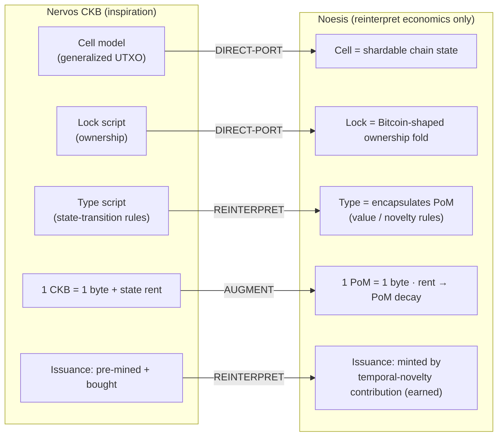

# noesis — Proof-of-Mind value chain (PRIVATE, stealth)

Rust core. **Core inspiration: Nervos CKB — https://github.com/nervosnetwork/ckb —
and it should remain so.** This network is CKB-shaped throughout; we port CKB's
architecture and reinterpret only the economics for Proof of Mind.

## What we take from CKB (keep this lineage explicit)

| CKB concept | Use here | Status |
|---|---|---|
| **Cell model** (generalized UTXO) | chain state = independent Cells → shardable | ✅ `Cell` in `src/lib.rs`, tested |
| **Lock script** | ownership: who may consume/transfer a cell (Bitcoin-shaped) | ✅ `ownership` module, tested (UTXO transfer-fold) |
| **Type script** | state-transition rules — here it **encapsulates PoM** (the value/novelty rules run as the type script) | 🟡 modeled; RISC-V program TBD |
| **RISC-V VM (CKB-VM)** | execution layer; scripts are RISC-V programs by `code_hash` | 🟡 integrate `ckb-vm` crate |
| **State rent / 1 CKB = 1 byte** | `1 PoM = 1 byte of state`; rent → PoM **decay** | 🟡 see `../docs/CRYPTOECONOMICS.md` |
| **Secondary issuance** | reinterpreted: issuance = **PoM minted by verified contribution** (earned, not bought) | 🟡 |



## What we reinterpret (the only divergence from CKB)

- **Issuance**: CKB is pre-mined + bought; PoM is minted by temporal-novelty
  contribution (earned). State capacity is allocated by proven mind, not capital.
- **Rent**: CKB's monetary secondary-issuance → **PoM decay** (stale contribution loses
  byte-capacity), which is also the supply sink.
- **Consensus**: add Proof of Mind (+ a Nakamoto-Infinity fallback) on top of the
  CKB-style state layer.

## Honest grounding note

The Cell / lock-script / type-script / state-rent model here is ported from CKB's
*architecture*; the exact crate APIs (`ckb-vm`, `ckb-types`) and consensus parameters
must be **verified against https://github.com/nervosnetwork/ckb** when the VM and
networking layers are integrated. Don't assume API shapes from memory at that point —
read the source.

## Build

```
cd node && cargo test    # 300/300 passing — incl. the on-VM PoS+PoM finality mirror finalizes_pos_pom_fixed (the live (mm) rule — PoW out of finality + anti-concentration — recomputed in pure Q32.32 integer arithmetic in noesis-core, builds host AND riscv64imac, drift-guarded so the fixed mirror NEVER finalizes a case the f64 rule rejects across a participation/decay/dimension sweep, anti-concentration enforced like the live rule; the live reference and its future on-VM type-script are now ONE arithmetic) + the canonical tx_digest serializer SINGLE-SOURCED in noesis-core::tx (no_std, builds riscv64imac — the bytes a lock-signature covers, recomputed identically by the on-VM lock-script and the node; the node's TokenTx::digest delegates via borrowed CellViews, byte-identical so the signing tests are the regression proof) + the post-quantum lock-sig verifier LINKED and PORTED on-VM (Lamport one-time signatures live in noesis-core::lamport — no_std, builds riscv64imac — so the on-VM lock-script type-script and the node validate with ONE implementation, same single-source pattern as the finalization mirror; the node re-exports it and verify_sig calls it; hash-based / no external crate / hash-rooted: a pubkey is a 32-byte blake2b root carried as the cell's lock.args, so existence->CONTROL is now closed cryptographically — a real finalized cell can be NAMED by anyone but only the holder of the lock's one-time key can MOVE it; the one-time limitation is free because a cell is consumed exactly once, so the lock key signs exactly once; spend_is_authorized verifies a presented auth FOR REAL against the FINALIZED cell's lock.args, keygen/sign are test-only since a node only verifies, end-to-end through node.validate a wrong-key signature over the same movement is rejected = the (o) orthogonal residual closed; anti-theater: stub verify to always-true and the wrong-message/wrong-key tests go RED) + unified_settlement, the cross-path slash bound's corrected mint<->sink Settlement (wraps unified_slash; burned = Σ merged slashes with zero canceled/payout — a pure cross-path bound cancels nothing and mints no bounty; an overlap identity slashed by BOTH the collusion and refutation paths collapses its two slashes to their max, so the sink burned is STRICTLY UNDER the naive sum of the two source burned figures = no double-counting the destroyed standing) + collusion_slash griefing-resistance (an attacker who CITES an honest victim — inbound edges, attacker-controlled — cannot frame them into a slash: a cycle/mutual pair through the victim needs a victim-AUTHORED outbound edge, which only the victim creates; inbound-only edges are pure gradient, Hodge-absorbed to residual 0, so the honest victim's share stays 0 and standing stays whole while the ring is slashed) + collusion_slash, the detection->economic-slash bridge (a directed collusion ring's per-identity Hodge-residual + mutual-circulation shares converted to a bounded Settlement that BURNS ring standing while sparing honest builders: Σ slashes ≤ manufactured value via the same bounded_shares the refutation path uses, consensus-keyed identity; end-to-end through apply_slashes the ring loses standing and the honest leaf-builder stays whole; purely additive, does not touch the proven resolve_refuted paths) + attribution_circulation, the moat-independent first-order alarm that DETECTS the collusion ring on topology alone (mutual cross-citation = circulation: honest one-way DAG=0, K=3 ring=C(3,2)=3, break-on-purpose drops a back-edge to 2) + attribution_cycle_energy, its COMPLEMENT closing the directed-k-cycle residual (the Helmholtz-Hodge harmonic energy of the NET flow: honest acyclic DAG=0, directed 3-cycle=3 while circulation on the same input=0, directed 4-cycle=4 = any-length detection, mutual ring circ-3/harmonic-0 vs directed ring circ-0/harmonic-3 = disjoint regimes; gradient-projection break-on-purpose verified; moat-independent topology, no labels) + the collusion-ring / mutual-citation vector demonstrated OPEN (🔬 pinned: K colluders cross-building novel children on each other's roots manufacture realized-flow the structural v(S) proxy credits; per-member 0->29 exceeds an honest single contributor; closure via the HodgeRank harmonic-energy alarm (cycle detector, moat-independent) or the real-label v(S) moat) + the orphan-root / multi-parent fan-out vector closed by realized-flow gating (an attacker posting K disconnected novel roots escapes every per-parent damping axis, but a root nobody builds on has no realized downstream flow so it seeds 0 => K orphan roots = K*0 = 0; a genuinely built-upon root earns 17.66 in the same harness, so the zero is the gate working not a broken setup) + the lock-sig step-3 wiring: the spend-authorization gate WIRED into is_valid_in_ledger (TokenTx::spend_is_authorized — existence->control: each input's per-tx `auths[i]` checked against the canonical tx_digest; absent/sentinel auth inert-authorized pre-deploy so every honest flow is unchanged, a presented-but-unverifiable auth rejected so the gate is live not dead code; CONTROL_BINDING_ACTIVE deploy flag fails loud; regression fires through node.validate, break-on-purpose verified) + the canonical tx_digest serializer (deterministic / presentation-invariant / value-sensitive / length-prefix-injective; the deploy-independent grain of the lock-sig existence->control mile — the deterministic bytes a future owner signature covers) + the multi-identity-split adversarial matrix (T1-T6; T3 keystone pins the hybrid-split diagonal pump — cross-axis geometric-tail compounding — as 🔬 open) + runtime adversarial-gaming tests (gaming.rs: sybil ring of 5 identical-content identities banks <=1 cell's coverage, cross-block re-post earns 0 = un-gameable-v(S) holds through the live node) + Byzantine 2-node adversarial tests (byzantine.rs: honest node rejects wrong-height/reordered/empty blocks, equivocation detected, Byzantine minority cannot finalize) + node runtime 2-node convergence (runtime.rs + two_node.rs: deterministic state-machine replication, presentation-independent block assembly, non-canonical-reorder rejection) + PoS+PoM finality gadget (runtime::finality::finalizes_pos_pom: PoW out of finality per T3, anti-concentration rule blocks unilateral PoM finalization = capital-orthogonality per T11) — now WIRED into the live runtime::finalizes path (T3 wiring landed 2026-06-22): the node's finalization decision routes through finalizes_pos_pom, so PoW (probabilistic/reorgeable, a finality-safety vector) is excluded and BOTH the PoS and PoM axes must clear the anti-concentration floor; the live wrapper is pinned by live_finalizes_wrapper_routes_through_pos_pom (a set the old PoW-inclusive rule WOULD finalize on PoW+PoM weight is now rejected for absent PoS — reverting the wrapper to the c.mix rule goes RED; the on-VM finalization mirror, still 🟡 designed, must mirror THIS rule when built) + ERC token analogs (tokens.rs: fungible/ERC-20, nft/ERC-721, multi/ERC-1155 conservation + mint-authorization, airgap-closed so no oracle layer) + block-level token-conservation gate (runtime::Node::validate rejects any block carrying a non-conserving / unauthorized-mint TokenTx, single-sourced from the tokens analogs — value cannot be forged into a finalized block; mint authority is DERIVED from issuer control of a consumed authority cell, never a self-declared minter field = 8th attacker-input site; validation-only, spending/persisting token state is the deploy-coupled next layer): per-certifier §7.1c-guard (resolve_refuted_guarded judges each certifier on its OWN standing via the certifier_keys key<->id join — the honest PoM holder's slash is dropped while the garbage endorser's lands, bounded over the FULL certifier set so totals stay exact; reduction to whole-settlement at one certifier) + asymmetric-appeal guard (§7.1c-guard, appeal_refutes_asymmetric — the PoM-minimized appeal court may only MONOTONE-DECREASE a down-weighted-dimension DEFENDANT's conviction/slash, never raise it; closes the PoW/PoS-majority appeal-grief that is the INVERSE of the §7.1c cartel-break, keying on the DEFENDANT's standing so the cartel-break — where the PoM cartel sit as JURORS, not the defendant — is untouched; honest_pom_defendant_vs_powpos_majority_appeal_cannot_increase_slash demonstrates full-mix acquits + ungated appeal convicts the honest PoM defendant + guard clamps to no-slash) + value_v8 realized-OUTCOME-gated seeds (the learned outcome v(S) AND-composed into the v5->v7 flow-gate seed — the structural change v7 named for the structured-but-valueless residual; outcome factor in [0,1] can only LOWER never mint, corrupt model reduces v8==v7 exactly = Role-C authority boundary proven; fake-lineage-of-noise seeds 0 via the single-sourced entropy floor; honest scope: synthetic structural labels DAMPEN a valueless child on a real root ~0.42x not zero, full closure rides the real DeepFunding label pull, seam wired end-to-end load_prefs->train->v_outcome_floored->seed) + semantic-floored v(S) closes the fake-lineage spoof at the score (v_outcome_floored AND-composes the entropy floor: spoofed structure of NOISE scores 0, real work keeps value) + learned v(S) held-out moat measurement (outcome module — Bradley-Terry over coalition features beats the coverage proxy on UNSEEN coalitions: lineage value the per-block proxy is blind to; real DeepFunding outcome labels are the remaining data pull; load_prefs locks the file-sourced label-ingestion seam — the harness reads labels from the on-disk contract and runs UNCHANGED when they land) + commit-order on-VM type-script (TEMPORAL-ORDER-ONCHAIN.md — the consensus ordering rule recomputed INSIDE the VM; the index cell REFUSES any non-canonical batch before root math; coord provenance sentinel-gated inert) + finalization on-VM type-script (ON-VM-FINALIZATION.md — the consensus finalize rule recomputed INSIDE the VM; validator set + params from the finalization cell, votes from the witness, `now` read from the block HEADER never tx-chosen; 5th attacker-input site closed on-VM) + finalization_fixed (consensus::finalizes_hybrid recomputed in pure Q32.32 — fixed-point retention-decay + effective/base weight + max(eff,floor) basis + 2/3 threshold, ceil-rounded AGAINST finalization; drift-guarded vs the f64 reference over a liveness×decay×subset sweep, conservative direction proven everywhere `!(fixed && !float)`; the 3rd on-VM arithmetic surface after value_fixed + settlement_fixed) + on-VM ordering port (noesis-core::commit_order — no_std, builds riscv64imac, the consensus permutation the index-cell type-script will verify on-VM; node lib RE-EXPORTS it = ONE implementation, single source, lean) + index_rule.valid_ordered_root_transition (the consensus commit-order wired INTO the index cell — a producer-favorable reorder of same-height contenders for shared novelty is rejected at the order gate, before any root math) + the ordered rule trusts its CellBatch coords AS CLAIMED, so a forged-lower-height steals contested novelty ⇒ coords (height, secret) must be consensus-sourced on-VM (7th site of dont-let-attacker-choose-critical-input; pinned) + finalization input-binding pins (RSAW 2026-06-13: `now` and the validator-set `all` are outcome-determining ⇒ on-VM both MUST be consensus/header-sourced, the 5th/6th sites of dont-let-attacker-choose-critical-input) + temporal-order consensus-criticality (redundant block earns novelty only by being ordered first => on-chain path must fix order to commit-height; timestamp field is not the lever) + commit_order (consensus-sourced ordering: inter-block=height, intra-block=XOR-seeded Fisher-Yates over revealed secrets; redundant block presented first earns 0; slot co-determined not self-selectable; on-VM port SHIPPED as commit-order-typescript ELF, coord-provenance inert pre-deploy) + index_binding (reference model — index cell-dep accepted by FULL CKB script identity {code_hash + hash_type + type-id}, not by shape; F1/F2/F3 closed at the reference level — hash_type added so a forged dep reusing code_hash+type-id under a different Data/Type/Data1 is rejected, QA-port-1/F2-complete; on-VM main.rs mirror SHIPPED inert — hash_type compare + explicit BINDING_ACTIVE flag replacing the overloaded sentinel (QA-port-2), ELF rebuilt green, only the activated-path fixture remains deploy-coupled) + value (v4 boost, v5 realized-flow gate, v6 priced-identity standing-gated seeds, semantic floor in production_value, v7 semantic-floored seeds, value_fixed Q16.16 on-chain mirror) + dispute (windowed vesting, challenge/verdict, causal-share slash, §7 escalation court + juror-slash, §7.1b load-bearing juror-exclusion closing the PoM-dominant edge-connected cartel, §7.1c dimension-level recusal — DISPUTE_APPEAL/Tribunal::AppealCourt down-weights the captured PoM axis, closing the identity-separated cartel down to the global cross-dimension assumption) + encoding-evasion class-dissolved economically (encoded noise defeats the v7 seed floor but is byte-blind to the v6 standing price and content-agnostic to the dispute slash ⇒ negative-EV) /PoM/synergy/flow/soulbound/ownership/consensus (2/3 finalization, retention-decay, A4 equivocation/early-reject, A2 anti-plutocracy via linear weighting + mix caps) + stability (core + nucleolus least-core solver) + adversary (sybil/padding/collusion/provenance-forgery/quality-bound + pinned: vested-certifier-endorsing-garbage) + RSAW self-audit (eclipse, slashability, quorum-floor) + evaluator (role-bounded advance) + outcome (learned coalition v(S), Bradley-Terry over set-features, corrupt-model harmless)
```
