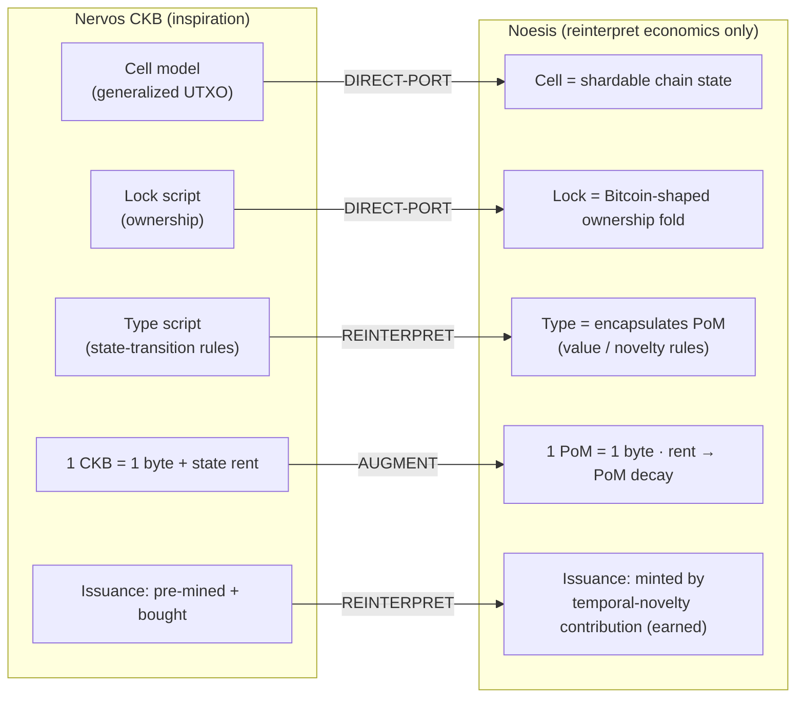

# noesis — Proof-of-Mind value chain (PRIVATE, stealth)

Rust core. **Core inspiration: Nervos CKB — https://github.com/nervosnetwork/ckb —
and it should remain so.** This network is CKB-shaped throughout; we port CKB's
architecture and reinterpret only the economics for Proof of Mind.

## What we take from CKB (keep this lineage explicit)

| CKB concept | Use here | Status |
|---|---|---|
| **Cell model** (generalized UTXO) | chain state = independent Cells → shardable | ✅ `Cell` in `src/lib.rs`, tested |
| **Lock script** | ownership: who may consume/transfer a cell (Bitcoin-shaped) | ✅ `ownership` module, tested (UTXO transfer-fold) |
| **Type script** | state-transition rules — here it **encapsulates PoM** (the value/novelty rules run as the type script) | 🟡 modeled; RISC-V program TBD |
| **RISC-V VM (CKB-VM)** | execution layer; scripts are RISC-V programs by `code_hash` | 🟡 integrate `ckb-vm` crate |
| **State rent / 1 CKB = 1 byte** | `1 PoM = 1 byte of state`; rent → PoM **decay** | 🟡 see `../CRYPTOECONOMICS.md` |
| **Secondary issuance** | reinterpreted: issuance = **PoM minted by verified contribution** (earned, not bought) | 🟡 |



## What we reinterpret (the only divergence from CKB)

- **Issuance**: CKB is pre-mined + bought; PoM is minted by temporal-novelty
  contribution (earned). State capacity is allocated by proven mind, not capital.
- **Rent**: CKB's monetary secondary-issuance → **PoM decay** (stale contribution loses
  byte-capacity), which is also the supply sink.
- **Consensus**: add Proof of Mind (+ a Nakamoto-Infinity fallback) on top of the
  CKB-style state layer.

## Honest grounding note

The Cell / lock-script / type-script / state-rent model here is ported from CKB's
*architecture*; the exact crate APIs (`ckb-vm`, `ckb-types`) and consensus parameters
must be **verified against https://github.com/nervosnetwork/ckb** when the VM and
networking layers are integrated. Don't assume API shapes from memory at that point —
read the source.

## Build

```
cd node && cargo test    # 185/185 passing: index_binding (reference model — index cell-dep accepted by type-script identity {code_hash + type-id}, not by shape; F1/F2/F3 closed at the reference level, on-VM port pending) + value (v4 boost, v5 realized-flow gate, v6 priced-identity standing-gated seeds, semantic floor in production_value, v7 semantic-floored seeds, value_fixed Q16.16 on-chain mirror) + dispute (windowed vesting, challenge/verdict, causal-share slash) + encoding-evasion class-dissolved economically (encoded noise defeats the v7 seed floor but is byte-blind to the v6 standing price and content-agnostic to the dispute slash ⇒ negative-EV) /PoM/synergy/flow/soulbound/ownership/consensus (2/3 finalization, retention-decay, A4 equivocation/early-reject, A2 log-scaling) + stability (core + nucleolus least-core solver) + adversary (sybil/padding/collusion/provenance-forgery/quality-bound + pinned: vested-certifier-endorsing-garbage) + RSAW self-audit (eclipse, slashability, quorum-floor) + evaluator (role-bounded advance) + outcome (learned coalition v(S), Bradley-Terry over set-features, corrupt-model harmless)
```
